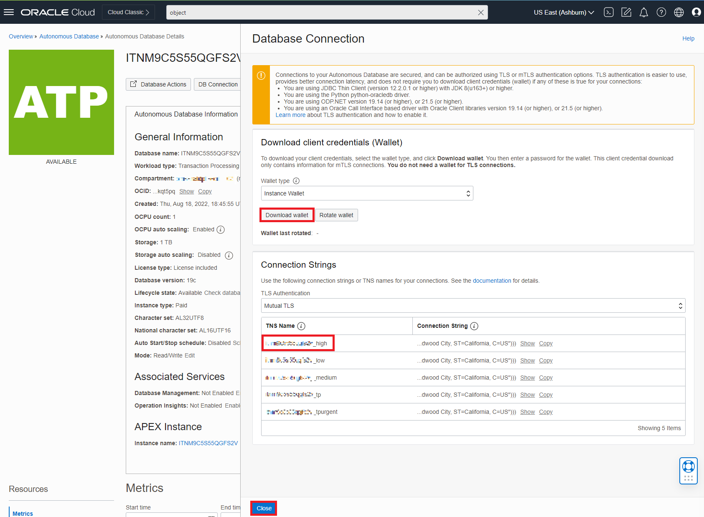

# Extract API

## Introduction

In this lab, we will use Visual Studio Code (VSCode) IDE to initiate a connection to the database and Twitter API using cx_Oracle and the Python library, Tweepy.  

> **Note:** Creating a Twitter Developer account may take up to a few days to get approved, depending on your responses to the questions.

**Download VSCode Here:** [Link](https://code.visualstudio.com/download)

**Download the Python lab files:** [Link](https://objectstorage.us-ashburn-1.oraclecloud.com/p/LNAcA6wNFvhkvHGPcWIbKlyGkicSOVCIgWLIu6t7W2BQfwq2NSLCsXpTL9wVzjuP/n/c4u04/b/livelabsfiles/o/developer-library/Twitter_LL2_python.zip)

Estimated Time: 40 minutes

### Objectives

In this lab, you will complete the following tasks:

- Install cx_Oracle
- Review Twitter API
- Run the extract

### Prerequisites

This lab assumes you have:
- An Oracle Always Free/Free Tier, Paid or LiveLabs Cloud Account
- An IDE of your choosing (All examples in this lab will use VSCode)
- Installed Python 3.9 (Newest version of Python will not work with the current version of Pysentimiento)

## Task 1: Install cx_Oracle

> **Note:** All screenshots will be using Windows OS.

1. Visit this site to download instant client:
    - [Oracle Instant Client Downloads](https://www.oracle.com/database/technologies/instant-client/downloads.html)

    Select the OS version that matches your computer. In this example, I am selecting the Windows x64 version.

    

    On the next page, select the **basic package.**

    

2. Extract the zip file to a location that best works for yourself. In this example, I extracted to root (C:\) and made a folder **instant_client** to extract the zip into.

    

3. Make note of the path (C:\instant\_client\instantclient\_21\_6), as you will place this in environment variables.
    - For windows, search **Environment Variables** and edit the **Path** variable to paste the path.

    

    - For macOS, you will need to use a CLI. For older macOS versions (before Catalina), use **bash** shell. For macOS Catalina and later, use **zsh** (z shell).
      - For bash: 
            
            ```
            <copy>nano ~/.bash_profile</copy>
            ```  

      - For zsh:
            ```
            To set the value of an environment variable, use the appropriate shell command to associate a variable name with a value. For example, to set the variable PATH to the value /bin:/sbin:/user/bin:/user/sbin:/system/Library/, you would enter the following command in a Terminal window:
            <copy>PATH=/bin:/sbin:/user/bin:/user/sbin:/system/Library/ export PATH</copy>
            ```
            **Note: Insert the correct path for your extracted instant client for this step**

4. Download the Python lab files: [Link](https://objectstorage.us-ashburn-1.oraclecloud.com/p/LNAcA6wNFvhkvHGPcWIbKlyGkicSOVCIgWLIu6t7W2BQfwq2NSLCsXpTL9wVzjuP/n/c4u04/b/livelabsfiles/o/developer-library/Twitter_LL2_python.zip) .

    -Extract and open the folder in VSCode.  

5. Open the ConnectionInfo.py file to paste the path for the Instant Client.

    - Paste the path for **TNS\_ADMIN** appending the following endpoint: **\network\admin** .
    - Paste the path (C:\instant\_client\instantclient\_21\_6) for the **LD\_LIBRARY\_PATH** . 

    

6. Edit the **# Username** section of the ConnectionInfo.py file:
   
    - usernm: **admin**
    - psswd: **Provided when creating the ATP**
    - dsn: **See next step**

7. Open OCI and navigate to the ATP that was created earlier. Select **DB Connection** to access connection strings.

    

8. Download the wallet and copy the first TNS Name in the popup window and paste the **TNS Name** into the section **dsn** of the ConnectionInfo.py files. Save the **ConnectionInfo.py** file.

    

9. Extract the wallet file to the **Instant Client** directory with the endpoint **/network/admin**.

    

## Task 2: Review Twitter API

1. Open the **TwitterExtract.py** file and make note of the following variables (**APIkey** & **APIsecret**). We will fill this out in the following steps.

    

2. Open the browser and access the following [Link](https://developer.twitter.com/en/docs/twitter-api) to open the Twitter API documentation.

3. Select **Sign Up** if you do not have previous access to Twitter API, otherwise, **login with your credentials.** The sign up process may take up to a couple days to get approved depending on your responses. 

4. After completing the information to sign up (if you haven't done so already), you can create an app by selecting **Create app**.

    

5. Name the app and select **Next** at the bottom. 

    

6. Notice the generated **API Key** and **Secret**. Copy these variables and paste in the **TwitterExtract.py** file.

    

## Task 3: Run the extract

1. Using VSCode terminal, we are ready to run the code. **Make sure you have installed all of the python libraries** or else you will run into errors. Use **pip install \<module name>** for the following modules:
    - tweepy: **pip install tweepy**
    - regex: **pip install regex**
    - pandas: **pip install pandas**
    - numpy: **pip install numpy**
    - textstat: **pip install textstat**
    - pysentimiento: **pip install pysentimiento**
    - cx_Oracle: **pip install cx_Oracle**

    Be sure to install to the correct version of Python (if 3.9 is not default). In order to install to a specific version of python, **find the path to 3.9** and declare that prior to using pip install. The path can be located at the end of this step.

    

    - if you have 3.10 version of python installed, be sure to install 3.9 now. Use this [link](https://www.python.org/downloads/release/python-390/) to install (Select the version that matches your computer).
    - If you have both, that is no problem for VSCode as you can change the Python Interpreter. Use **CMD+Shift+P** to type **Python: Select Interpreter.**

    

    - Select the 3.9 version of Python to run the code correctly. Note the path in order to correctly install the modules.

    

2. Run the code in the IDE of choice. In this example, select the **Play button** in the top right to run the code in terminal from VSCode.

    

3. If you run into errors, Check the following:

    - **Table or view does not exist:** Be sure your **Schema name** matches the code for the INSERT statements.

    

    - **TNS error:** Wallet/ instant client path or dns value does not match the correctly - repeat previous section (Task 1).

    

    - If you receive an error, **Cannot locate a 64-bit Oracle Client library,** then you will need to add the following to the TwitterExtract.py file (including your path to the instant client):

    

    ```
    <copy>cx_Oracle.init_oracle_client('<PATH_NAME_INSERT_HERE>')</copy>
    ```

    

    - If this error persists, the reinstall the instant client, ensuring you have the correct version for your OS. Otherwise, review this documentation on how to proceed: 
    [Initialization Guide](https://cx-oracle.readthedocs.io/en/latest/user_guide/initialization.html)

    - **Elevated Access for Twitter:** Required after creating a developer account. Sign Up and request access here: [Link for Twitter Developer Sign up.](https://developer.twitter.com/en/docs/developer-portal/overview)

    

    - **Module not found:** See Task 3, Step 1 for information how to install.

4.  Notice the following:
    - **Model insert success**
    - **Successful user insert**
    - **Successful tweet insert**

    

5.  Let this script run for at least 20 minutes for approximately 100 inserts (longer is better). Press **CTRL+C** in the terminal to end the script.

You may now **proceed to the next lab.**

## Learn more
- [cx_Oracle installation](https://cx-oracle.readthedocs.io/en/latest/user_guide/installation.html)
- [Twitter API documentation](https://developer.twitter.com/en/docs/twitter-api)
- [Use environment variables in Terminal on Mac](https://support.apple.com/guide/terminal/use-environment-variables-apd382cc5fa-4f58-4449-b20a-41c53c006f8f/mac)

## Acknowledgements

- **Author**- Nicholas Cusato, Santa Monica Specialists Hub
- **Contributers**- Rodrigo Mendoza, Ethan Shmargad, Thea Lazarova
- **Last Updated By/Date** - Nicholas Cusato, November 2022