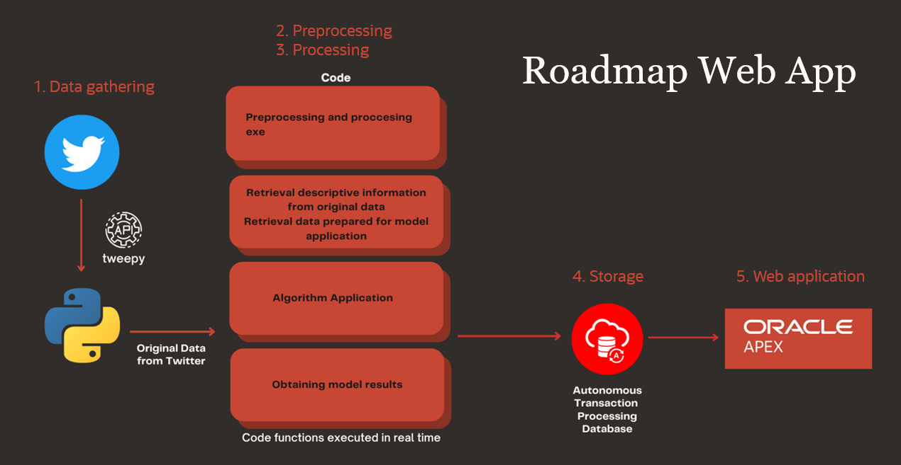

# Create an APEX application for sentiment analysis using Twitter API

## Introduction

Want to know how people feel about a topic? Twitter is a haven for people's opinions. Even though you are limited to 280 characters, with such a big & easy-to-use soapbox, folks can quickly & effortlessly share what they think about things. 

The metadata contains a treasure trove of insights but is challenging to dissect, making it hard to market & influence, which is a big part of pop culture. 
 
Learn who is speaking on topics & organize a strategy to help your organization's public relations!
 
This workshop shows users how to use Oracle APEX, Twitter API, and Machine learning to extract the sentiment of tweets. 
 
You will generate dynamic and embedded analytics by specifying keywords & metadata, such as geolocation and hashtag frequency. Using Oracle APEX, Oracle's low-code development platform, and Twitter API, cx_Oracle creates a connection from your local execution of the Python library, Tweepy, and an Oracle Autonomous Database. This data is processed and fed through a machine learning algorithm to capture distinct tweets' sentiments (positive, neutral, or negative).
 
Institutions need simple yet powerful solutions to leverage data from popular social media platforms (such as Twitter) to analyze their PR campaigns and better understand their constituents' sentiments. In this example, Mexico City's government is interested in what its people say. You will build an insightful web application that can quickly discern the general sentiment of the citizens using word clouds, statistics, and even a heat map to illustrate how the people are feeling towards the city.

Estimated Time: 90 minutes

### Objectives

In this lab, you will complete the following tasks:

- Create Schema
- Extract API
- View tweets in ATP
- Prep tweet data
- Analyze tweet sentiment with ML
- Use low code to perform analytics

### Prerequisites

This lab assumes you have:
- An Oracle Always Free/Free Tier, Paid or LiveLabs Cloud Account
- Familiarity with Twitter is desirable, but not required
- Some understanding of cloud and database terms is helpful
- Familiarity with Oracle Cloud Infrastructure (OCI) is helpful
- Basic familiarity with Oracle APEX
- Python 3.9 installed on your computer (Lab won't run properly with newer versions of Python)
- Basic familiarity with Python and SQL language
- IDE of your choice installed on your computer (All examples in this lab will use VSCode - [Link to install](https://code.visualstudio.com/download))
- An **Elevated Twitter Developer account** [Link to sign up](https://developer.twitter.com/en/docs/twitter-api)

Download the lab files here: 
[SQL Files](https://objectstorage.us-ashburn-1.oraclecloud.com/p/LNAcA6wNFvhkvHGPcWIbKlyGkicSOVCIgWLIu6t7W2BQfwq2NSLCsXpTL9wVzjuP/n/c4u04/b/livelabsfiles/o/developer-library/Twitter_LL1_sql.zip)
[Python Files](https://objectstorage.us-ashburn-1.oraclecloud.com/p/LNAcA6wNFvhkvHGPcWIbKlyGkicSOVCIgWLIu6t7W2BQfwq2NSLCsXpTL9wVzjuP/n/c4u04/b/livelabsfiles/o/developer-library/Twitter_LL2_python.zip)

>**Note:** Creating an **Elevated** Twitter Developer account may take up to a couple days to be approved depending on your responses to the questions. It is recommended to start this process before beginning the lab. Click the link to get started: [Link to sign up](https://developer.twitter.com/en/docs/twitter-api).

## Want to learn more about Autonomous Database?
- [Oracle Autonomous Data Warehouse Documentation](https://docs.oracle.com/en/cloud/paas/autonomous-data-warehouse-cloud/index.html)
- [Additional Autonomous Data Warehouse Tutorials](https://docs.oracle.com/en/cloud/paas/autonomous-data-warehouse-cloud/tutorials.html)

## Acknowledgements

- **Author**- Nicholas Cusato, Santa Monica Specialists Hub
- **Contributers**- Rodrigo Mendoza, Ethan Shmargad, Thea Lazarova
- **Last Updated By/Date** - Nicholas Cusato, November 2022