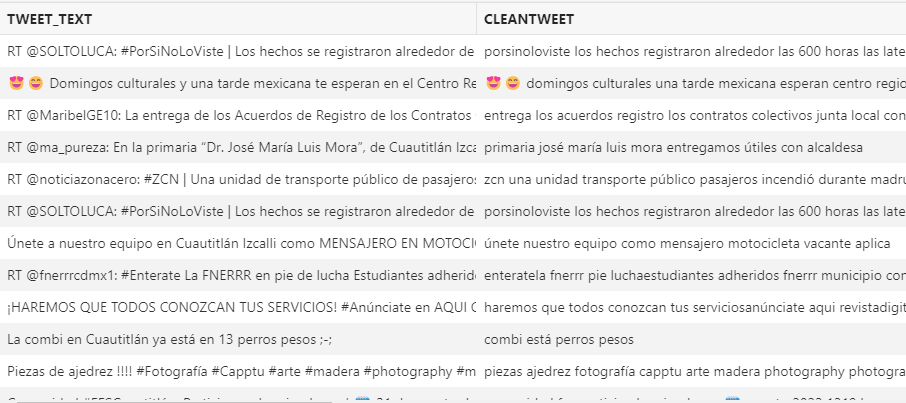
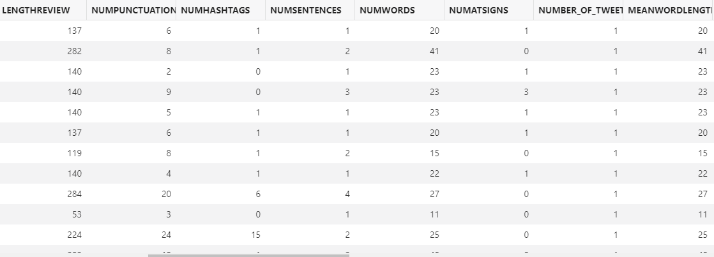
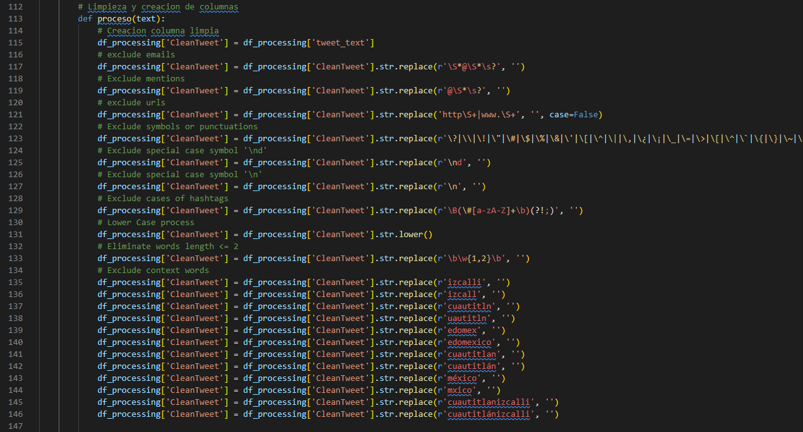
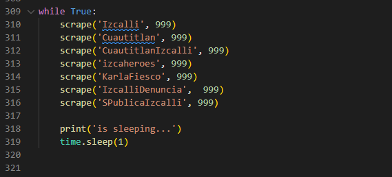

# Prep tweet data

## Introduction

In this lab, we will explore the processing required to analyze the tweet collected by the API. By reviewing the tables and the code, you should have a good understanding of how this is accomplished.

Estimated Time: 5 minutes


### Objectives

In this lab, you will complete the following tasks:

- Analyze data in ADB
- Analyze code

### Prerequisites

This lab assumes you have:
- An Oracle Always Free/Free Tier, Paid or LiveLabs Cloud Account

## Task 1: Analyze data in ADB

1. With cloud SQL Developer still open, copy and paste the following again to review the processing required for analysis.

    ```
    <copy>
    SELECT * FROM WKSP_TWITTERLL.MODEL
    </copy>
    ```
    
    Select the **play** button to run the script.

     

2. Notice all of the special characters are removed to ensure the correct data is being analyzed. 
- RT = Retweet (removed for redundancy).
- Hashtags are removed and logged in separate column.
- Punctuations are removed to allow the ML model to run correctly and logged in separate column.

     

## Task 2: Analyze code

1. Open the TwitterExtract.py file to explore the lines of code (starting at line 112) that processes the data. Pysentimeinto is the Python library that runs the clean tweets through the ML model. We will cover this in the next lab. 

     

2. Scrolling down to the end of the file (line 309), you can view the API search parameters. These key words can be edited to adjust the context of your project. If you change these words, you will need replace the lines 135-146 to better fit your project context. These words are commonly found in our tweets but don't actually help the sentiment analysis and are replaced with empty spaces, which helps filter our results.

     

You may now **proceed to the next lab.**

## Acknowledgements

- **Author**- Nicholas Cusato, Santa Monica Specialists Hub, August 22, 2022
- **Contributers**- Rodrigo Mendoza, Ethan Shmargad, Thea Lazarova
- **Last Updated By/Date** - Nicholas Cusato, August 22, 2022