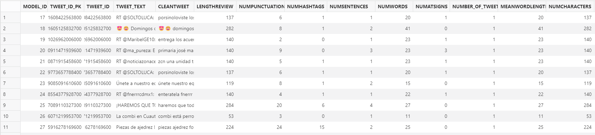
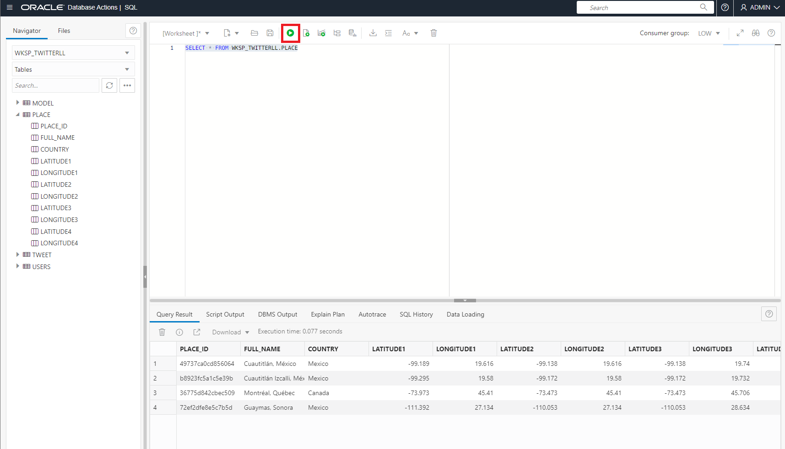
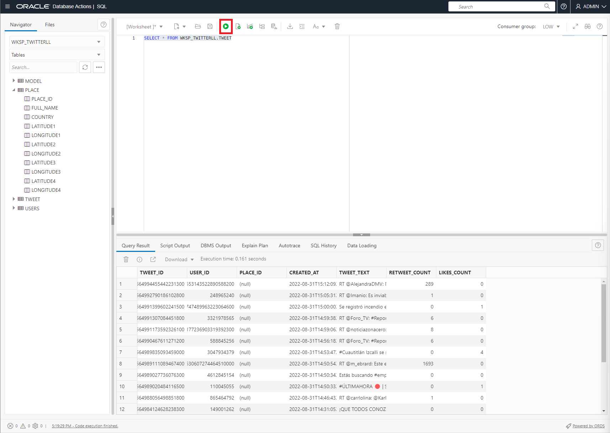
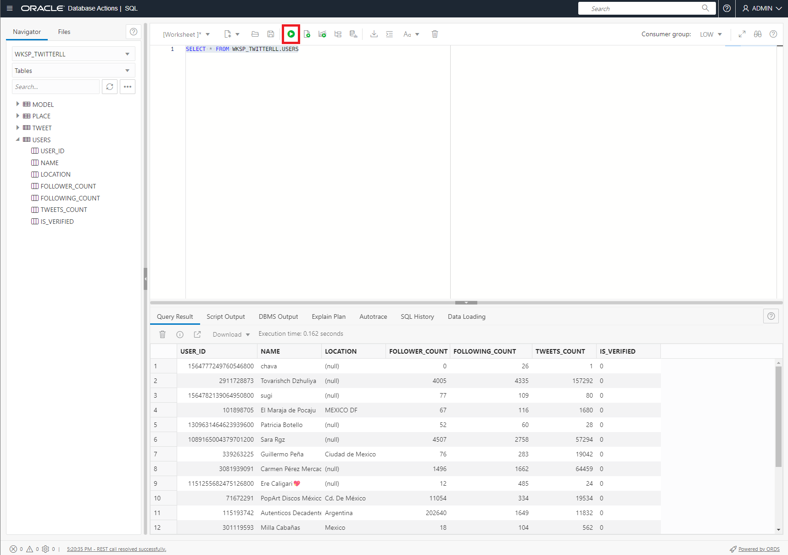

# Review ATP Storage

## Introduction

In this lab, we will view the storage of the tweets collected by the API.

Estimated Time: 5 minutes


### Objectives

In this lab, you will complete the following tasks:

- Review Storage
  
### Prerequisites

This lab assumes you have:
- An Oracle Always Free/Free Tier, Paid or LiveLabs Cloud Account

## Task 1: Review Storage

1. Navigate to the ATP homepage of the instance you created in the first lab. Select **Database Actions** to open the cloud SQL Developer.

     

2. In the new window that opens, login as **ADMIN** and provide the password used to create the database.

     

3. Select the **SQL** option to open the cloud SQL Developer. 

     

4. Select the drop down menu to select the TWITTERLL schema we created in the previous lab.

     

5. Notice the tables generated by the DDL we created in the first lab. Copy and paste the following into the worksheet:

    ```
    <copy>
    SELECT * FROM WKSP_TWITTERLL.MODEL
    </copy>
    ```
Select the **play** button to run the script

    

6. Notice the output indexes the table by **Model ID.** We will analyze this data in the next labs: Data processing and Machine Learning.

    

7. Copy and paste the following into the worksheet:

    ```
    <copy>
    SELECT * FROM WKSP_TWITTERLL.PLACE
    </copy>
    ```
Select the **play** button to run the script

    

Notice the indexed metadata from tweets. Here we have four tweets from Mexico and Canada.

8. Copy and paste the following into the worksheet:

    ```
    <copy>
    SELECT * FROM WKSP_TWITTERLL.TWEET
    </copy>
    ```
Select the **play** button to run the script

    

9. Copy and paste the following into the worksheet:

    ```
    <copy>
    SELECT * FROM WKSP_TWITTERLL.USERS
    </copy>
    ```
Select the **play** button to run the script

    

10. Notice all of the data that was extracted from Twitter. This will be helpful for analytics, which will be covered in the lab **Explore APEX.**

## Acknowledgements

- **Author**- Nicholas Cusato, Santa Monica Specialists Hub
- **Contributers**- Rodrigo Mendoza, Ethan Shmargad, Thea Lazarova
- **Last Updated By/Date** - Nicholas Cusato, September 2022