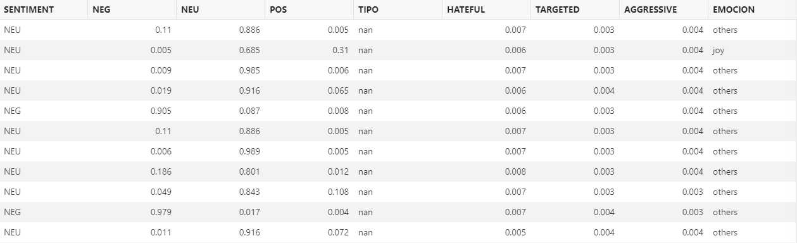
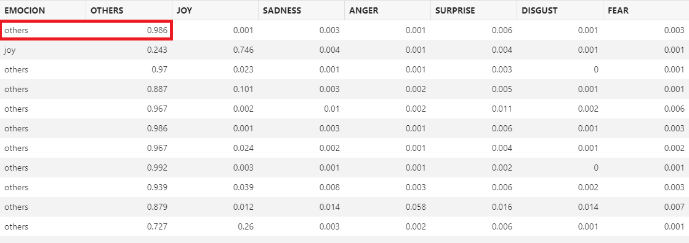
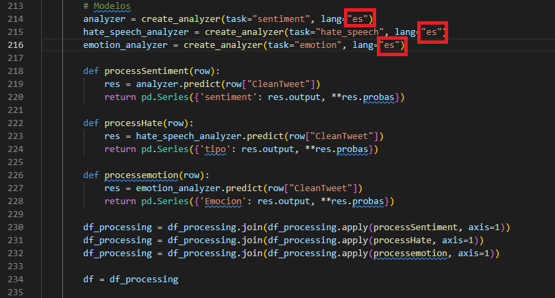

# Review machine learning 

## Introduction

In this lab, we will analyze the code and review the scoring used to assess sentiment for each tweet. By reviewing the tables and the code, you should have a good understanding of how this is accomplished.

Estimated Time: 5 minutes

### Objectives

In this lab, you will complete the following tasks:

- Review machine learning model
- Analyze code

### Prerequisites

This lab assumes you have:
- An Oracle Always Free/Free Tier, Paid or LiveLabs Cloud Account

## Task 1: Review machine learning model

1. With cloud SQL Developer still open, notice the columns for the **MODEL** table. You might need to scroll the table over to see the additional columns.

     

2. Notice the **SENTIMENT** that is assessed from the scoring. In this first row example, **NEU** is the highest score; therefore, it is assigned a Neutral sentiment. Hate speech is also analyzed in the columns **HATEFUL, TARGETED, and AGGRESSIVE,** which can be further used for analysis.

3. Scroll more to observe the emotions declared for each tweet.

     

4. Notice the highest scored emotion are assigned an emotion for the tweet. In this first row example, the first tweet has a high score for **OTHERS**, therefore, none of the other emotions are used to assess the tweet.

## Task 2: Analyze code

1. Open the TwitterExtract.py file to explore the lines of code (staring at line 214) used to score the sentiment, hate speech, and emotions. Pysentimiento is used to analyze the cleantweets. ES (Spanish) is declared as the scoring language, which can be changed to EN (English) to expand on the topic on lines 214-216.

    

You may now **proceed to the next lab.**

## Acknowledgements

- **Author**- Nicholas Cusato, Santa Monica Specialists Hub
- **Contributers**- Rodrigo Mendoza, Ethan Shmargad, Thea Lazarova
- **Last Updated By/Date** - Nicholas Cusato, September 2022