#  Audit in an Autonomous Database

## Introduction
You will create an audit policy for the update done on CUSTOMERS table and then to query UNIFIED\_AUDIT\_TRAIL to view the generated audit records.

Estimated time: 20 minutes

### Objectives
In this lab, you will:

* Create an audit policy
* Enable the policy and apply audit settings to one or more users
* View the generated audit records

### Prerequisites

* The lab requires an Oracle Public Cloud account with Autonomous Transaction Processing Cloud Service.

## Task 1: Sign in to OCI Console and create an Autonomous Transaction Processing Cloud instance

1. In Oracle Cloud, click **Sign In**. Sign in using your tenancy name. Then click **Continue**.

2. Enter your user name and password, and click **Sign In**.

    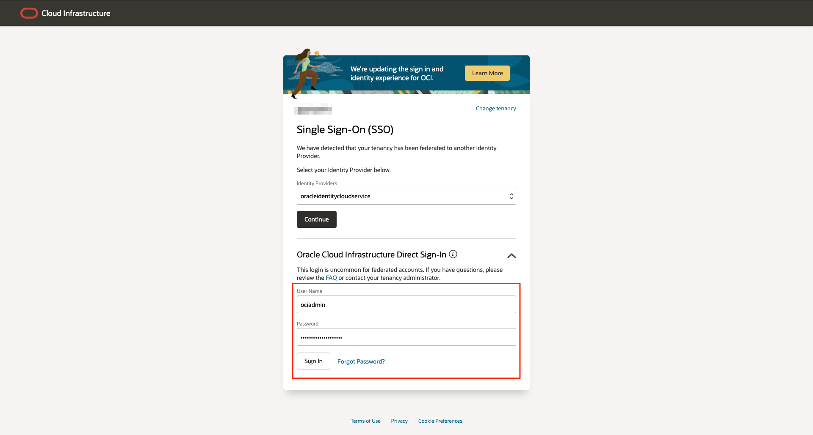

3. Click the navigation menu at the upper left, and select **Autonomous Transaction Processing** under Oracle Database.
	

4. Select your compartment. <if type="livelabs">Your compartment should begin with the username you logged in with. Do not select the root compartment.
</if>Leave Transaction Processing selected. Click **Create Autonomous Database**.

5. Fill out the dialog box:

    - Display name: Provide a name <if type="livelabs">- to ensure you have create a unique name, prepend the name with you username, for example "LL-234-DB"</if>
    - Database name: Provide a name <if type="livelabs">- to ensure you have create a unique name, prepend the name with you username, without any hyphens, for example "LL234DB"</if>
    - Choose a workload type: Transaction Processing
    - Choose a deployment type: Serverless

    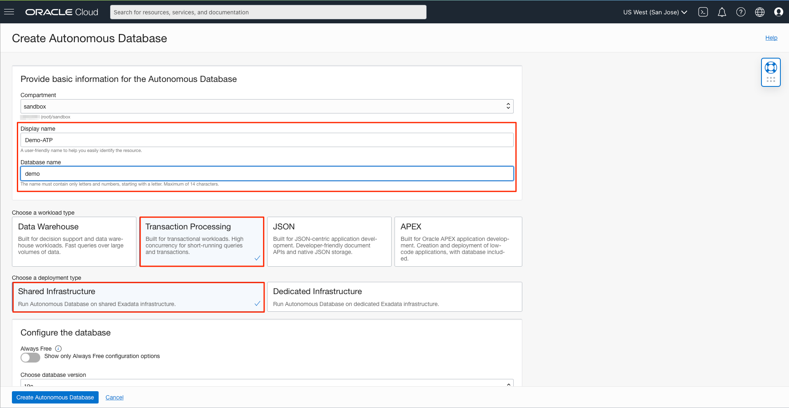

    Under **Configure the database**

    - Always Free: Leave Default
    - Choose database version: Leave Default
    - OCPU count: 1
    - CPU Auto Scaling: Make sure flag is Un-checked

    Under **Create administrator credentials**

    - Username: ADMIN (default)
    - Password: Provide a password (For example : AAbbcc123456 **Do not use &,!, in the password due to script limitation that we will execute later.**)
    - Confirm password: Confirm the password provided

    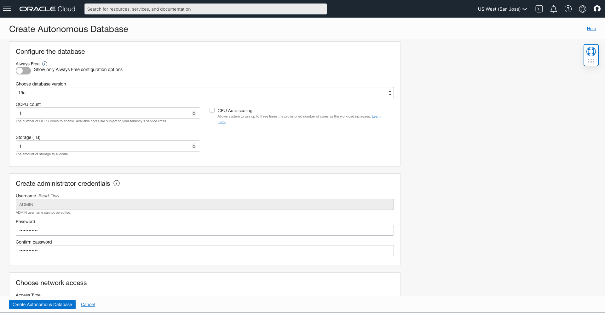

    Under **Choose network access**

    - Secure access from everywhere: Make sure this option is checked

    Under **Choose a license type**

    - License Included: Check this option

    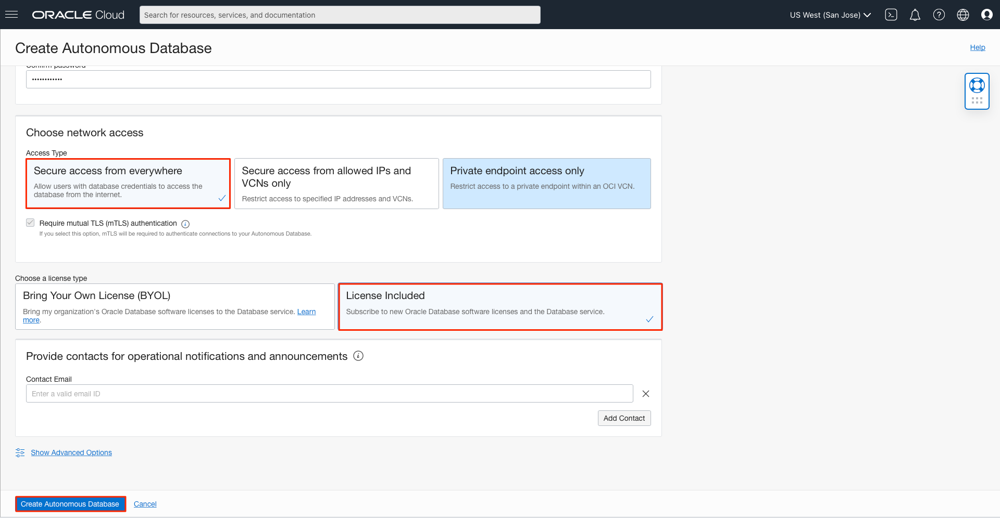

6. Click **Create Autonomous Database**. Wait for State to change to Available (few minutes).

## Task 2: Start using SQL Developer Web

1. Click **Database Actions**.

       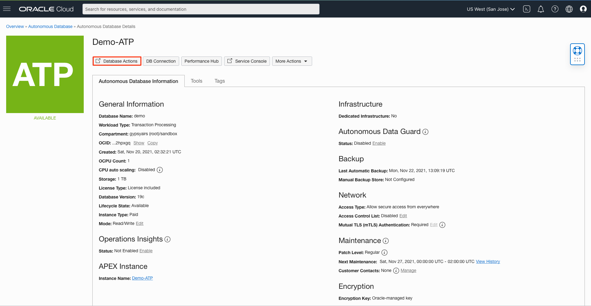  

2. In Database Actions, enter the ADMIN username and the password provided above. Then click **Sign In**.
       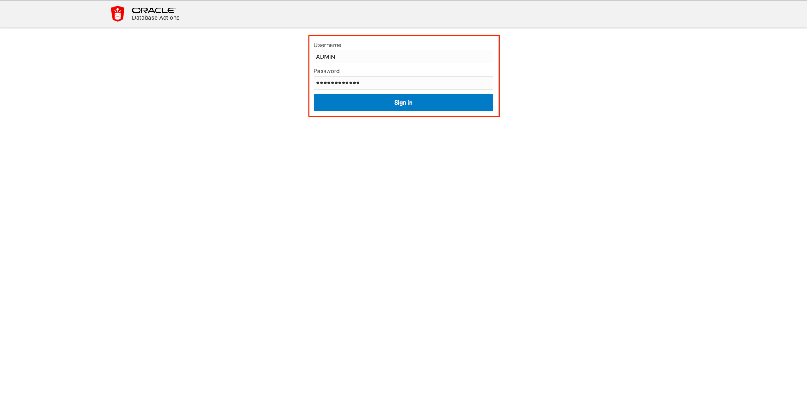

3. Click **SQL** to open SQL worksheet.
	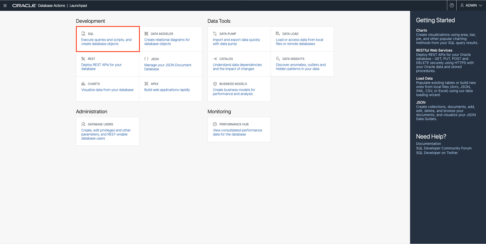

4. Before starting auditing data, you create a new user and a table with sensitive data. Use the following commands in the Worksheet:

	>**Note:** Replace ```*your_password*``` with a password of your choice. The password must be at least 12 characters long, with upper and lower case letters, numbers, and a special character. It must start with a letter. Click **Run Script**.

	```
    <copy>
    DROP USER test CASCADE;
    CREATE USER test IDENTIFIED BY *your_password*;
    ALTER USER test QUOTA UNLIMITED ON DATA;  
    GRANT create session, create table TO test;

    CREATE TABLE test.customers AS SELECT * FROM sh.customers;
    </copy>
    ```

	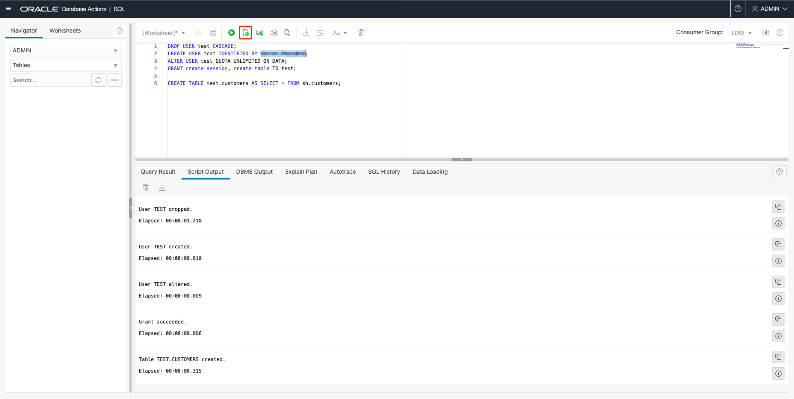

5. Display the data from the TEST.CUSTOMERS table, by copying, pasting, and executing the query below in the Worksheet.
      ```
      <copy>
      SELECT cust_first_name, cust_last_name, cust_main_phone_number FROM test.customers;
      </copy>
      ```

      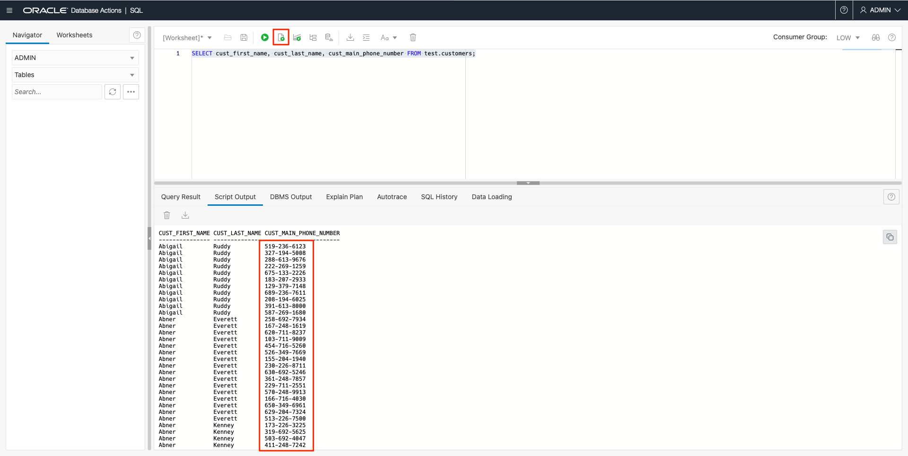

## Task 3: Audit data

1. The table TEST.CUSTOMERS holds columns whose data is sensitive. You want to audit the UPDATE actions on the table.

   Before you start auditing any operations on table TEST.CUSTOMERS, verify that the auditing is enabled in the database.

      ```
      <copy>
      SELECT VALUE FROM V$OPTION WHERE PARAMETER = 'Unified Auditing';
      </copy>
      ```

      The result should be TRUE. This shows that the unified auditing is enabled by default in your database.
      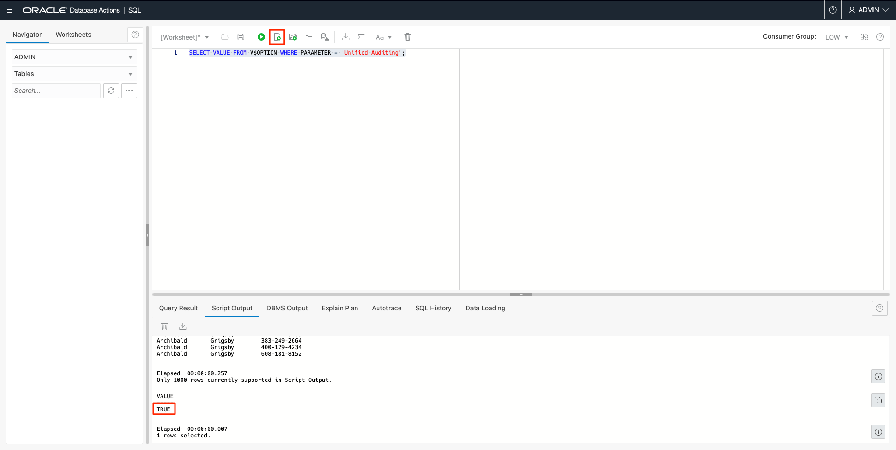

2. Create an audit policy on the table and then enable the audit policy for all users who could update values in the table TEST.CUSTOMERS.

      ```
      <copy>
      CREATE AUDIT POLICY audit_update_customers ACTIONS update ON test.customers;

      AUDIT POLICY audit_update_customers;
      </copy>
      ```

      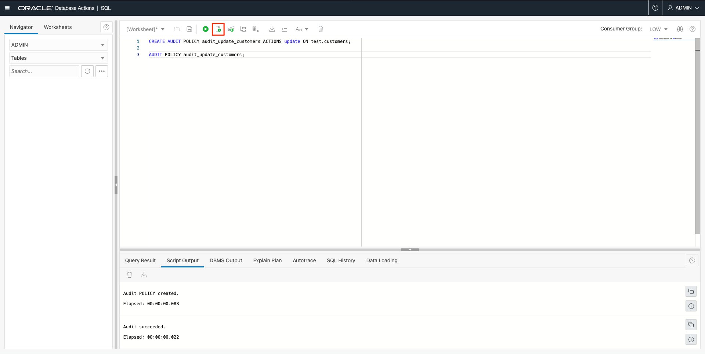

	>**Note:** When unified auditing is enabled in Oracle Database, the audit records are populated in this new audit trail. This view displays audit records in tabular form by retrieving the audit records from the audit trail. Be aware that if the audit trail mode is QUEUED, then audit records are not written to disk until the in-memory queues are full.

	The following procedure explicitly flushes the queues to disk, so that you can see the audit trail records in the UNIFIED\_AUDIT\_TRAIL view:

	```
	<copy>
	EXEC SYS.DBMS_AUDIT_MGMT.FLUSH_UNIFIED_AUDIT_TRAIL;
	</copy>
	```

3. Verify that the audit policy is created and enabled for all users.

      ```
      <copy>
      SELECT policy_name, enabled_option FROM audit_unified_enabled_policies
      WHERE policy_name = 'AUDIT_UPDATE_CUSTOMERS';
      </copy>
      ```

       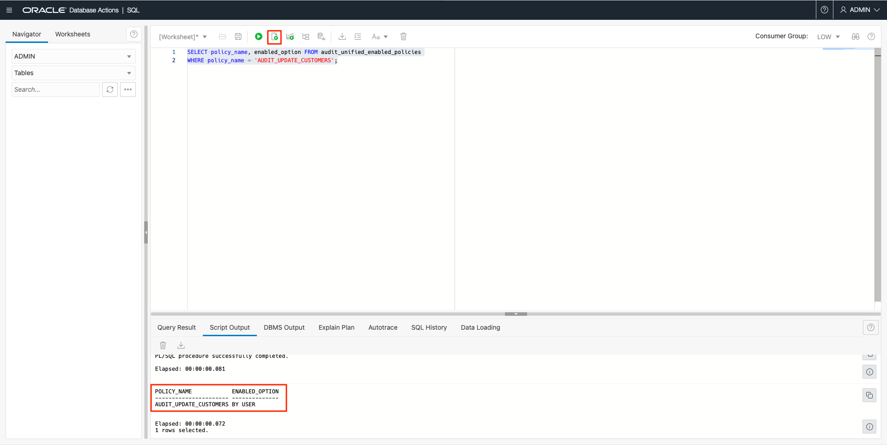

4. Execute an UPDATE operation on table TEST.CUSTOMERS.
      ```
      <copy>
      UPDATE TEST.CUSTOMERS SET cust_main_phone_number='XXX-XXX-1234';
      COMMIT;
      </copy>   
      ```

5. View the audit records.

      ```
      <copy>
      SELECT dbusername, event_timestamp, sql_text FROM unified_audit_trail
      WHERE  unified_audit_policies = 'AUDIT_UPDATE_CUSTOMERS';
      </copy>
      ```

       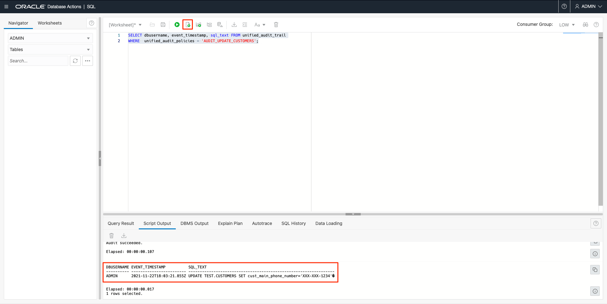

6. The ENABLED_OPT shows if a user can access the policy. Exclude the user ADMIN from unified policy. You must first disable the policy for all users and then re-enable the policy for all users except ADMIN:

      ```
      <copy>
      NOAUDIT POLICY audit_update_customers;
      AUDIT POLICY audit_update_customers EXCEPT admin;
      </copy>
      ```

       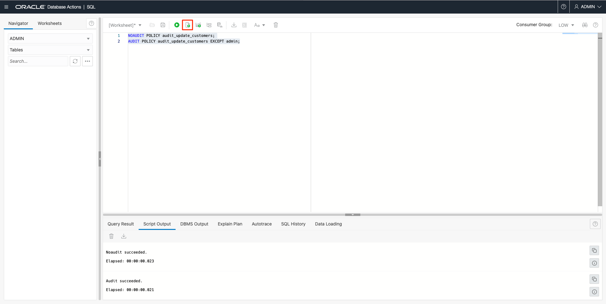

7. Re-execute an UPDATE operation on table TEST.CUSTOMERS. First delete the commands from the Worksheet and reload the UPDATE from the **SQL History** by clicking twice on the command and change the value for the phone number.

      ```
      <copy>
      UPDATE TEST.CUSTOMERS SET cust_main_phone_number='XXX-YYY-5678';
      COMMIT;
      </copy>
      ```

       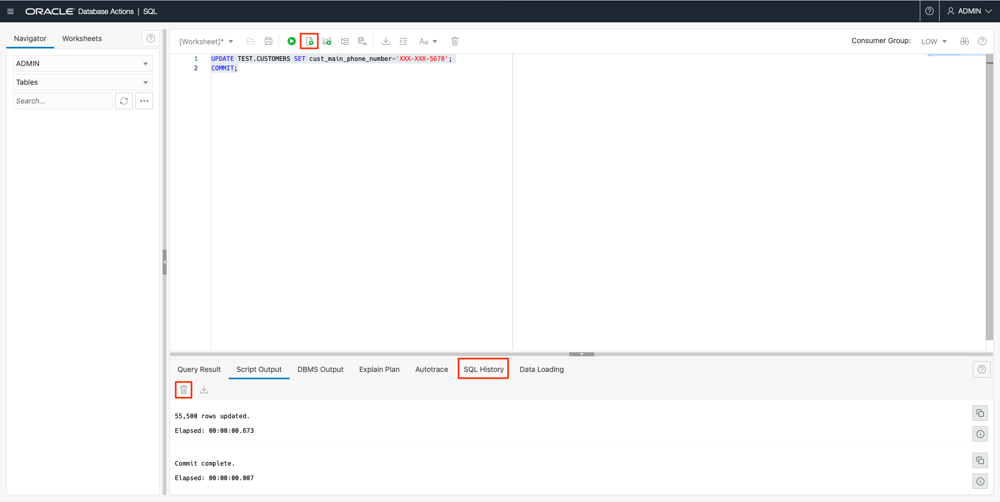

8. View the audit records.

      ```
      <copy>
      SELECT dbusername, event_timestamp, sql_text FROM unified_audit_trail
      WHERE unified_audit_policies = 'AUDIT_UPDATE_CUSTOMERS';
      </copy>
      ```

       

   You can observe that the second UPDATE completed by ADMIN is not audited.

## Acknowledgements
*Congratulations! You have successfully completed the lab.*

- **Author** - Flavio Pereira, Larry Beausoleil
- **Adapted by** -  Yaisah Granillo, Cloud Solution Engineer
- **Last Updated By/Date** - Arabella Yao, Product Manager, DB Product Management, November 2021