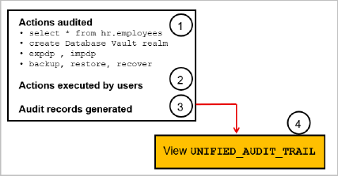

# Introduction

Get hands-on learning with training labs about Oracle cloud solutions. The workshops featured cover various solutions, skill levels, and categories based on Oracle Cloud Infrastructure (OCI).

Estimated time: 20 minutes

## About Audit in an Autonomous Database

Auditing is the monitoring and recording of configured database actions, from both database users and non-database users.
You can base auditing on individual actions, such as the type of SQL statement executed, or on combinations of data that can include the user name, application, time, and so on.

Watch the video below for a quick introduction to OCI Audit.

Unified Auditing is enabled by default. You can audit the several types of activities, using unified audit policies and the AUDIT SQL statement. All audit records are written to the unified audit trail in a uniform format and are made available through the UNIFIED\_AUDIT\_TRAIL view. The unified audit trail captures audit information from many types of object, from SQL statements to other Oracle Database Components, such as Recovery Manager, Oracle Data Pump, SQL*Loader.

### Benefits of the Unified Audit Trail

* The audit records are placed in one location and in one format, rather than your having to look in different places to find audit trails in varying formats.
* This consolidated view enables auditors to co-relate audit information from different components.
* The management and security of the audit trail is also improved by having it in single audit trail.
* Overall auditing performance is greatly improved. By default, the audit records are automatically written to an internal relational table.
* You can create named audit policies that enable you to audit the supported components. Furthermore, you can build conditions and exclusions into your policies.

### Objectives
In this workshop, you will:

* Create an audit policy
* Enable the policy and apply audit settings to one or more users
* View the generated audit records

### Prerequisites
* An Oracle Cloud Account - Please view this workshop's LiveLabs landing page to see which environments are supported

>**Note:** If you have a **Free Trial** account, when your Free Trial expires your account will be converted to an **Always Free** account. You will not be able to conduct Free Tier workshops unless the Always Free environment is available. 

**[Click here for the Free Tier FAQ page.](https://www.oracle.com/cloud/free/faq.html)**

## Additional Recommended Resources

1. [OCI Training](https://cloud.oracle.com/en_US/iaas/training)
2. [Familiarity with OCI console](https://docs.us-phoenix-1.oraclecloud.com/Content/GSG/Concepts/console.htm)
3. [Overview of Networking](https://docs.us-phoenix-1.oraclecloud.com/Content/Network/Concepts/overview.htm)
4. [Familiarity with Compartments](https://docs.us-phoenix-1.oraclecloud.com/Content/GSG/Concepts/concepts.htm)

You may now **proceed to the next lab**.

## Acknowledgements

- **Author** - Flavio Pereira, Larry Beausoleil
- **Adapted by** -  Yaisah Granillo, Cloud Solution Engineer
- **Last Updated By/Date** - Arabella Yao, Product Manager, DB Product Management, November 2021