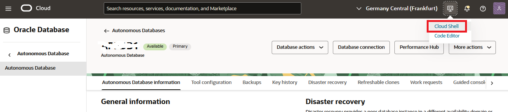
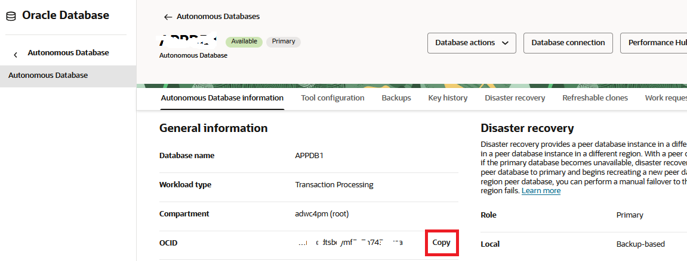
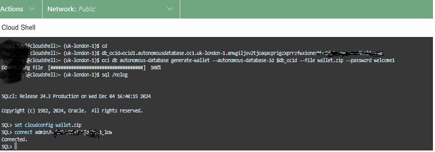

# Creating a non-partitioned Table

## Introduction

In this Lab, we create a 5GB non-partitioned table. A table must be at least 5GB in Always Free Autonomous Database environments or 64GB in non-free Autonomous Database (transaction processing or data warehousing) to be considered a candidate table for auto partitioning.

**Note: To run this workshop as-is you need to ensure to run it on a 19c Autonomous Database.**

### Objectives
- Create a sufficiently large nonpartitioned table with random data that will become your candidate table for auto partitioning.

### Prerequisites
This lab assumes you have completed the following lab:

- Provision an ADB Instance (19c)


## Task 1: Invoking Cloud Shell from the Oracle OCI 

During this part of the workshop we will use OCI Cloud Shell, a web browser-based terminal accessible from the Oracle Cloud Console. Cloud Shell provides access to a Linux shell, with a pre-authenticated Oracle Cloud Infrastructure CLI, and other useful pre-installed tools like SQL command line. We are going to use SQL command line in Cloud Shell for this workshop. 


1. From your Autonomous Database Details page, click the OCI Cloud Shell button:

	

2. When the shell has started we need to download the wallet into Cloud Shell to connect to your autonomous database. 
   First, we need to copy the OCID of your newly created autonomous database. That is the unique identifier of your database.	

	


3. 	In Cloud Shell, execute the following to connect to your database. You need to insert your copied **autonomous database OCID** into the code below. For the database connection you are using ADMIN with the admin password you set up when provisioning your autonomous database.

	The name of your service is your database name with suffix "high", "medium", or "low". You can get this information also from the DB Connections button on your **Autonomous Database Details** screen.
	
	```
	# go to home directory
	cd
	
	# set the environment variable for your newly created autonomous database
	db_ocid=<paste your copied ocid here>
	 
	# download wallet using OCI CLI 
	oci db autonomous-database generate-wallet --autonomous-database-id $db_ocid --file wallet.zip --password welcome1
	
	# Connect using sqlcl and your newly downloaded wallet
	sql /nolog
	set cloudconfig wallet.zip
	connect admin/<your_password>@<your_service>
	```
	This could look as follows:

	


## Task 2: Creating and populating a new Table

We are now creating a nonpartitioned table that will become our candidate table for auto partitioning. Building the table usually takes 8-9mins.

1. Using Cloud Shell connect with user **ADMIN** in sqlcl as you have done before.
	
	```
	sql /nolog
	set cloudconfig wallet.zip
	
	-- We will run the example in the ADMIN user account
	connect admin/<your_password>@<your_service>
	  
	-- Drop the APART table if it exists already
	--
	declare
		ORA_00942 exception; pragma Exception_Init(ORA_00942, -00942);
	begin
		execute immediate 'drop table APART purge';
		exception when ORA_00942 then null;
	end;
	/
	--
	-- Create the non-partitioned APART table
	--
	create table apart (
			a   number(10), 
			b   number(10), 
			c   number(10), 
			d   date, 
			pad varchar2(1000));
	```

2. Load your table with random data in sqlcl as user **ADMIN**
	
	```
	<copy>
	--
	-- Hints must be enabled for this particular INSERT statement
	-- because we want to force a particular join order. This will 
	-- keep the random strings apart when written to storage, which will  
	-- make compression less effective. We want to make the table large
	-- as quickly as possible so that it qualifies for auto partitioning.
	--
	-- If you want to use a paid (non-free) Autonomouse Database environment, 
	-- the minimum size for the table is 64GB. You can create a suitable table 
	-- by changing the following line in the SQL statement below.
	-- From this:
	--    from dual connect by level <= 3 )
	-- To this:
	--    from dual connect by level <= 30 )
	--
	alter session set optimizer_ignore_hints = false;
	  
	-- Table data is compressed by default, so we will insert random data 
	-- to make compression less effective. The aim is to create
	-- a large table as quickly as possible.
	-- 
	insert /*+ APPEND */ into apart
	with
	r as ( select /*+ materialize */ dbms_random.string('x',500) str 
	     from dual connect by level <= 2000 ),
	d as ( select /*+ materialize */ to_date('01-JAN-2020') + mod(rownum,365) dte 
	     from dual connect by level <= 2500 ),
	m as ( select 1 
	     from dual connect by level <= 3 )
	select /*+ leading(m d r) use_nl(d r) */
	rownum, rownum, rownum, dte, str
	from m,d,r;
	  
	-- Commit the transaction
	commit;

	alter session set optimizer_ignore_hints = true;
	</copy>
	```    

## Task 3: Checking the new table size
A candidate table for automatic partitioning must be at least 5 GB in size in a free Autonomous Database 19c.

1. Connect to sqlcl with user ADMIN as before and check the size of the table

	```
	<copy>
	select sum(bytes)/(1024*1024) size_in_megabytes 
	     from   user_segments
	     where  segment_name = 'APART';
	</copy>
	```
	It should show a size larger than 5000MB (similar to the example below).

	

## Acknowledgements
* **Author** - Nigel Bayliss, Dec 2021 
* **Contributor** - Hermann Baer
* **Last Updated By/Date** - Nigel Bayliss, Jun 2025