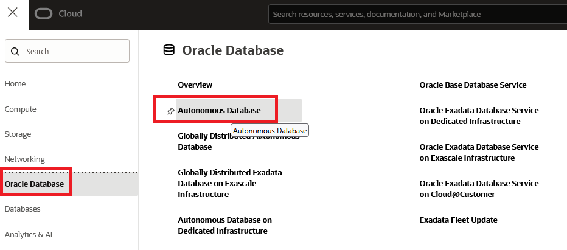
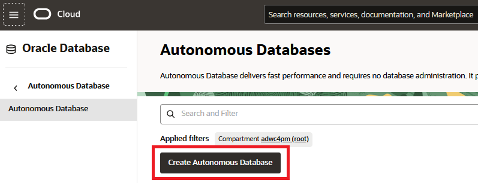
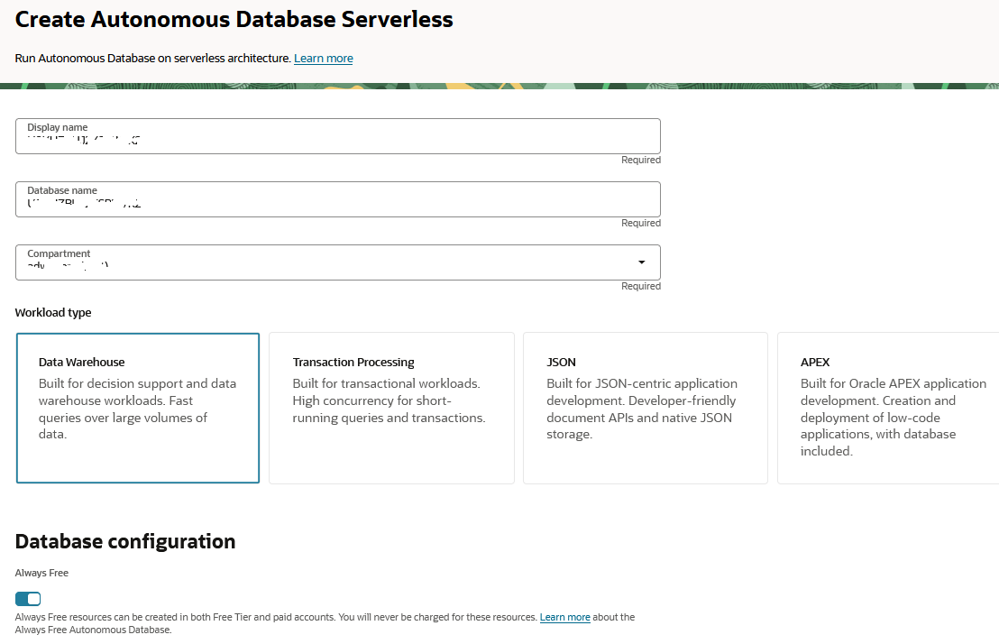

# Provisioning a new Autonomous Data Database

## Introduction

This workshop walks you through the steps to get started using the Oracle Autonomous Database. For this workshop we're going to use an always free **Autonomous Database optimized for Analytics and Warehousing (ADW)**. You will provision a new database in just a few minutes.

Estimated Lab Time: 15 minutes.

### Objectives 
- Create an Autonomous Database with the latest features of Oracle Databases

## Task 1: Create a new Always Free Autonomous Data Warehouse Database

1. Click on the navigation menu at the upper left corner of the page.

    This will produce a drop-down menu, click **Oracle Database** and then select **Autonomous Data Warehouse**.

    

    This will take you to the management console page.

    To learn more about comparments, see [Managing Compartments](https://docs.cloud.oracle.com/en-us/iaas/Content/Identity/Tasks/managingcompartments.htm).
    
2. To create a new instance, click the **Create Autonomous Database** button.

    

    Enter the required information and click the **Create Autonomous Database** button at the bottom of the form. For the purposes of this workshop, use the information below:

    - **Compartment:** Verify that a compartment ( &lt;tenancy_name&gt; ) is selected.

        By default, any OCI tenancy has a default ***root*** compartment, named after the tenancy itself. The tenancy administrator (default root compartment administrator) is any user who is a member of the default Administrators group. For the workshop purpose, you can use ***root***.

    - **Display Name:** Enter the display name for your ADW Instance.
    
    - **Database Name:** Enter a database name.

    - **Workload Type:** Data Warehouse  
    
    - **Deployment Type:** Serverless
    
    - **Always Free:** On

    

3. Under **Create administration credentials** and **Choose network access** sections:

    - **Administrator Password:** Enter any password you wish to use noting the specific requirements imposed by ADW.
    
    - **Reminder:** Note your password in a safe location.

    - **Access type**: Choose **Secure access from everywhere**

    - **Contact email**: Enter a contact email address.

    

4. Create the database.

    When you have completed the required fields, scroll down and click on the **Create** button at the bottom of the form.

5. The Autonomous Database **Details** page will show information about your new instance. You should notice the various menu buttons that help you manage your new instance - because the instance is currently being provisioned all the management buttons are greyed out.

    The provisioning process should take **under 5 minutes**.

6. After a short while, the status will change to **Available**:

    

You have just created an Autonomous Database with the latest features of Oracle Databases.

## Acknowledgements

- **Author** - Priscila Iruela - Technology Product Strategy Director, Juan Antonio Martin Pedro - Analytics Business Development
- **Contributors** - Victor Martin, Melanie Ashworth-March, Andrea Zengin
- **Last Updated By/Date** - Nigel Bayliss, Jun 2025
