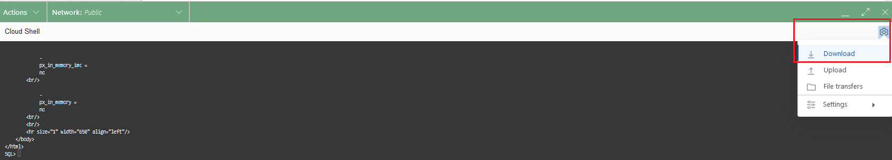
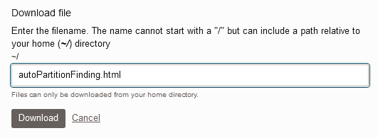
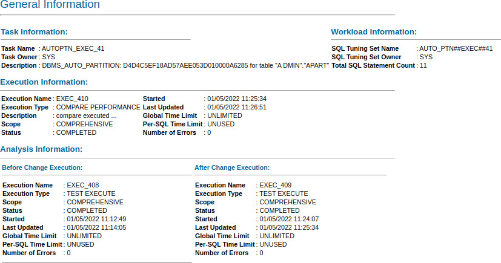
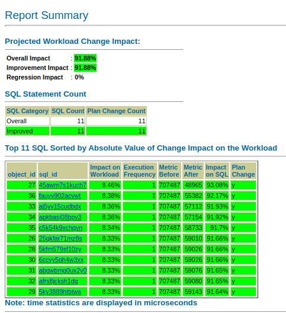
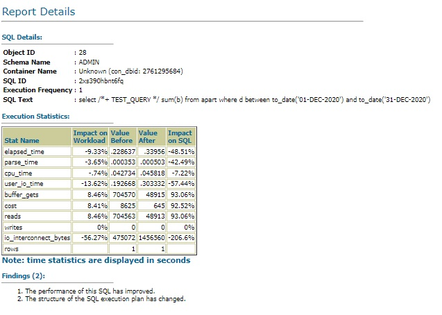
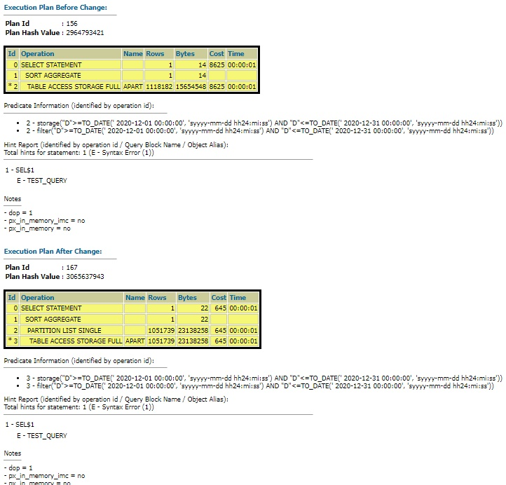

# View Recommendation

## Introduction

View the results of the recommend task.

Estimated Time: 10mins

### Objectives
- View the auto partitioning report and the information available in the auto partitioning data dictionary view.

### Prerequisites
This lab assumes you have completed the following labs:

- Provision an ADB instance (19c)
- Create non-partitioned table
- Validate the table
- Execute recommend task

## Task 1: View basic Information of your Recommendation

Whenever Auto Partitioning identifes a suitable recommendation for a candidate table, the findings are stored in the data dictionary. The DBA\_AUTO\_PARTITION\_RECOMMENDATIONS view can be used to see details of the recommendation, such as the partitioning method and partition key.

1. Use the following query to view the latest recommendation details.

    ````
    <copy>
    set linesize 180
    column partition_method format a100
    column partition_key format a13
    
    select partition_method,partition_key 
    from dba_auto_partition_recommendations
    where generate_timestamp = 
      (select max(generate_timestamp) 
       from   dba_auto_partition_recommendations);
    </copy>
    ````
    This is the same information you have seen in the previous lab being returned by the recommendation. The partitioning method is not a standard range or interval partitioning because it needs to account for NULL partition keys and it allows us to avoid creating a large number of partitions if, for example, column D is inserted/updated with a date value far into the future.

    The PARTITION_METHOD column value had been shortened here for clarity. The partition column is "D".

    `````
    PARTITION_METHOD                       PARTITION_KEY
    ---------------------------------- ... -------------
    LIST(SYS_OP_INTERVAL_HIGH_BOUND("D ... D         
    `````
## Task 2: Extract and Download the Auto Partitioning Report

In addition to the core information about the recommendation execution and the top level findings, the Autonomous Database also stores a detailed report about the workload execution against the hidden partitioned table built for verification. You can select this information directly from the data dictionary or use a purpose-built interface to extract this information in a user-friendly format such as HTML. 

1. Extract the latest auto partitioning report by executing the following commands in the Cloud Shell. The script will spool a file called _autoPartitionFinding.html_ into your current directory where you invoked sqlcl. Please take note of the directory in Cloud Shell. 

    ````
    <copy>
    set trimspool on
    set trim on
    set pages 0
    set linesize 1000
    set long 1000000
    set longchunksize 1000000
    set heading off
    set feedback off

    spool autoPartitionFinding.html
    select dbms_auto_partition.report_last_activity(type=>'HTML') from dual;
    exit;
    </copy>
    ````

2. Initiate the _autoPartitionFinding.html_ file download to your local machine using the Cloud Shell. Select the _Download_ menu option.

    

3. Specify the file name and click the Download button.

    

## Task 4: View the Auto Partitioning Report

1. Open the downloaded _autoPartitionFinding.html_ file in your browser. The report format is similar to that of _SQL Performance Analyzer_, so it may be broadly familiar to you already.

2. The general information section contains information on the performance test conduncted to measure the improvement in query performance when the table is partitioned.

    

3. The report summary presents the performance effects of partitioning for the application workload SQL statements.

    

4. For each SQL statement in the workload, the report will allow you to compare the non-partitioned vs partitioned performance.

    

5. In addition, you will be able to check the before vs after SQl execution plans.

    

## Task 4: View the modify-table DDL

It is possible to run the recommend task on a clone of your production database and retrieve the DDL command that can be used to partition your production database table. The DDL command is held in DBA\_AUTO\_PARTITION\_RECOMMENDATIONS. 

1. Inspect the DDL command that auto partitioning will use to alter the candidate table. Note that is uses an ONLINE PARALLEL operation. In this example, query DBA\_AUTO\_PARTITION\_RECOMMENDATIONS to view the latest recommendation.

    ````
    <copy>
    set long 100000

    select modify_table_ddl 
    from  dba_auto_partition_recommendations
    where generate_timestamp = 
       (select max(generate_timestamp) 
        from   dba_auto_partition_recommendations)
    order by recommendation_seq;
    </copy>
    ````
    The DDL for our nonpartitioned table and generated workload will look similar to the following output:

    ````
    begin                                                                           
    -- DBMS_AUTO_PARTITION recommendation_ID 'D28FC3CF09DF1E1DE053D010000AF8F8'   
    --   for table "ADMIN"."APART"                                                
    --   generated at 12/07/2021 14:45:24                                         
                                                                                    
    dbms_auto_partition.begin_apply(expected_number_of_partitions => 7);          
                                                                                    
    execute immediate                                                             
    'alter table "ADMIN"."APART"                                                    
    modify partition by                                                            
    LIST(SYS_OP_INTERVAL_HIGH_BOUND("D", INTERVAL ''2'' MONTH, TIMESTAMP ''2020-01-0
    1 00:00:00'')) AUTOMATIC (PARTITION P_NULL VALUES(NULL))                        
    auto online parallel';                                                         
                                                                                    
    dbms_auto_partition.end_apply;                                                
    exception when others then                                                      
    dbms_auto_partition.end_apply;                                                
    raise;                                                                        
    end;   
    ````

You may now **proceed to the next lab**.

## Acknowledgements
* **Author** - Nigel Bayliss, Jan 2022
* **Contributor** - Hermann Baer
* **Last Updated By/Date** - Nigel Bayliss, Jan 2022
