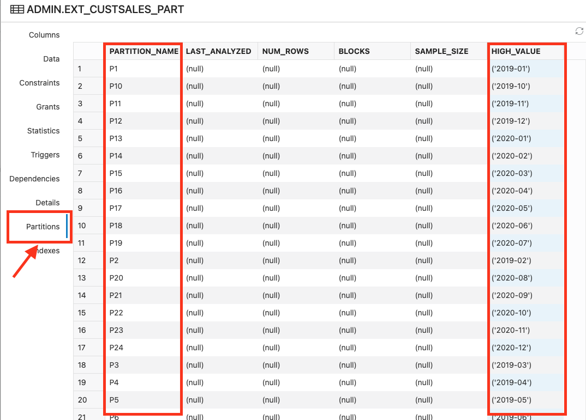

# Query External Data

## Introduction

Data lakes oftentimes have data sets that are experimental, potentially useful but sparse (think log data), uncurated or staging data. It is extremely beneficial to be able to query that data from the data warehouse using existing tools and applications. Blending data from the warehouse with data from the lake allows for new insights that would otherwise be unachievable. 

Data lakes typically organize data files in object storage using a particular format:
    


In the example above:
* Tables map to folders (`customer_contact`, `custsales`)
* Partitions map to subfolders. `month=201901` is equivalent to a month partition column with the value `201901`. There are often multiple levels of subfolders.
* Data is found in files at the leaf

Autonomous Database understands common data lake organization patterns and makes it easy to create and synchronize partitioned external tables with these sources. Queries against these sources benefit from Oracle Database partition pruning query optimization - minimizing the amount of data scanned and improving performance.

Estimated Time: 10 minutes

### Objectives

In this lab, you will:
* Create an external table over data in object storage
* Create a partitioned external table over data in object storage
* Load data from the partitioned external table
* Compare query performance against these stores

### Prerequisites

- This lab requires that you have provisioned an Autonomous Database instance.

## Task 1: Navigate to SQL worksheet
[](include:adb-goto-sql-worksheet.md)

## Task 2: Query the contents of the object store 
You can query the list of files available in object storage using SQL. Simply pass the location of the source data to the ``dbms_cloud.list_objects`` function. You can [learn more about this function in the documentation](https://docs.oracle.com/en/cloud/paas/autonomous-database/adbsa/dbms-cloud-subprograms.html#GUID-52801F96-8280-4FE0-8782-E194F4360E6F). 

> Because the files used in this exercise are in a public bucket, a credential is not required to access OCI Object Storage

1. Query MovieStream's public bucket to see the target files that you will access. Copy and paste the following query into the worksheet. Run the query by pressing [control-enter] or by clicking the play button in the toolbar. 
        ```
    <copy>--===============================
-- view the files in object storage
--===============================
select object_name, bytes
from 
    dbms_cloud.list_objects (            
        location_uri => 'https://objectstorage.us-ashburn-1.oraclecloud.com/n/c4u04/b/moviestream_gold/o/')
where object_name like '%.parquet'
order by 1
;
    </copy>
        ```

2. Notice the monthly partitions in the ``custsales`` folder. The files are stored in an optimized Apache Parquet file type. Parquet files capture data in compressed columnar format. Autonomous Database optimizes queries against these file types, extracting only the necessary columns and filtering data blocks - minimizing the amount of data scanned and returned by queries:

    

## Task 3: Create and query an external table over Parquet data files

1. Let's create a simple external table over this data set using the ``dbms_cloud.create_external_table`` procedure:
        ```
        <copy>--==============================
-- simple table
--==============================
begin
    dbms_cloud.create_external_table
    (
    table_name => 'ext_custsales',
    file_uri_list => 'https://objectstorage.us-ashburn-1.oraclecloud.com/n/c4u04/b/moviestream_gold/o/custsales/*.parquet',
    format => '{"type":"parquet", "schema": "first"}'

    );
end;
/
    </copy>
    ```
2. Run the following query to view the first few rows of data:
    ```
    <copy>select *
from ext_custsales where rownum < 5;
    </copy>
    ```
    Listed below are the results. You can see the movies that were rented or viewed for free using different devices:

    

3. View performance of a count(*) query against a single month of data by running the following query:
    ```
    <copy>select count(*) 
from ext_custsales
where to_char(day_id, 'YYYY-MM') = '2019-01';
    </copy>
    ```
    Your query performance will vary depending on your region. Also, this query is not running in parallel since you are running in the LOW consumer group:
    
    

    The query executed in a bit over a minute. Remember this number - we'll compare it next to a query that uses a partitioned external table.

## Task 4: Create and query a partitioned external table over Parquet data files
With Oracle Partitioning, a single logical object in the database is subdivided into multiple smaller physical objects, known as partitions. The knowledge about this physical partitioning enables the database to improve the performance when querying external data. As mentioned previously, Autonomous Database makes it easy to create partitioned external tables over sources that use common data lake organizational patterns. 

1. Create a partitioned external table using the the ``dbms_cloud.create_external_part_table`` procedure. Similar to the previously used ``dbms_cloud.create_external_table`` procedure, ``dbms_cloud.create_external_part_table`` takes the table_name and the source URI (again, this data is stored in a public bucket, so the credential parameter is not required). Notice that the format parameter also includes a ``partition_columns`` attribute. The attribute's name must match the partition column name found in the object storage path. The data type is the Oracle data type that maps to the column. The result will be a partitioned tables whose values come from the file paths:

    ```
    <copy>--==============================
    -- partitioned table
    --==============================
    begin
        dbms_cloud.create_external_part_table (
            table_name => 'ext_custsales_part',
            file_uri_list => 'https://objectstorage.us-ashburn-1.oraclecloud.com/n/c4u04/b/moviestream_gold/o/custsales/*.parquet',
            format => '{"type":"parquet", "schema": "first","partition_columns":[{"name":"month","type":"varchar2(100)"}]}'
            );
        end;
        /
    </copy>
    ```
    Copy and paste this code snippet into the SQL worksheet and run the command.

2. Let's review the new external table. Click the refresh button in the **Navigator**. Then, right-click **EXT\_CUSTSALES\_PART** and select **Open**

    

    The columns and their data types were automatically derived from the Parquet file metadata. The ``month`` column does not appear in the file but has been added to the table as the partition column.

3. Click the **Partitions** tab in the table viewer. A partition has been created for each month value:

    

    In the future, as new partitions are added to the object storage bucket, simply call ``dbms_cloud.sync_external_part_table`` to keep the external table up to date. [Refer to the documentation](https://docs.oracle.com/en/cloud/paas/autonomous-database/adbsa/dbms-cloud-subprograms.html#GUID-9C7D1555-F323-4F48-9C8C-6AB025EF8C86) for more details on these capabilities.

    Click **Close** to dismiss the dialog.

4. How are customers watching movies? Find out which operating systems are used most frequently. Copy and paste the following SQL into the SQL worksheet and click run. Notice you query partitioned tables in exactly the same way you query unpartitioned tables:
    ```
    <copy>select os, count(*)
from ext_custsales_part 
where month='2020-12'
group by os
order by 2 desc;
    </copy>
    ```
    Android and iOS are the dominant devices:

    

5. Re-execute the ``count(*)`` query and compare performance to the unpartitioned table. Copy and paste the SQL below into the SQL worksheet and click run:
    ```
    <copy>select count(*) 
from ext_custsales_part
where month='2019-01';
    </copy>
    ```
    

    The query returns in a couple of seconds. Partitioning narrowed the data scan to a single month - providing a 20x performance improvement.   

## Task 5: Create, load and query the an Oracle table from the object storage source

1. Now that we have the external table, it's easy to create and load an Oracle Database table from the object storage source:
    ```
    <copy>create table custsales as
select * from ext_custsales_part;
    </copy>
    ```
    ``CREATE TABLE AS SELECT``, or CTAS, is a shortcut for both creating and populating a table.

2. Run the same count query against the internal table:
    ```
    <copy>select count(*) 
from custsales
where month='2019-01';
    </copy>
    ```
    This time, the query returns in just a fraction of a second (or 12x faster than the partitioned external table query):

    

## Learn More
There's lots of good material on working with external data:
* Oracle Autonomous Database dbms_cloud documentation
* Oracle Autonomous Database documentation [Query External Data with Data Catalog](https://docs.oracle.com/en/cloud/paas/autonomous-database/adbsa/query-external-data-catalog.html#GUID-480FAF23-453D-4B15-BF92-8435805EB8A5)
* Oracle Data Warehouse Insider Blog: 
    * [Creating and managing Partitioned External Tables just got simple](https://blogs.oracle.com/post/simplified-partitioning-xt)
    * [Use any AWS S3 compatible object store with Autonomous Database](https://blogs.oracle.com/datawarehousing/post/use-any-aws-s3-compatible-object-store-with-autonomous-database)

Please *proceed to the next lab*.

## Acknowledgements

* **Author** - Marty Gubar, Autonomous Database Product Management
* **Last Updated By/Date** - Marty Gubar, June 2022
