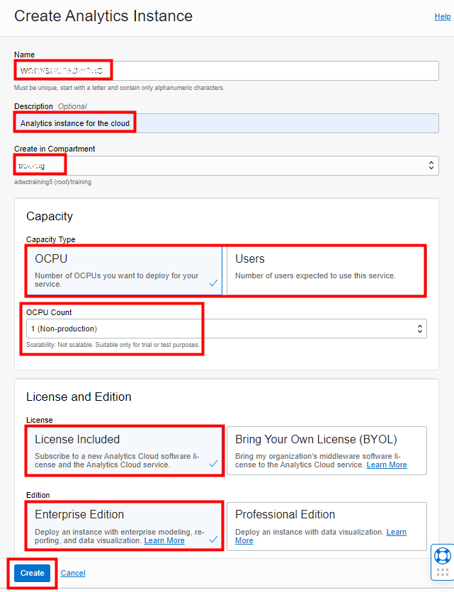
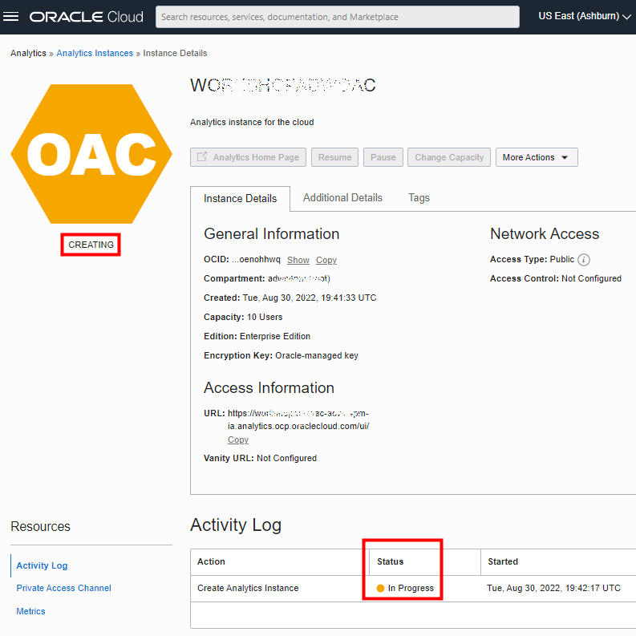
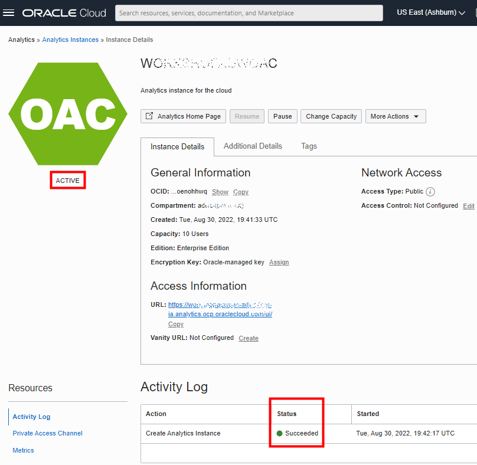

# Provision Your Oracle Analytics Cloud (OAC) Instance

## Introduction

In this lab, you provision an **Oracle Analytics Cloud (OAC)** instance on Oracle Cloud Infrastructure, which you will use in the final lab to analyze your data.

You will provision your OAC instance with your Oracle Cloud paid or Free Tier **credits**; Oracle Analytics Cloud is not part of the **Always Free** cloud services.

Provisioning an Oracle Analytics Cloud instance can take over **40 minutes**. We position this lab first, so that the OAC instance can provision while you proceed with the following labs. You will later use your OAC instance in the final lab of this workshop, "Develop Self-Service Analytics Cloud Dashboards."

> Note: If you attend this workshop at CloudWorld or another in-person instructor-led event, your instructor will direct you to skip this lab, providing you a link to  an already-provisioned OAC instance.

Watch our short video that explains how to provision your Oracle Analytics Cloud instance:

> Note: Please disregard the video's reference to "Lab 2."

Estimated Time: 40+ minutes.

### Objectives
- Create an Oracle Analytics Cloud Instance

## Task 1: Create an Oracle Analytics Cloud (OAC) Instance

Access the Oracle Cloud Infrastructure Console from the **Oracle Home Page** (www.oracle.com) and sign in to your cloud account. Click **View Account** and **Sign in to Cloud**.

1. Click the menu icon on the left. Verify that you are signed in as a **Single Sign On** (Federated user) by selecting the **Profile** icon in the top right side of your screen. If your username is shown as:

    - oracleidentitycloudservice/&lt;your username&gt;

    Then you are **connected** as a **Single Sign On** user.

    

    If your username is shown as:

    -  &lt;your username&gt;

    Then you are **signed in** as an **Oracle Cloud Infrastructure** user.

    

    If your user does not contain the identity provider (**oracleidentitycloudprovider**), please log out and select to authenticate
    using **Single Sign On**.
    > To enable using **Oracle Analytics Cloud**, we need to sign on as a **Single Sign-On** (SSO) user.

    

    For more information about federated users, see [User Provisioning for Federated Users](https://docs.cloud.oracle.com/en-us/iaas/Content/Identity/Tasks/usingscim.htm).

2. Return to the **Home Console Page** and navigate to the **Analytics & AI** section and then **Analytics Cloud**.

    

    > **Note**: You must be connected as a **Single Sign On** (**Federated user**) user to a tenancy, which has available cloud credits to see this menu item. Local OCI users are not able to do this.

3. Select **Create Instance**.

    Complete the form using the following information:

    - **Name**: 

    - **Description**: `Analytics instance for the cloud`

    - **Create in Compartment**: Select a valid compartment in your tenancy

    - **Capacity Type - OCPU**: OCPU Count: 1 (Non Production)

    - **Capacity Type - Users**: User Count: 10

    - **License**: License Included

    - **Edition**: Enterprise Edition

4. Click **Create**.

    

5. The Analytics instance page will be displayed with a status of **CREATING**.

    

    ***Reminder***: Provisioning an Oracle Analytics Cloud instance can take over **40 minutes**.

6. The Analytics instance page will be displayed with a status of **ACTIVE**.

    

Please proceed to the next lab.

## **Acknowledgements**

- **Author** - Priscila Iruela - Technology Product Strategy Director, Juan Antonio Martin Pedro - Analytics Business Development
- **Contributors** - Victor Martin, Melanie Ashworth-March, Andrea Zengin
- **Updated By/Date** - Priscila Iruela, June 2022
- **Last Updated By/Date** - Rick Green, Principal Developer, Database User Assistance, August 2022
