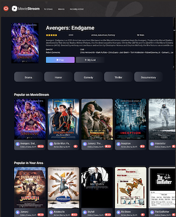
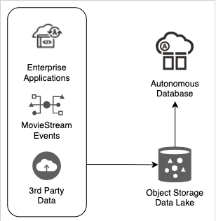
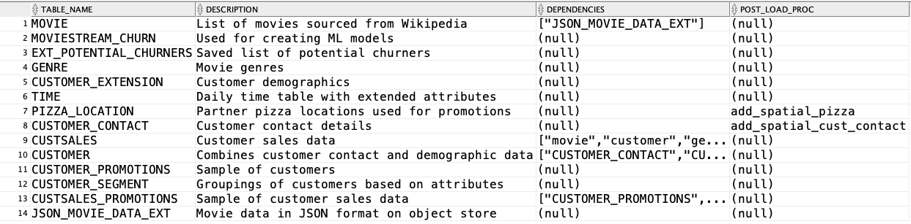

# Data Sets

## Introduction
One of the challenges in workshop development is finding a data set to use. Many Autonomous Database workshops are using a shared MovieStream data set. It's encouraged that other workshops do the same. Sharing data makes reusing content much, much easier. 

In addition, your workshop may simply want to focus on a task - like running spatial queries. Of course, you can have the user load data, create spatial metadata and then add spatial indexes. But, that may be more than you want to do for your workshop. After a quick install of the workshop utilities (would be nice to remove this step!), simply run a command that adds the data set and all its requirements using a single API call.

Read on to learn more about the MovieStream data set and how to use it.

And, let us know if you have interesting data sets to include!

### Background
Oracle MovieStream is a fictitious movie streaming platform - similar to Netflix, Amazon, Hulu, etc.  They face challenges that are typical to many organizations across industries. MovieStream needs to gain a better understanding of their customers to ensure that they love their service.  MovieStream needs to offer the right products at the right time at the right price.  They want to grow the business to become a dominant player in the streaming business.



We have hosted in public buckets the data required to drive this application. The movies themselves were sourced from Wikipedia. If you use the movie data, ensure that you provide proper acknowledgements in your workshop:

> Data about movies in this workshop were sourced from **Wikipedia**.
>
> Copyright (C)  Oracle Corporation.
>
> Permission is granted to copy, distribute and/or modify this document
> under the terms of the GNU Free Documentation License, Version 1.3
> or any later version published by the Free Software Foundation;
> with no Invariant Sections, no Front-Cover Texts, and no Back-Cover Texts.
>
> A copy of the license is included in the section entitled [GNU Free Documentation License](files/gnu-free-documentation-license.txt)


### Data Architecture
The data organization mirrors an example customer deployment:


1. Landing zone (bucket) in object storage.  This will have data in its raw form.
2. Gold zone (bucket) in object storage.  This will contain cleansed and transformed data.
3. Sandbox (bucket) in object storage.  Results of OML produced by data scientists are saved into the sandbox.
4. Data warehouse.  Data access and performance layer.  Fed from data lake.

## Data Description
Below is a partial list of the key data sets that are used by the MovieStream (we will update the table below with the additional ones). The workshop utilities will load these data sets into the tables listed below.

<table class="wrapped">

  <thead>
    <tr>
      <th>Table</th>
      <th>Source Bucket</th>
      <th>Source Files</th>
      <th>Size</th>
      <th>Description</th>
    </tr>
  </thead>
  <tbody>
    <tr>
      <td style="text-align: left;">movie</td>
      <td>moviestream_gold</td>
      <td>movie/*.json</td>
      <td style="text-align: left;">3821</td>
      <td style="text-align: left;">Movies list of movies.  Lots of good attributes, including: awards, nominations, cast, crew, genres, budget, gross, opening date, etc. This in JSON format.</td>
    </tr>
    <tr>
      <td>customer_contact</td>
      <td>moviestream_gold</td>
      <td>customer_contact/*.csv</td>
      <td>148,129</td>
      <td>This is the base contact details for a moviestream customer</td>
    </tr>
    <tr>
      <td style="text-align: left;">genre</td>
      <td>moviestream_gold</td>
      <td>genre/*.csv</td>
      <td style="text-align: left;">25</td>
      <td style="text-align: left;">Genre that a movie belongs to</td>
    </tr>
    <tr>
      <td style="text-align: left;">custsales</td>
      <td>moviestream_gold</td>
      <td>custsales/*.parquet</td>
      <td style="text-align: left;">25,686,400</td>
      <td style="text-align: left;">Two years of daily movie purchases by customers. The data has monthly partitions and is stored as parquet files</td>
    </tr>
    <tr>
      <td>customer_extension</td>
      <td>moviestream_landing</td>
      <td>customer_extension/*.csv</td>
      <td>148,129</td>
      <td>3rd party data that has extended attributes for the customer.  Probably 20 or so attributes describe the customer.</td>
    </tr>
    <tr>
      <td style="text-align: left;">customer</td>
      <td>n/a</td>
      <td></td>
      <td style="text-align: left;">148,129</td>
      <td style="text-align: left;">View combines customer_extension and customer_contact tables.</td>
    </tr>
    <tr>
      <td style="text-align: left;">customer_segment</td>
      <td>moviestream_landing</td>
      <td>customer_segment/*.csv</td>
      <td style="text-align: left;">10</td>
      <td style="text-align: left;">Customer segment that a customer belongs to (DINK, married with children, etc.)</td>
    </tr>
    <tr>
      <td>time</td>
      <td>n/a</td>
      <td></td>
      <td>731</td>
      <td>Table used to densify time calculations for SQL analytic functions. Created via code.</td>
    </tr>
    <tr>
      <td>pizza_location</td>
      <td>moviestream_landing</td>
      <td>pizza_locations/*</td>
      <td>104</td>
      <td>Pizza locations that are near customers that are likely to churn</td>
    </tr>
    <tr>
      <td>potential_churners</td>
      <td>moviestream_sandbox</td>
      <td>potential_churners/*.csv</td>
      <td></td>
      <td>Customers and their predicted probability to churn</td>
    </tr>
  </tbody>
</table>

## Accessing the data
The data is stored in public buckets managed by LiveLabs. You can access the data using the table below:
<table>
  <tbody>
    <tr>
      <th>Buckets (production URLs on LiveLabs)</th>
      <th>PAR (Production URLs on LiveLabs)</th>
    </tr>
    <tr>
      <td>
        <a href="https://objectstorage.us-ashburn-1.oraclecloud.com/n/c4u04/b/moviestream_gold/o">moviestream_gold</a>
      </td>
      <td>
        <a href="https://objectstorage.us-ashburn-1.oraclecloud.com/p/B4TMFWDOLh-EPrzE2ivDAfOlizm7IjpI_SY94QgUTGJNMX3jgh0jnQFAtPPZVcWq/n/c4u04/b/moviestream_gold/o/">par_moviestream_gold</a>
      </td>
    </tr>
    <tr>
      <td>
        <a href="https://objectstorage.us-ashburn-1.oraclecloud.com/n/c4u04/b/moviestream_landing/o">moviestream_landing</a>
      </td>
      <td>
        <a href="https://objectstorage.us-ashburn-1.oraclecloud.com/p/YtpqXpUpPx1pPXFQa4Githwxx4bxp12q2yZJsCyzN0Y9-kpYr5nAOvLvwZfLHxXF/n/c4u04/b/moviestream_landing/o/">par_moviestream_landing</a>
      </td>
    </tr>
    <tr>
      <td>
        <a href="https://objectstorage.us-ashburn-1.oraclecloud.com/n/c4u04/b/moviestream_sandbox/o">moviestream_sandbox</a>
      </td>
      <td>
        <a href="https://objectstorage.us-ashburn-1.oraclecloud.com/p/jTFkU1Mey2PizeVQDp2nkfpAV40OmI9rLejneNhQ9tNiDqkP4543H4Boy8gDaxos/n/c4u04/b/moviestream_sandbox/o/">par_moviestream_sandbox</a>
      </td>
    </tr>
    <tr>
  </tbody>
</table>

## Loading data using the Workshop Utilities
Your workshop may be focused on using data, not loading data. The workshop utilities simplify the installation of the MovieStream data sets. This includes:
* Listing available data sets
* Creating tables and loading the data
* Running dependent scripts - like building a graph, adding indexes, etc.

The list of data sets is easily extended. There are no dependencies on certain locations, etc. All information about the data sets and their requirements are captured in a metadata file hosted in github.

### Installing the workshop utilities
Run the following script in a SQL Worksheet (must be ADB) to install the utility. For simplicity, run this as the ADMIN user:

  ```
  <copy>
  declare
      l_git varchar2(4000);
      l_repo_name varchar2(100) := 'adb';
      l_owner varchar2(100) := 'martygubar';
      l_package_file varchar2(200) := 'building-blocks/setup/workshop-setup.sql';
  begin
      -- get a handle to github
      l_git := dbms_cloud_repo.init_github_repo(
                  repo_name       => l_repo_name,
                  owner           => l_owner );

      -- install the package header
      dbms_cloud_repo.install_file(
          repo        => l_git,
          file_path   => l_package_file,
          stop_on_error => false);

  end;
  /
  </copy>
  ```
There is also a Block that steps thru this install in more detail:
* [Add Workshop Utilities](/building-blocks/workshop/freetier/index.html?lab=add-workshop-utilities)

You're now ready to add users and load data!

## Add a user
The Workshop Utilities provide an add user procedure. The newly created user has all of the privileges required to run the MovieStream workshops. You can also run workshpos as ADMIN - however, this is not recommended (and sometimes not even possible). Of course, you can add a user via the Database Tools - and there is a Block for that! Adding the user via the API can speed things up. In SQL Worksheet:

  ```
  <copy>
  exec add_adb_user('dave','Spatialisc00l#')
  </copy>
  ```

## List available data sets
Once the utilities are installed, It is easy to view available datasets and then load the ones you want into any schema. After logging in as the targeted user, run the following query to view available datasets:
  ```
  <copy>
  select  
    table_name,
    description,
    dependencies,
    post_load_proc
  from workshop_datasets;;
  </copy>
  ```

Here, you can see the data sets and their dependencies. Dependent data sets are automatically installed when needed; you do not need to track the dependencies:



You will also see post-load procedures that are registered with the data set. These procedures run after the data set has been installed and perform tasks like creating indexes, registering metadata, etc.

## Create and load tables
Use the `workshop.add_dataset` procedure to add tables to your schema. The procedure takes two inputs:
  * **table\_names**: comma separated list of tables.  Use ALL to add all tables
  * **debug\_on**: will keep dmbs_cloud logging tables after a data load. This lets you check for rejected records and other loading issue

In the following example, add the **PIZZA\_LOCATION** and **CUSTOMER\_CONTACT** tables:

  ```sql
  <copy>
    exec workshop.add_dataset('PIZZA_LOCATION, CUSTOMER_CONTACT')
  </copy>
  ```

To create and load all 14 tables and views, simply run:
  ```sql
  <copy>
  exec workshop.add_dataset('ALL')
  </copy>
  ```

### Analyze your data
Run spatial queries against the **PIZZA\_LOCATION** and **CUSTOMER\_CONTACT** tables. Notice, you don't have to worry about updating the spatial metadata and indexes. The add_dataset procedure took care of that for you. Below, we'll identify the pizza location nearest to customer 1029765:

  ```sql
  <copy>
  SELECT b.chain, b.address, b.city, b.state,
          round( sdo_nn_distance(1), 1 ) distance_km
  FROM customer_contact a, pizza_location  b
  WHERE a.cust_id = 1029765
  AND sdo_nn(
        latlon_to_geometry(b.lat, b.lon),
        latlon_to_geometry(a.loc_lat, a.loc_long),
        'sdo_num_res=1 unit=KM',
        1 ) = 'TRUE';
  </copy>
  ```
