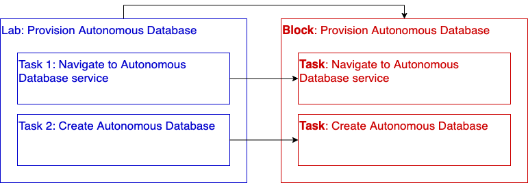

# Building Blocks

## Introduction
LiveLabs is a great environment for publishing workshops. There are a few things that we are addressing to satisfy the following requirements:

* Make it easy for customers to find and perform specific ADB tasks
* Simplify and accelerate the authoring of workshops
* Improve on-going maintenance of workshops
* Promote consistency across workshops

Building Blocks are a way to enhance both the workshop development and customer experience. This page focuses on how authors can use Building Blocks and Tasks to accelerate workshop development.

## Building Blocks and Tasks
As an author, there are two types of components you may want to take advantage of: a Building Block and/or a Task. Let's examine these two concepts and how they map to your workshop development:



Just as a lab is comprised of multiple tasks, a Block is comprised of multiple Tasks.

For example: ADB provisioning has two tasks:  
* Selecting the ADB Service from the OCI menu
* Creating the ADB instance

In this case, there is a **Building Block** that directly maps to this lab. You can simply take this Building Block, add it to your workshop's manifest, update LiveLab variables (the database name, # CPUs, etc.) to match your lab's requirements, and your done. In the future, when updates are made to ADB provisioning, your lab will update automatically when the Building Block is updated.

**Tasks** map to the individual lab tasks. In this case, there are two Tasks in the Block. Because a Task is a component, it can be used in this or multiple Blocks. And, its usage is not limited to Blocks. You can use the Task directly in your lab.

Having this Task is really useful because numerous labs (including ADB Provisioning) navigate to the ADB Service. Since this is a common task, we've created a Task for it. When that navigation changes, the Task will be updated and all labs and Blocks that used that Task will be updated automatically.

Hope it's clear - Blocks and Tasks will simplify your workshop authoring and on-going maintenance.

## How Building Blocks use Tasks
Let's take a look at the markdown for Provisioning an Autonomous Database:

```
Here is markdown specific to my workshop. 

Let's create an ADB instance.

## Task 1: Choose Autonomous Database from the services menu
[]&lpar;include:adb-goto-service-body.md)

## Task 2: Create the Autonomous Database instance
[]&lpar;include:adb-provision-console-body.md)
```

As you can see, the markdown for this block is pretty simple. It is including two Tasks: 1) go to the service and 2) provision using the console. It may be that the format of this Block does not meet your workshop requirements. No problem. Your workshop markdown can use these Tasks in a similar way to the Building Block. Simply include the Task within your markdown. 

See below for how the markdown was rendered

## Example: Provision using the OCI Console
Here is markdown specific to my workshop. 

Let's create an ADB instance.

### Task 1: Choose Autonomous Database from the services menu
[](include:adb-goto-service-body.md)

###  Task 2: Create the Autonomous Database instance
[](include:adb-provision-body.md)

## The workshop manifest and variables
### variables.json
Workshops have different requirements. Database names, OCPUs and other options may differ. LiveLabs uses variables to allow authors to update content. It may be that you need to make updates to the Task in order to make it more flexible; please share any required updates with the LiveLabs team.

The master list of all variables used in Blocks are stored in the ```/building-blocks/variables/variables.json``` file. You can copy this variables.json file to your own workshop if the default variable values need changing:

variables.json
```
{
    "db_name": "MYQUICKSTART",
    "db_display_name":"MyQuickStart",
    "db_ocpu": "1 OCPU",
    "db_storage": "1 TB",
    "db_name_livelabs": "MOVIE+your user id",
    "db_name_livelabs_example": "MOVIE2252",
    "db_workload_type":"Autonomous Data Warehouse"
 }
 ```

###  manifest.json
The manifest.json file describes the content of your workshop. It also contains references that will be used in your markdown. These references include:
* ```include```: these are markdown files that will be referenced. Tasks or Blocks will be listed here
* ```variables```: these are the variables that will be referenced in your markdown

 See below for an example ```manifest.json``` file and how these two attributes are referenced:
```
 {
    "workshoptitle": "LiveLabs Building Blocks",
    "include": {
      "adb-provision-body.md":"/building-blocks/tasks/adb/provision-body.md",
      "adb-goto-service-body.md":"/building-blocks/tasks/adb/goto-service-body.md"
    },
    "variables": ["/building-blocks/variables/variables.json"],
    "help": "livelabs-help-db_us@oracle.com",
    "tutorials": [
        {
          "title": "Authoring using Blocks", 
          "type":"freetier",        
          "filename": "/building-blocks/how-to-author-with-blocks/how-to-author-with-blocks.md"
        }
    ]
}
```

## List of Building Blocks and Tasks
The remaining sections describe the Tasks that are available to you broken out by service. The documentation provides snippets of how to include the Task in both the ``manifest.json`` and your markdown file. 

[Go here to view the list of Building Blocks](/building-blocks/workshop/freetier/index.html).

