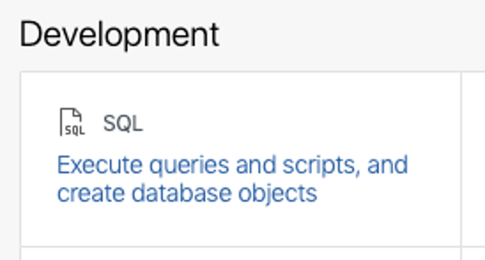
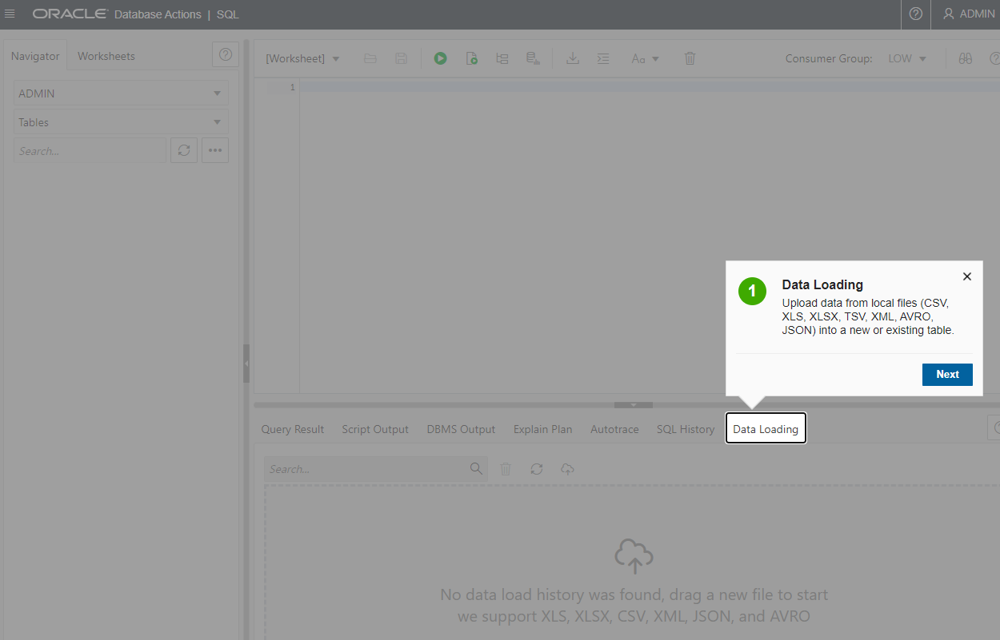

# Add workshop utilities from github

## Introduction

You need to install the workshop utilities in order to run the labs in any order. These utilities will make it easy to run lab prerequisites and add required data sets.

This setup is dual purpose. First, it is needed to run many of the other labs. Second, it introduces you to using github as a code repository for your Autonomous Database applications.

Estimated Time: 5 minutes

### Objectives

Add workshop utilities will update your Autonomous Database
* Adds PLSQL packages and procedures that are used for individual lab setup
* Adds PLSQL packages and views that will you to find and install data sets


### Prerequisites

- This lab requires completion of Lab 1, **Provision an ADB Instance**, in the Contents menu on the left.

## Task 1: Install the workshop utilities

The [DBMS\_CLOUD\_REPO package](https://docs.oracle.com/en/cloud/paas/autonomous-database/adbsa/dbms-cloud-repo-package.html) is a feature of Autonomous Database allows you to install packages, procedures, tables, etc. from code repositories like GITHUB. We'll be using two API calls:
* DBMS\_CLOUD\_REPO.INIT\_GITHUB\_REPO : this function returns a handle to your github repo. You'll use that handle for subsequent API calls
* DBMS\_CLOUD\_REPO.INSTALL\_FILE : this procedure will run the SQL and PLSQL commands found in a file. For this lab, the procedure will install tables, packages and procedures into the ADMIN schema

Install the workshop utilities using DBMS\_CLOUD\_REPO from any SQL command line as the ADMIN user.  We'll use the SQL Tools below.

1. Navigate to the Details page of the Autonomous Database you provisioned in the "Provision an ADB Instance" lab. In this example, the database name is "moviestream". Click the **Database Actions** button.

    

You will automatically log in as the ADMIN user.

2.  In the Development section of the Database Actions page, click the **SQL** card to open a new SQL worksheet:

    

    This will open up a new window that should look something like the screenshot below. The first time you open SQL Worksheet, a series of pop-up informational boxes introduce you to the main features. Click Next to take a tour through the informational boxes.

    


3. In the SQL Worksheet, paste in this code and run it using the **Run Script** button:

    ```
    <copy>
    declare
        l_git varchar2(4000);
        l_repo_name varchar2(100) := 'adb-get-started';
        l_owner varchar2(100) := 'martygubar';
        l_package_file varchar2(200) := 'setup/workshop-setup.sql';
    begin
        -- get a handle to github
        l_git := dbms_cloud_repo.init_github_repo(
                    repo_name       => l_repo_name,
                    owner           => l_owner );

        -- install the package header
        dbms_cloud_repo.install_file(
            repo        => l_git,
            file_path   => l_package_file,
            stop_on_error => false);

    end;
    /
    </copy>
    ```

Click the **Run Script** button to run the script.

## Try this
There's a lot more the the [DBMS\_CLOUD\_REPO package](https://docs.oracle.com/en/cloud/paas/autonomous-database/adbsa/dbms-cloud-repo-package.html). You can create a repository, manage files, and more. You can also query your repo using SQL:

```
<copy>
select 
    name,
    bytes
from table(
    dbms_cloud_repo.list_files(
            repo   => dbms_cloud_repo.init_github_repo(
                        repo_name       => 'adb-get-started',
                        owner           => 'martygubar' ),
            path   => 'setup/')
    )
order by 1;    
</copy>
```


## Acknowledgements

* **Author** -Marty Gubar, Autonomous Database Product Management
* **Last Updated By/Date** - Marty Gubar, Autonomous Database Product Management, April 2022
