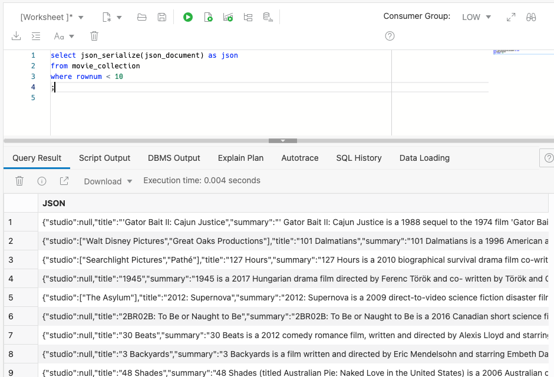
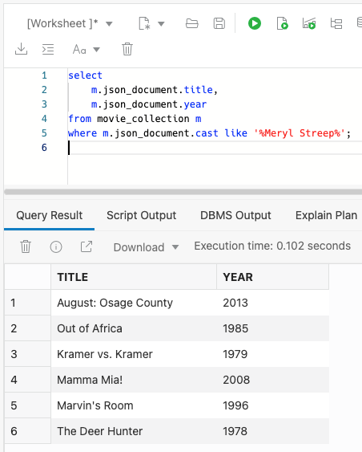
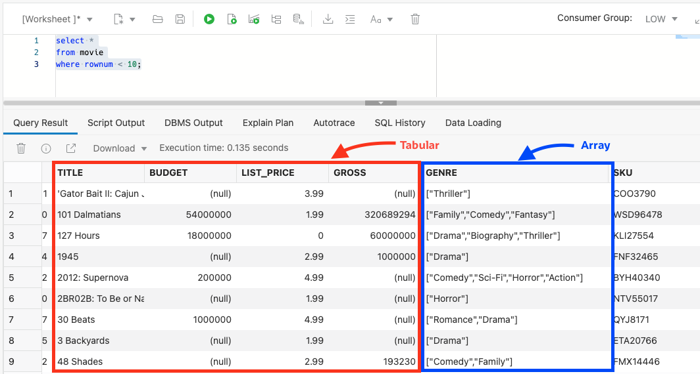

<!---
{
    "name":"Create and load JSON Collection from object storage",
    "description":
    "* Loads data using DBMS_CLOUD.COPY_COLLECTION
     * Introduces JSON_SERIALIZE, JSON_VALUE and JSON_QUERY (minimal)
     * Creates a view over JSON data
     * Performs basic JSON queries"
}
--->
### What is JSON?
JSON provides a language independent, flexible and powerful data model. It was derived from JavaScript, but many modern programming languages include code to generate and parse JSON-format data. For more information see here: [https://en.wikipedia.org/wiki/JSON](https://en.wikipedia.org/wiki/JSON). No wonder that it is such a popular storage format for developers. 

Oracle SQL allows you to analyze JSON data - including complex data types like arrays - in combination with structured tabular data.

### Movie JSON data
Our movie data set has a series of columns that contain different types of details about movies. Each movie has a **crew** associated with it and that crew is comprised of **jobs**, such as "producer," "director," "writer," along with the names of the individuals. Each movie also has a list of award nominations and wins. An example of how this information is organized is shown below:
adb-json-movie


You can see that JSON data is organized very differently than typical warehouse data. There is a single entry for "producer" but the corresponding key "names" actually has multiple values. This is referred to as an **array** - specifically a JSON array. 

1. Use the Autonomous Database ``DBMS_CLOUD.COPY_COLLECTION`` procedure to create and load the movie collection from object storage. Copy and paste the following PLSQL into the SQL worksheet and click run:
    ```
    <copy>
    -- create and load movie json collection from a public bucket on object storage
    begin
    dbms_cloud.copy_collection (
        collection_name => 'MOVIE_COLLECTION',
        file_uri_list   => 'https://objectstorage.us-ashburn-1.oraclecloud.com/n/c4u04/b/moviestream_landing/o/movie/*.json',	
        format          => '{ignoreblanklines:true}'
    );
    end;
    /
    </copy>
    ```
    
    
    
    This single steps creates a table called `MOVIE_COLLECTION` and populates it with JSON documents. You can access this table thru SQL, Oracle Database API for MongoDB, SODA REST and more.

> **Note:** There is extra metadata captured for SODA collections that is not removed by dropping the table directly using SQL ``drop table``. To properly drop a collection, use PLSQL function [`DMBS_SODA.DROP_COLLECTION`](https://docs.oracle.com/en/database/oracle/oracle-database/18/adsdp/using-soda-pl-sql.html#GUID-D29C4FFF-D093-4C1B-889A-5C29B63756C6).

2. Let's take a look at the documents. The documents are stored in a highly optimized binary format. Use the `JSON_SERIALIZE` function to view the JSON text. Copy and past the following SQL into the worksheet and click run:
    ```
    <copy>
    select json_serialize(json_document) as json
    from movie_collection
    where rownum < 10
    ;
    </copy>
    ```

    Your result will look similar to the following:
    
    

3. Oracle offers a wide range of SQL functions that help you analyze JSON data ([see documentation](https://docs.oracle.com/en/database/oracle/oracle-database/19/adjsn/query-json-data.html#GUID-119E5069-77F2-45DC-B6F0-A1B312945590) for details). Let's use simple dot notation to extract fields in tabular format. Copy and paste the following SQL into the worksheet and click run:
    ```
    <copy>
    select 
        m.json_document.title,
        m.json_document.year       
    from movie_collection m
    where cast like '%Meryl Streep%'
    ;
    </copy>
    ```

    Below are the Meryl Streep movies and the year that they were released:
    

4. Let's simplify subsequent queries against the movie collection by using a view. The view definition extracts from the JSON documents both simple fields (using the `JSON_VALUE` function) and complex arrays (using the `JSON_QUERY` function). Copy and past the following SQL into the worksheet.

    ```
    <copy>
    -- Create a view over the collection to make queries easy
    create or replace view movie as
    select
        json_value(json_document, '$.movie_id' returning number) as movie_id,
        json_value(json_document, '$.title') as title,
        json_value(json_document, '$.budget' returning number) as budget,
        json_value(json_document, '$.list_price' returning number) as list_price,
        json_value(json_document, '$.gross' returning number) as gross,
        json_query(json_document, '$.genre' returning varchar2(400)) as genre,
        json_value(json_document, '$.sku' returning varchar2(30)) as sku,
        json_value(json_document, '$.year' returning number) as year, 
        json_value(json_document, '$.opening_date' returning date) as opening_date,
        json_value(json_document, '$.views' returning number) as views, 
        json_query(json_document, '$.cast' returning varchar2(4000)) as cast,
        json_query(json_document, '$.crew' returning varchar2(4000)) as crew,
        json_query(json_document, '$.studio' returning varchar2(4000)) as studio,
        json_value(json_document, '$.main_subject' returning varchar2(400)) as main_subject,
        json_query(json_document, '$.awards' returning varchar2(4000)) as awards,
        json_query(json_document, '$.nominations' returning varchar2(4000)) as nominations,
        json_value(json_document, '$.runtime' returning number) as runtime, 
        json_value(json_document, '$.summary' returning varchar2(10000)) as summary 
    from movie_collection
    ;
    </copy>
    ```
    Each JSON attribute is now exposed as a column - similar to any table column.

5. Query the view by copying and pasting the following SQL into the worksheet:

    ```
    <copy>
    select *
    from movie
    where rownum < 10;
    </copy>
    ```
    

    Most of the data is in tabular format. However, several of the fields are arrays. For example, there are multiple genres and cast members associated with each movie.
