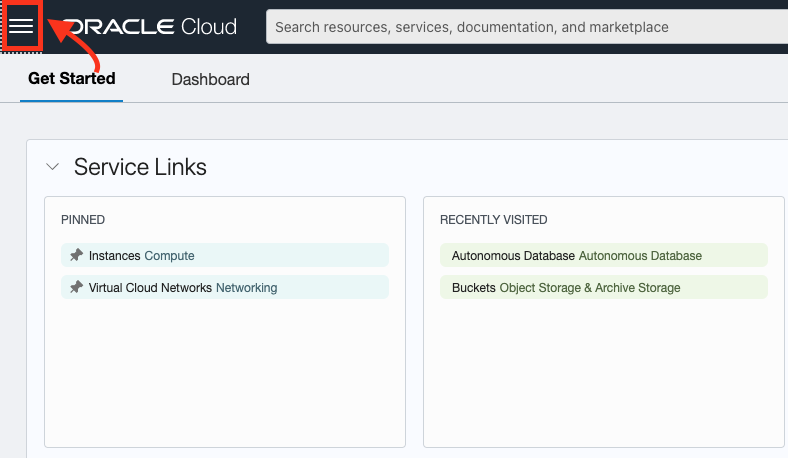
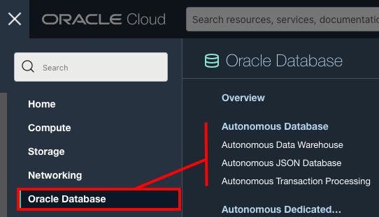
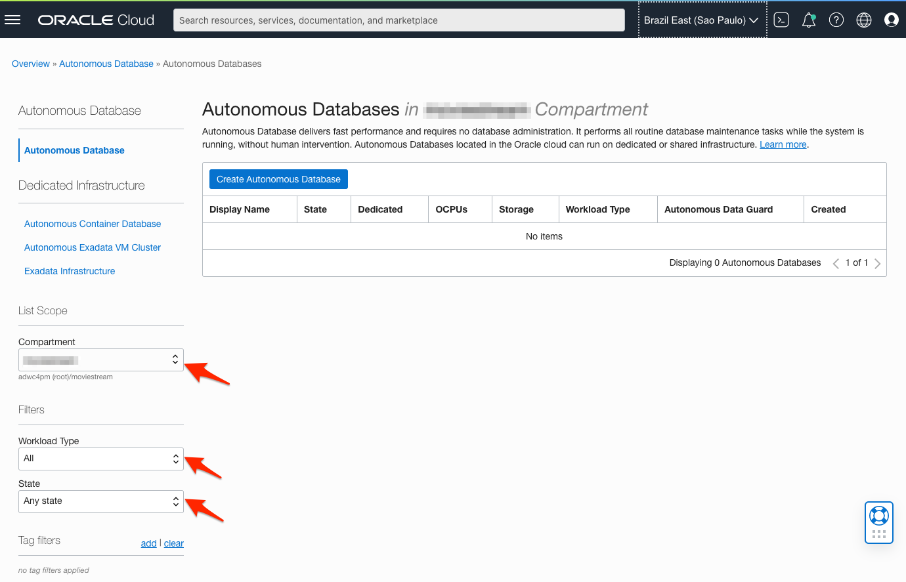
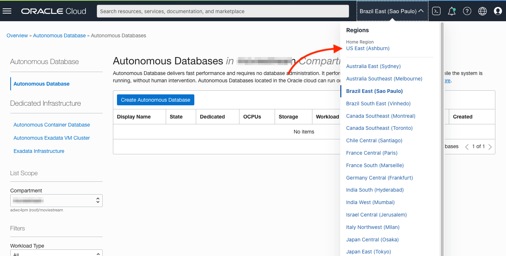

1. Once logged into Oracle Cloud, click the navigation menu in the upper left to show top level navigation choices:

    

    Then, select **Oracle Database -> **:   

    

2. You can use the List Scope fields on the left to control the list of Autonomous Databases that are displayed. This is useful when you are managing many Autonomous Databases:

    

    - **Compartment**: OCI resources are organized into compartments. Select the compartment where you want to create your Autonomous Database. <if type="livelabs">To quickly locate the compartment that has been assigned to you for this workshop, enter the first part of your user name (e.g. `LL185`) in the Search Compartments field.</if>
    - **Workload Type**: Filter the Autonomous Database list by selecting your workload type. Select *All* to view all databases
    - **State**: View databases that are available, stopped, terminated and more.

<if type="freetier">

   > **Note:** Avoid the use of the `ManagedCompartmentforPaaS` compartment as this is an Oracle default used for Oracle Platform Services.

</if>

<if type="freetier">
3. If you are using a Free Trial or Always Free account, and you want to use Always Free Resources, you need to be in a region where Always Free Resources are available. You can see your current default **region** in the top, right hand corner of the page.

    
</if>
