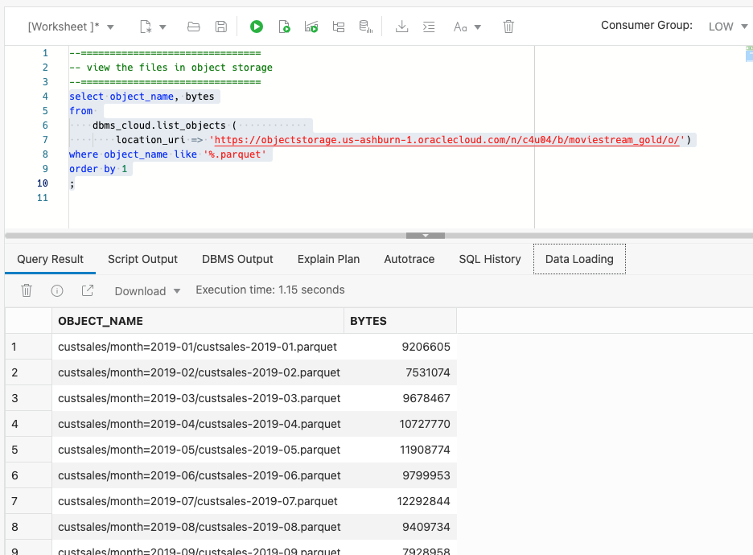

You can query the list of files available in object storage using SQL. Simply pass the location of the source data to the ``dbms_cloud.list_objects`` function. You can [learn more about this function in the documentation](https://docs.oracle.com/en/cloud/paas/autonomous-database/adbsa/dbms-cloud-subprograms.html#GUID-52801F96-8280-4FE0-8782-E194F4360E6F). 

> Because the files used in this exercise are in a public bucket, a credential is not required to access OCI Object Storage

1. Query MovieStream's public bucket to see the target files that you will access. Copy and paste the following query into the worksheet. Run the query by pressing [control-enter] or by clicking the play button in the toolbar. 
        ```
    <copy>--===============================
-- view the files in object storage
--===============================
select object_name, bytes
from 
    dbms_cloud.list_objects (            
        location_uri => 'https://objectstorage.us-ashburn-1.oraclecloud.com/n/c4u04/b/moviestream_gold/o/')
where object_name like '%.parquet'
order by 1
;
    </copy>
        ```

2. Notice the monthly partitions in the ``custsales`` folder. The files are stored in an optimized Apache Parquet file type. Parquet files capture data in compressed columnar format. Autonomous Database optimizes queries against these file types, extracting only the necessary columns and filtering data blocks - minimizing the amount of data scanned and returned by queries:

    
