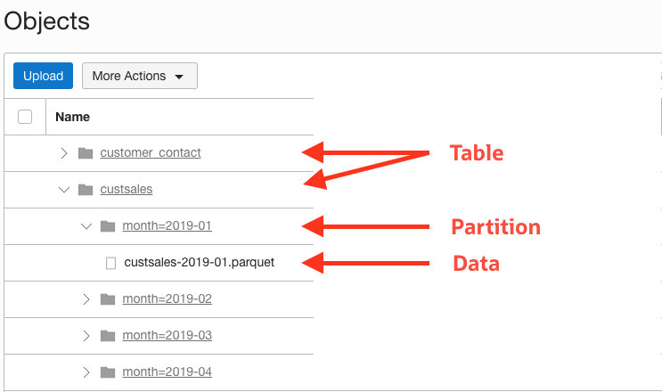
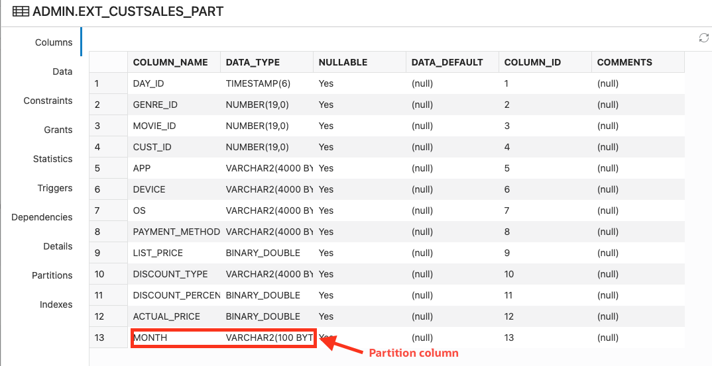
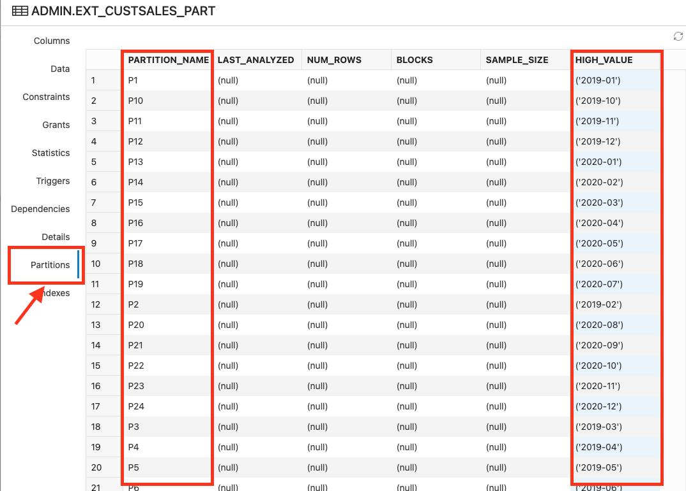
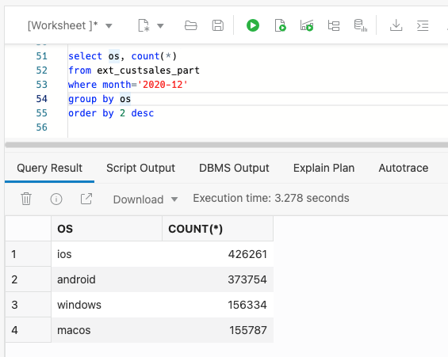
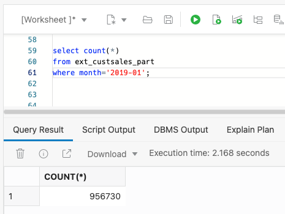

<!--
    {
        "name":"Using Partitoned External Tables",
        "description":"Create partitioned external tables over object storage data using a single, simple API call. Then, load that data. Compare performance of external tables and partitioned external tables."
    }
-->
With Oracle Partitioning, a single logical object in the database is subdivided into multiple smaller physical objects, known as partitions. The knowledge about this physical partitioning enables the database to improve the performance when querying external data. Autonomous Database makes it easy to create partitioned external tables over sources that use common data lake organizational patterns.



Let's create an external table ``EXT_CUSTSALES_PART`` with 24 monthly partitions.

1. Create a partitioned external table using the the ``DBMS_CLOUD.CREATE_EXTERNAL_PART_TABLE`` procedure. Similar to the ``DBMS_CLOUD.CREATE_EXTERNAL_TABLE`` procedure, ``DBMS_CLOUD.CREATE_EXTERNAL_PART_TABLE`` takes the table_name and the source URI (again, this data is stored in a public bucket, so the credential parameter is not required). Notice that the format parameter also includes a ``PARTITION_COLUMNS`` attribute. The attribute's name must match the partition column name found in the object storage path. The data type is the Oracle data type that maps to the column. The result will be a partitioned table whose values come from the file paths:

    ```
    <copy>--==============================
    -- partitioned table
    --==============================
    begin
        dbms_cloud.create_external_part_table (
            table_name => 'ext_custsales_part',
            file_uri_list => 'https://objectstorage.us-ashburn-1.oraclecloud.com/n/c4u04/b/moviestream_gold/o/custsales/*.parquet',
            format => '{"type":"parquet", "schema": "first","partition_columns":[{"name":"month","type":"varchar2(100)"}]}'
            );
        end;
        /
    </copy>
    ```
    Copy and paste this code snippet into the SQL worksheet and run the command.

2. Let's review the new external table. Click the refresh button in the SQL worksheet **Navigator**. Then, right-click **EXT\_CUSTSALES\_PART** and select **Open**.

    

    The columns and their data types were automatically derived from the Parquet file metadata. The ``month`` column does not appear in the file but has been added to the table as the partition column.

3. Click the **Partitions** tab in the table viewer. A partition has been created for each month value:

    

    In the future, as new partitions are added to the object storage bucket, simply call ``DBMS_CLOUD.SYNC_EXTERNAL_PART_TABLE`` to keep the external table up to date. [Refer to the documentation](https://docs.oracle.com/en/cloud/paas/autonomous-database/adbsa/dbms-cloud-subprograms.html#GUID-9C7D1555-F323-4F48-9C8C-6AB025EF8C86) for more details on these capabilities.

    Click **Close** to dismiss the dialog.

4. How are customers watching movies? Find out which operating systems are used most frequently. Copy and paste the following SQL into the SQL worksheet and click run. Notice you query partitioned tables in exactly the same way you query unpartitioned tables:
    ```
    <copy>select os, count(*)
from ext_custsales_part
where month='2020-12'
group by os
order by 2 desc;
    </copy>
    ```
    Android and iOS are the dominant devices:

    

5. Re-execute the ``count(*)`` query and compare performance to an unpartitioned table. Copy and paste the SQL below into the SQL worksheet and click run:
    ```
    <copy>select count(*)
from ext_custsales_part
where month='2019-01';
    </copy>
    ```
    

    The query returns in a couple of seconds. Partitioning narrowed the data scan to a single month - approximately 20x faster than a similar non-partitioned table query.  
