# Choose your Own JSON Adventure: Relational or Document Store: Relational

## Introduction

In this lab you will use the SQL Developer Web browser-based tool, connect to your Database and load JSON data into relational tables. You will then work with this data to understand how it is accessed and stored.

Estimated Lab Time: 30-45 minutes

### Objectives

- Load JSON data into relational tables
- Understand how Oracle stores JSON data in relations tables
- Work with the JSON data with SQL

### Prerequisites

- The following lab requires an [Oracle Cloud account](https://www.oracle.com/cloud/free/). You may use your own cloud account, a cloud account that you obtained through a trial, or a training account whose details were given to you by an Oracle instructor.
- This lab assumes you have successfully provisioned Oracle Autonomous database an connected to ADB with SQL Developer web.
- You have completed the user setups steps.

## Task 1: Loading Data in a Relational Table

1. After logging into Database Actions in the previous section, we come to the Getting Started/Database Actions Overview page. Start by clicking the SQL tile.

    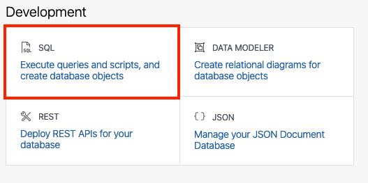

    **If this is your first time accessing the SQL Worksheet, you will be presented with a guided tour. Complete the tour or click the X in any tour popup window to quit the tour.**

2. We are now ready to load data into the database. For this task, we will use the Data Loading tab in the SQL Worksheet.

    

3. Start by clicking the `Data Loading` area; the center of the gray dotted-line box.

    

4. The Upload Data into New Table model will appear.

    

5. We are going to use some sample data to load data into the database and create a table at the same time. Start by downloading this file

    **(right-click and download the file with the following link)**

    [Airport Delays 2003-2016](https://objectstorage.us-ashburn-1.oraclecloud.com/p/LNAcA6wNFvhkvHGPcWIbKlyGkicSOVCIgWLIu6t7W2BQfwq2NSLCsXpTL9wVzjuP/n/c4u04/b/livelabsfiles/o/developer-library/airportDelays.json)

6. Once on your desktop, drag the file into the Upload Data into New Table model. You can also click the `Select Files` button and find where you downloaded it via your operating system's file browser.

    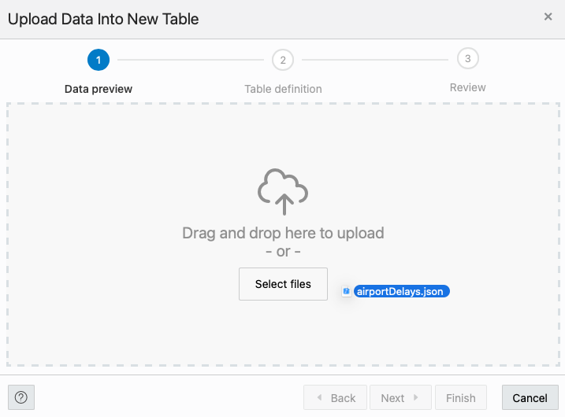

7. The modal will then give you a preview of what the data will look like in an Oracle table. Go ahead and click the `Next` button on the bottom right of the modal.

    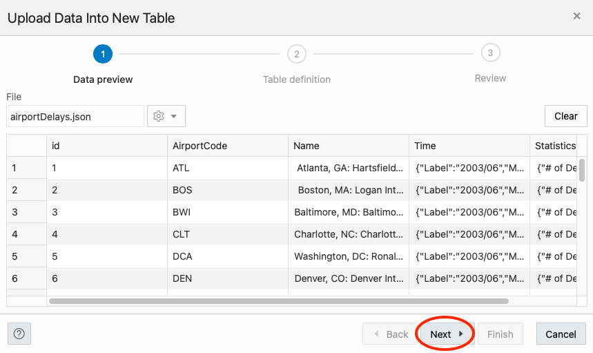

    On the following step of the data loading modal, we can see the name of the table we are going to create as well as the column and data types for the table.

    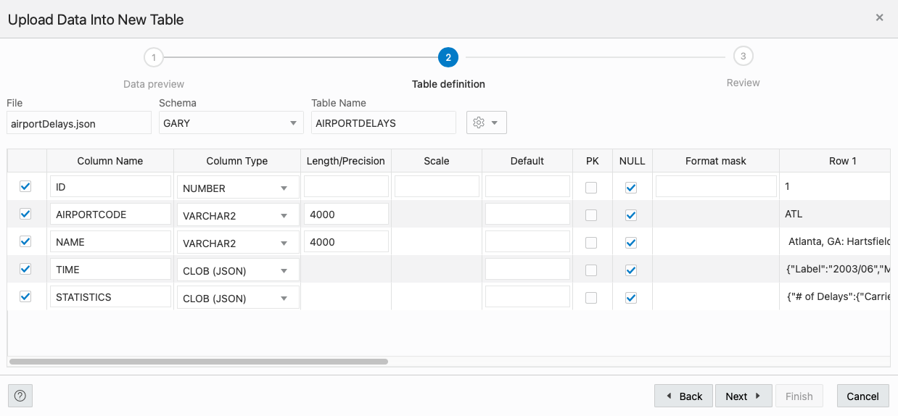

8. We need a Primary Key for our table. Here, we can use the ID column. Just click the PK checkbox for the ID row.

    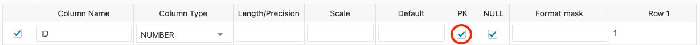

9. Click `Next` on the bottom right of the modal when done.

    

10. On the last step of the modal, we can see the DDL (Data Definition Language) for creating the table, table name and if you scroll down, the column mappings.

    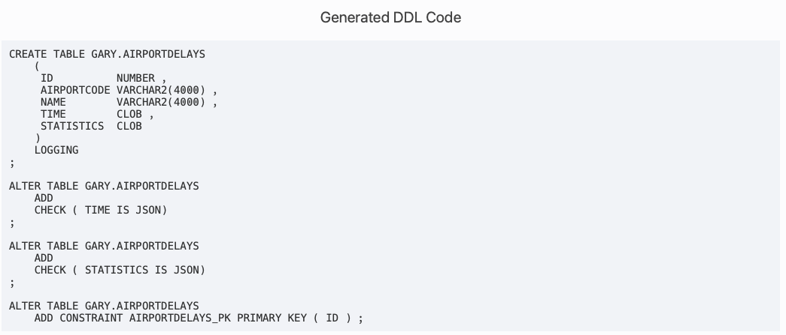

11. When you are done taking a look, click the `Finish` button in the lower right of the modal.

    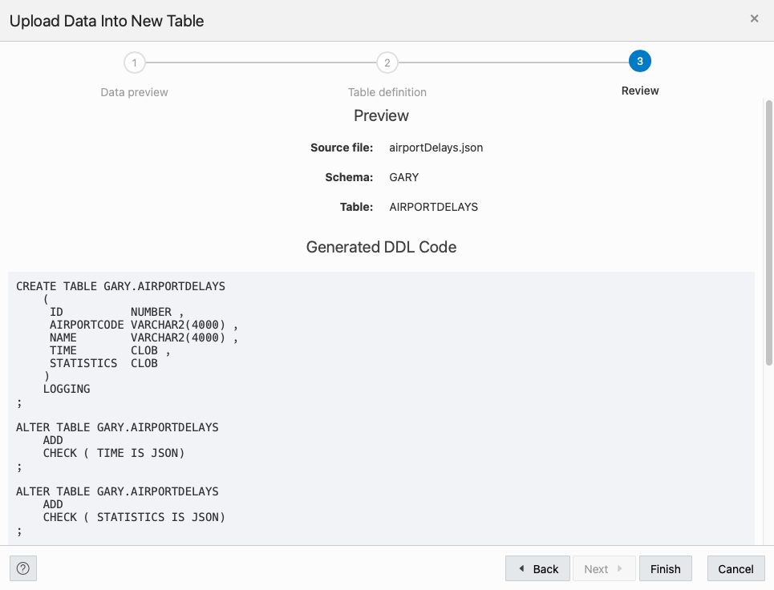

    The Data Loader will now process the file by creating a table and loading the JSON file data into that table.

    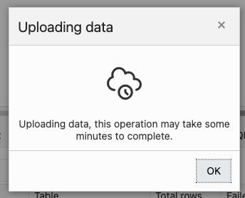

    Once its done, you will see a row in the Data Loading tab that indicates how many rows were uploaded, if any failed and the table name.

    

12. We can take a look at our newly created table and the data in it by using the navigator on the left of the SQL Worksheet. Just right click the table name (AIRPORTDELAYS) and select `Open` from the pop up menu.

    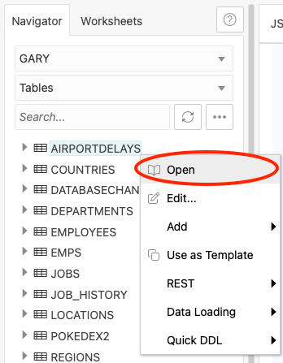

13. In the slider that has come out from the right of the page, we can look at the data definition, triggers, constraints and even the data itself.

    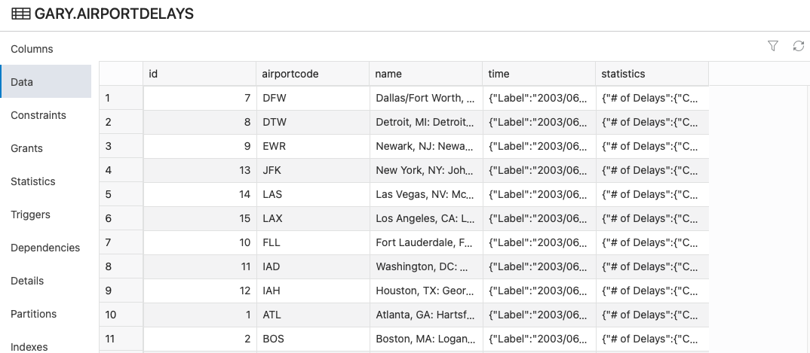

## Task 2: Working with JSON Data in a Relational Table

### **Part 1 - Simple Dot-Notation Access to JSON Data**

Dot notation is designed for easy, general use and common use cases of querying JSON data. For simple queries it is a handy alternative to using SQL/JSON query functions.

1. Let's start simple and query the table and return a count(*). We are going to bring back the statistics JSON column based on an airport code.

    ```sql
    <copy>
    select a.statistics 
    from airportdelays a
    where a.airportcode = 'SFO'
    fetch first 1 row only;
    </copy>
    ```

   and the result will be similar to the following (formatted for readability):

    ```json
    {
        "# of Delays": {
            "Carrier": 416,
            "Late Aircraft": 312,
            "National Aviation System": 1080,
            "Security": 14,
            "Weather Codes": [
                "SNW",
                "RAIN",
                "SUN",
                "CLDY"
            ],
            "Weather": 59
        },
        "Carriers": {
            "Aircraft Types": [
                {
                    "make": "Boeing",
                    "models": [
                        "717",
                        "737",
                        "757",
                        "767",
                        "777",
                        "787"
                    ]
                },
                {
                    "make": "Airbus",
                    "models": [
                        "A320",
                        "A321",
                        "A330",
                        "A340",
                        "A350",
                        "A380"
                    ]
                }
            ],
            "Names": "American Airlines Inc.,Alaska Airlines Inc.,Continental Air Lines Inc.,Delta Air Lines Inc.,America West Airlines Inc.,American Eagle Airlines Inc.,Northwest Airlines Inc.,SkyWest Airlines Inc.,ATA Airlines d/b/a ATA,United Air Lines Inc.,US Airways Inc.",
            "Total": 11
        },
        "Flights": {
            "Cancelled": 83,
            "Delayed": 1880,
            "Diverted": 9,
            "On Time": 8211,
            "Total": 10183
        },
        "Minutes Delayed": {
            "Carrier": 22673,
            "Late Aircraft": 17879,
            "National Aviation System": 45407,
            "Security": 1138,
            "Total": 90487,
            "Weather Codes": [
                "SNW",
                "RAIN",
                "SUN",
                "CLDY"
            ],
            "Weather": 3390
        }
    }
    ```

2. Now what if we wanted to filter this based on the month and year(which is in the **time** column which contains JSON)? We want to filter by:

   - Airport code = SFO
   - Month = June
   - Year = 2010

   The JSON we are looking for in the time column would look like this:

    ```json
    {"Label":"2010/06","Month":6,"Month Name":"June","Year":2010}
    ```

    So we can use the following which has a where clause on "Month Name" and "Year":

    ```sql
    <copy>
    select a.statistics 
      from airportdelays a
     where a.airportcode = 'SFO'
       and a.time."Month Name" = 'June'
       and a.time.Year = '2010';
    </copy>
    ```

    Or we could just use the "Label" item:

    ```sql
    <copy>
    select a.statistics 
      from airportdelays a
     where a.airportcode = 'SFO'
       and a.time.Label = '2010/06';
    </copy>
    ```

    In either instance, we see we can traverse down the JSON with the Dot-Notation.

3. We can also use analytical functions such as `sum` using the Dot-Notation as well. Very helpful for creating charts and graphs on this data for reporting purposes. For this example, we are going to add up (sum) the number of minutes delayed for each airport across this entire dataset and group by airport:

    ```sql
    select a.name, 
        sum(a.statistics."Minutes Delayed".Carrier) "Minutes Delayed" from airportdelays a
    group by a.name
    order by a.name;
    ```

### **Part 2 - SQL/JSON Path Expressions**

Oracle also has many built in JSON functions for working with document data which elevates the functionality found with Dot-Notation. 

1. **json_value** - The SQL/JSON function JSON\_VALUE finds a specified scalar JSON value in JSON data and returns it as a defined SQL value (date, number, timestamp, sdo\_geometry, etc). 


    We can start easy by just getting the **Label** item in the time JSON block:

    ```json
    select json_value (
            time, 
            '$.Label'
        ) date_label
    from airportdelays a
    where a.id = 5;
    ```

    Let's get a bit deeper and get the number of **flights cancelled** thats in the Statistics JSON block. We will also tell the query to return this value as a number by using **returning number** after the JSON path:

    ```sql
    select json_value (
            Statistics, 
            '$.Flights.Cancelled' returning number
        ) cancled_flights
    from airportdelays a
    where a.id = 5;
    ```

    What if we select a value we know is going to be an array? (Let's also add **error on error** so we don't just get back null)

    ```sql
    select json_value(statistics, '$."Carriers"."Aircraft Types"[*].models' error on error)
    from airportdelays
    where id = 1032;
    ```

    We see the error **ORA-40470: JSON\_VALUE evaluated to multiple values**. json\_value can only return scalar JSON values (number, string, Boolean or null)

2. **json\_mergepatch** - You can use the **json\_mergepatch** function to update specific portions of a JSON document. You can think of JSON Merge Patch as merging the contents of the source and the patch.

    Say you wanted your airline to look really really good and remove them from the string of airlines in the Names section of the statistics JSON block. We can do this by replacing or updating the name with another one in that particular portion of the JSON document. Let's remove United and replace it with Oracle:

    ```sql
    update airportdelays
    set statistics = json_mergepatch ( 
                    statistics,
                        '{"Carriers" : {"Names" : "'||
                            (select replace(json_value (
                                Statistics, '$.Carriers.Names')
                                ,'United Air Lines Inc.,','Oracle Air Lines Inc.,')
                            from airportdelays a
                            where id = 10)||'"}
                        }'
                    )
    where id = 10;
    ```

    Next, we check our previous work:

    ```sql
    select json_value (
            Statistics, 
            '$.Carriers.Names' 
        ) "Airline Names" 
    from airportdelays a 
    where  a.id = 10;
    ```

    and in the result, we see that change we just made:  

    `American Airlines Inc.,JetBlue Airways,Continental Air Lines Inc.,Delta Air Lines Inc.,AirTran Airways Corporation,America West Airlines Inc.,Northwest Airlines Inc.,ATA Airlines d/b/a ATA,**Oracle Air Lines Inc.**,US Airways Inc.,Southwest Airlines Co.`

3. **json\_transform (21c)** - You can use the `json_transform` function to change input JSON data (or pieces of JSON data), by specifying one or more modifying operations that perform changes to the JSON data. Unlike `json_mergepatch`, json_transform can target the specific attributes you want to change.

    Continuing our underhanded data alterations, lets work with the **Minutes Delayed** JSON section and see if we can make our numbers look a bit more favorable. Here is a sample of the JSON we will be working with:

    ```json
    "Minutes Delayed": {
        "Carrier": 61606,
        "Late Aircraft": 68335,
        "National Aviation System": 118831,
        "Security": 518,
        "Total": 268764,
        "Weather": 19474
    }
    ```

    We can use json_transform to replace the value of Total to be 0 with the following SQL:

    ```sql
    update airportdelays  
    set statistics = json_transform (
                    statistics, 
                    replace '$."Minutes Delayed".Total' = '0'
                )
    where id = 10;
    ```

    And checking our work. First we can look at the entire section of JSON:

    ```sql
    select a.statistics."Minutes Delayed" 
    from airportdelays a 
    where id = 10;
    ```

    Or just look at that particular attribute:

    ```sql
    select a.statistics."Minutes Delayed".Total 
    from airportdelays a 
    where id = 10;
    ```

    We get back a result of 0; mischief managed! We can also use json_transform to remove entire attributes. If we wanted to remove multiple attributes in this Minutes Delayed section, we can issue the following SQL for each attribute:

    ```sql
    update airportdelays  
    set statistics = json_transform (
                statistics, 
                    remove '$."Minutes Delayed".Carrier',
            )
    where id = 10;
    ```

    Or we can chain multiple remove and replace statements with json_transform:

    ```sql
    update airportdelays  
    set statistics = json_transform (
                    statistics, 
                        replace '$."Minutes Delayed".Total' = '0',
                        remove '$."Minutes Delayed".Carrier',
                        remove '$."Minutes Delayed"."Late Aircraft"'
                )
    where id = 10;
    ```

    And as always, let's check our work to make sure the deed is done:

    ```sql
    select a.statistics."Minutes Delayed" 
    from airportdelays a 
    where id = 10;
    ```

4. **json\_query** - The SQL/JSON function json\_query selects and returns one or more values from JSON data and returns those values. You can thus use json\_query to retrieve fragments of a JSON document in JSON.

    We can run the following query for a quick example:

    ```sql
    select JSON_QUERY(statistics, '$."# of Delays"')
    from airportdelays
    where id = 1032;
    ```


    Let's revisit an issue we had previously with json\_value and returning arrays. Can json_query come to the rescue?

    ```sql
    select json_query(statistics, '$."Carriers"."Aircraft Types"[*].models' error on error)
    from airportdelays
    where id = 1032;
    ```

    and we get: ORA-40480: result cannot be returned without array wrapper

    Oh...ok...so lets add **with array wrapper** to the query:

    ```sql
    select JSON_QUERY(statistics, '$."Carriers"."Aircraft Types"[*].models' with array wrapper error on error)
    from airportdelays
    where id = 1032;
    ```

    and problem solved with the result being:

    `[["717","737","757","767","777","787"],["A320","A321","A330","A340","A350","A380"]]`

5. **json_table**

    The SQL/JSON function JSON_TABLE creates a relational view of JSON data. It maps the result of a JSON data evaluation into relational rows and columns.

    We can start by taking the time JSON and turning it into a table:

    ```sql
    select a.name, v.*
    from airportdelays a, json_table (
            a.time, '$' 
                columns (
                    Label,
                    Year,
                    Month,
                    "Month Name"
        ) )v
    where a.id = 100;
    ```

    and we see the following:

    ```na
    NAME                                        LABEL   YEAR MONTH MONTH NAME 
    ------------------------------------------- ------- ---- ----- ---------- 
    New York, NY: John F. Kennedy International 2003/09 2003 9     September  
    ```

    we have taken the `Time` object

    ```json
    "Time": {
                "Label": "2003/09",
                "Month": 9,
                "Month Name": "September",
                "Year": 2003
            }
    ```

    and created a relational table result from it.

    Want more than one row? We can alter the SQL to fetch *n* rows, thus bringing back multiple rows in a single table format:

    ```sql
    select a.name, v.*
    from airportdelays a, json_table (
            a.time, '$' 
                columns (
                    Label,
                    Year,
                    Month,
                    "Month Name"
        ) )v
    fetch first 10 rows only;
    ```

    The result of that query:

    ```na
    NAME                                                         LABEL   YEAR MONTH MONTH NAME 
    ------------------------------------------------------------ ------- ---- ----- ---------- 
    Dallas/Fort Worth, TX: Dallas/Fort Worth International       2003/06 2003 6     June       
    Detroit, MI: Detroit Metro Wayne County                      2003/06 2003 6     June       
    Newark, NJ: Newark Liberty International                     2003/06 2003 6     June       
    New York, NY: John F. Kennedy International                  2003/06 2003 6     June       
    Las Vegas, NV: McCarran International                        2003/06 2003 6     June       
    Los Angeles, CA: Los Angeles International                   2003/06 2003 6     June       
    Fort Lauderdale, FL: Fort Lauderdale-Hollywood International 2003/06 2003 6     June       
    Washington, DC: Washington Dulles International              2003/06 2003 6     June       
    Houston, TX: George Bush Intercontinental/Houston            2003/06 2003 6     June       
    Atlanta, GA: Hartsfield-Jackson Atlanta International        2003/06 2003 6     June  
    ```

    What if you want to retrieve data in nested arrays? Using this query,

    ```sql
    select t.*
    from airportdelays,
        json_table(Statistics, '$.Carriers."Aircraft Types"[*]'
                columns(
                    make varchar2(400) path '$.make',
                        nested path '$.models[*]'
                            columns(
                                models varchar2(400) path '$'
                                )
                    )    
                ) as t
    where id = 100;
    ```

    will return:

    ```na
    MAKE   MODELS 
    ------ ------ 
    Boeing 717    
    Boeing 737    
    Boeing 757    
    Boeing 767    
    Boeing 777    
    Boeing 787    
    Airbus A320   
    Airbus A321   
    Airbus A330   
    Airbus A340   
    Airbus A350   
    Airbus A380 
    ```

    You can see we can get data from arrays with the `json_table` function in combination with **nested path**.

    We can also combine both relational tables and JSON. Instead of a new row per model, lets collapse them back into just two rows:

    ```sql
    select t.*
    from airportdelays,
            json_table(Statistics, '$.Carriers."Aircraft Types"[*]'
                columns(
                    make varchar2(400) path '$.make',
                    models varchar2(400) format json path '$.models'
                )       
            ) as t
    where id = 100;
    ```

    We combined the second nested path and told the query to output or format the result in JSON with **format json**. The results are as follows:

    ```na
    MAKE   MODELS                                      
    ------ ------------------------------------------- 
    Boeing ["717","737","757","767","777","787"]       
    Airbus ["A320","A321","A330","A340","A350","A380"] 
    ```

    We can even go one step further and pivot nested arrays as columns as seen in this next example:

    ```sql
    select a.airportcode, t.*, md.*
    from airportdelays a, 
        json_table (
                a.time, '$' 
                    columns (
                        Label,
                        "Month Name",
                        Year
                    ) 
            ) t,
            json_table (
                a.Statistics, '$."Minutes Delayed"' 
                    columns (
                        Carrier,
                        "National Aviation System",
                        "Late Aircraft",
                        Security,
                        Weather,
                        "Weather Codes" varchar2(200) format json path '$."Weather Codes"',
                        nested path '$."Weather Codes"'
                        columns (
                            code1 varchar2(100) path '$[0]',
                            code2 varchar2(100) path '$[1]',
                            code3 varchar2(100) path '$[2]',
                            code4 varchar2(100) path '$[3]'
                        ),
                        Total               
                    )
            ) md
    where a.id = 100;
    ```

    Here's the result:

    ```na
    AIRPORTCODE LABEL   MONTH NAME YEAR CARRIER NATIONAL AVIATION SYSTEM LATE AIRCRAFT SECURITY WEATHER WEATHER CODES               TOTAL CODE1 CODE2 CODE3 CODE4 
    ----------- ------- ---------- ---- ------- ------------------------ ------------- -------- ------- --------------------------- ----- ----- ----- ----- ----- 
    JFK         2003/09 September  2003 13176   14391                    7732          93       996     ["SNW","RAIN","SUN","CLDY"] 36388 SNW   RAIN  SUN   CLDY
    ```

6. **json\_exists** - The SQL/JSON condition `json_exists` lets you use a SQL/JSON path expression as a row filter, to select rows based on the content of JSON documents.

    Again, lets start easy and bring back all the IDs where the year is 2004 and the month is 6 (June):

    ```sql
    select a.id 
    from airportdelays a
    where json_exists(a.time, '$?(@.Year  == "2004" && @.Month == "6")');  
    ```

    Lets take this a step further and not only bring back all the IDs where the year is 2004 and the month is 6 (June), but where the total minutes delayed is greater than 500000:

    ```sql
    select a.id, a.airportcode, a.Statistics."Minutes Delayed".Total 
    from airportdelays a
    where json_exists(a.time, '$?(@.Year  == "2004" && @.Month == "6")')
    and json_exists(a.Statistics, '$?(@."Minutes Delayed".Total > 500000)');  
    ```

    And the result:

    ```na
    ID AIRPORTCODE MINUTES DELAYED 
    --- ----------- --------------- 
    349 ATL         714316          
    369 ORD         554653          
    355 DFW         520185 
    ```

    So you can see, `json_exists` will allow us to quickly and efficiently filter our JSON documents to get the results we want. Want more proof? Run an explain plan on the following SQL we just used:

    ```sql
    select a.id, a.airportcode, a.Statistics."Minutes Delayed".Total 
    from airportdelays a
    where json_exists(a.time, '$?(@.Year  == "2004" && @.Month == "6")')
    and json_exists(a.Statistics, '$?(@."Minutes Delayed".Total > 500000)');  
    ```

    SQL/JSON explain plan:
        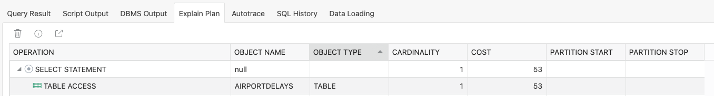

    and now with SQL using the Dot-Notation format:

    ```sql
    select a.id, a.airportcode, a.Statistics."Minutes Delayed".Total 
    from airportdelays a
    where a.time.Year  = 2004
    and a.time.Month = 6
    and a.Statistics."Minutes Delayed".Total > 500000; 
    ```

    Dot-Notation explain plan
        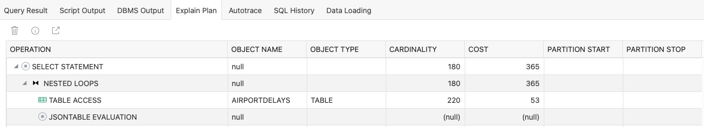

    You can see that the SQL/JSON path expressions are much more efficient.

7. **Reverse! I need to create JSON out of relational data**

    Need to make a JSON document out of the relational table? Here you go!

    ```sql
    select json_object ( * ) jdoc
    from airportdelays;
    ```

8. **Putting it all together**

    Lets analyze this data a bit....we have delays...so maybe we can take a look at which airports had the most weather delays in each month over the span of this data.

    ```sql
    with weather_delays as (
        select json_value(time, '$.Label') time_label, 
            max(json_value(statistics,'$."# of Delays".Weather' returning number error on error)) max_weather
        from airportdelays a 
        group by json_value(time, '$.Label')
    )
    select a.airportcode, 
        json_value(a.time, '$.Label') "Year/Month", 
        json_value(a.statistics, '$."# of Delays".Weather' returning number) "Weather Delays"
    from airportdelays a,
        weather_delays wd
    where wd.time_label = json_value(a.time, '$.Label')
    and json_value(a.statistics, '$."# of Delays".Weather' returning number) = wd.max_weather
    order by json_value(a.time, '$.Label');
    ```

    ```na
    AIRPORTCODE YEAR/MONTH WEATHER DELAYS 
    ----------- ---------- -------------- 
    ATL         2003/06               328 
    ATL         2003/07               367 
    ATL         2003/08               361 
    ATL         2003/09               161 
    ATL         2003/10               170 
    ORD         2003/11               202 
    SLC         2003/12               282 
    ATL         2004/01               599 
    ATL         2004/02               787 
    ATL         2004/03               227 
    DFW         2004/04               217 
    ATL         2004/05               556 
    DFW         2004/06               729 
    ATL         2004/07               491 
    DFW         2004/08               469 
    ATL         2004/09               362 
    ATL         2004/10               500 
    ...
    ```

## Conclusion

In this lab, you loaded JSON into a relational table and worked with that data using SQL and JSON/SQL functions using the Database Actions SQL worksheet.

This concludes this lab. You may now **proceed to the next lab**.

## Acknowledgements

- **Authors** - Jeff Smith, Beda Hammerschmidt and Chris Hoina
- **Contributor** - Brian Spendolini
- **Last Updated By/Date** - Chris Hoina/March 2023

