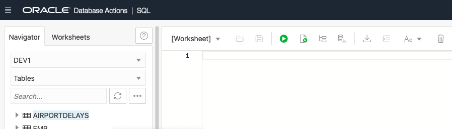
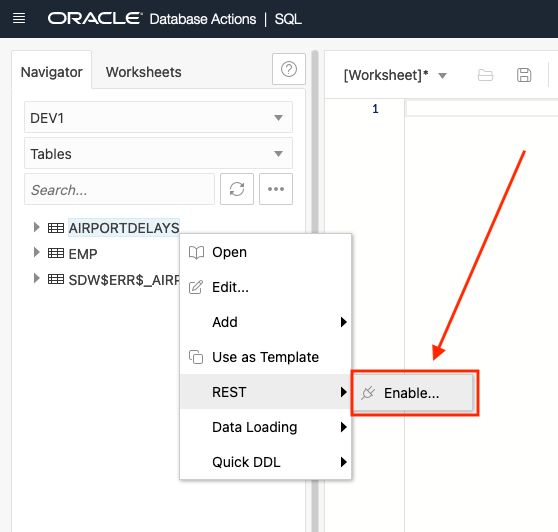
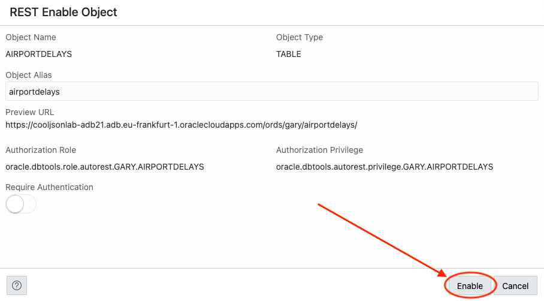
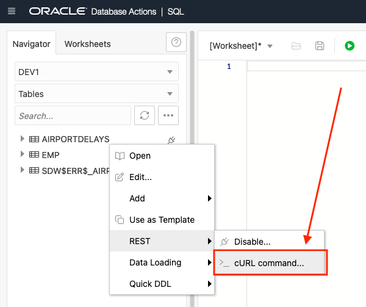
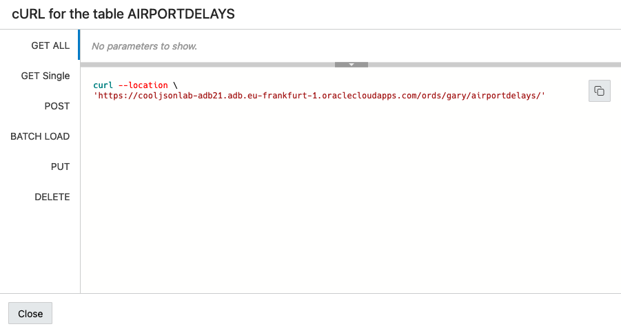
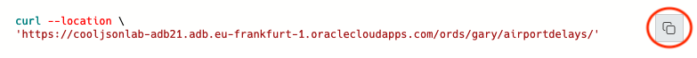

# Choose your Own JSON Adventure: Relational or Document Store: Expose the Data for Applications

## Introduction

In this lab you will review the methods used in the previous labs to see how we can expose data for application development from REST endpoints.

Estimated Lab Time: 10 minutes

### Objectives

- Review how to expose data to applications

### Prerequisites

This lab assumes you have:

- All previous labs successfully completed

## Task 1: RESTful Services on Relational Tables

1. REST-enabling a relational table couldn't be easier. To do this, find the table we created named **AIRPORTDELAYS** in the navigator on the left of the SQL Worksheet.

    

2. Right click on the table name (AIRPORTDELAYS) and select **REST** in the pop up menu then **Enable**.

    

3. The REST Enable Object slider will appear from the right side of the page. Keep the default values and when ready, click the **Enable** button in the lower right of the slider.

    

4. Thats it! Your table is REST-enabled. We can work with the REST endpoints by using cURL commands that the SQL Worksheet can provide to us. To get to these endpoints, again right click the table name (AIRPORTDELAYS) as we did in the previous step, select **REST**, then **cURL Command**.

    

    On the right of the page, we see the **cURL for the table AIRPORTDELAYS** side out panel.

    

5. Here we can work with the various REST endpoints. To try one, click the copy icon  for the **GET ALL** endpoint. (**NOTE: your URL hostname will be different than the below image**)

    

6. You can use this cURL command we just copied in the OCI Cloud Shell or on your local compute if cURL is installed.(**NOTE: your URL hostname will be different than the below command**)

    Here is the command running:

    ```curl
    >curl --location \
    'https://cooljsonlab-adb21.adb.eu-frankfurt-1.oraclecloudapps.com/ords/gary/airportdelays/'

    {"items":[{"airportcode":"JFK","name":"New York, NY: John F. Kennedy International","time":"{\"Label\":\"2003/06\",\"Month\":6,\"Month Name\":\"June\",
    \"Year\":2003}","statistics":"{\"# of Delays\":{\"Carrier\":376,\"Late Aircraft\":226,\"National Aviation System\":394,\"Security\":21,\"Weather\":28},
    \"Carriers\":{\"Names\":\"American Airlines Inc.,JetBlue Airways,Continental Air Lines Inc.,Atlantic Coast Airlines,Delta Air Lines Inc.,Atlantic 
    Southeast Airlines,America West Airlines Inc.,American Eagle Airlines Inc.,Northwest Airlines Inc.,ExpressJet Airlines Inc.,United Air Lines Inc.\",
    \"Total\":11},\"Flights\":{\"Cancelled\":24,\"Delayed\":1046,\"Diverted\":13,\"On Time\":4695,\"Total\":5778},\"Minutes Delayed\":{\"Carrier\":22029,
    \"Late Aircraft\":11593,\"National Aviation System\":14103,\"Security\":659,\"Total\":50335,\"Weather\":1951}}","links":[{"rel":"self","href":"https://
    bqj5jpf7pvxppq5-adb21.adb.eu-frankfurt-1.oraclecloudapps.com/ords/dev1/airportdelays/AAAZToAAAAABB67AAA"}]},{"airportcode":"LAS","name":"Las Vegas, 
    NV: McCarran International","time":"{\"Label\":\"2003/06\",\"Month\":6,\"Month Name\":\"June\",\"Year\":2003}","statistics":"{\"# of Delays\":
    {\"Carrier\":511,\"Late Aircraft\":678,\"National Aviation System\":624,\"Security\":17,\"Weather\":64},\"Carriers\":{\"Names\":\"American Airlines 
    Inc.,Alaska Airlines Inc.,JetBlue Airways,Continental Air Lines Inc.,Delta Air Lines Inc.,America West Airlines Inc.,Northwest Airlines Inc.,SkyWest 
    Airlines Inc.,ATA Airlines d/b/a ATA,United Air Lines Inc.,US Airways Inc.,Southwest Airlines Co.\",\"Total\":12},\"Flights\":{\"Cancelled\":39,
    \"Delayed\":1893,\"Diverted\":6,\"On Time\":9821,\"Total\":11759},\"Minutes Delayed\":{\"Carrier\":24293,\"Late Aircraft\":31043,\"National Aviation 
    System\":19561,\"Security\":808,\"Total\":79533,\"Weather\":3828}}","links":[{"rel":"self","href":"https://bqj5jpf7pvxppq5-adb21.adb.eu-frankfurt-1.
    oraclecloudapps.com/ords/dev1/airportdelays/AAAZToAAAAABB67AAB"}]},{"airportcode":"LAX","name":"Los Angeles, CA: Los Angeles International","time":"
    {\"Label\":\"2003/06\",\"Month\":6,\"Month Name\":\"June\",\"Year\":2003}","statistics":"{\"# of Delays\":{\"Carrier\":830,\"Late Aircraft\":765,
    \"National Aviation System\":842,\"Security\":37,\"Weather\":97}.......
    ```

    These REST APIs can now be secured and exposed to applications to query, insert, update or delete data.

## Task 2: REST for SODA on Collections

We actually worked with the SODA APIs in our previous lab. The SODA APIs take on the format:

```na
https://coolrestlab-adb21.adb.eu-frankfurt-1.oraclecloudapps.com/ords/gary/soda/latest/airportdelayscollection?action=XXXX
```

Here we can define the action of query, insert, update or delete. We can even use the patch action as we saw in the previous lab. These SODA APIs are already secure, no need for authentication.

More on SODA for REST using ORDS can be found [here](https://docs.oracle.com/en/database/oracle/simple-oracle-document-access/rest/index.html).

## Conclusion

In this lab you learned how to expose data to applications via RESTful APIs.

## Acknowledgements

- **Authors** - Jeff Smith, Beda Hammerschmidt and Chris Hoina
- **Contributor** - Brian Spendolini
- **Last Updated By/Date** - Chris Hoina/March 2023


