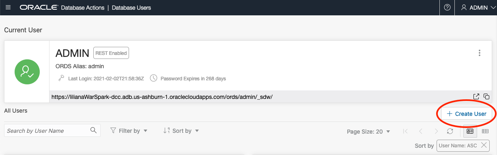
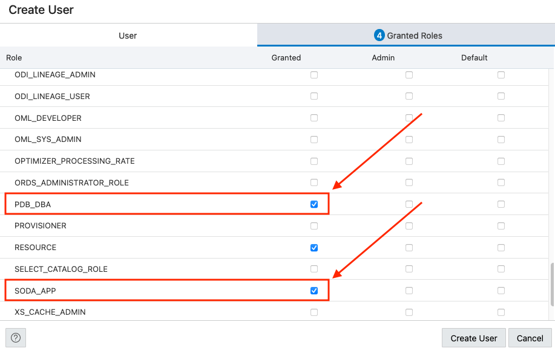
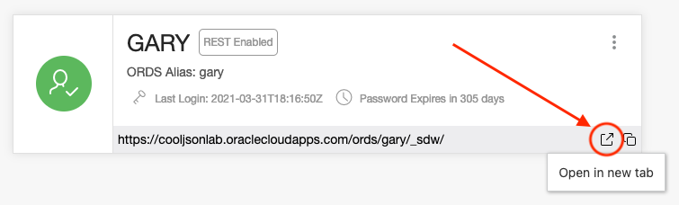

# Setups for the Choose your Own JSON Adventure: Relational or Document Store LiveLab

## Introduction

In this part of the lab, we will be using the Database Actions set of UIs to create a user, granted the necessary roles and quota to perform the lab, then log back into Database Actions as this user.

Estimated Lab Time: 10 minutes

### Objectives

- Create a Database User
- Grant user needed roles, quota and REST enable
- Access Database Actions UI with new user

### Prerequisites

- The following lab requires an <a href="https://www.oracle.com/cloud/free/" target="\_blank">Oracle Cloud account</a>. You may use your own cloud account, a cloud account that you obtained through a trial, or a training account whose details were given to you by an Oracle instructor.
- This lab assumes you have successfully provisioned Oracle Autonomous database an connected to ADB with SQL Developer web.

## Task 1: Create a user

1. First, we want to create a database schema for our tables. business logic and data. We do this by creating a database user. To create a database user, we start by clicking the Database Actions Menu in the upper left of the page, then clicking Database Users in the Administration List. It is not good practice to use a SYS or SYSTEM user to create an application's tables, and neither is it good practice to use the ADMIN account to create applications.

    

2. Now, click the Create User button on the left side of the page. This will slide out the Create User panel.

    

3. Start by entering a user name. Let's use GARY as the username. Next we need to enter a password. The password must be complex enough to pass the password profile set by the database. The rules are as follows:

    Password must be 12 to 30 characters and contain at least one uppercase letter, one lowercase letter, and one number. The password cannot contain the double quote (") character or the username "admin".

    Once we enter the password twice, ensure the **Web Access** button is on. This will allow us to use REST services with this database schema from the start as well as use the Database Actions tools. 
    
    In the right column of options, find the **Quota on tablespace DATA** dropdown select list. Choose **Unlimited** for this lab.
    
    Your panel should look similar to the following image:

    

4. Next, click the **Granted Roles** tab. Use the **Granted** column and select the following checkboxes; PDB\_DBA and SODA\_APP.

    

5. Once you are ready, click the **Create User** button on the bottom of the panel to create the database user.

    

6. Now that the user is created, we need to log back into Database Actions as this user. On the Database Users admin page, find the Gary user tile and left click the **Open in New Tab** icon link  in the lower right.

    

7. Login to Database Actions using the user and password we just created in the previous steps in the new browser tab. Provide the Username, Password then left click the blue Sign In button.

    

## Conclusion

In this section, we created a new database user and granted them the needed roles and quota to perform this LiveLab.

## Acknowledgements

- **Author** - Jeff Smith, Distinguished Product Manager and Brian Spendolini, Trainee Product Manager
- **Last Updated By/Date** - Anoosha Pilli, April 2021
