# Getting Started with Oracle Data Safe

## Introduction
Data Safe is a unified control center for your Oracle Databases which helps you understand the sensitivity of your data, evaluate risks to data, mask sensitive data, implement and monitor security controls, assess user security, monitor user activity, and address data security compliance requirements. Whether you’re using Oracle Autonomous Database or Oracle Database Cloud Service (Exadata, Virtual Machine, or Bare Metal), Data Safe delivers essential data security capabilities as a service on Oracle Cloud Infrastructure.

This lab walks you through the steps to get started using Oracle Data Safe on Oracle Cloud Infrastructure.

### Objectives
-   Learn how to register a target database
-   Learn how to assess users and database configurations with Oracle Data Safe
-   Learn how to discover, verify and update a sensitive data model with Oracle Data Safe
-   Learn how to create a sensitive type and category with Oracle Data Safe
-   Learn how to mask sensitive data with Oracle Data Safe

### Required Artifacts
-   The following lab requires an Oracle Public Cloud account. You may use your own cloud account, a cloud account that you obtained through a trial, or a training account whose details were given to you by an Oracle instructor.
-	An Oracle Database Service enabled in a region in your tenancy.
-	A registered target database in Oracle Data Safe with sample audit data and the password for the SYS user account.

## Task 0: Enable Data Safe for your Tenancy

Oracle Data Safe administrators can enable Oracle Data Safe in a region of their tenancy. Be aware that it is not possible to disable Oracle Data Safe after it's enabled.

1. To enable Oracle Data Safe, you must belong to one of the following groups in Oracle Cloud Infrastructure Identity and Access Management (IAM):

	* Your tenancy's **Administrators group**. This group has permission on all resources in your tenancy. **NOTE:** A group in your tenancy that has the **manage** permission for Oracle Data Safe and can **inspect** groups in the tenancy.

2. Grant a group all permissions in a tenancy.

3. To grant the Data-Safe-Admins group all permissions on all resources in a tenancy, the policy might be:

	* Allow group Data-Safe-Admins to manage all-resources in tenancy
	* Allow group Data-Safe-Admins to inspect groups in tenancy
	* Make a group an Oracle Data Safe administrators group for the whole tenancy

4. To allow the Data-Safe-Admins group to enable and manage Oracle Data Safe in any region of a tenancy, the policy might be as follows. Note that the group cannot manage all resources in the tenancy with this permission.
	```
	<copy> Allow group Data-Safe-Admins to manage data-safe in tenancy </copy>
	```
	```
	<copy> Allow group Data-Safe-Admins to inspect groups in tenancy </copy>
	```

5. To allow a Data-Safe-Admins group to enable and manage Oracle Data Safe only in the us-phoenix-1 region of a tenancy, include a where clause in your policy statement:
	```
	<copy> Allow group Data-Safe-Admins to manage data-safe in tenancy where request.region='phx' </copy>
	```
	```
	<copy> Allow group Data-Safe-Admins to inspect groups in tenancy </copy>
	```

6. For more information please see [Data Safe Documentation](https://docs.oracle.com/en/cloud/paas/data-safe/udscs/enable-oracle-data-safe.html#GUID-409260CE-2D7B-4029-B7CA-2EDD6E961CEB)

7. **Note:** Both native and federated users in Oracle Cloud Infrastructure can enable Oracle Data Safe.

8. Ensure that you have the required permissions for enabling Oracle Data Safe.

9. Sign in to the Oracle Cloud Infrastructure Console.

10. At the top of the page, select the region in which you want to enable Oracle Data Safe.

11. From the navigation menu, select **Data Safe**.

12. Click **Enable Data Safe**.

12. Collapse


## Task 1: Registering a Target Database

You can register an Autonomous Database from its Console in Oracle Cloud Infrastructure Console. From this Console, you can also access the Oracle Data Safe Console.

1. Sign in to Oracle Cloud Infrastructure.

	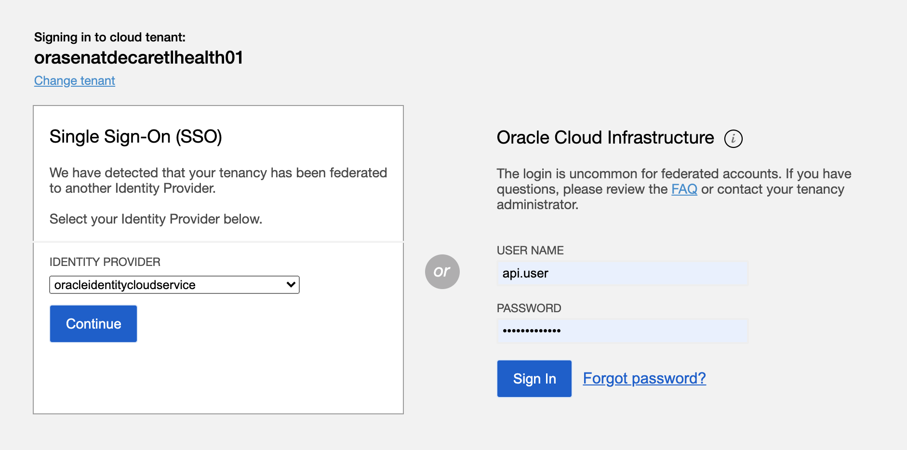

2. In the upper right corner, select the region in which your Autonomous Database resides.

3. Click the **Navigation Menu** in the upper left, navigate to **Oracle Database**, and select **Autonomous Transaction Processing**.

	

4. From the **COMPARTMENT** drop-down list, select the compartment that contains your Autonomous Database.

	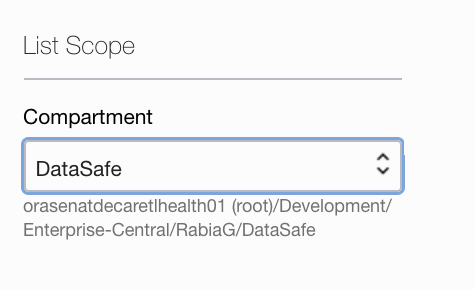

5. Click the name of your Autonomous Database. The **Autonomous Database Information** tab on the **Autonomous Database Details** page is displayed.

6. Under **Data Safe**, click **Register**.

7. A Confirm dialog box asks if you are sure you want to register the database with Oracle Data Safe.

8. Click **Confirm**. Wait for registration to finish.

9. When registration is completed, the **Status** reads **Registered**. A resource group is created in Oracle Data Safe with the same name as the compartment that contains the database in Oracle Cloud Infrastructure. The user registering the database is automatically authorized to manage the User Assessment, Security Assessment, and Activity Auditing features for that resource group.

10. (Optional) Click **View Console** to navigate to the Oracle Data Safe Console for the database.

	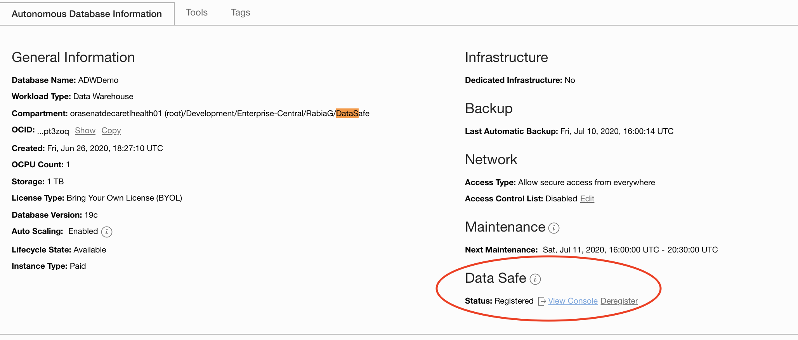


## Task 2: Grant User Roles

The roles that you grant to this account determine the Oracle Data Safe features that you can use with your Autonomous Database. These particular roles allow you to assess users and security configurations on your Autonomous Database and start audit trail collection immediately after you register the database.

The following table describes the available roles for Autonomous Databases [here](https://docs.cloud.oracle.com/en-us/iaas/data-safe/doc/roles-oracle-data-safe-service-account.html#GUID-F52D2580-1659-4A1D-85EE-01C8B5ADB613).

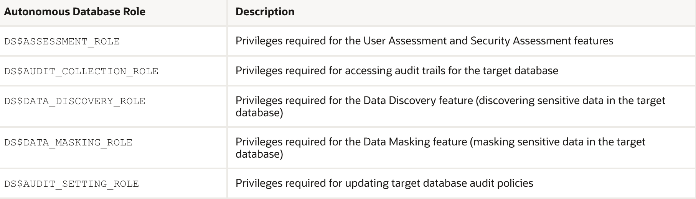

**NOTE**:You can grant or revoke roles as often as needed.

1. Using a tool like SQL Developer, log in to your Autonomous Database as the Admin user (ADMIN).

    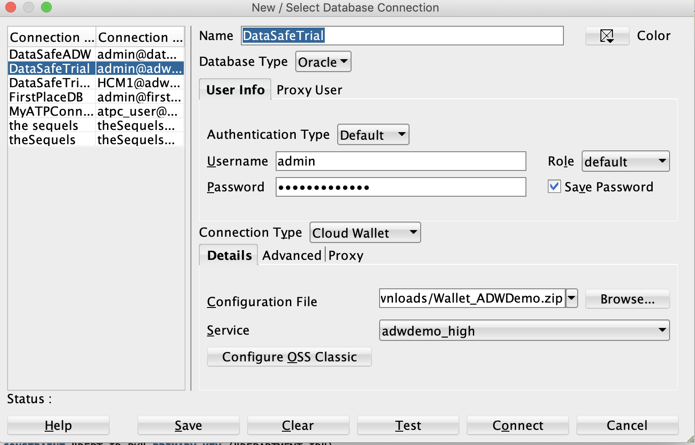

2. Grant or revoke a role from the Oracle Data Safe service account by running either one of the following commands, where role_name is the name of an Oracle Data Safe role, must be in single quotation marks.

	```
	<copy> EXECUTE DS_TARGET_UTIL.GRANT_ROLE('role_name'); </copy>
	```
	**NOTE** SQL GRANT is a command used to provide access or privileges on the database objects to the users. We are granting access to 'role name' (Assess Data, Data Discovery and more) to allow user to perform necessary actions on Data Safe.
	```
	<copy> EXECUTE DS_TARGET_UTIL.REVOKE_ROLE('role_name'); </copy>
	```
 	**NOTE** SQL REVOKE command removes user access rights or privileges to the database objects.

3. These are the roles you can add now to your SQL Developer worksheet.

	```
	<copy> EXECUTE DS_TARGET_UTIL.GRANT_ROLE('DS$ASSESSMENT_ROLE');
	EXECUTE DS_TARGET_UTIL.GRANT_ROLE('DS$AUDIT_COLLECTION_ROLE');
	EXECUTE DS_TARGET_UTIL.GRANT_ROLE('DS$DATA_MASKING_ROLE');
	EXECUTE DS_TARGET_UTIL.GRANT_ROLE('DS$AUDIT_SETTING_ROLE');
	EXECUTE DS_TARGET_UTIL.GRANT_ROLE('DS$DATA_DISCOVERY_ROLE'); </copy>
	```

	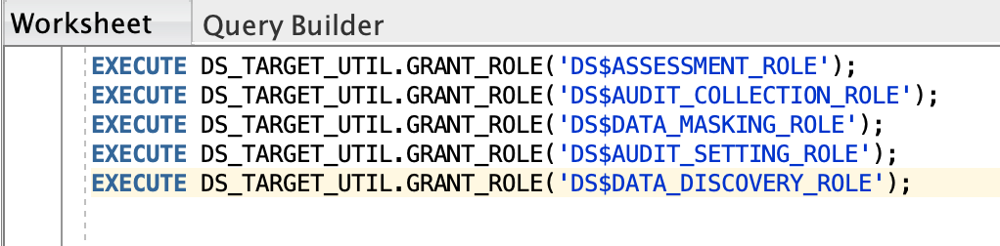

	**NOTE** 1. If you don't have any data, populate your database with some new users and data to effectively use this lab. Use the script [here](https://objectstorage.us-phoenix-1.oraclecloud.com/n/orasenatdecaretlhealth01/b/Workshop/o/UsersScript.sql) to add new users.

4. Login as **HCM1** user.

    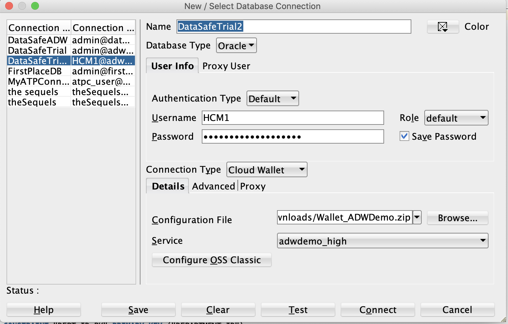

5. Use the script [here](https://objectstorage.us-phoenix-1.oraclecloud.com/n/orasenatdecaretlhealth01/b/Workshop/o/TableScript.sql) to add new tables to the HCM1 schema.

    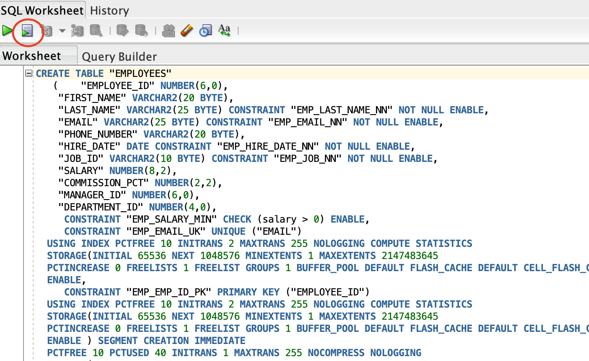

	**NOTE** These tables are basic HR data containing personal credentials that will be used later throughout the lab. You can use any data you would like, this is just good example data. This provides the ability to replicate the following lab.

## Task 3: Assess Database Configurations with Oracle Data Safe

Using Oracle Data Safe you can assess the security of a database by using the Security Assessment feature and fix issues.

1. In the Oracle Data Safe Console (refer to Part 1 step 2 on how to log in), generate a Comprehensive Assessment report.

2. Navigate to the Oracle Data Safe Console.

3. Click the **Home** tab and then **Security Assessment**.

	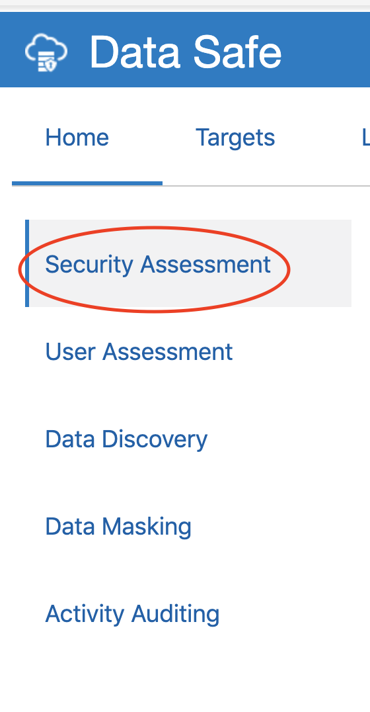

4. On the **Security Assessment** page, select the check box for your target database, and click **Assess**.

	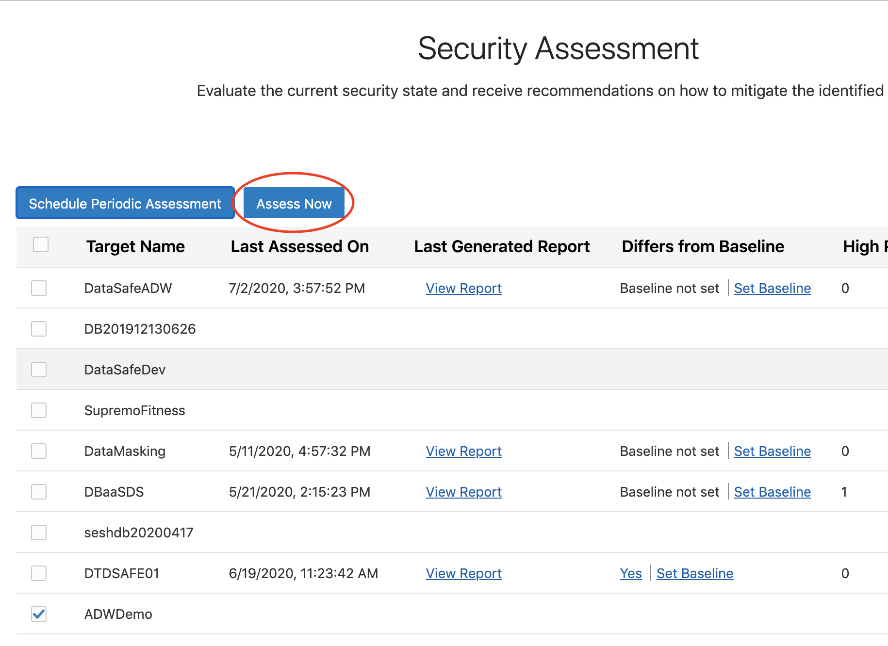

5. Wait a moment for the report to generate.

6. When the report is generated, review the high risk, medium risk, and low risk values.

7. In the **Last Generated Report** column, click **View Report**.

	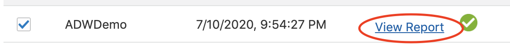

8. The **Comprehensive Assessment** report is displayed on the **Reports** tab.

9. In the upper right corner, view the target name, when the database was assessed, and the database version.

	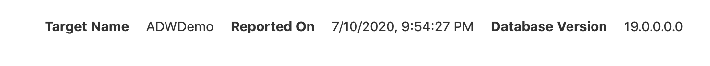

10. At the top of the report, click either **Medium Risk, Low Risk, High Risk, or Advisory** to filter the report to show only their individual findings. These values give you an idea of how secure your database is.

	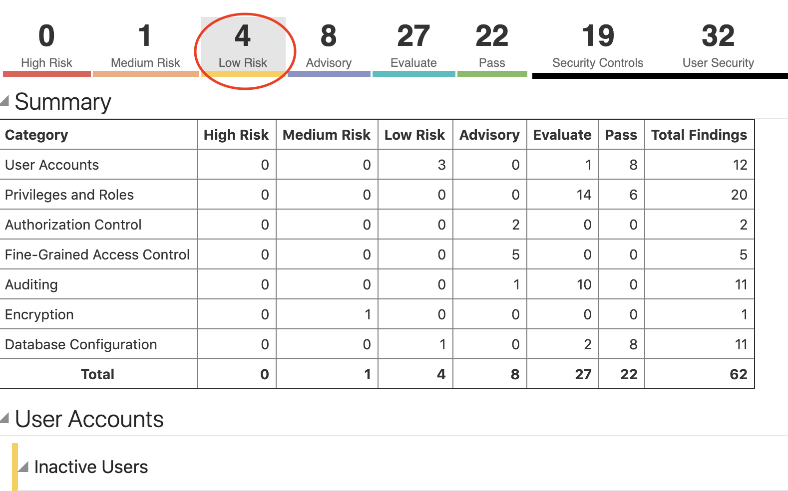

	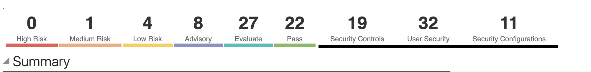

	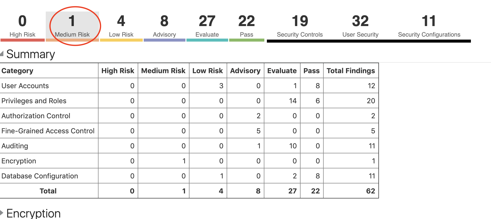

	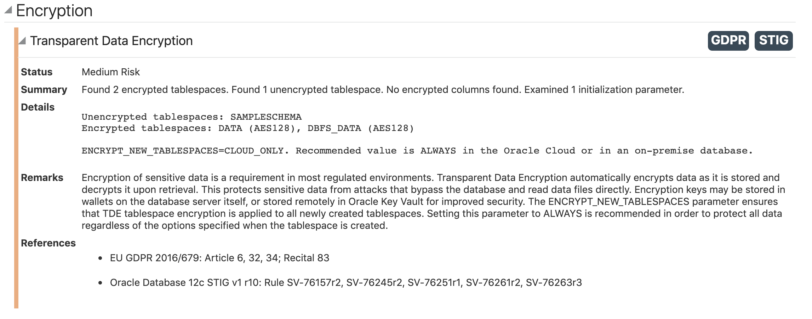

11.	View the values for security controls, user security, and security configurations. These totals show you the number of findings for each high-level category.

12.	Browse the report by scrolling down and expanding and collapsing categories. Each category lists related findings about your database and how you can make changes to improve its security.

13.	View the **Summary** table. This table compares the number of findings for each category and counts the number of findings per risk level. It helps you to identify the areas that need attention on your database.

	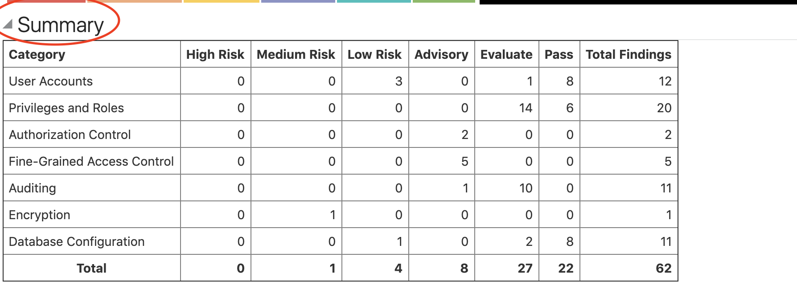

14.	At the top of the report, click **Evaluate** to filter the report to show only the Evaluate findings.

	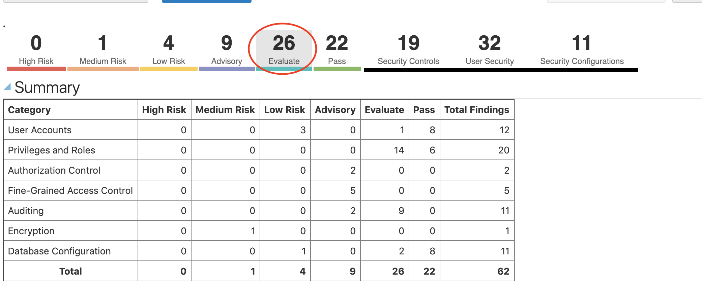

15. Focus on **System Privilege Grants** under Privileges and Roles.

16.	System privileges (**ALTER USER, CREATE USER, DROP USER**) can be used to create and modify other user accounts, including the ability to change passwords. This ability can be abused to gain access to another user's account, which may have greater privileges. **The Privilege Analysis feature may be helpful to determine whether or not a user or role has used account management privileges.**

	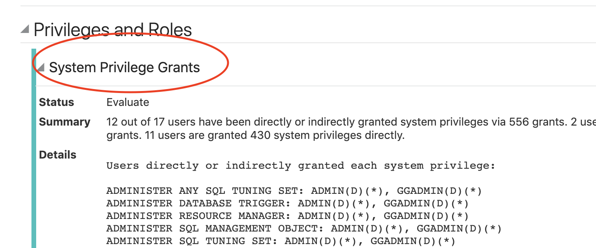


## Task 4: Assess Users with Oracle Data Safe

Using Oracle Data Safe, assess user security in your target database by using the User Assessment feature and fix issues.

1. In the Oracle Data Safe Console, click the **Home** tab, and then click **User Assessment**. The User Assessment page is displayed.

	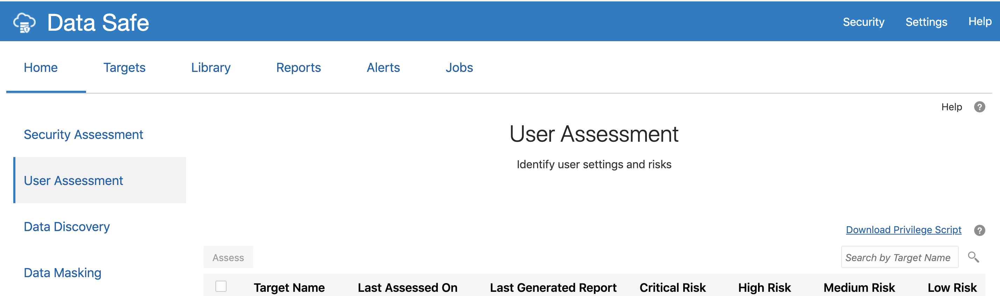

2. Select the check box for your target database, and click Assess. When finished, click **view report.**

	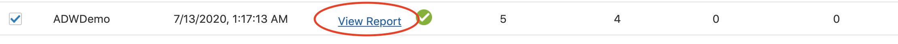

3. When the report is generated, view the totals in the Critical Risk, High Risk, Medium Risk, and Low Risk columns.

	

4. View the **User Roles** chart. This chart compares the number of users with the DBA, DV Admin, and Audit Admin roles.

	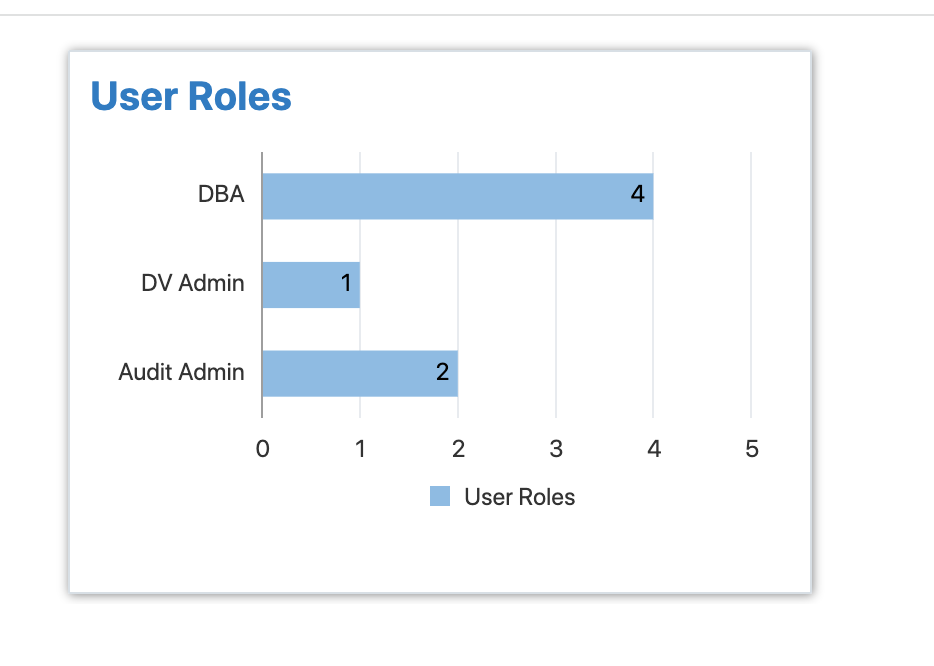

5. Click the second small circle below the charts to view the **Last Password Change** and **Last Login** charts.

	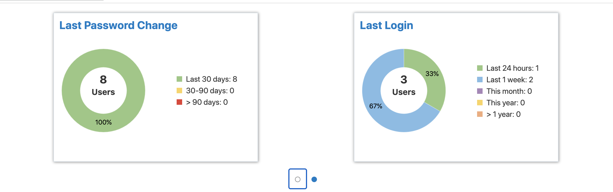

6. Click the + sign to view the list of columns that you can display in the table. Add and remove columns as you wish, then click Apply.

	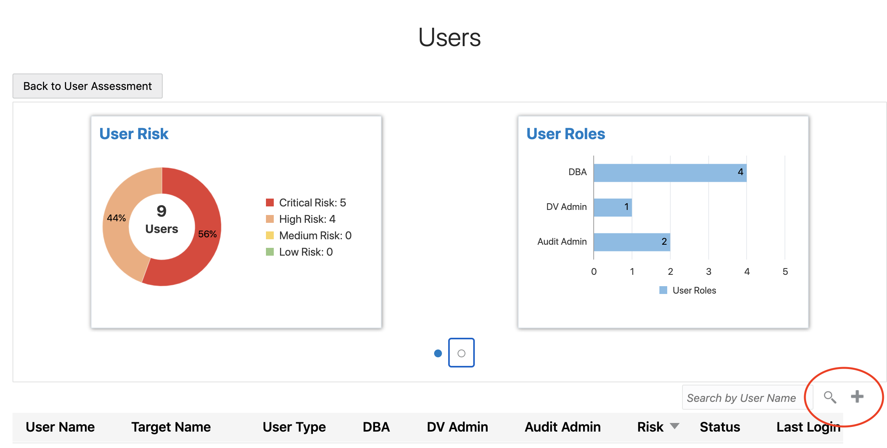

	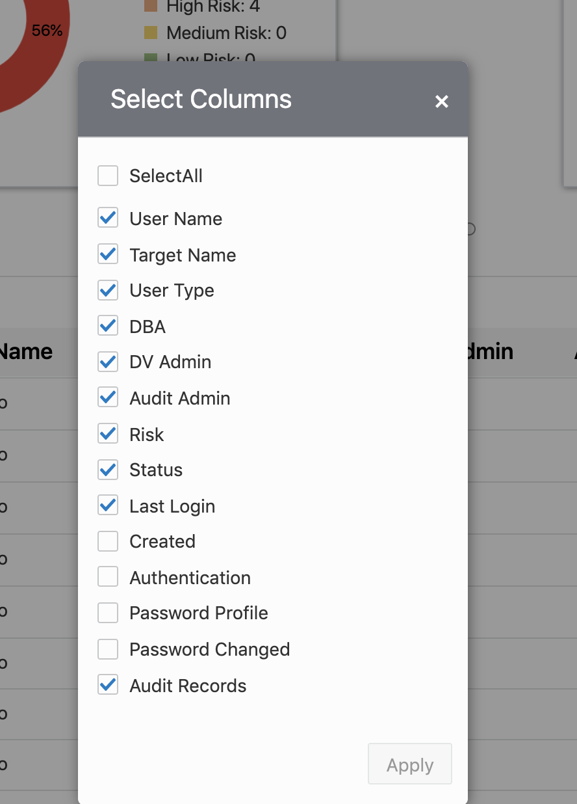

7. In the **Audit Records** column, click **View Activity** for the following users to view the audit records that they generated. Filters are automatically applied to **Operation Time** and **User Name**. Click Back to **User Assessment** report to return to the **User Assessment** report.

	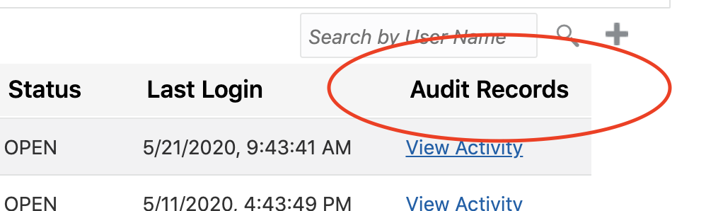

	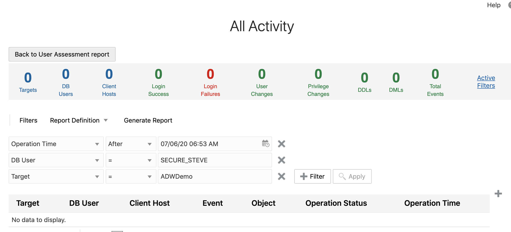

	**NOTE:** DBA_DEBRA: Notice that DBA_DEBRA has the Audit Admin role, but has not generated any audit records.

3. In the table, click DBA_DEBRA. The **User Details** dialog box is displayed. Here you see she is not using her audit admin role, it may be recommended to reconsider her admin role.

	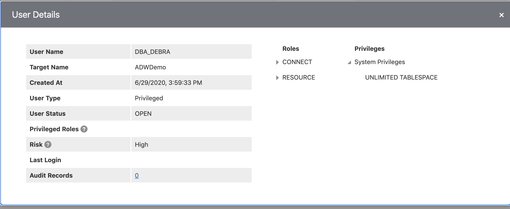

4.	On the right, expand the roles to view the privileges.

5.	On the left, click the question mark next to **Risk**. Here you can review the factors that designate a user as Critical, High, Medium, or Low risk.

6.	Close the User Details dialog box.

## Task 5: Discover Sensitive Data with Oracle Data Safe

1. Navigate to the Oracle Data Safe Service Console.

2. To access the **Data Discovery** wizard, click the **Home** tab, and then click **Data Discovery**.

	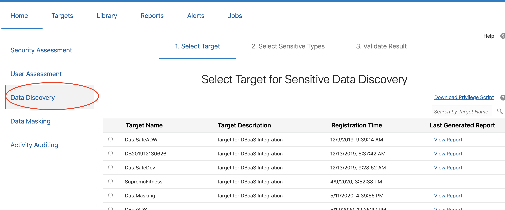

3. On the Select Target for Sensitive Data Discovery page, your target database is listed.

	**NOTE** Often, you want to perform data discovery against a production database where you can get an accurate and up-to-date picture of your sensitive data. You can discover sensitive data in the source database (a production or copy) and mask the cloned copies of this source database. Or, you can simply run a data discovery job on the actual database that you want to mask.

4. Select your target database, and then click **Continue at the bottom right**.

	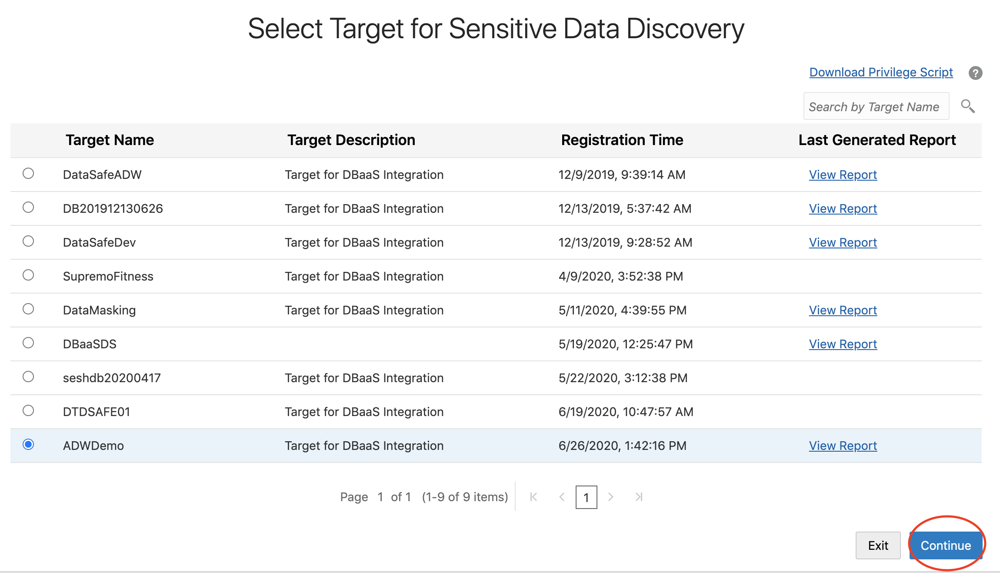

5. On this page, you can create a new **sensitive data model**, select an existing one from the Library, or import a file-based sensitive data model.

	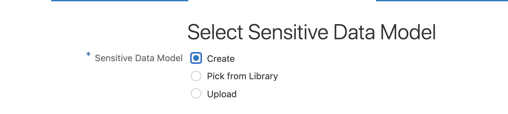

 	i. Leave **Create** selected.

   	ii. Name the sensitive data model as **SDM1**.

   	iii. Enable **Show and save sample data** so that Data Discovery retrieves sample data for each sensitive column, if it's available.

	iv. Select your resource group.

    v. Click **Continue**.

6. On the **Select Schemas for Sensitive Data Discovery** page, select the schema that you want Data Discovery to search. In this case, select the **HCM1** schema, and click **Continue**.

	

7. On the **Select Sensitive Types for Sensitive Data Discovery** page, select the **Select All** check box.

	**NOTE** Data Discovery categorizes its sensitive types as Identification Information, Biographic Information, IT Information, Financial Information, Healthcare Information, Employment Information, and Academic Information.

8. Select **Expand all** at the top. Notice that you can select individual sensitive types, sensitive categories, and all sensitive types.Scroll and review the sensitive types available.

	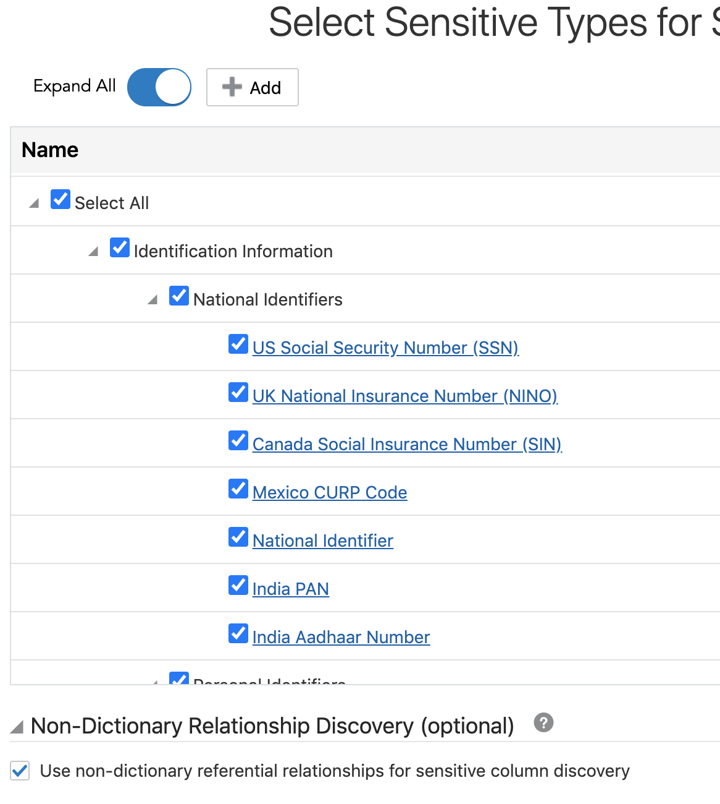

9. At the bottom of the page, select the **Non-Dictionary Relationship Discovery** check box.

	**NOTE** Oracle Data Safe automatically discovers referential relationships defined in the data dictionary. The **Non-Dictionary Relationship Discovery** feature helps to identify application-level parent-child relationships that are not defined in the data dictionary. It helps discover application-level relationships so that data integrity is maintained during data masking.

10.	When you are ready to start the data discovery job, click **Continue**.

11. The job will take a few minutes to complete. If the job is successful, the **Detail** column states Data discovery job finished successfully, and you can click **Continue**. Otherwise, you need to click **Back** or **Exit** and investigate the issue.

12. On the **Non-Dictionary Referential Relationships** page, you are presented with a list of potential non-dictionary (application level) referential relationships that Data Discovery found by using column name patterns and column data patterns.

13. To view all of the columns, move the **Expand All** slider to the right. Data Discovery found some potentially sensitive columns (non-dictionary referential relationships) in the **PU_PETE schema**.

	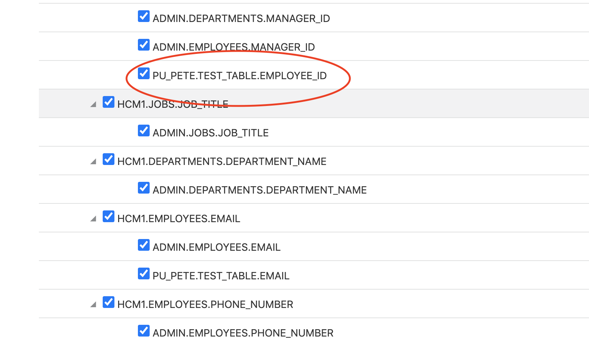

14. Click **Save and Continue**.

15. The **Sensitive Data Discovery Result** page is displayed. On this page, you can view and manage the sensitive columns in your sensitive data model. Your sensitive data model is **saved to the Library.**

	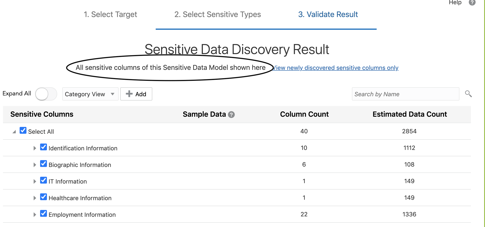

16. Notice that Data Discovery found sensitive columns in all three sensitive categories that you selected. To view the sensitive columns, move the **Expand All** slider to the right. The list includes the following:

    -	Sensitive columns discovered based on the sensitive types that you selected
    -	Dictionary-based referential relationships
    -	Non-dictionary referential relationships

17. Take a look at how the sensitive columns are organized. Initially, they are grouped by sensitive categories and sensitive types. To list the sensitive columns by schema and table, select **Schema View** from the drop-down list next to the **Expand All Slider**. **Schema View** is useful for quickly finding a sensitive *column* in a table and for viewing the list of sensitive columns in a table. For example, in the EMPLOYEES table there are several sensitive columns listed.

	**NOTE** If needed, you can add and remove sensitive columns from your sensitive data model by deselecting or selecting the box. You can use the **Add** button to add more sensitive columns.

	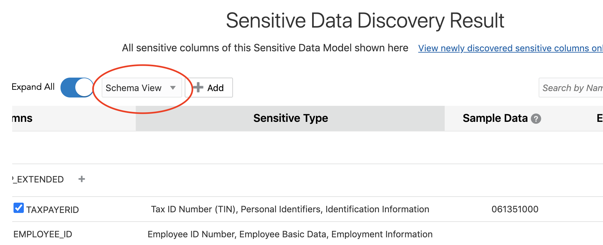

18. Notice that some of the sensitive columns do not have a check box. These are dependent columns and they have a relationship with their parent column. For example, in the EMPLOYEES table, JOB\_ID is listed. It has a relationship defined in the Oracle data dictionary to the JOBS.JOB\_ID sensitive column. If you remove a sensitive column that has a referential relationship, both the sensitive column and referential relationship are removed from the sensitive data model. Therefore, if you deselect JOBS.JOB\_ID, then EMPLOYEES.JOB\_ID is removed too.

19. View the sample data for the HCM1.SUPPLEMENTAL\_DATA.LAST\_INS\_CLAIM column (expand HCM1 at the top, then expand supplemental data, then expand last\_ins\_claim). The sensitive type is **Healthcare Provider** and the discovered sensitive column is LAST\_INS\_CLAIM, which has values such as Cavity and Hair Loss. Your value may be different. This column isn't a Healthcare Provider type of column and thus it is a false positive; you can deselect this column. Being able to remove a sensitive column is important when your sensitive data model includes false positives. To be able to recognize false positives, it helps to know your data well.

	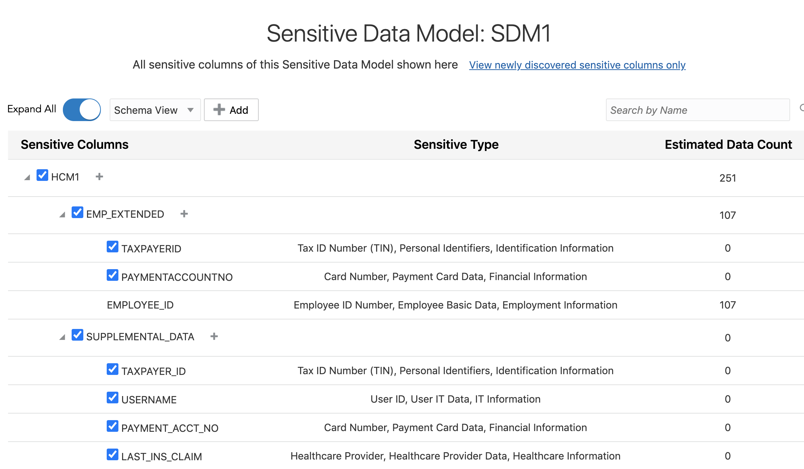

20. Suppose that you're missing some sensitive columns in your sensitive data model. While working in the Data Discovery wizard, you can backtrack to reconfigure and rerun the data discovery job. You can repeat the process as many times as you need until you feel that your sensitive data model is accurate. Try the following steps.

21. Click **Back**.

22. Now you are on the **Select Sensitive Types for Sensitive Data Discovery** page. Here you can change your sensitive type selections and choose whether to include non-dictionary referential relationships in the search.

23. Select all of the sensitive categories.

24. Deselect **Non-Dictionary Relationship Discovery** at the bottom of the page.

	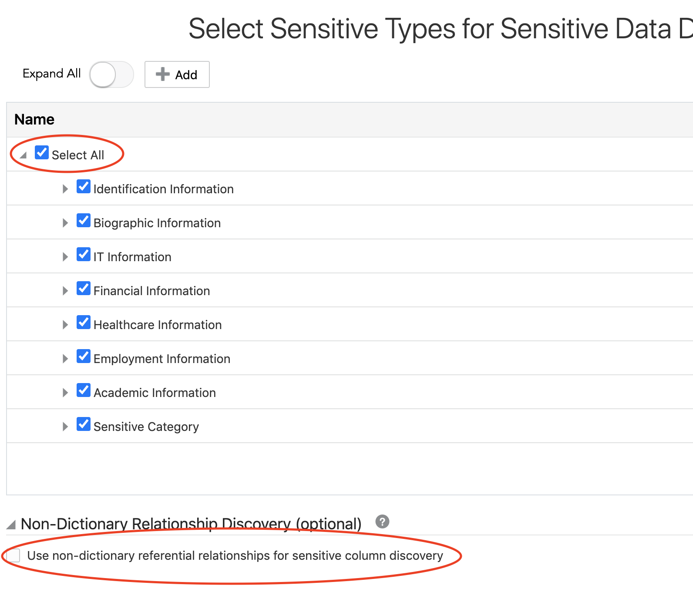

25. To rerun the data discovery job, click **Continue**.

26. When the job is finished, click **Continue**. Because you chose to not discover non-dictionary referential relationships, the wizard takes you directly to the **Sensitive Data Discovery Result** page.

27. Expand all of the sensitive columns and review the results then scroll down and click reports.

	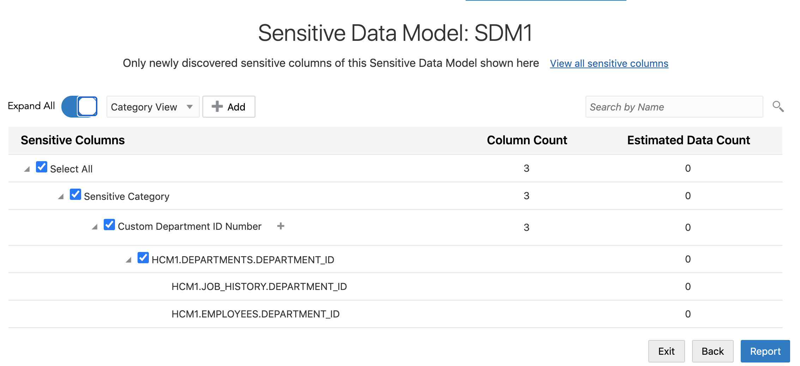

	**NOTE** The report shows you a chart that compares sensitive categories. You can also view totals of sensitive values, sensitive types, sensitive tables, and sensitive columns. The table at the bottom of the report displays individual sensitive column names, sample data for the sensitive columns, column counts based on sensitive categories, and estimated data counts.

	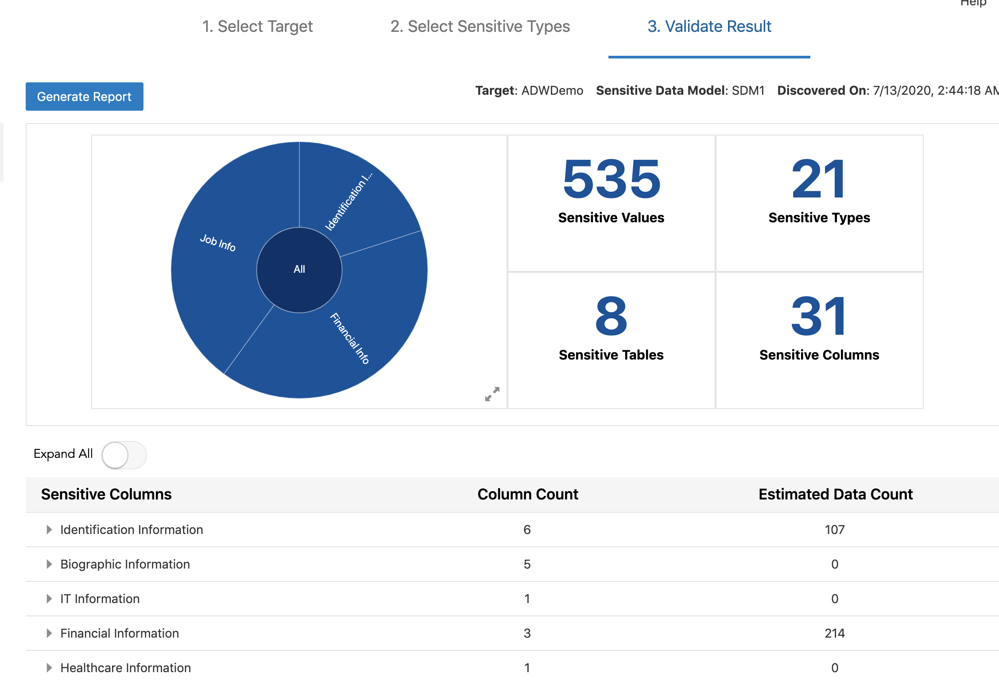

28. Click the **Library**  tab and click **Data Discovery.** and go to **Sensitive Data Models**.

29. For each sensitive data model, you can view information about when your sensitive data model was created, when it was last updated, and who owns it. If you need to remove your sensitive data model from the Library, you can select the check box for it, and click **Delete**.

	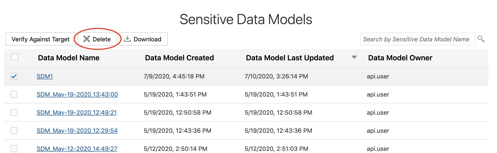

30. You can also **Download** the Sensitive Data Model. Open the file, and review the XML code. (Save the file to your desktop as **SDM1.xml**).

	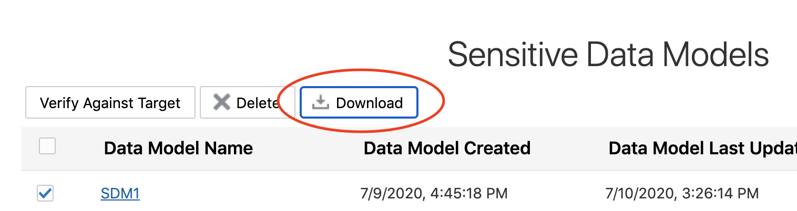

## Task 6: Verify Sensitive Data Model with Oracle Data Safe

Using Oracle Data Safe, verify a sensitive data model by using the verification option in the Library and by using the Data Discovery wizard.

1. Open SQL Developer.

2. On the SQL Worksheet, run the following command to add an AGE column to the EMPLOYEES table.

	```
	<copy> ALTER TABLE EMPLOYEES
 	ADD AGE NUMBER; </copy>
	```

3. Click the **Refresh** button to view the newly added column.

	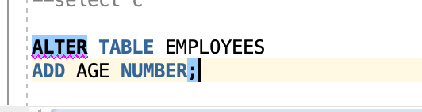

	**NOTE** This alteration will enact a small change that you will later see in Data Safe console.

4. Navigate to the Oracle Data Safe Service Console.

5. In the Oracle Data Safe Console, click the **Library** tab, and then click **Sensitive Data Models**.

	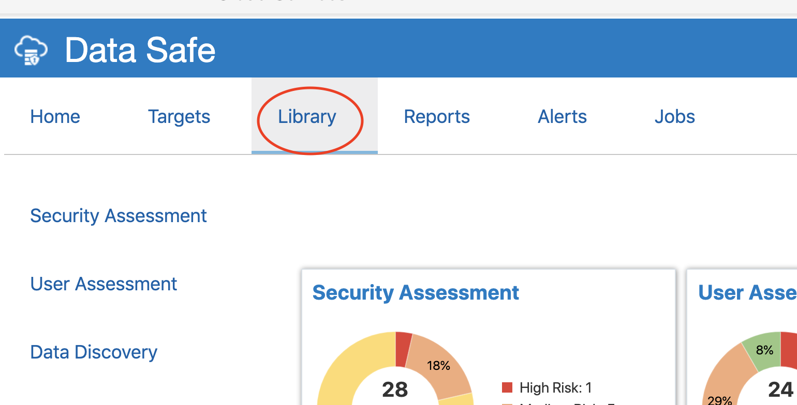

6. Select the check box for your sensitive data model that you created in Discovery Lab 1 - Discover Sensitive Data with Oracle Data Safe (**SDM1**).

7. Click **Verify Against Target**.

	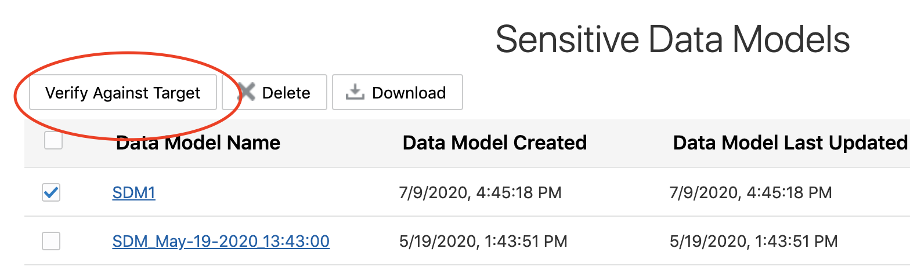

8. On the **Select Target for Data Model Verification** page, select your target database, and click **Continue**. The verification job is started. Once finished, click **Continue**.

	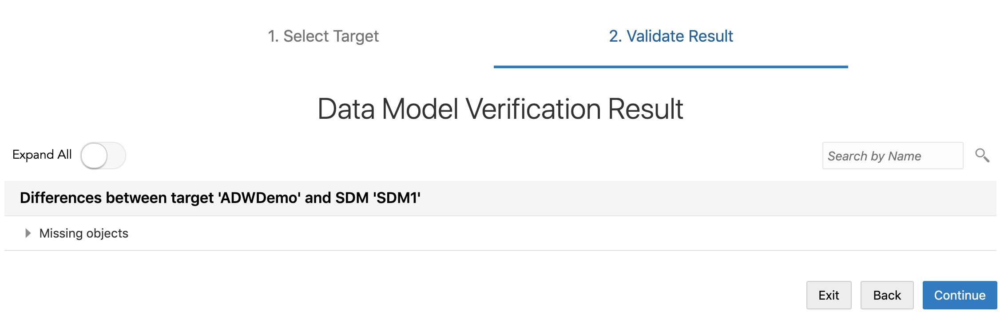

	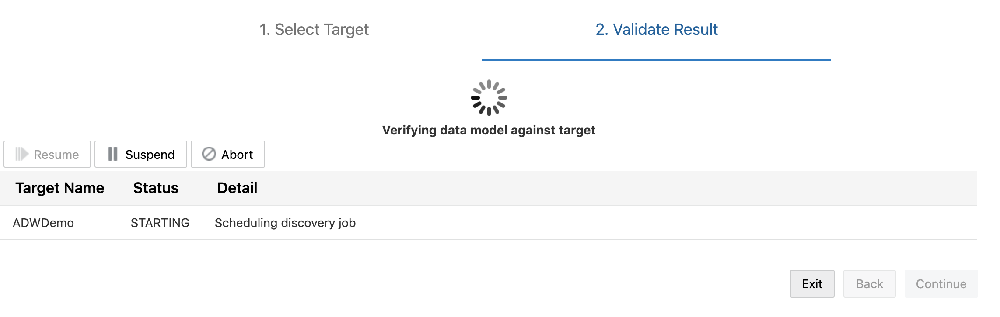

9. On the **Data Model Verification Result** page, notice that there are no differences to report. The verification job did not find the new sensitive column, AGE. Click **Continue**.

	**NOTE** The verification feature checks whether the sensitive columns in the sensitive data model are present in the target database. If there are some present in the sensitive data model, but missing in the target database, it reports them. In addition, it reports new referential relationships for the columns already present in the sensitive data model. It does not, however, discover ALL the relationships.

10. On the **Sensitive Data Model: SDM1** page, click **Add**. The **Add Sensitive Columns** dialog box is displayed.

	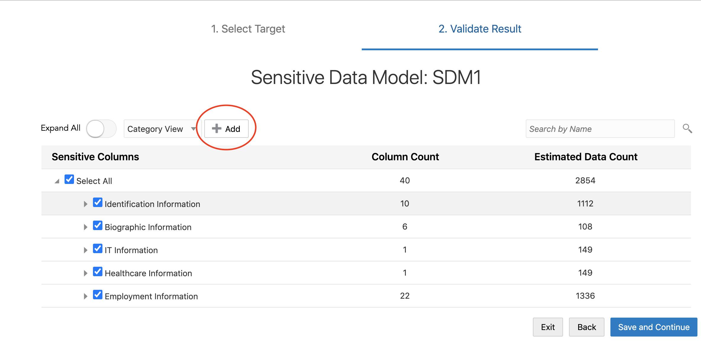

	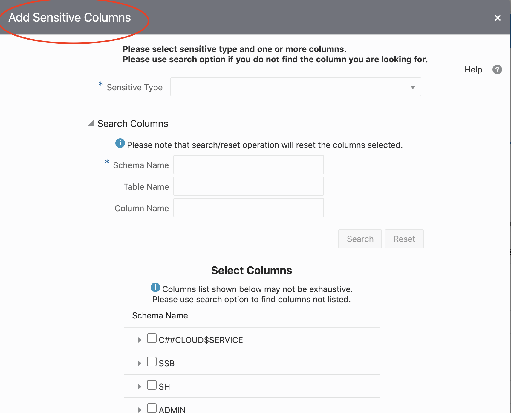

11. Expand the **HCM1**, and then the **EMPLOYEES** table, then select the **AGE** column.

	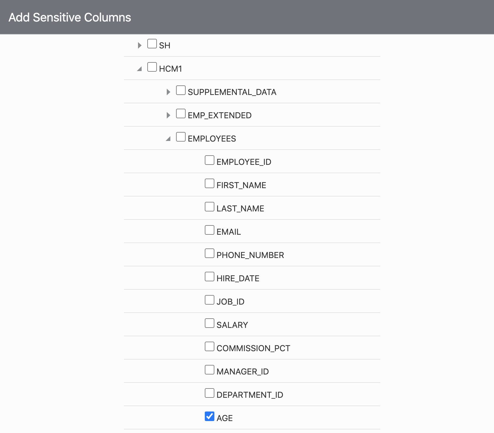

12. At the top of the dialog box in the **Sensitive Type** field, enter **age**. AGE is automatically retrieved as a sensitive type and you can select it.

	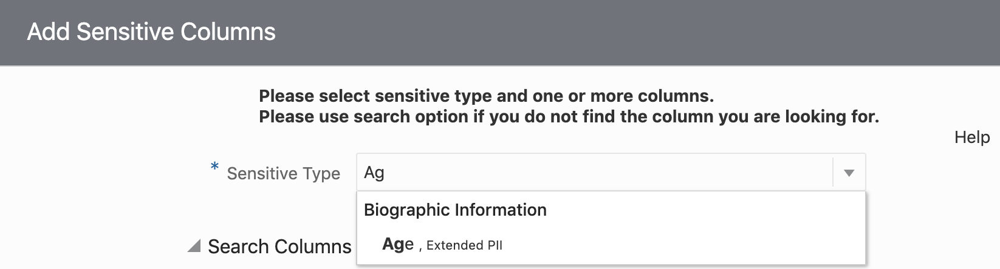

13. Scroll to the bottom and click **Add to Result**. Your sensitive data model is updated to include the AGE column.

14. To verify, enter age in the search box. HCM1.EMPLOYEES.AGE should be listed under **Biographic Information**.

	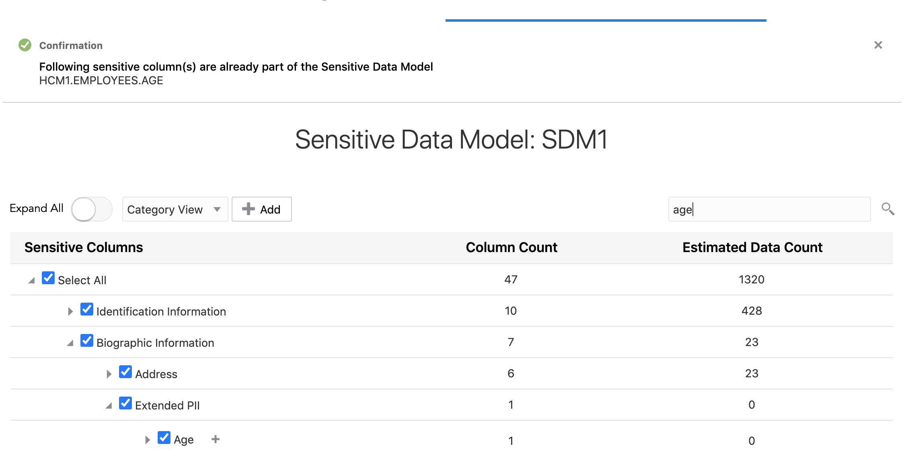

15. Click **Save and Continue** and then **Exit**.

16. Return to SQL Developer.

17. On the SQL Worksheet, run the following commands to drop the HCM1.EMPLOYEES.AGE column.

	```
	<copy> ALTER TABLE EMPLOYEES
	DROP COLUMN AGE; </copy>
	```

	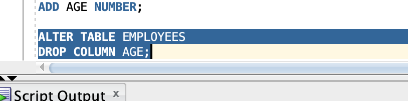
	**NOTE** This alteration will allow you to change the data and delete the age column. This will reflect in the Data Safe console.

18. To verify that the EMPLOYEES table no longer has an AGE column, run the following script:

	```
	<copy> SELECT AGE FROM HCM1.EMPLOYEES; </copy>
	```

19. Notice that the AGE column is gone and you receive an "Invalid Identifier" message when you run the command.

	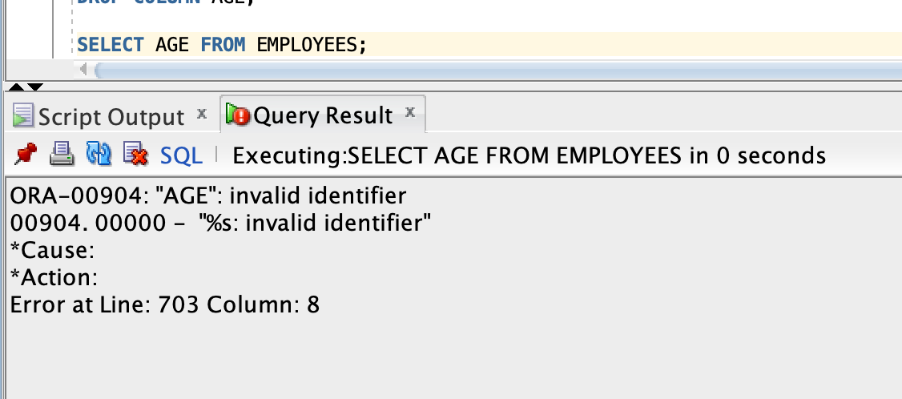

	**NOTE** This error simply means you can no longer find the column you have just deleted.

20. If the AGE column is still there, click the **Refresh** button to refresh the table.

21. Return to Oracle Data Safe.

22. Click the **Home** tab, and then click **Data Discovery**.

	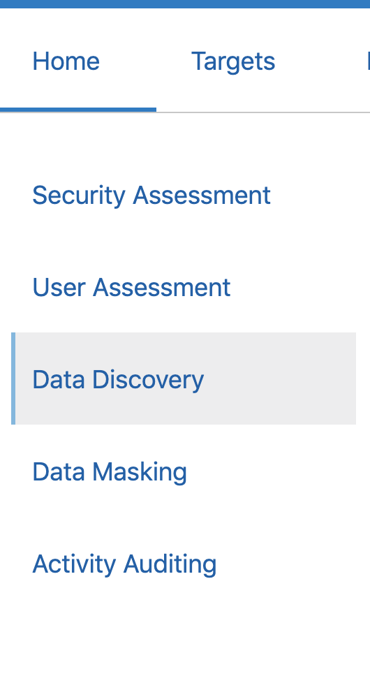

23. On the **Select Target for Sensitive Data Discovery** page, select your target database, and then click **Continue**.

	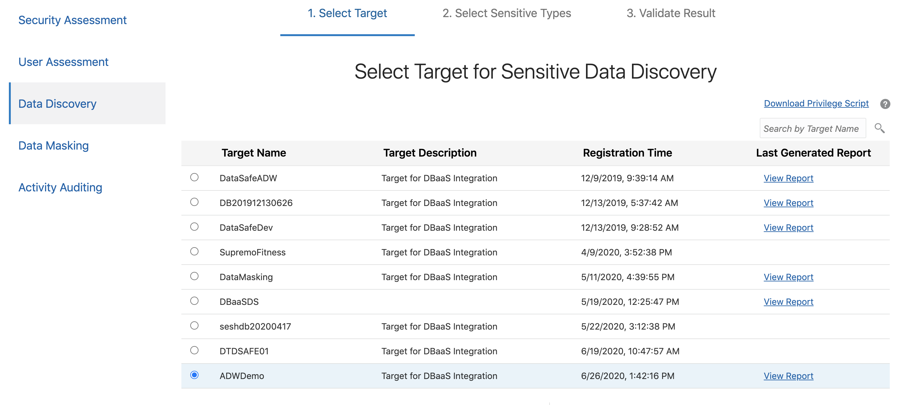

24. For **Sensitive Data Model**, select **Pick from Library**, and then click **Continue**. The **Select Sensitive Data Model** page is displayed.

	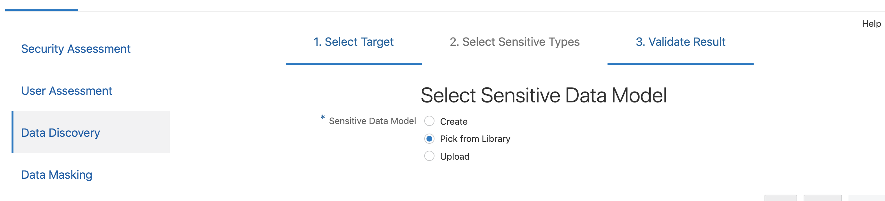

	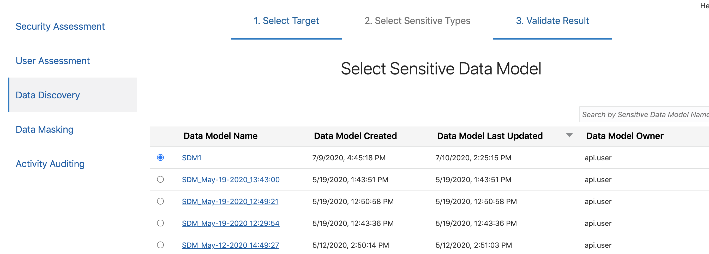

25. Select your sensitive data model, **SDM1**.

26. Scroll down to the bottom of the page and select **Verify if SDM is compatible with the target.**

	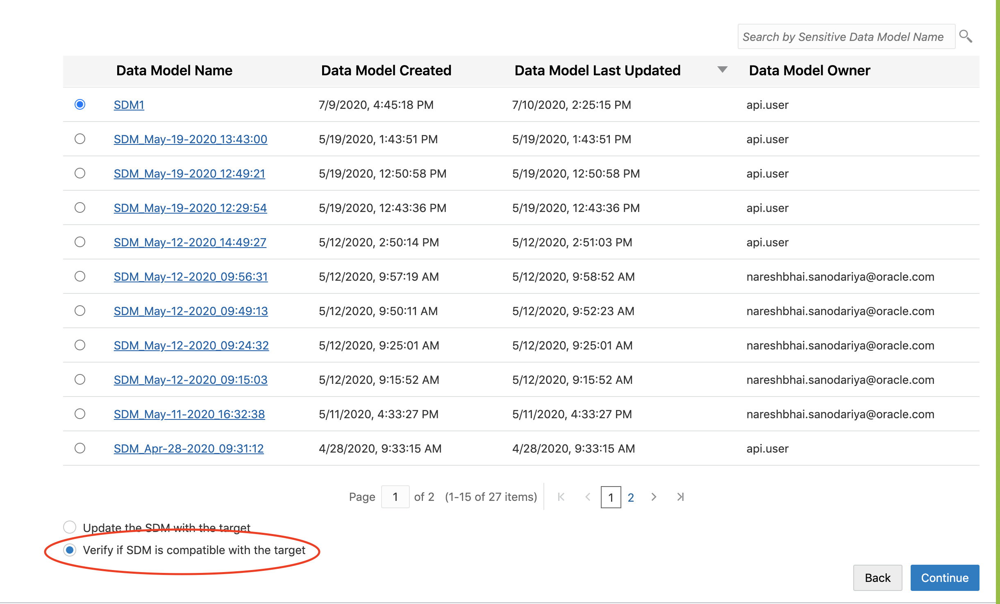

27. To start the verification job, click Continue. If the job finishes successfully, click **Continue**. The **Data Model Verification Result** page is displayed.

28. Expand **Missing sensitive columns**, and then HCM1. The Data Discovery wizard identifies the AGE column as missing from the database.

	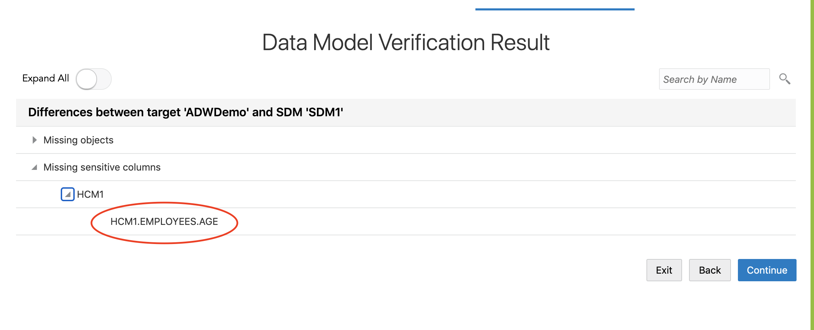

	**NOTE:** You can manually update your sensitive data model while continuing to work in the Data Discovery wizard. In which case, you simply deselect your sensitive column and save your sensitive data model. This part, however, shows you another way to do it from the Library.

29. Click **Exit** to exit the Data Discovery wizard.

30. Click the **Library** tab, and then click **Sensitive Data Models**.

31. Click your sensitive data model to open it.

32. Search for **AGE**.

33. In the list of sensitive columns, deselect HCM1.EMPLOYEES.AGE.

	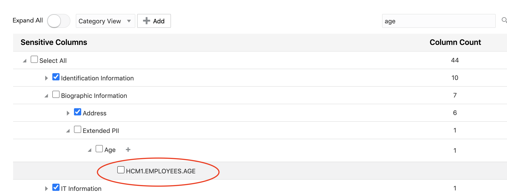

34. Your sensitive data model is now updated and accurate.

35. Click **Save** then **Exit**.

## Task 7: Update a Sensitive Data Model with Oracle Data Safe

Using Oracle Data Safe, perform an incremental update to a sensitive data model by using the Data Discovery wizard.

1. Open SQL Developer

2. On the SQL Worksheet, run the following commands to add an AGE column to the EMPLOYEES table.
	```
	<copy> ALTER TABLE HCM1.EMPLOYEES ADD AGE NUMBER; </copy>
	```

	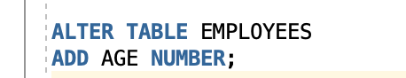
	**NOTE** We are now adding back the Age column so that it will show in the sensitive data model.

2. On the Navigator tab, click the **Refresh** button.

3. AGE is added to the bottom of the list in the EMPLOYEES table.

	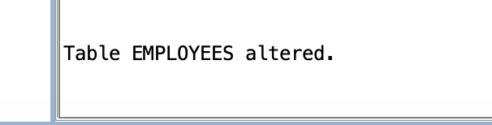

	**NOTE** Table alteration in this case means you have just added a new column.

4. Navigate to the Oracle Data Safe Service Console.

5. In the Oracle Data Safe Console, click **Data Discovery**. The Select Target for Data Discovery page is displayed.

	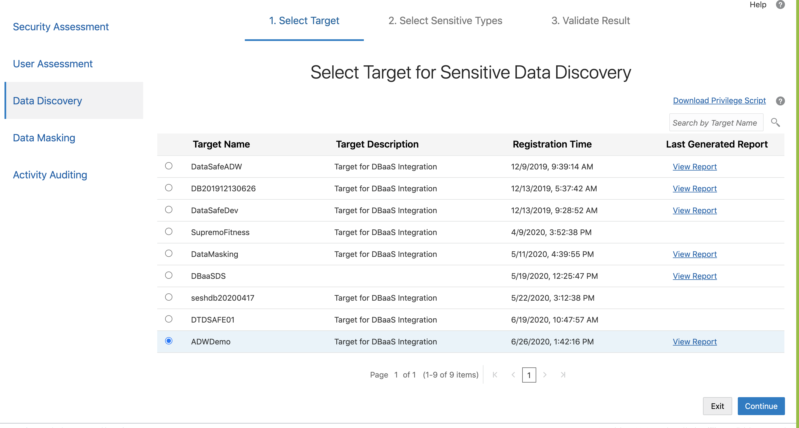

	i. Select your target database, and then click **Continue**. The **Select Sensitive Data Model** page is displayed.

	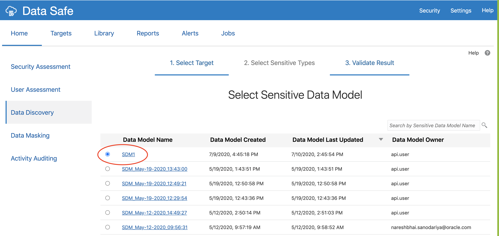

	ii. For **Sensitive Data Model**, click **Pick from Library**.

	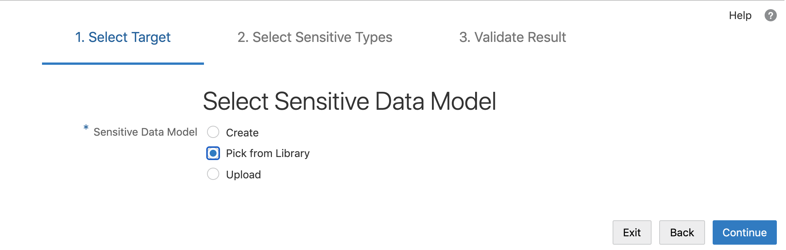

	iii. Click **Continue**. The **Select Sensitive Data Model** page is displayed.

	iv. Select your sensitive data model (**SDM1**).

	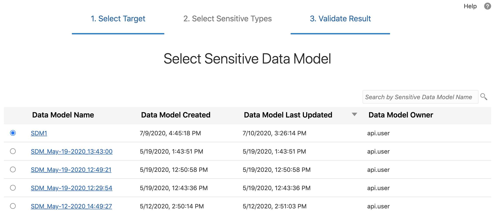

	v. Leave **Update the SDM with the target** selected.

	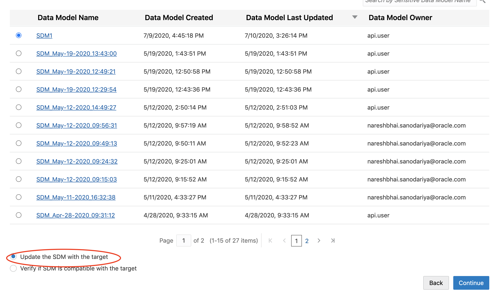

	vi. Click **Continue**. The wizard launches a data discovery job.

6. When the job is finished, notice that the **Detail** column reads **Data discovery job finished successfully**.

	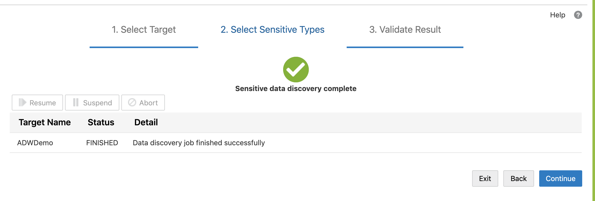

7. Click **Continue**. The **Sensitive Data Model: SDM1 page** is displayed.

8. Notice that you have the newly discovered sensitive column, AGE. **Only newly discovered columns are displayed at the moment.**

	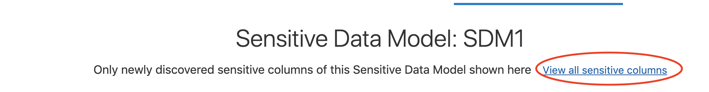

9. **Expand all** of the nodes.

10. To view all of the sensitive columns in the sensitive data model, click **View all sensitive columns**.

11. You can toggle the view back and forth between displaying all of the sensitive columns or just the newly discovered ones.

12. Click **Exit**.

## Task 8: Create a Sensitive Type and Sensitive Category with Oracle Data Safe

1. In the Oracle Data Safe Console, click the **Library** tab, and then click **Sensitive Types**. On this page you can view predefined sensitive types and manage your own sensitive types.

	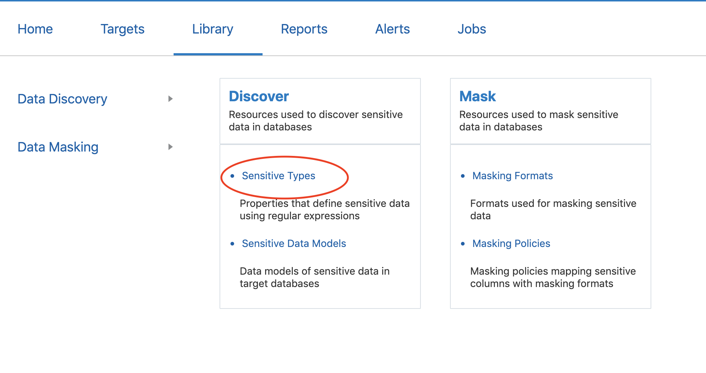

2. Scroll through the list and become familiar with the different sensitive types available. The list contains predefined sensitive types only.

	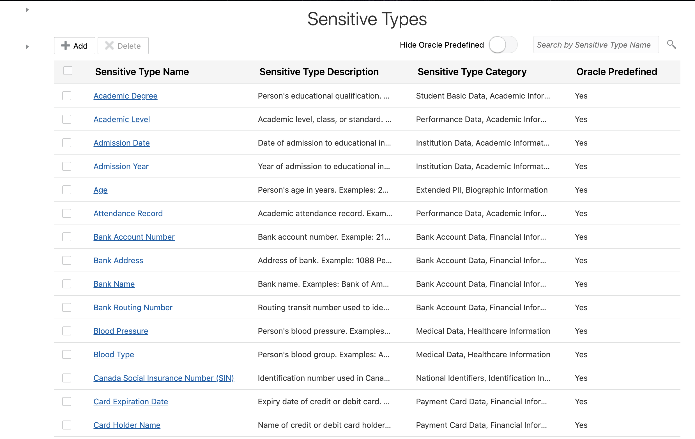

3. Move the **Hide Oracle Predefined** slider to the right. The list removes the Oracle defined sensitive types, showing only the ones that you have defined. Move the slider back to the left.

	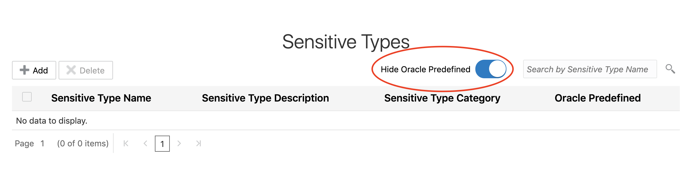

4. To view the definition for a sensitive type, click directly on any one of the sensitive types. The **Sensitive Type Details** dialog box is displayed.

	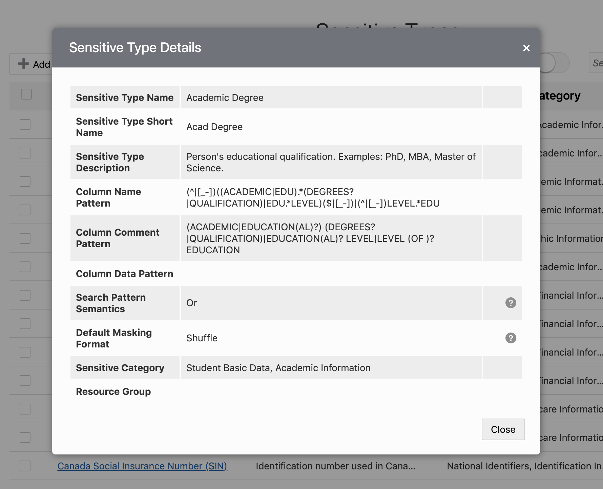

	**NOTE:** Here you can view the sensitive type's short name, description, column name pattern (regular expression), column comment pattern (regular 	expression), column data pattern (regular expression), the search pattern semantic (And or Or), the default masking format associated with the sensitive 	type, and the sensitive category and resource group to which the sensitive type belongs.

5. Click **Close** to close the dialog box.

6. To check if there is a sensitive type that discovers department IDs, in the search field, enter **Department**. The search finds **Department Name**, but nothing for department IDs.

	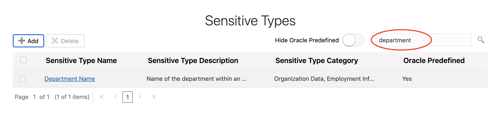

7. Clear the search field, and then press **Enter** to restore the list.

8. Keep this page open because you return to it later in the lab.

9. Open SQL Developer.

10. Run the following script:

	```
	<copy> SELECT * FROM HCM1.DEPARTMENTS; </copy>
	```

11. Notice that the department ID values are 10, 20, 30, up to 270.

	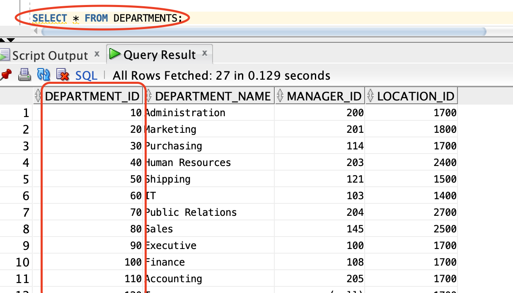

	**NOTE** We want to be able to see and retrieve these records from the Departments table in SQL to analyze it further.

12. Return to the **Sensitive Types** page in the Oracle Data Safe Console. Click **Add**.

13. The **Create Sensitive Type** dialog box is displayed. - From the **Create Like** drop-down list, select **Employee ID Number**.

    **NOTE:** It will autofill to a different Sensitive Type, so adjust accordingly.

	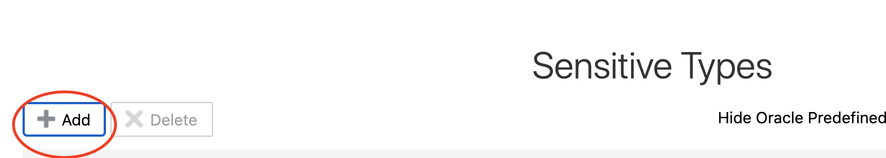

14. In the **Sensitive Type Name** field, enter **Custom Department ID Number**.

15. In the **Sensitive Type Short Name** field, enter **Custom Dept ID**.

	**Tip**: It is helpful to use a word like "Custom" when naming your own sensitive types to make them easier to search for and identify.

16. In the **Sensitive Type Description** field, enter  "Identification number assigned to departments. Examples: 10, 20, 30…1000."

17. In the **Column Name Pattern** field, enter:

	```
	<copy> (^|[_-])(DEPT?|DEPARTMENT).?(ID|NO$|NUM|NBR) </copy>
	```

18. In the **Column Comment Pattern** field, enter:

	```
	<copy> (DEPT?|DEPARTMENT).?(ID|NO |NUM|NBR) </copy>
	```

19. In the **Column Data Pattern** field, enter:

	```
	<copy> ^[0-9]{2,4}$ </copy>
	```

20. For **Search Pattern Semantic**, select **And**.

21. In the **Default Masking Format** field, enter **Identification Number**.

22. In the **Sensitive Category** field, enter **Sensitive Category**. If you do not specify a sensitive category, the category is automatically named 		"Uncategorized."

23. Select your resource group.

24. Click **Save**.

25. Your sensitive type is now included in the list and is available in the Data Discovery wizard.

	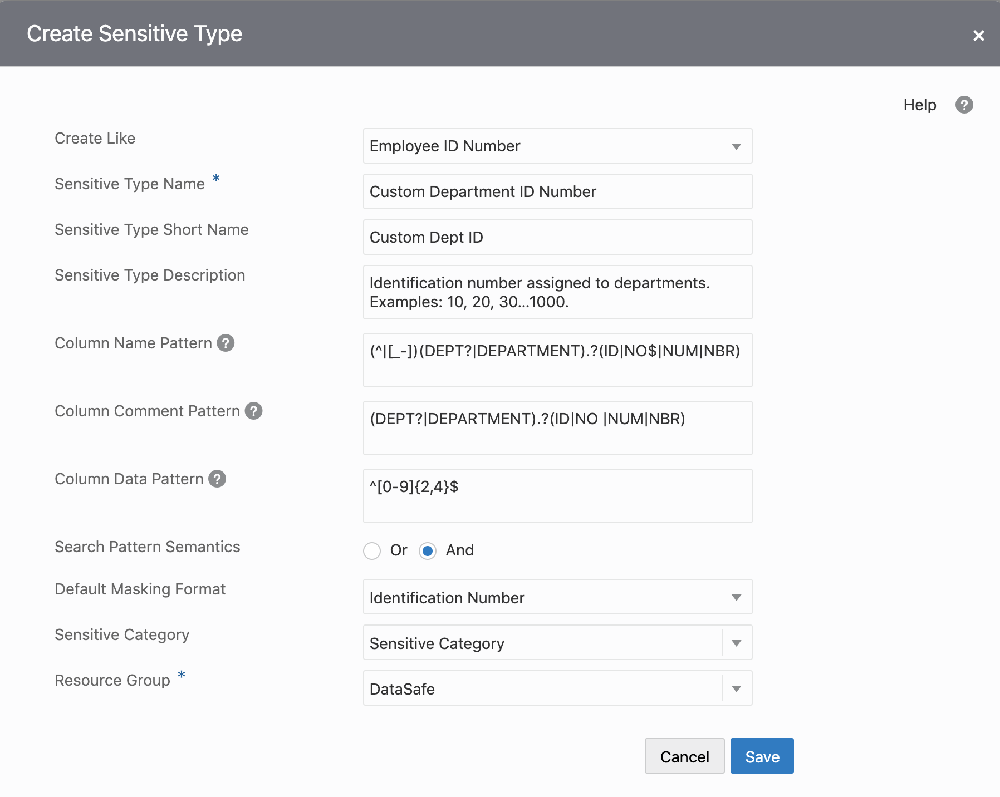

26. Move the **Hide Oracle Predefined** slider to the right to view your custom sensitive type in the list.


## Task 9: Mask Sensitive Data with Oracle Data Safe

1. Open SQL Developer and login as **HCM1** user.

2. Run the following script:

	```
	<copy> SELECT * FROM SUPPLEMENTAL_DATA; </copy>
	```

3. Notice that you are seeing Payment Account Number, this sensitive data was discovered in **Data Discovery**. View the Account number for TAXPAYER_ID 173-14-3494.

	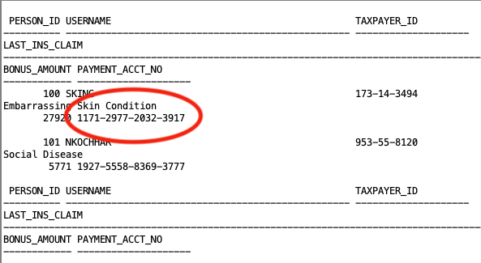

4. Open up Data Safe Console, click **HOME** then click **Data Discovery**.

	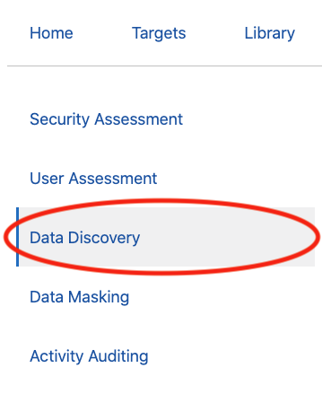

5. Select Target and click **Continue**.

	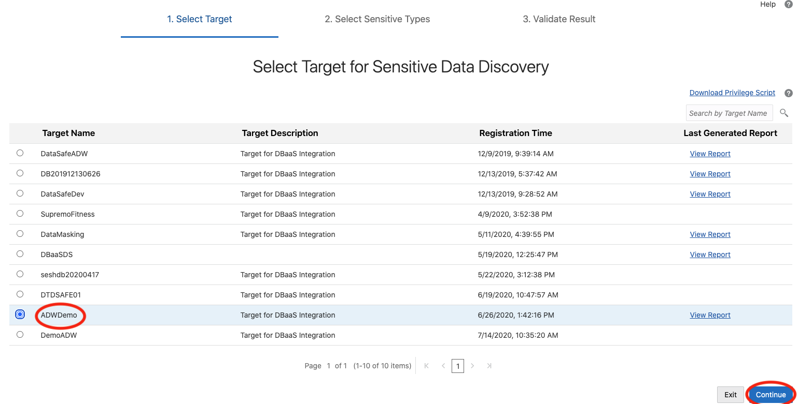

6. Data Discovery is required to be done before Data Masking. Select **Pick from Library** and click **Continue**.

	

7. Select **SDM1**, keep **Update the SDM with the target** as selected and click **Continue**.

	

8. Click **Continue** after sensitive data discovery is complete.

	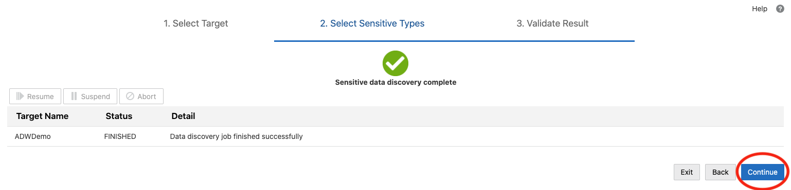

9. Click **Report**.

	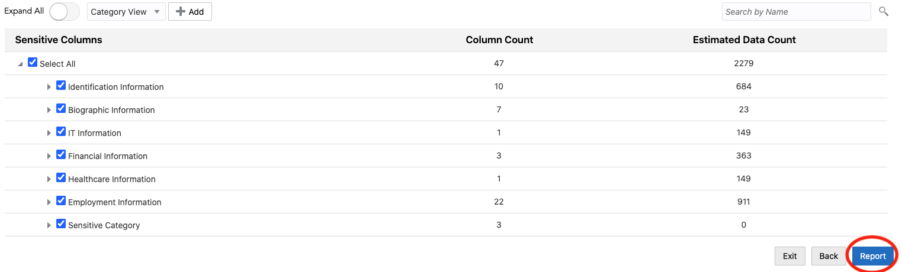

10. Click **Continue to mask the data**

	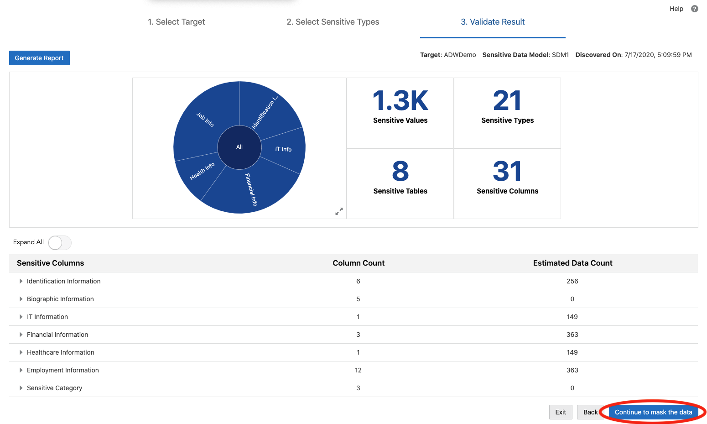

11. Select a target for Data Masking and click **Continue**.

12. Click **Select All** to deselect all columns. Only select **Financial Information** as the Payment Account Number falls under that category. Click **Confirm Policy**.

	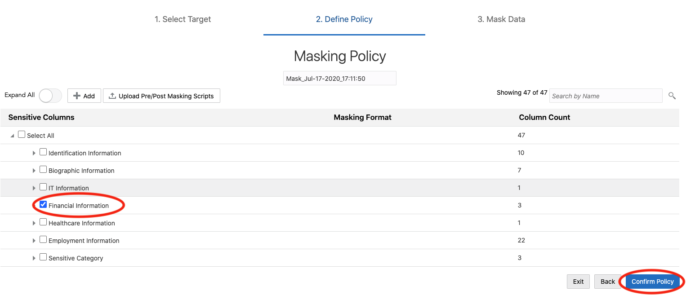

13. Schedule the Masking Job for **Right Now** and click **Review**.

	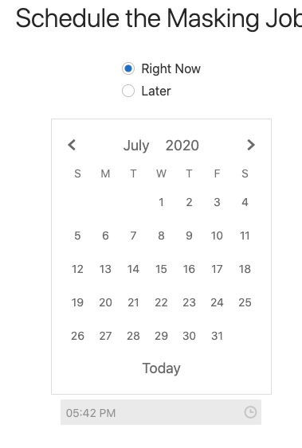

	**NOTE** Make sure this is not done on a production database.

14. Click **Submit** and wait for the masking job to be finished.

	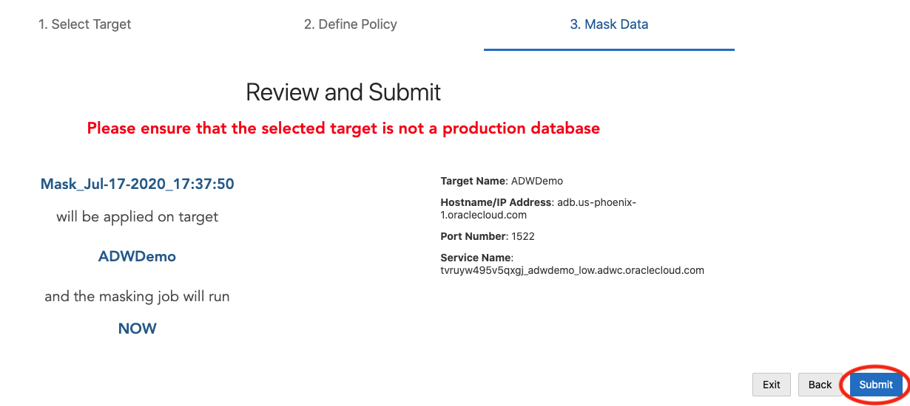

15. Click **Report** to view your successful Masking Job.

16. Click **Expand All** to see all the values that have been masked.

	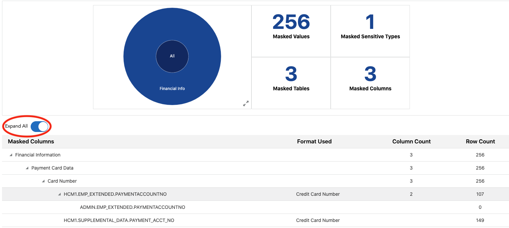

17. **NOTE:** Run the following script in SQL developer if you face an error saying "Oracle Data Safe service account on your Autonomous Database does not have sufficient privileges. Grant DS$DATA\_MASKING\_ROLE by running the GRANT\_ROLE procedure in DS\_TARGET_UTIL PL/SQL package"

	```
	<copy> EXECUTE DS_TARGET_UTIL.GRANT_ROLE('DS$DATA_MASKING_ROLE'); </copy>
	```

18. Open SQL Developer and run the following script:

	```
	<copy> SELECT * FROM SUPPLEMENTAL_DATA; </copy>
	```

	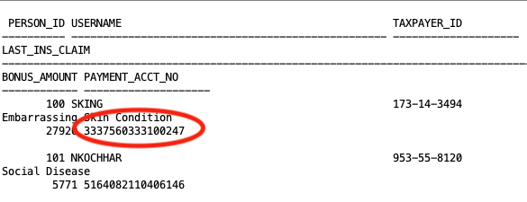

19. Notice that the **Payment Account Number** has been changed to a randomized credit card number for the TAXPAYER_ID 173-14-3494.

20. Click **Library** and select **Masking Formats** and view the different masking formats.

	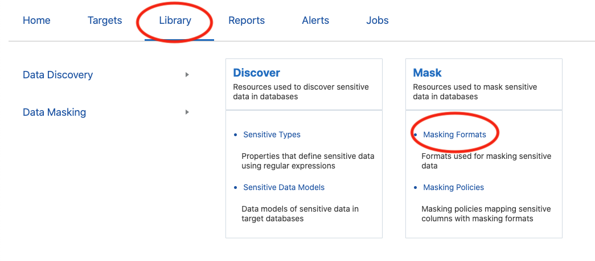

21. View **Credit Card Number** and **Credit Card Number (Hyphenated)** by clicking on them.

	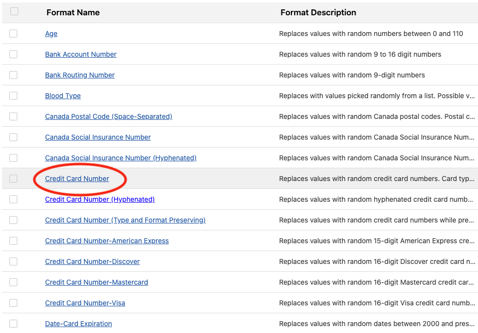

	**NOTE** By default Data Safe selected Credit Card Number and replaced the value by that masking format. This masking can be done once more to select **Credit Card Number (Hyphenated)** to follow the same format as the previous Credit Card value.

	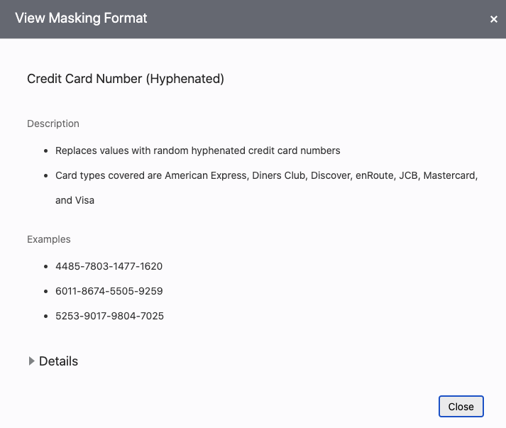


You may proceed to the next lab.


## Summary

In this lab, you registered your Autonomous Database to your Data Safe instance. You were able to assess database configurations, assess users, discover sensitive data and update sensitive data model.

## Learn More

Click this link learn more about Enabling Data Safe in a region: [Enable Data Safe](https://docs.oracle.com/en/cloud/paas/data-safe/udscs/enable-oracle-data-safe.html#GUID-409260CE-2D7B-4029-B7CA-2EDD6E961CEB)

To learn more about Oracle Autonomous Data Warehouse (ADW), feel free to watch the following video by clicking on this link: [ADW - How it Works](https://www.youtube.com/watch?v=f4BurlkdEQM)

To learn more about Oracle Application Express (Data Safe), feel free to explore the capabilities by clicking on this link: [Data Safe](https://docs.cloud.oracle.com/en-us/iaas/data-safe/index.html)

## Acknowledgements

Author - NA Cloud Engineering - Austin (Khader Mohiuddin, Rabia Gunonu, Shadi Ojelade, Jess Rein, Philip Pavlov)
Last Updated By/Date - Jess Rein, Cloud Engineer, September 2020
See an issue? Please open up a request here. Please include the workshop name and lab in your request. Please include the workshop name and lab in your request.


