#  Using Oracle Cloud Infrastructure Data Science Platform for Fraud Prediction

## Introduction

Oracle Cloud Infrastructure (OCI) Data Science platform allows you to leverage deep data science expertise and libraries. In this lab, you will learn how to set it up for machine learning needs such as fraud prediction in a comprehensive cloud ecosystem with an integrated database and function model deployment.

Estimated Lab Time: 20 minutes.

### Objectives

-   Learn how to set-up an Oracle Cloud Infrastructure (OCI) Data Science platform instance and associated network resources
-   Learn how to use notebooks for machine learning purposes such as fraud detection and prediction
-   Learn the differences between data science open source libraries and Oracle Accelerated Data Science (ADS) AutoML
-   Learn about how to use the Model Catalog as a place to store your models and utilize them
-   Learn how to call a OCI Data Science model through Oracle Functions

### Prerequisites

-   The following lab requires an Oracle Public Cloud account. You may use your own cloud account, a cloud account that you obtained through a trial, or a training account whose details were given to you by an Oracle instructor.
-   A tenancy with user privilege role access to OCI Data Science and associated resources such as VCNs (Virtual Cloud Networks) and Compute instances.

## Task 1: Create the necessary networking components

1. Click the **Navigation Menu** in the upper left, navigate to **Networking**, and select **Virtual Cloud Networks**.

	

2. Make sure you are in the desired compartment of choice to create resources (such as **CloudDataWorkshop**) and proceed by selecting the **Start VCN Wizard** option.

    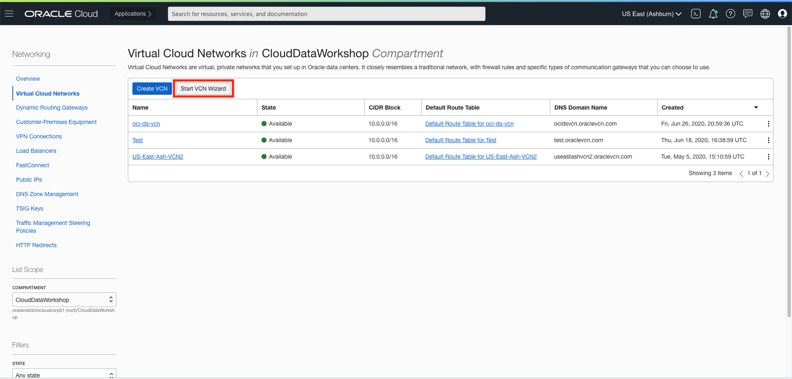

3. Then, choose the **VCN with Internet Connectivity** selection in the wizard and then click on **Start VCN Wizard**.

    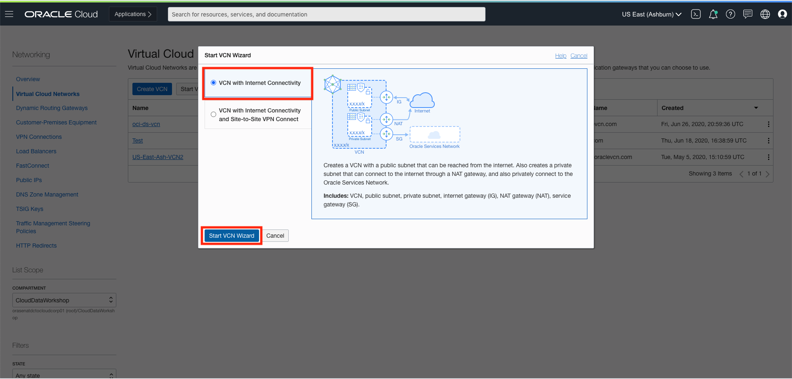

4. Name your **VCN Name** with something like **YourInitials_vnc** and keep all the default settings intact. Then, click on **Next**.

    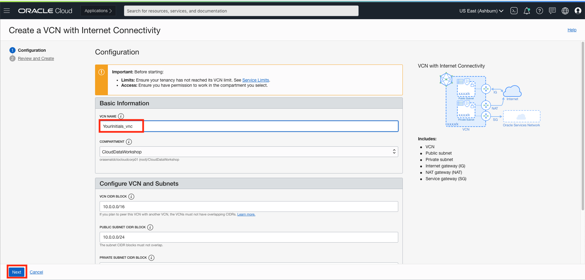

5. The next screen shows a summary of what will be done. Click the **Create** button, and all of these networking components will be created. In just a few moments, an entire Cloud networking infrastructure will be setup for use. Now you are done with creating the necessary networking components.

## Task 2: Create a Data Science Platform Project and Notebook Session

1. Inside of the OCI Console, click on the top left menu **hamburger icon**. Then, in the side menu, navigate to **Data Science**, then select **Projects**.  

    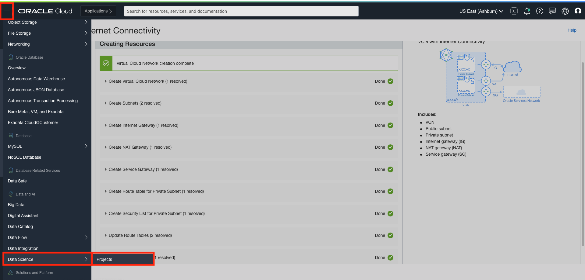

2. Let's create a project by clicking on **Create Project**.

    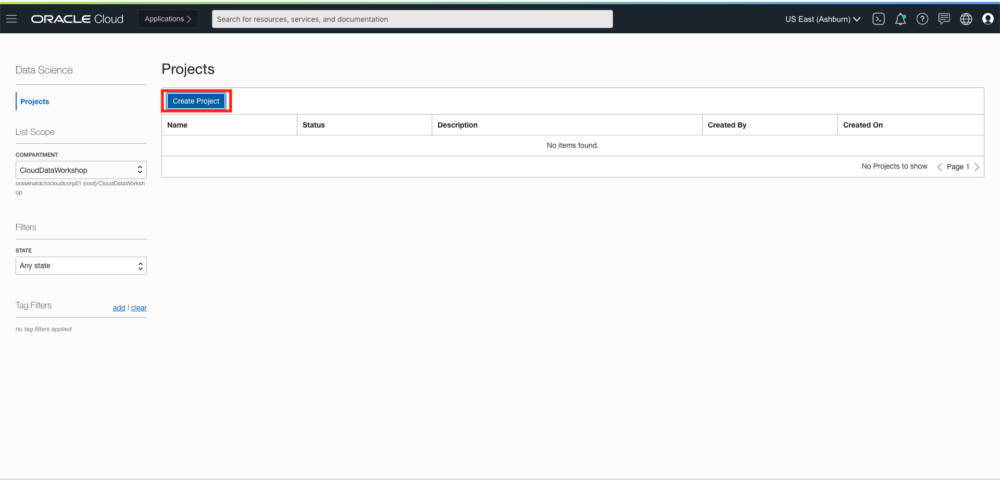

3. Confirm that the compartment is the one you would like to use and input a name for your project such as **YourInitials_project**. Then click on **Create**.

    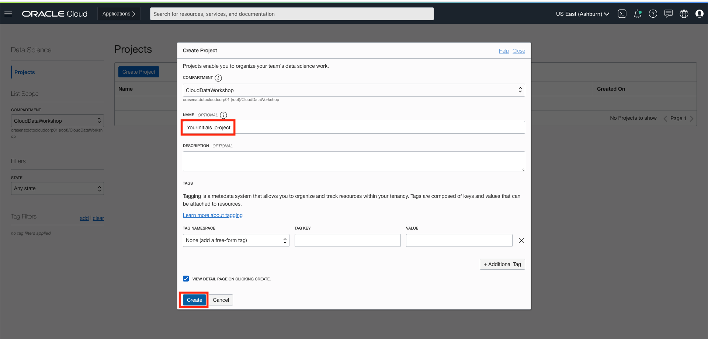

4. Your project is now created! Now, we have a space for any Data Science platform related work. Let's create a notebook session by clicking on **Create Notebook Session**.

    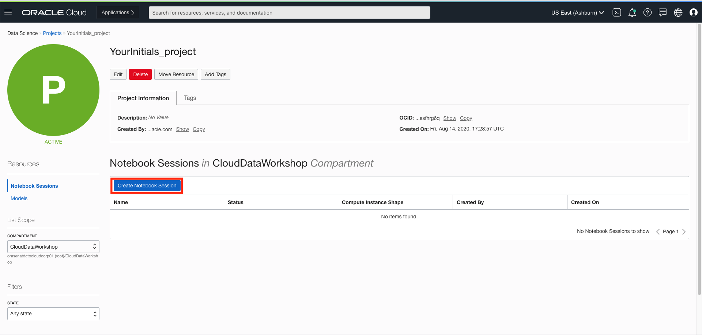

5. Name the notebook session **YourInitials_ns**. Keep the **Compute Instance Shape** as the default, **VM.Standard.E2.2**. For **Block Storage Size (in GB)**, input **50** for a size of 50 GB. For the **VCN**, select the one created in the previous step and keep the default private subnet (it should include your newly created VCN name in it's name).

    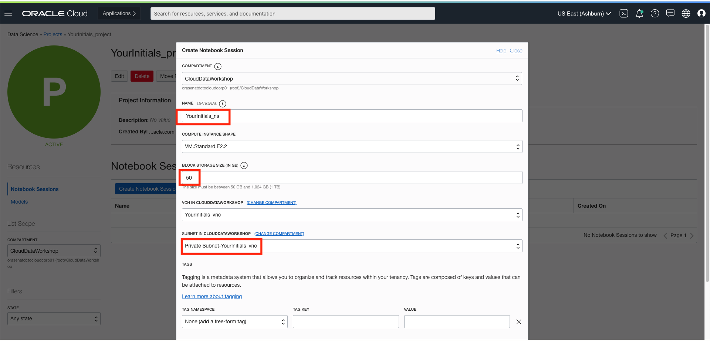

6. Finalize by scrolling down and clicking on **Create**.

    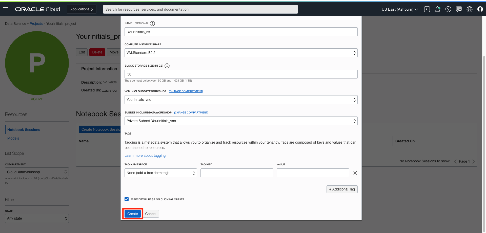

7. Now you have successfully created a Data Science platform project and notebook session, which is integrated with your VCN and Compute instance for all the networking and computation needs of your data science work.

## Task 3: Navigate to the OCI Data Science Notebook Session Interface

1. After a few moments, the **notebook session** should be created. You may have to wait a few minutes and refresh the page to see it. To access it, click on **Open**.

    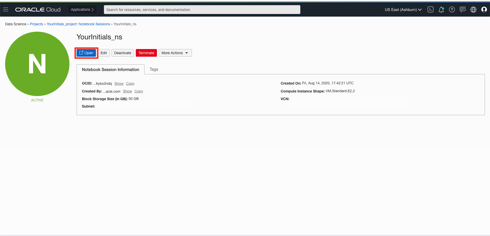

2. You are now inside the notebook session and can see a file directory hierarchy on the left with some pre-included notebooks that you can explore. On the right window, you can select different options to start up in your notebook session such as a terminal or a python notebook.

    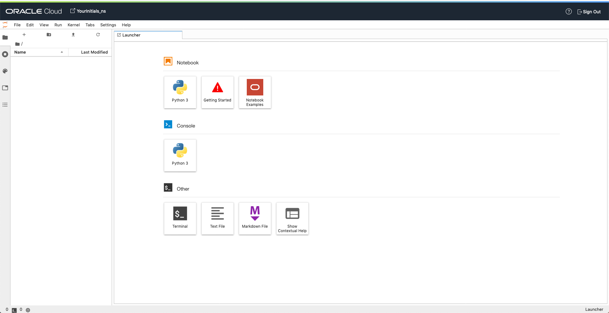

3. Let's import a notebook to see the capabilities of the platform. Download the sample notebook by clicking on this link: [sampleNotebook]( https://objectstorage.us-ashburn-1.oraclecloud.com/p/sAL1iD_tUFyG50EJoqrjJuBhgwFKggXiPNF6z0FcrEN41Tj8gkeGCNGEC9zNtOsQ/n/c4u04/b/livelabsfiles/o/austindatamanagement/sampleNotebook.ipynb)

4. Now, let's download the datasets for this project- there are 3 you will download. For the first, download by clicking on this link: [sampleDataset](https://objectstorage.us-ashburn-1.oraclecloud.com/p/sAL1iD_tUFyG50EJoqrjJuBhgwFKggXiPNF6z0FcrEN41Tj8gkeGCNGEC9zNtOsQ/n/c4u04/b/livelabsfiles/o/austindatamanagement/sampleDataset.csv). For the second, download by clicking on this link: [trainDataset](https://objectstorage.us-ashburn-1.oraclecloud.com/p/-I4yLdDr2RQnrYGh1zU8-_9YcvOi5o-eY29byXkFQlydOBJdfuDlbbbZ5OrzvBm0/n/c4u04/b/austindatamanagement/o/trainDataset.csv). For the third and final dataset, download by clicking on this link: [testDataset](https://objectstorage.us-ashburn-1.oraclecloud.com/p/sAL1iD_tUFyG50EJoqrjJuBhgwFKggXiPNF6z0FcrEN41Tj8gkeGCNGEC9zNtOsQ/n/c4u04/b/livelabsfiles/o/austindatamanagement/testDataset.csv)

5. Then, start by clicking on the **^ icon** to **Upload Files** in the OCI Data Science notebook session interface. Then, select the datasets from the previous step to import it. It may take a minute for them to completely upload the dataset, but it will continue the upload process in the background. You may still continue to the next step.

    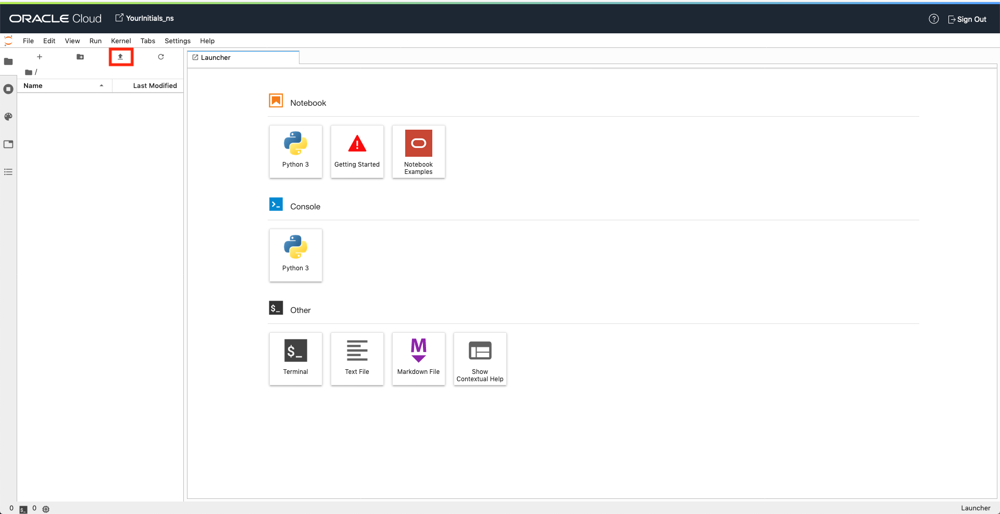

6. Then, click on the **^ icon** again to **Upload Files** in the OCI Data Science notebook session interface. Then, select the notebook downloaded from the previous step to import.

7. Open the notebook by double clicking on its name in the left pane.

    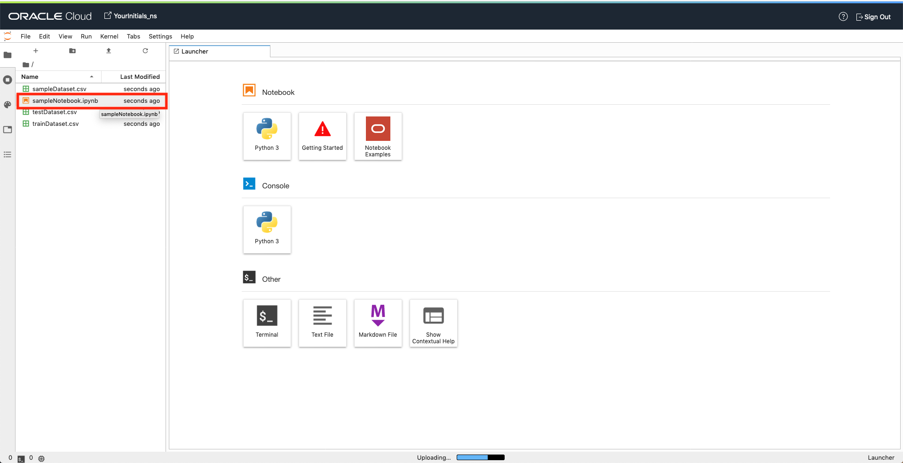

8. Take a moment to look through the different sections of the notebook. You will find all the typical steps of a machine learning pipeline in place. Additionally note that there are multiple approaches showcased in the notebook. For one, you can see a standard open source data science approach and how that can be done in the platform. Additionally, in OCI DataScience, you have access to Oracle's Accelerated Data Science (ADS) library, giving you access to AutoML capabilities to help greatly accelerate your machine learning and data science work. With ADS, you can use a few lines of code to create multiple models from many different algorithms, parameters, and data set slices. This would typically require extensive programming knowledge and many more lines of code with standard open source libraries. Feel free to take a look at the differences between the open source approach in the sample notebook and the Oracle ADS AutoML approach.

    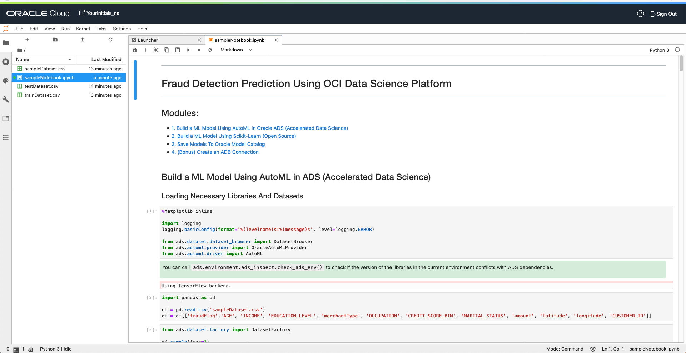

9. Feel free to run the notebook and see the machine learning algorithms run right before your eyes. To do that, navigate to the top menu bar, click on **Run** and then click on **Run All Cells**. Again, note the runtime for the open source libraries approach and for the Oracle ADS AutoML library approach.

    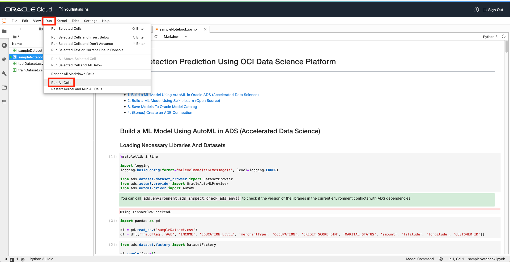

10. Congratulations, you have now ran a notebook which leverages data science and machine learning capabilities to help detect and predict fraud in data that you have now as well as data that you may get in the future!

11. Bonus: if you have an existing Oracle Autonomous Data Warehouse (ADW) or want to spin one up, feel free to check out the bonus module (module 4) in the sample notebook you imported earlier and configure it with your ADW details.

## Task 4: (Bonus) Explore Model Catalog

1. With the model that you created in the previous step inside of the notebook, they can also stored in OCI's Model Catalog. This is a repository for your models which can be accessed in a variety of ways. Let's look at how we can do that by exploring an OCI DS included example notebook. Learn more by clicking on **File** and then on **New Launcher**. Then, click on **Notebook Examples**.

    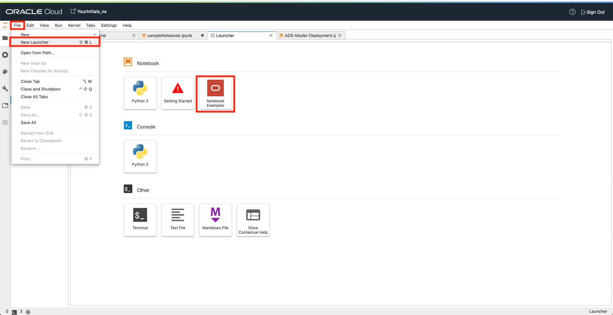

1. Scroll down to then click on **model_catalog.ipynb** and click on **Load Example**.

    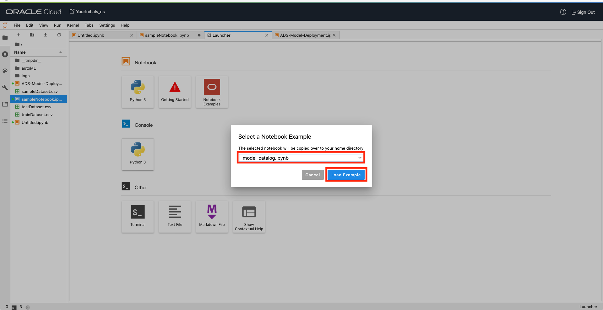

2. In this notebook, you can learn about how to save your models in model catalog for further use. The models that you ran earlier could be stored in a model catalog repository to be available for further use, sharing, or exploring. There are a variety of metrics and metadata that can be seen from a quick glance.

    

## Task 5: (Bonus) Set up Oracle Cloud Shell and Oracle Functions

1. Let's try to deploy our newly created machine learning model using Oracle Functions. This allows us to use a lightweight method, that can be used outside of OCI Data Science, to test payloads for whether or not they are fraud.

2. Download the ADS-Model-Deployment notebook by clicking on this link: [ADS-Model_Deployment.ipynb](https://objectstorage.us-ashburn-1.oraclecloud.com/p/sAL1iD_tUFyG50EJoqrjJuBhgwFKggXiPNF6z0FcrEN41Tj8gkeGCNGEC9zNtOsQ/n/c4u04/b/livelabsfiles/o/austindatamanagement/ADS-Model-Deployment.ipynb). Then, similarly to how you uploaded a file before, begin by clicking on the **^ icon** to **Upload Files** in the OCI Data Science notebook session interface. Then, select the ADS notebook from the previous step to import it.

    

3. Follow the steps outlined to deploy your models through functions.

    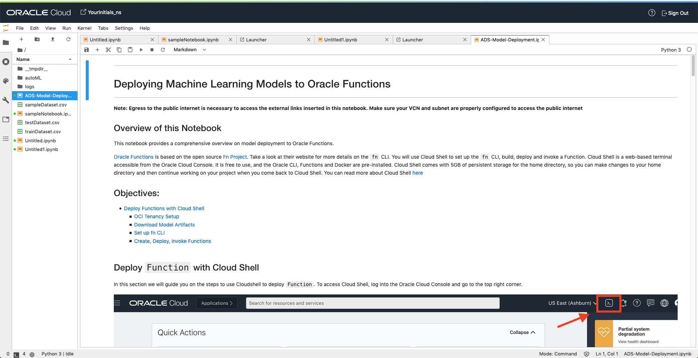

You may proceed to the next lab.

## Summary

In this lab, you learned how to set-up an Oracle Cloud Infrastructure (OCI) Data Science platform instance and associated network resources, how to use notebooks for machine learning purposes such as fraud detection and prediction, better understand the differences between data science open source libraries and Oracle Accelerated Data Science (ADS) AutoML, and how to call a OCI Data Science model through Oracle Functions.

The OCI Data Science platform allows you to leverage the full capabilities of data science, cloud computing, and more in many different use cases such as fraud detection.

## Learn More

To learn more about OCI Data Science, feel free to explore the capabilities by clicking on this link: [Oracle Data Science Documentation](https://docs.cloud.oracle.com/en-us/iaas/data-science/using/data-science.html)

## Acknowledgements

- **Author** - NATD Cloud Engineering - Austin (Khader Mohiuddin, Philip Pavlov, Patrick Guha)
- **Last Updated By/Date** - Jess Rein, Cloud Engineer, September 2020

