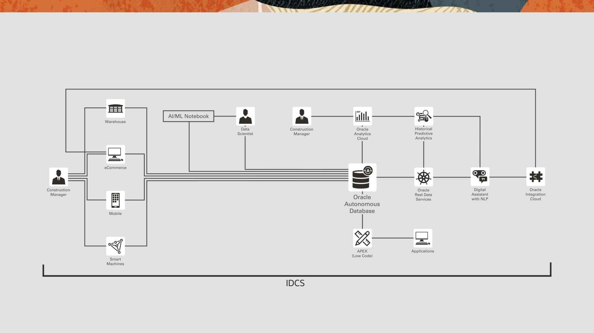

# Oracle’s Cloud Data Platform: Autonomous-Driven & AI-Infused

## Introduction

*Complete AI Portfolio:*
Oracle offers a complete portfolio of products, services, and differentiated capabilities to power your enterprise with artificial intelligence. For business users, Oracle offers ready-to-go AI-powered cloud applications with intelligent features that drive better business outcomes. With Oracle’s ready-to-build AI platform, data scientists and application developers have a full suite of cloud services to build, deploy, and manage AI-powered solutions. With Oracle’s ready-to-work Autonomous Database, machine learning is working behind the scenes to automate security patching, backups, and optimize database query performance, which helps to eliminate human error and repetitive manual tasks so organizations can focus on higher-value activities.

This is the first of several labs that are part of the **Oracle’s Cloud Data Platform
Autonomous-Driven & AI-Infused** workshop. This workshop will walk you through the process of using the Autonomous Data Warehouse for storing analytical datasets and applying Machine Learning models in order to learn the correlation between different attributes and predict the future demand while leveraging Application Express to create a simple application as well as link to a 3rd party web app. These features will also be integrated through the bonus use of a chatbot that you can interact with using natural language.

You will take on 2 Personas during the workshop. The **Data Scientist Persona** will prepare the data for training and validating the machine learning models and apply those models in order to predict the future demand. The **Business Analyst Persona** will also build and apply Machine Learning models using Oracle Analytics Cloud service without writing a single line of code.

This workshop covers Oracle’s portfolio of cloud services related to databases, analytics, machine learning, data science and low-code app development. It’s a complete solution that ties it all together using integration, security, management and monitoring. The solution begins with provisioning an Autonomous Data warehouse (ADW), loading warehouse inventory data and sales/demographic data into it. Delve into the fascinating realm of AI/ML and predict warehouse Inventory based on transactions, customer buying patterns and demographics using ML models developed with Oracle Machine Learning (OML). Build a simple application using Oracle Application Express (APEX). Expose data insights to applications via API’s created using Oracle Restful Data Services (ORDS). Merge multiple datasets and visualize data using Oracle Analytics cloud (OAC). Integrate a Digital Assistant into the solution to consume predictive analysis using Natural Language Processing (NLP). Learn how to use Oracle Cloud Infrastructure Data Science for fraud protection. Secure data using Oracle Data Safe and monitor the entire solution using Oracle Management Cloud (OMC).

Here is an example of that Cloud Data Platform Architecture which can be extended with further Oracle services such as federation through Identity Cloud Service (IDCS) and Oracle Integration Cloud (OIC):

**Note**: This lab is intended to be a comprehensive full cloud showcase. As such, it is assumed a user going through this workshop will be provisioning resources and creating users from scratch. If you decide to use existing infrastructure or resources, be aware and keep note of your namings so resources don't overlap and conflict. 

**Note**: Additionally, as much as possible, do not stray away from the naming conventions used for resources in this workshop. You may run into errors if you do.

Estimated Workshop Time: 3.5 hours

### Objectives
- Provision an Autonomous Data Warehouse (ADW) Instance
- Build an Oracle Application Express (APEX) App
- Create Machine Learning Models within the Autonomous Data Warehouse (ADW) Instance by using the Oracle Machine Learning Tool (OML)
- Visualize Data and Prediction Models in Oracle Analytics Cloud (OAC)
- Integrate a 3rd Party Web App and Oracle Digital Assistant (ODA) Chatbot
- Use OCI Data Science Platform for Fraud Protection
- Use Oracle Data Safe to secure data
- Monitor entire solution using Oracle Management Cloud (OMC)

### Prerequisites
- The following lab requires an Oracle Public Cloud account that will either be supplied by your instructor, or can be obtained through the following steps.
- A cloud tenancy where you have the resources available to provision an ADW instance with 2 OCPUs, an OAC instance with 2 OCPUs, and an ODA instance.
- Oracle Cloud Infrastructure supports the following browsers and versions: Google Chrome 69 or later, Safari 12.1 or later, Firefox 62 or later.

*Note: If you have a **Free Trial** account, when your Free Trial expires your account will be converted to an **Always Free** account. You will not be able to conduct Free Tier workshops unless the Always Free environment is available. **[Click here for the Free Tier FAQ page.](https://www.oracle.com/cloud/free/faq.html)***

## Acknowledgements

- **Author** - NATD Cloud Engineering - Austin Hub (Khader Mohiuddin, Jess Rein, Philip Pavlov, Naresh Sanodariya, Parshwa Shah)
- **Contributors** - LiveLabs QA Team (Jeffrey Malcolm, QA Specialist, Kamryn Vinson, QA Specialist, Arabella Yao, Product Manager Intern)
- **Last Updated By/Date** - Jess Rein, Cloud Engineer, August 2020

