#  Using Oracle Management Cloud (OMC) to Monitor ADW

## Introduction

Oracle Management Cloud (OMC) allows you to gain insight into your IT applications and infrastructure. In this lab, you will learn how to connect to and monitor your Oracle Autonomous Database (ADB) instances such as Oracle Autonomous Warehouse (ADW).

Estimated Lab Time: 20 minutes.

### Objectives

-   Learn how to provision an Oracle Management Cloud Instance
-   Learn how to set up Autonomous Database Monitoring in OMC
-   Learn how to navigate the out-of-the-box dashboards in OMC to gain insight into your databases

### Prerequisites

-   The following lab requires an Oracle Public Cloud account. You may use your own cloud account, a cloud account that you obtained through a trial, or a training account whose details were given to you by an Oracle instructor.

## Task 0: Provision a Management Cloud Instance

1. Inside of the OCI (Oracle Cloud Infrastructure) Console, click on the top left menu icon.

    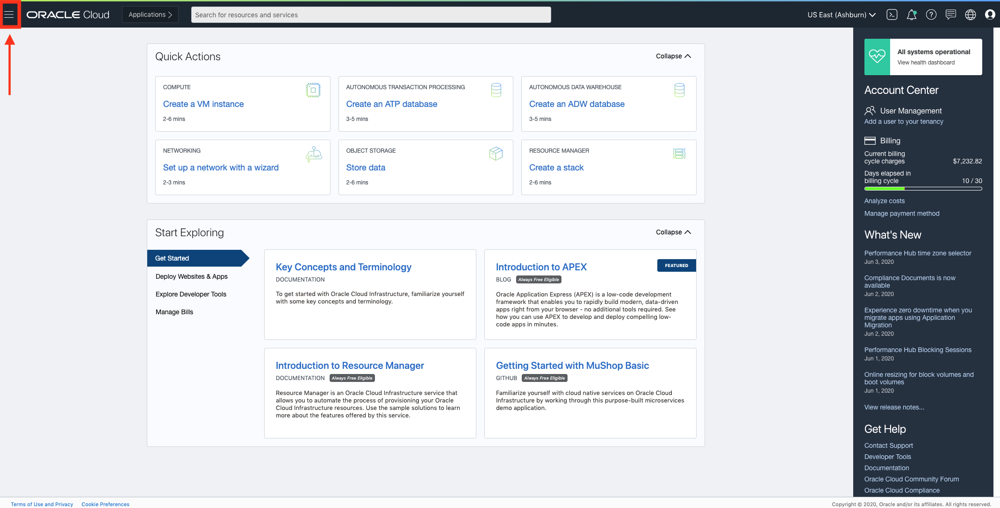

2. In the side menu, navigate to **Platform Services**, then select **Management Cloud**.  Note: It may take a couple of minutes to load this page.

    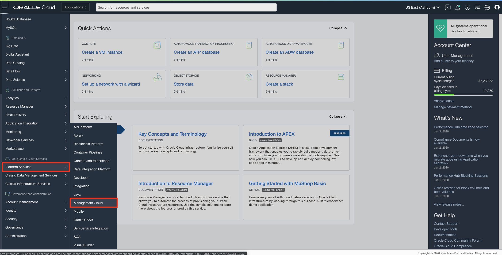

3. Once the Management Cloud Instances page loads, look at the top right of your screen to find the available regions.  **Select** from the drop down the same region in which you have spun up your ADW instance. It is assumed for the purposes of this lab that you already have an ADW instance provisioned. If not, please refer to this workshop's other lab guide on setting up an ADW instance.

    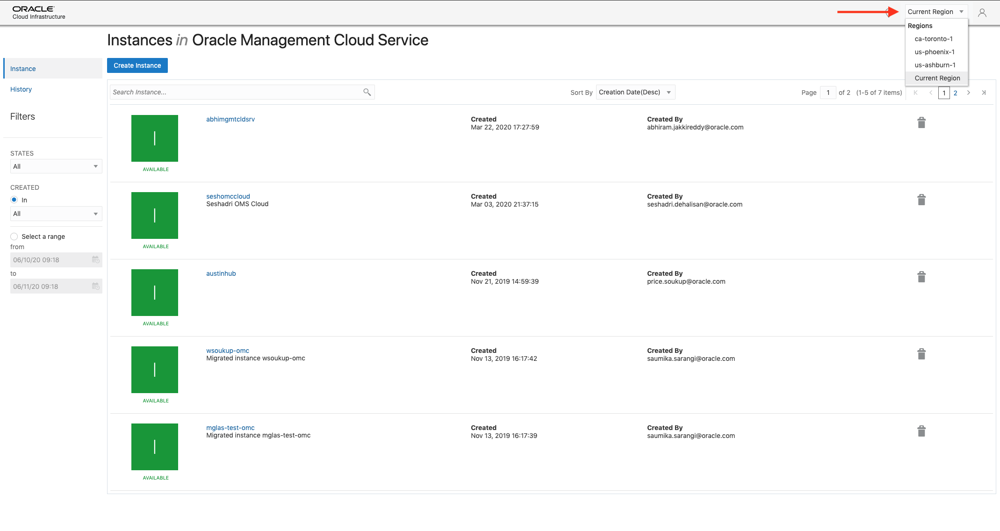

4. Once your region is selected, click on the **Create Instance** button.  Enter the instance information following the format below.  Make sure to include your own personal email to ensure that you have OMC Administrator access to your instance.  Once you have entered all of the necessary information, click **Create**.

    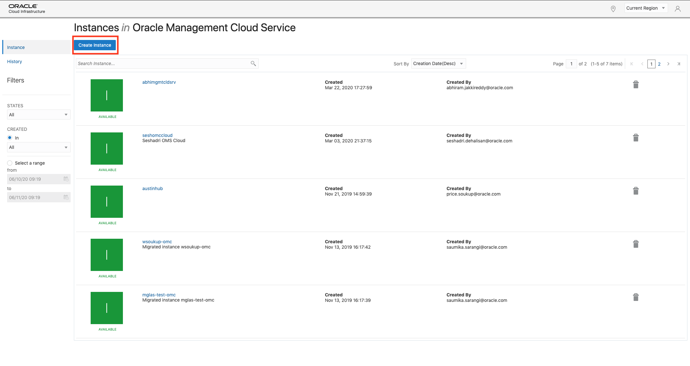

    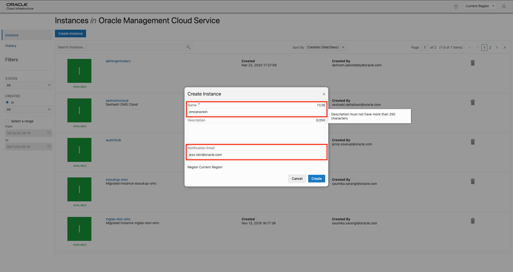

5. You will see that once you click Create, your instance will be in a 'Provisioning' status.  This may take a couple of minutes for the instance to provision.

    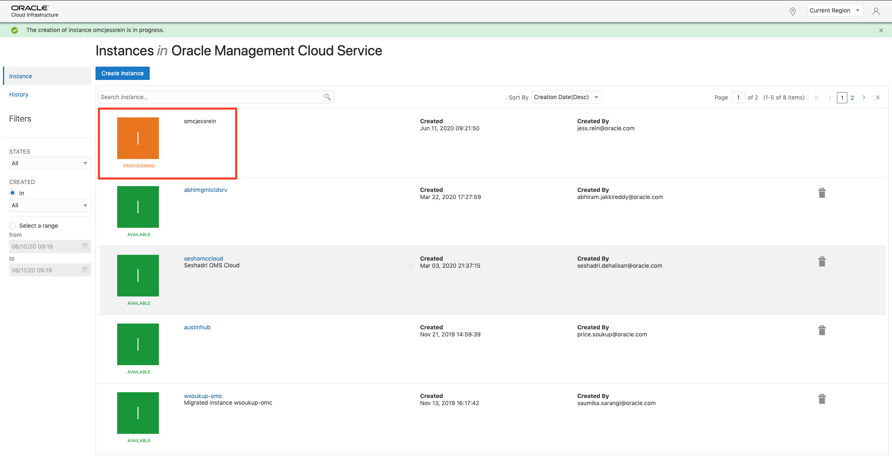

6. Once your instance is fully provisioned and ready for use, you will see your instance in an 'Available' status, as shown below.

    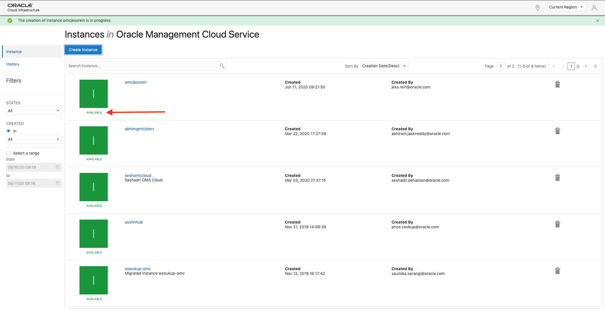

## Task 0: Gather the Following Information Using the OCI Console

1. First you will need to capture your **Tenancy OCID**.  To do so, click on the **profile icon** on the top right of your Oracle Cloud Infrastructure (OCI) console and select your **tenancy name**.

    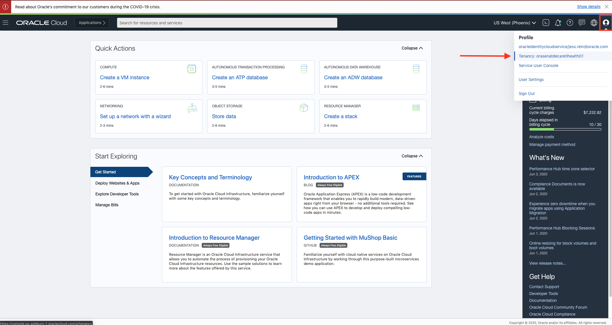

2. Copy the **OCID** from the Tenancy Information section and store it in a note for later use.

    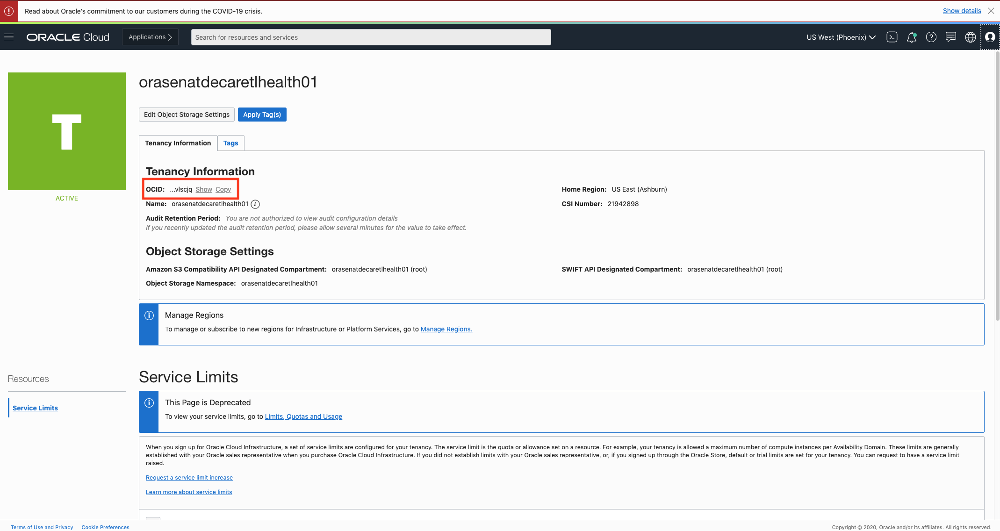

3. Next, you need to capture your **User OCID**.  Again, click on the **profile icon** on the top right of your OCI console, and select **User Settings**.

    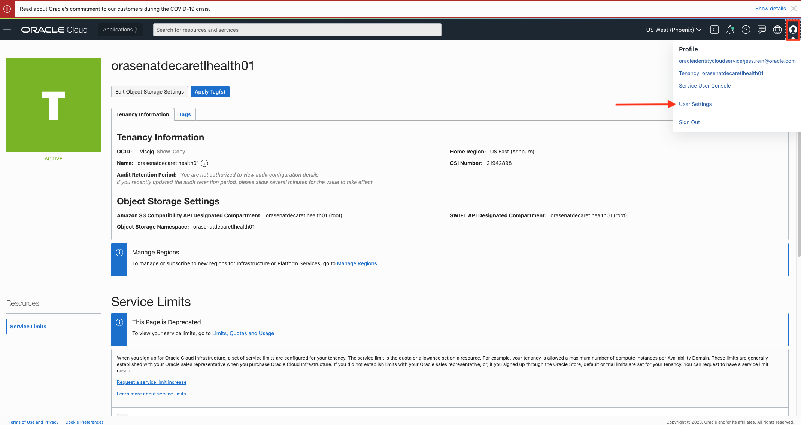

4. Copy the **OCID** from the User Information section and store it in a note for later use.  Note: Be sure to distinguish this OCID from the tenancy OCID in your notes so that you don't get them mixed up later.

    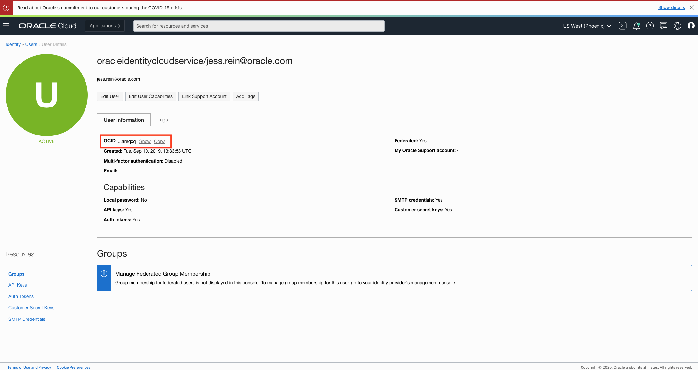

5. Now, you need to get your **API Signing Key**.  If you do not have a User API Key, you can generate one by opening up the Terminal(MacOS) or Command Prompt(Windows) application on your computer.

6. Make sure you have either the Terminal(MacOS) or the Command Prompt(Windows) application open.  First, navigate to whichever directory you would like to store your credentials in.  You can do this using the **cd** command.  Here, I am navigating to a folder named .oci on my Desktop. (**cd .oci**) You can choose whichever folder you'd like.

    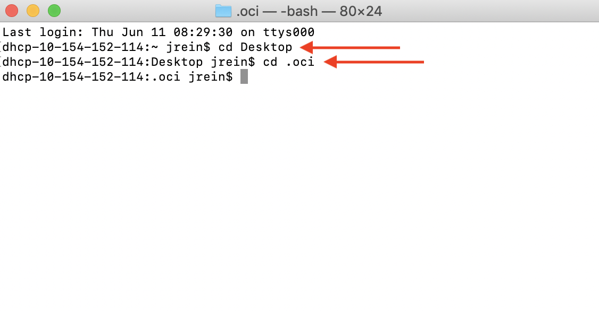

7. Once you are in your desired directory, you will need to run a series of commands.  First, to generate a private key with no passphrase, enter: **openssl genrsa -out oci\_api\_key.pem 2048**.

    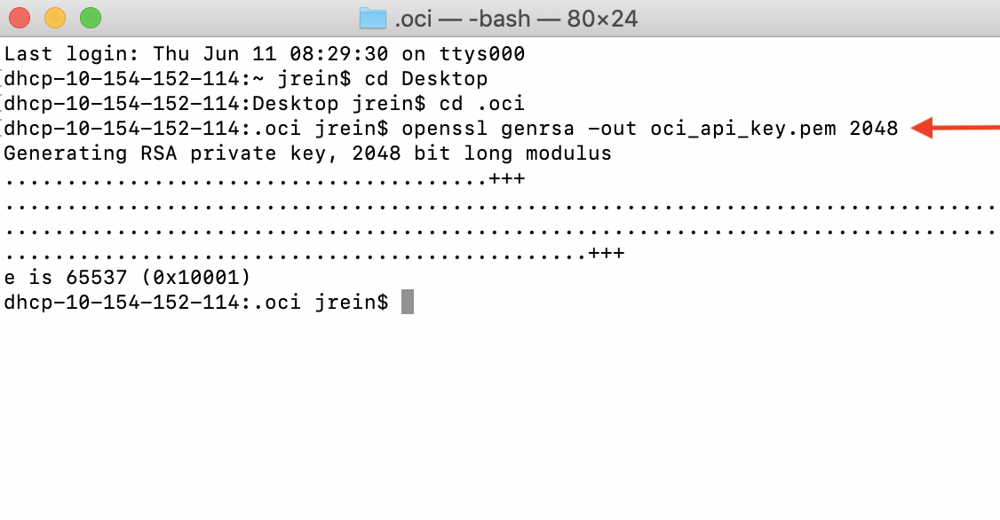

8. Ensure that only you can read the private key by entering: **chmod go-rwx oci\_api\_key.pem**.

    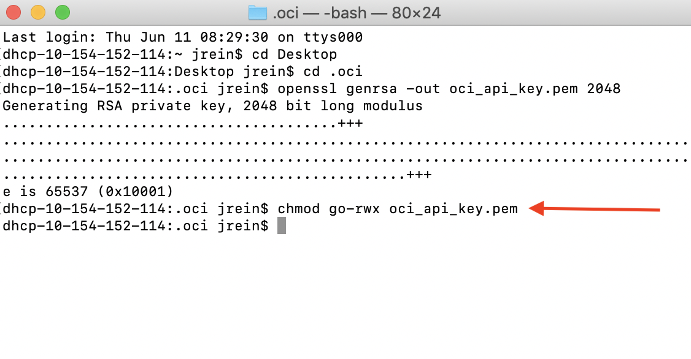

9. Now, generate your public key using the following command: **openssl rsa -pubout -in oci\_api\_key.pem -out oci\_api\_key\_public.pem**.

    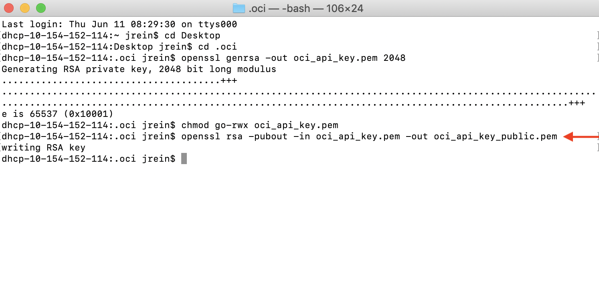

10. Navigate back to your OCI console.  Navigate to your **User Settings**, and select **API Keys**, then click **Add Public Key**.

    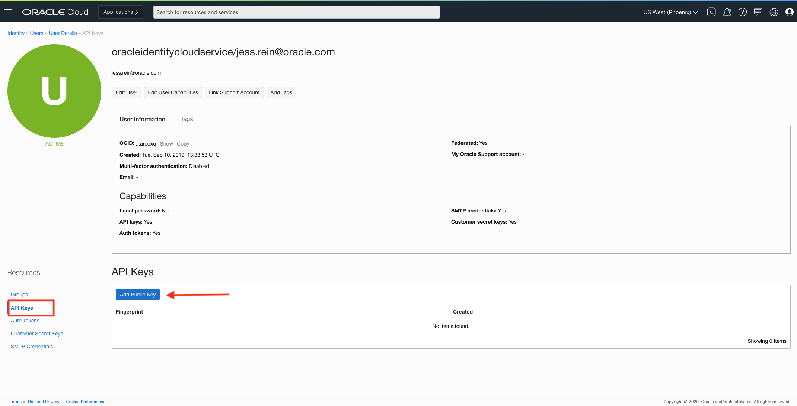

11. Here, upload the public key, **oci\_api\_key\_public.pem**, that you generated from your Terminal or Command Prompt in the previous steps.  Then, click **Add**.

    

12. Now that you have uploaded your public key, you will need to capture your **Fingerprint**.  From the same screen, navigate to **API Keys**, and **copy** the fingerprint that was added to your OCI console when you uploaded your API Key in the previous step.  Paste this in your separate note file to be used later in this lab.

    

## Task 0: Create the Discovery Profile in OMC

1. In the OCI Console, click on the top left menu icon, then navigate to **Platform Services**, then select **Management Cloud**.

    

2. On the Management Cloud Instances page, find your Management Cloud instance that you provisioned in Part 0 of this lab, and **click** on your instance name to open.  Note: If you can't find your instance, make sure you are in the correct region.

    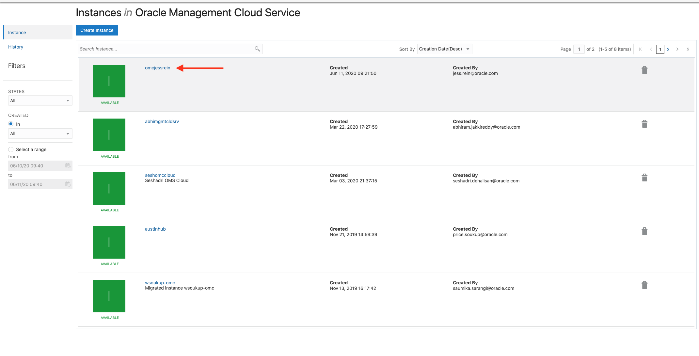

3. Once you are in your instance, you will be brought to the OMC home page.  Navigate to the top left menu icon, and go to **Administration > Discovery > Cloud Discovery Profiles**.

    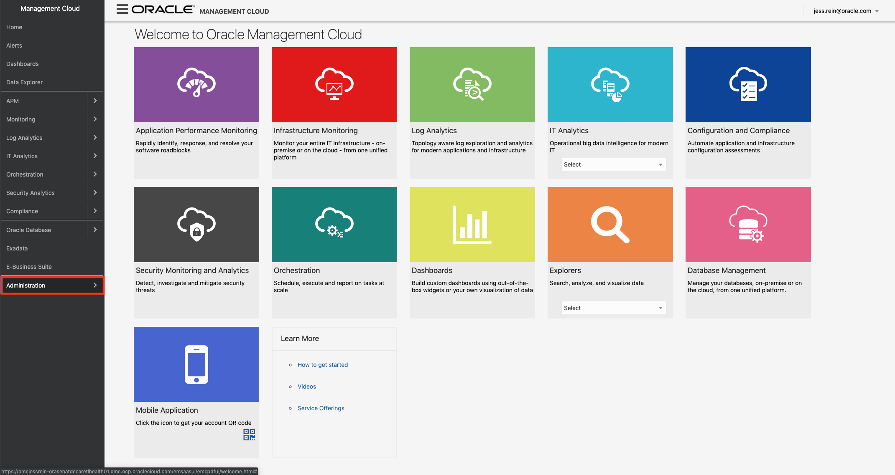

    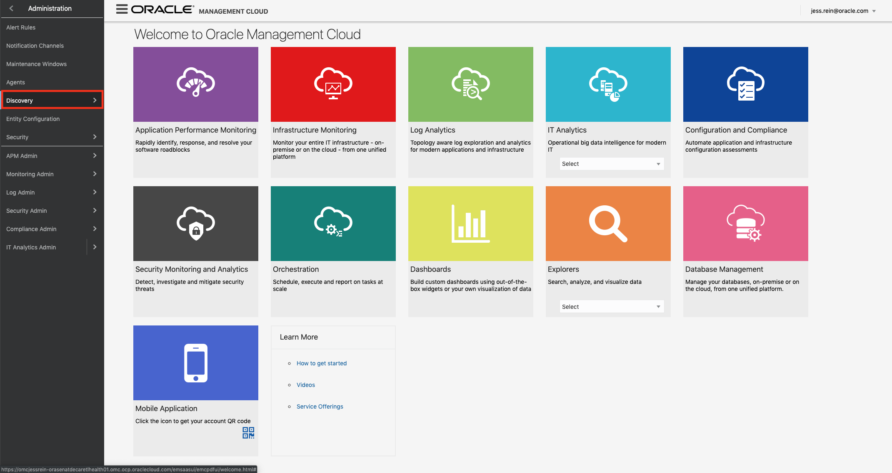

4. On this page, select **+Add Profile** on the top right of the page.

    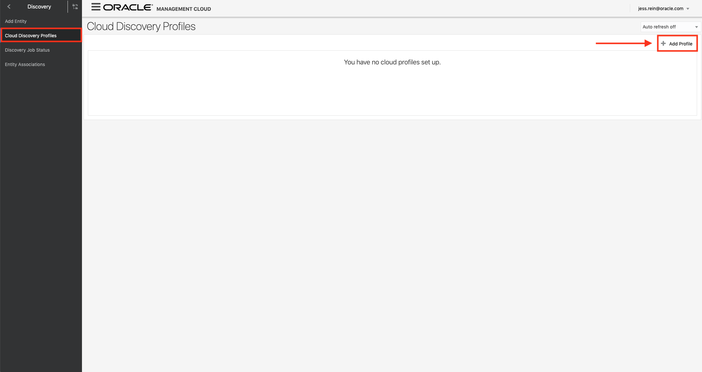

5. To add your profile, type in a profile name.  Here, we are using **adwdiscoveryprofile**.  Next, select **Oracle Cloud Infrastructure** as the Cloud Service Provider from the dropdown.  Under Regions and Services, select the **region** your OMC/ADW instances are in, then select **Autonomous Data Warehouse** under Services.  

6. For the credentials, select **New Credentials**, then enter in the information that you saved in your separate note file, entering your own name as the credential name, as shown below, and leaving the passphrase blank.  Note: For the **Private Key**, you will need to copy your Private API Key that you created in previous steps.  To do this, you can copy it to your clipboard using the following command in your terminal, making sure you're in the directory which contains your API Keys: **cat oci\_api\_key.pem | pbcopy**.  Instead of using terminal, you can also open your private key in TextEdit(MacOS) or Notepad(Windows), and simply copy your private key that way.

7. When you are finished entering in all fields, click **Start Discovery** in the top right corner of the window.

    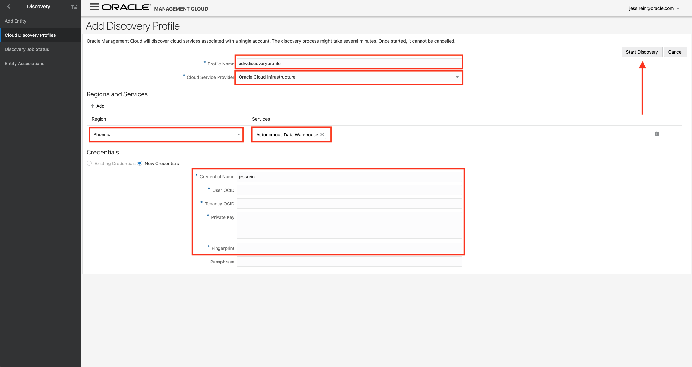

## Task 0: Validate Databases

1. Click on the **Oracle** logo on the top left of your screen to navigate back to OMC's main console.

    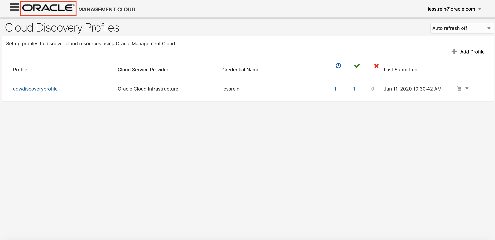

2. Now, on the lefthand side menu, navigate to **Administration > Entity Configuration**.

    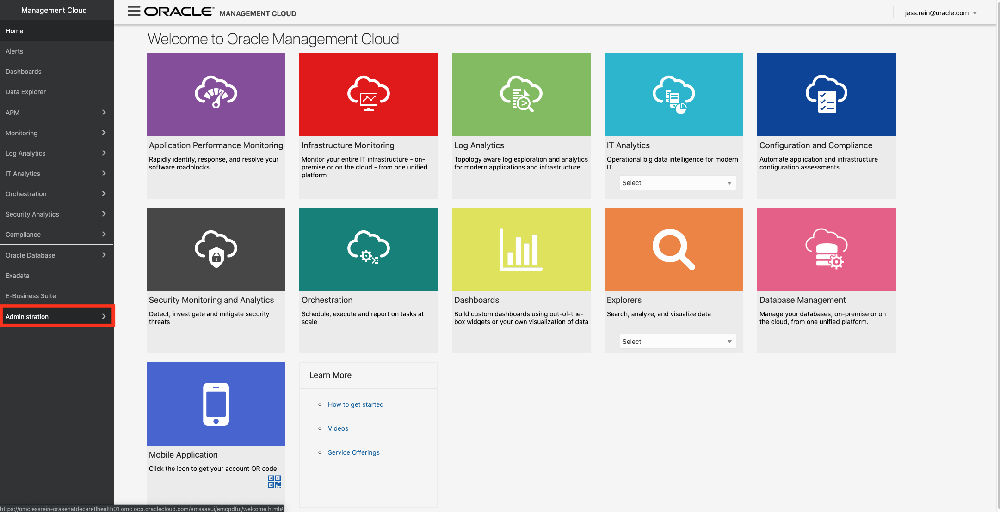

    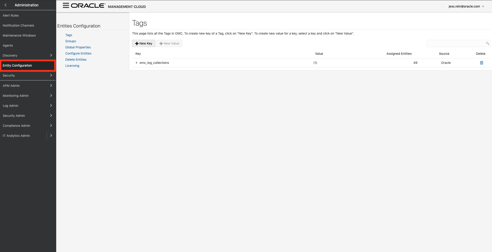

3. On the Entity Configuration page, select **Licensing**, as shown below.

    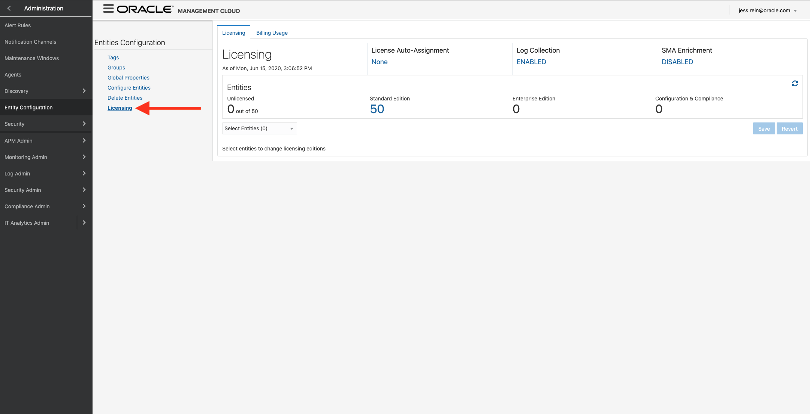

4. On the Licensing page, click on the number beneath **Standard Edition**.  You should be able to see all of the Autonomous Databases in your cloud tenancy.  With the discovery profile, your databases have automatically been licensed within OMC.  When monitoring other entities, you will have to enable the license yourself.

    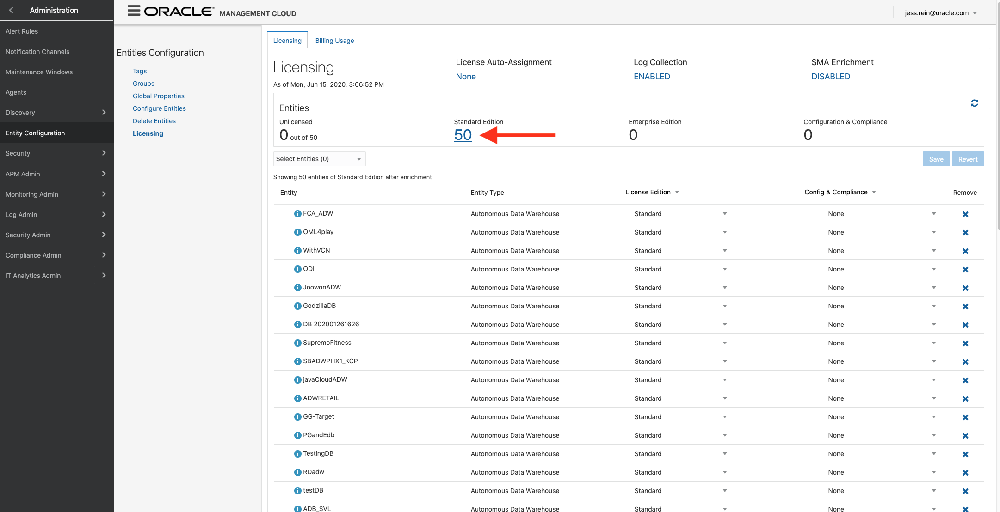

## Task 0: Oracle Database Suite

1. Click on the **Oracle** logo on the top left of your screen to navigate back to OMC's main console.

    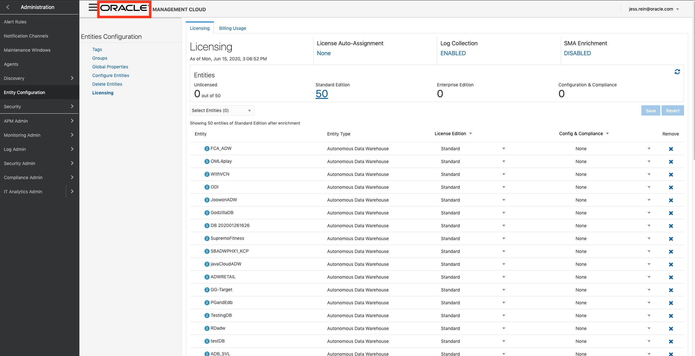

2. Select the pink **Database Management** page to view your full Database Fleet.  

    

    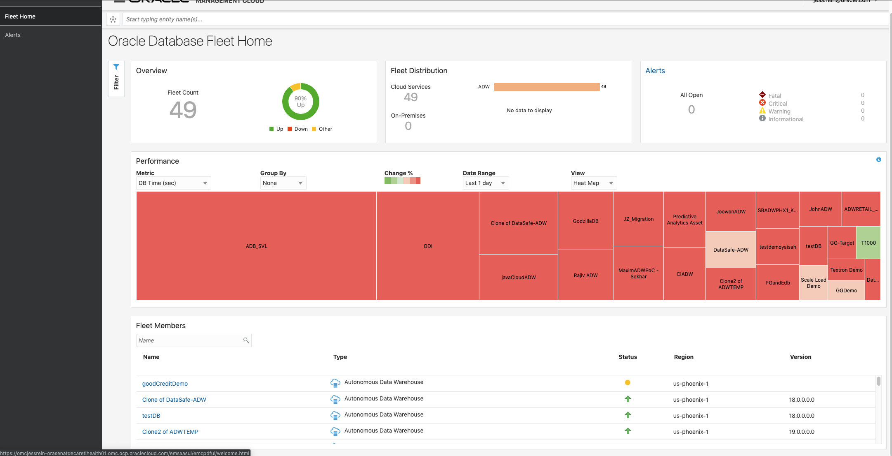

3. Using the global context menu at the top of the page, filter for your ADW by typing in the name of your database and then selecting the entity that matches.  Now, you should see open alerts and important performance statistics relating exclusively to your ADW instance.

    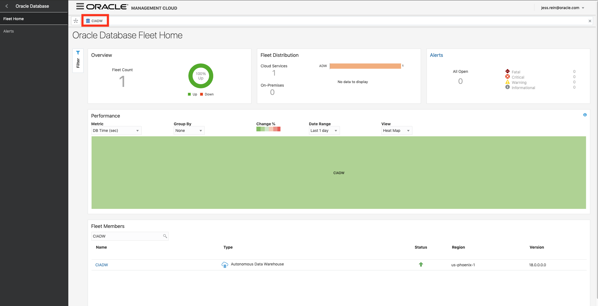

4. Scroll down to the bottom of the page to see **Fleet Members**.  **Click** on the name of your database.  Here is where you can go to get more detailed information (Database Activity, Running SQL statements, etc) to understand on a surface-level what types of activities your database is performing.

    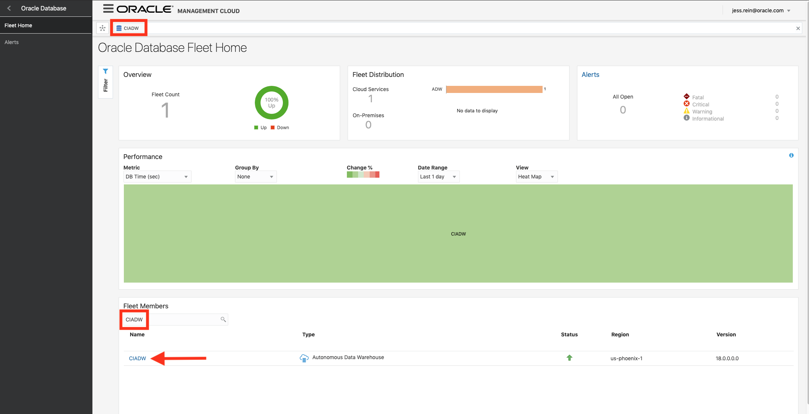

    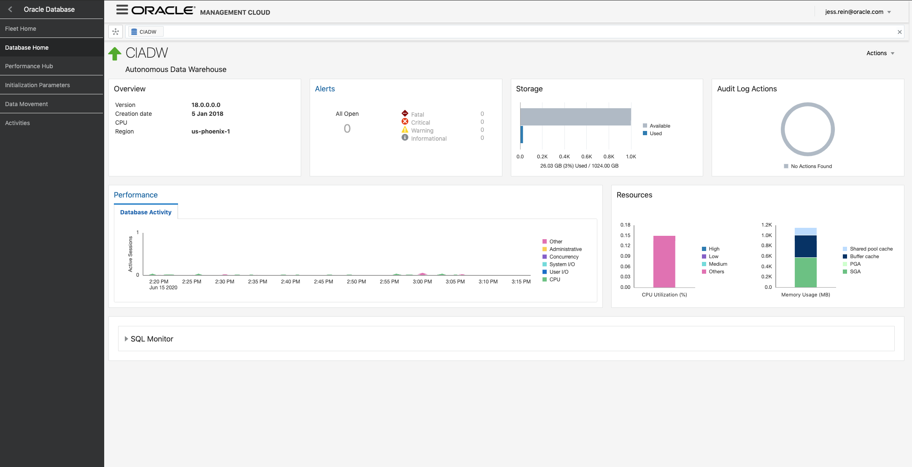

5. Now that you have your database selected, you can navigate to the side menu, and click on **Performance Hub**.  Here you're able to gain some deeper insights on ASH Analytics, SQL Monitoring, and DB Workloads to obtain a more thorough picture of what is happening behind the scenes in your database.  Explore the different visualizations on the page.

    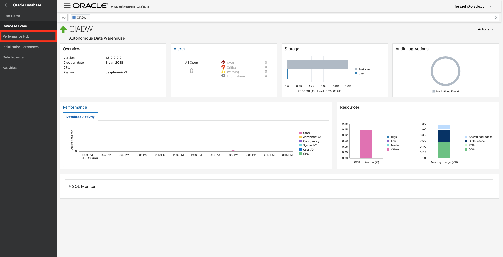

    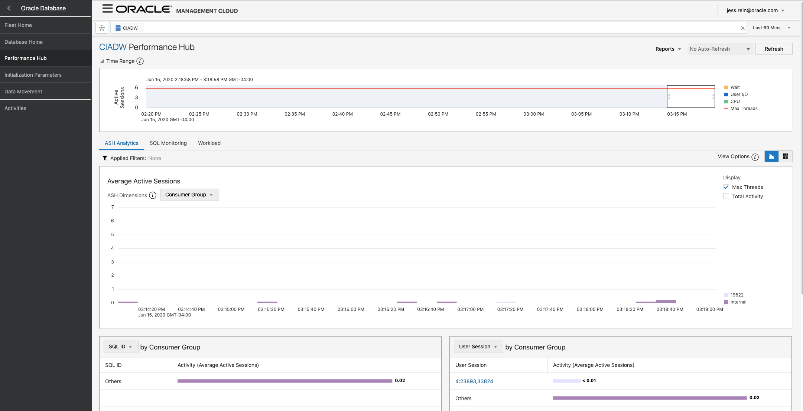

## Task 0: Infrastructure Monitoring

1. On the left navigation menu, click on the **back** button until you can select **Monitoring**.

    

    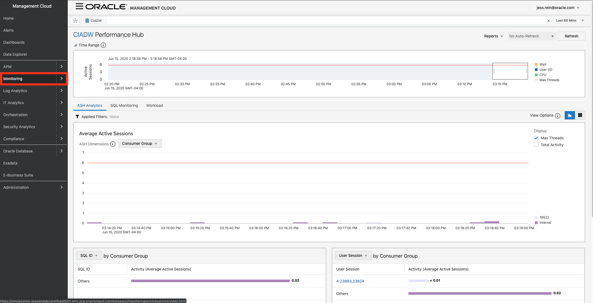

2. Your ADW should still be selected in the global context menu from the previous section.  If it's not, filter for your retail database by typing the database name into the menu bar at the top as you did before.

3. On this **Entities** page, navigate to the second tab **Performance Charts**.  You'll be able to see different metrics over a period of time and understand how your database resources are being utilized.  To change the amount of time you're viewing, use the time context in the top right corner.

    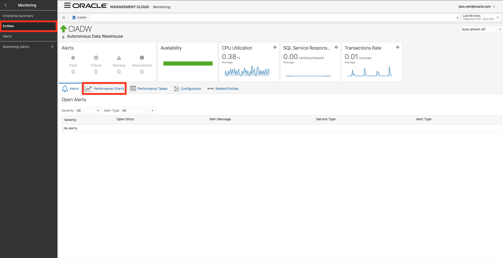

    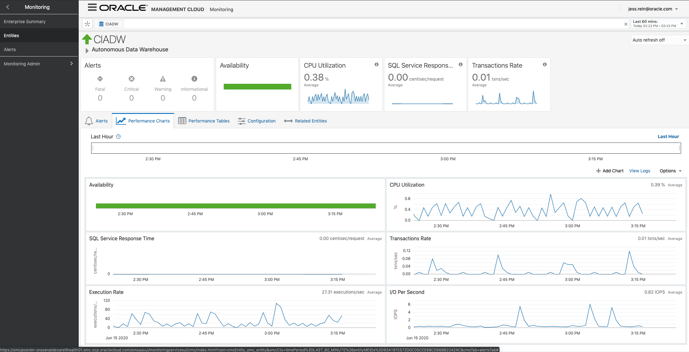

4. Feel free to explore the other tabs (Performance Tables, Configuration, Related Entities) to gain an understanding of what sort of information is available in the Infrastructure Monitoring Suite.

You may proceed to the next lab.

## Summary

In this lab, you provisioned a new Oracle Management Cloud instance, connected it to your Autonomous Database, and then navigated through the different views in OMC to understand how your database is being used.

However, this was only the first step to monitoring your IT solution. In addition to Autonomous Databases, OMC has the ability to monitor a wide variety of different entity types - including products that are on-premises or from other cloud vendors. You can connect to these other resources and see how they interact with your database in order to gain a thorough understanding of what is happening in your IT estate and view any issues through a single pane of glass.

## Learn More

To learn more about Oracle Management Cloud, feel free to explore the capabilities by clicking on this link: [Oracle Management Cloud Documentation](https://docs.oracle.com/en/cloud/paas/management-cloud/index.html)

To learn more about monitoring Autonomous Databases in Oracle Management cloud, refer to this link: [Using Oracle Database Management for Autonomous Databases](https://docs.oracle.com/en/cloud/paas/management-cloud/mcdbm/introduction-oracle-database-management.html)

## Acknowledgements

- **Author** - NA Cloud Engineering - Austin (Khader Mohiuddin, Jess Rein, Parshwa Shah, Tanvi Varadhachary)
- **Last Updated By/Date** - Jess Rein, Cloud Engineer, September 2020
