# Oracle Machine Learning (OML) and SQL Developer

## Introduction

This lab walks you through the steps to make an OML user and use SQL Developer as an interface to the ADW instance for granting user privileges. Then you will use OML to run a SQL script to generate machine learning models.

Estimated Lab Time: 30 minutes

*In addition to the workshop*, feel free to watch the walkthrough companion video:
[](youtube:uprqKyeuxik)


### Objectives
-   Learn how to make an OML user
-   Learn how to grant user privileges using SQL developer web
-   Learn how to run an OML script

### Prerequisites
-   The following lab requires an Oracle Public Cloud account. You may use your own cloud account, a cloud account that you obtained through a trial, or a training account whose details were given to you by an Oracle instructor.

### Extra Resources
-   To learn more about Oracle Machine Learning (OML), feel free to explore the capabilities by clicking on this link: [OML Overview](https://www.oracle.com/database/technologies/datawarehouse-bigdata/oml-notebooks.html)
-   To learn more about SQL Developer Web, feel free to explore the capabilities by clicking on this link: [SQL Developer Web Documentation](https://docs.oracle.com/en/database/oracle/sql-developer-web/18.1/sdweb/sdw-about.html#GUID-AF7601F9-7713-4ECC-8EC9-FB0296002C69)


## Task 1: Creating OML Users

1. Navigate to your ADW instance in the Oracle Cloud console. Then, click the **Service Console** button on your Autonomous Data Warehouse details page.

    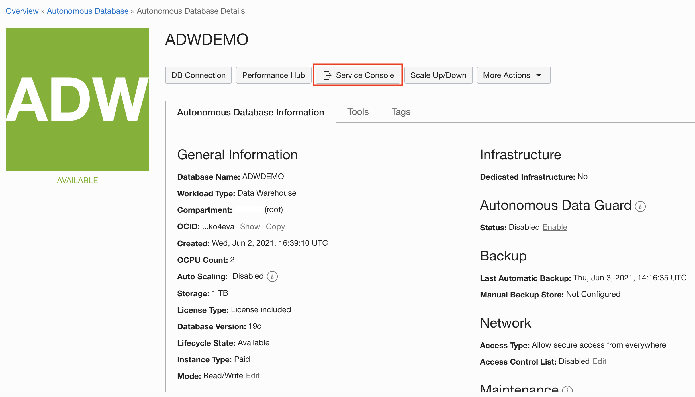

2. Click the **Administration** tab and click **Manage Oracle ML Users** to go to the OML user management page.

    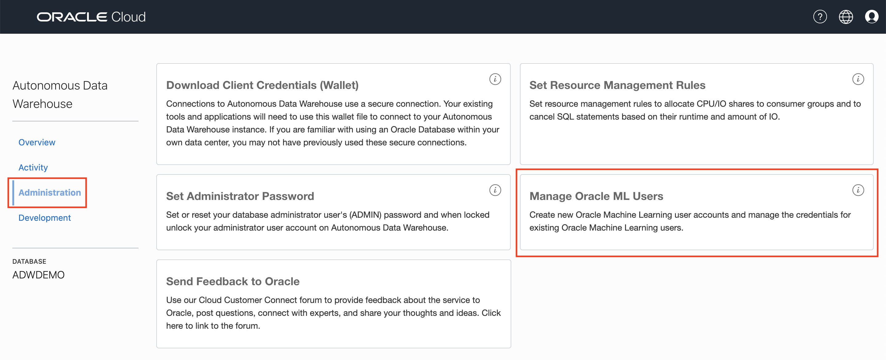

3. This will open a new tab within your browser that may ask you for a username and password. You may receive an **Insufficient Privileges** error. If you do, continue by clicking on the top right **Person Icon** and then on **Sign Out**.

4. Then on the Sign In page, enter **admin** as the username and use the password you specified when provisioning your ADW instance.

    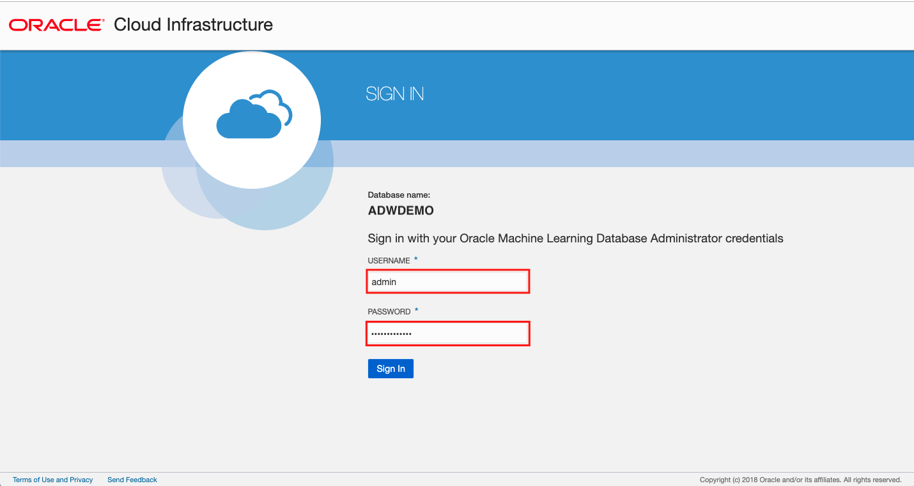

5. Click **Create** button to create a new OML user. Note that this will also create a new database user with the same name. This newly created user will be able to use the OML notebook application. For this lab, you can use your own personal email address when creating the user.

    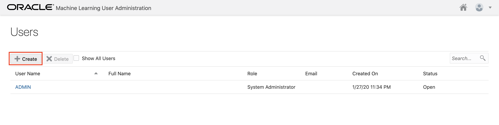

6. Enter the required information for this user, name the user as **testuser**. If you supplied a valid **email address**, a welcome email should arrive within a few minutes to your Inbox. Remember your password if you choose to create it in this step. If you do not create it in this step, the user will receive an email and will be able to create a new password through there.  Click the **Create** button, in the top-right corner of the page, to create the user.

    

7. After you click **Create** you will see that user listed in the Users section.

    

8. Below is the email which each new user receives welcoming them to the OML application. It includes a direct link to the OML application for that user which they can bookmark.  If you didn't already create a password for your user in the step above, click on the **Access Oracle ML SQL notebook** button in the email, and you will be taken to the site where you can create a password for your new user account.

    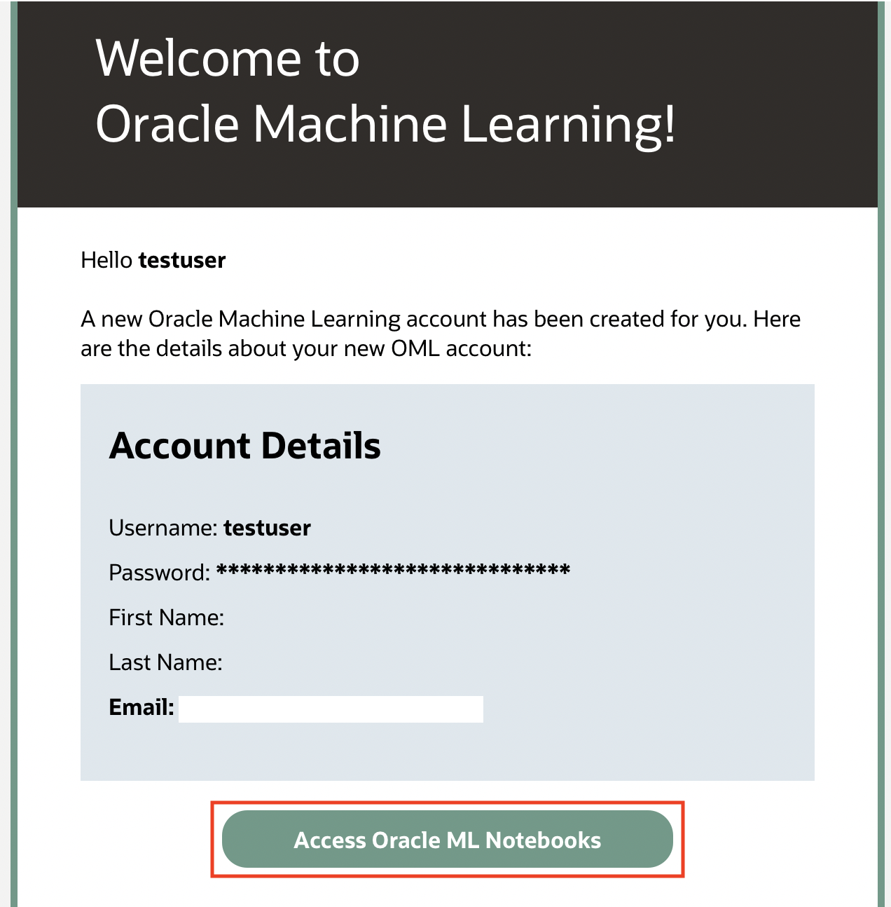

    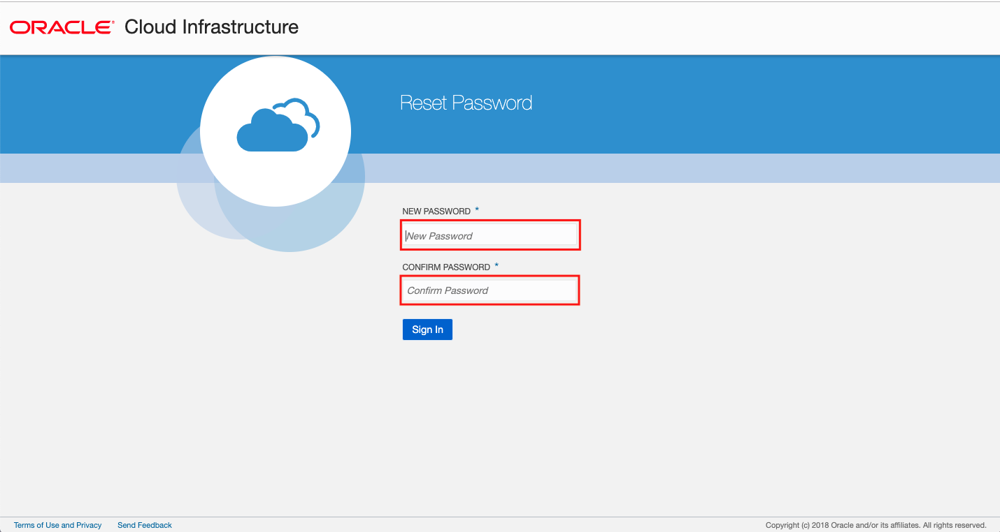

9. Now that you have an OML user created, make sure to keep note of the login details. You will use this user later in this workshop.

## Task 1: Access SQL Developer Web and Grant OML user privileges

1. We will use SQL Developer Web, an included cloud service with your ADW instance, to grant the necessary privileges for the OML user **testuser** to run the future prediction model OML script.

2. To start, navigate back to your ADW instance in the Oracle Cloud console. Then, click the **Service Console** button on your Autonomous Data Warehouse details page.

    

3. Click the **Development** tab and click **Database Actions** to access SQL Developer through the cloud.

    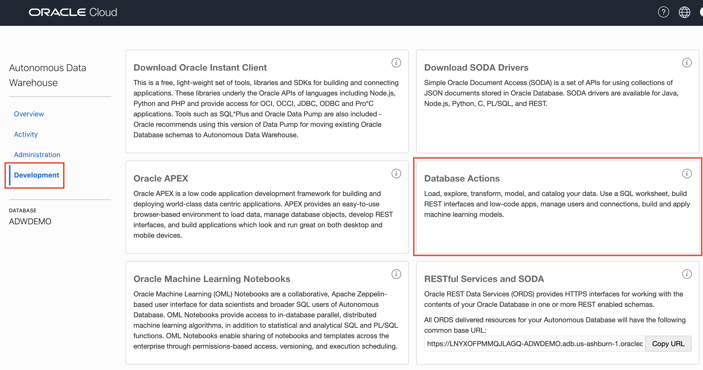

4. Sign in with your **admin** user and password for the admin user that you noted down earlier when creating your ADW instance.

    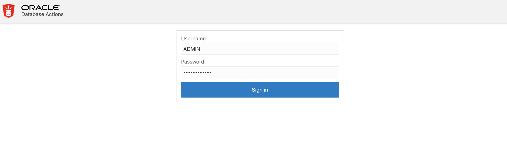

5. Select **SQL**. This will open up a view of your database as the admin user and you can run sql queries directly in your browser. We will be running a SQL query to grant our new OML user specific privileges so we can create and modify tables.

    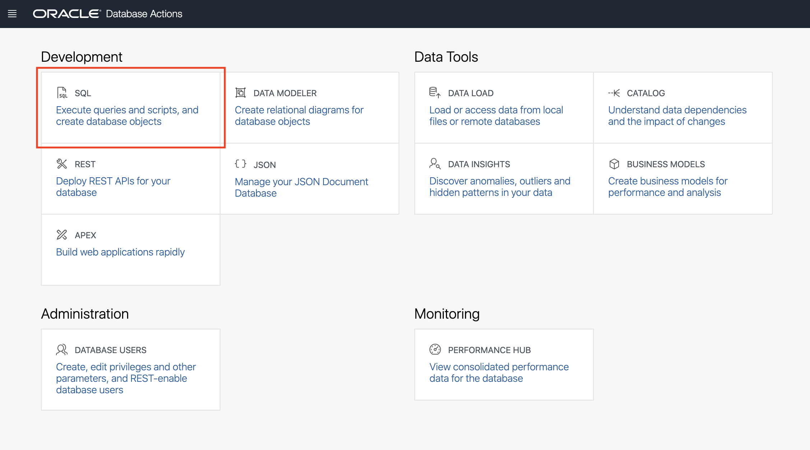    

6. First, click on the **ADMIN** user on the dropdown of all users and then scroll down to select **testuser**, the OML user that you created earlier. This will give us the ability to see the content and privileges of **testuser**.

    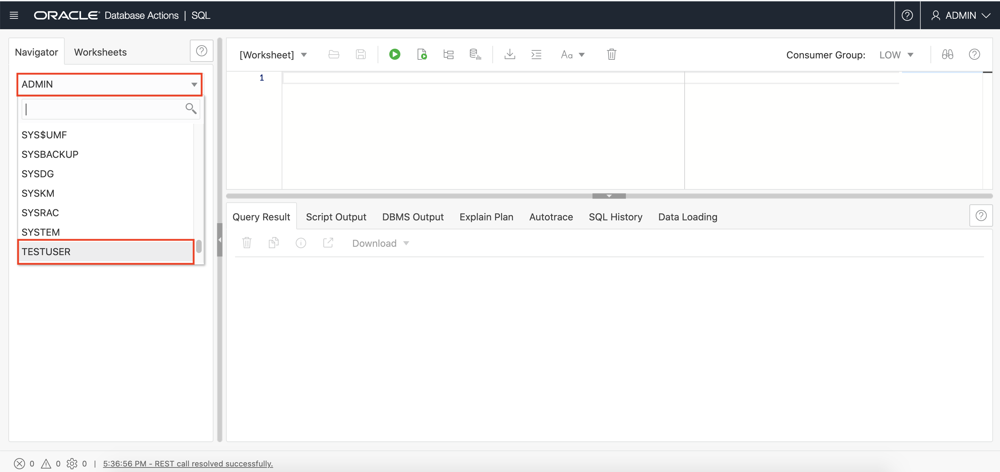

7. Let's grant this user some privileges. Copy and paste the following SQL query into the **[Worksheet]** section:
    ```
    <copy>
    GRANT ALTER ANY TABLE, CREATE ANY TABLE, CREATE TABLE, DELETE ANY TABLE, DROP ANY TABLE, INSERT ANY TABLE, READ ANY TABLE, SELECT ANY TABLE, UNDER ANY TABLE, UPDATE ANY TABLE TO TESTUSER
    </copy>
    ```

    *Note*: if you created an OML user with a different name other than **TESTUSER**, make sure to modify the end of the above SQL code with your specific user name appropriately.

    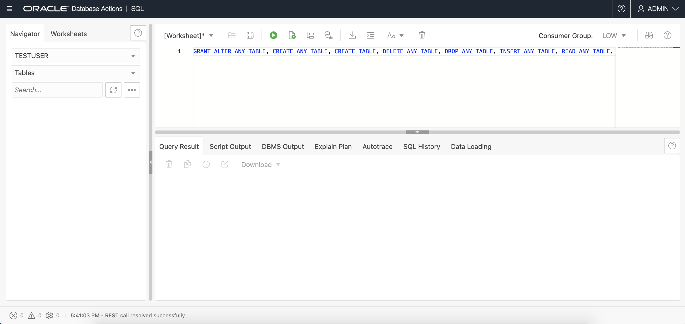

8. Then, click on the **green play button** in the **[Worksheet]** section navigation bar to run the code and you should get a **Grant succeeded.** prompt in the Query Result section.

    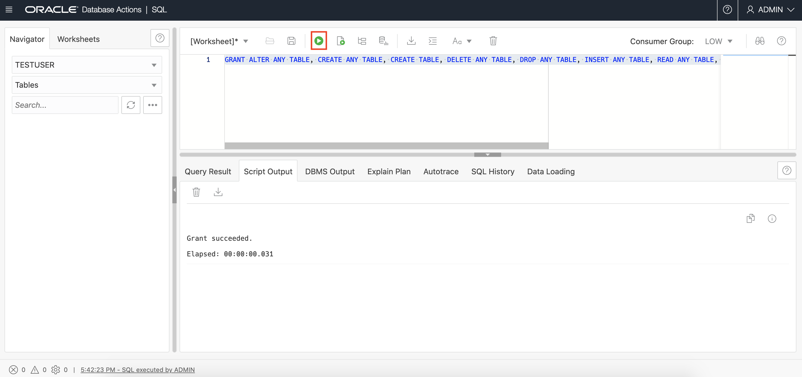

9. You have just used SQL developer web in order to grant a new user certain privileges to your Autonomous Database.

## Task 1: Import an OML script

1. Navigate to and click on **Oracle Machine Learning Notebooks** from the development page of your ADW instance service console.

    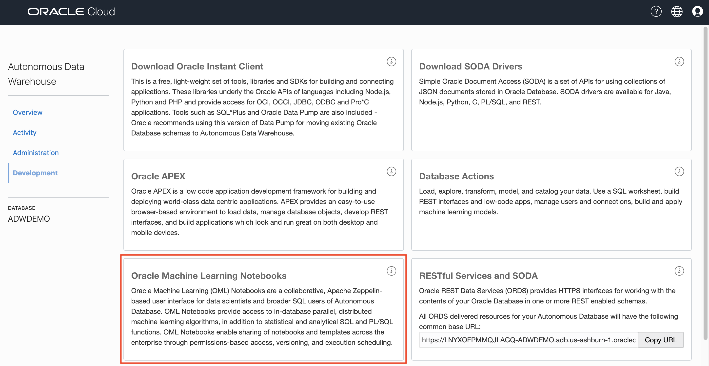

2. Sign in as **testuser** with the appropriate password.

    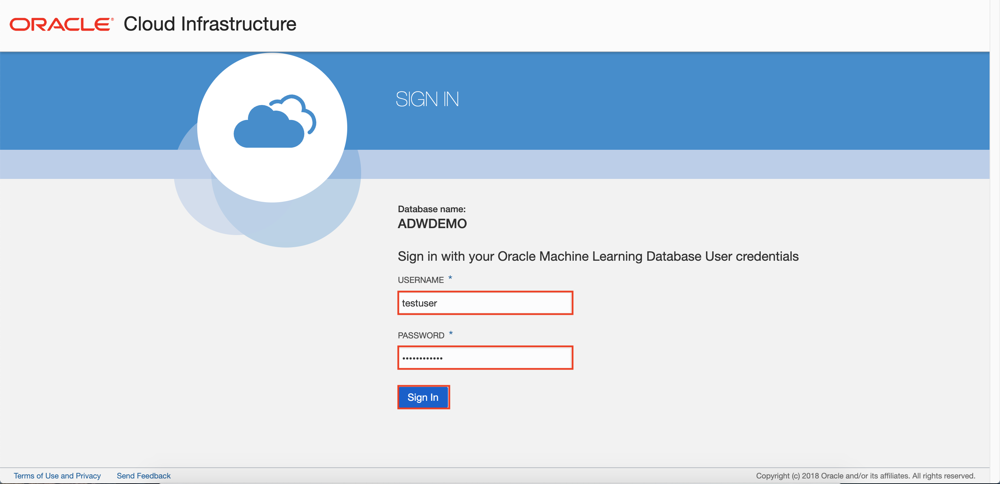

3. Click on **Notebooks** under the **Quick Actions** section.

    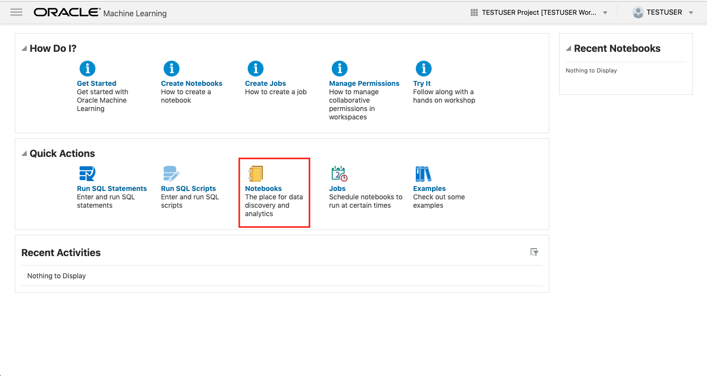

4. You will download a dataset file from this workshop to load into OML. You can download it by right clicking on the following text link and selecting **Save link as**. Keep the default options when downloading: <a href="./files/ML-Prediction-Models.json" download="ML-Prediction-Models.json" target="\_blank"> Download ML-Prediction-Models.json here </a>

5. Click **Import** and select **ML-Prediction-Models.json** that you just downloaded.

    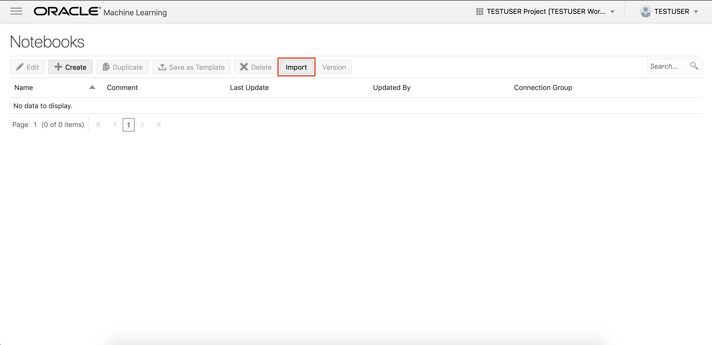

6. After the successful import message pops up, click on the notebook.

    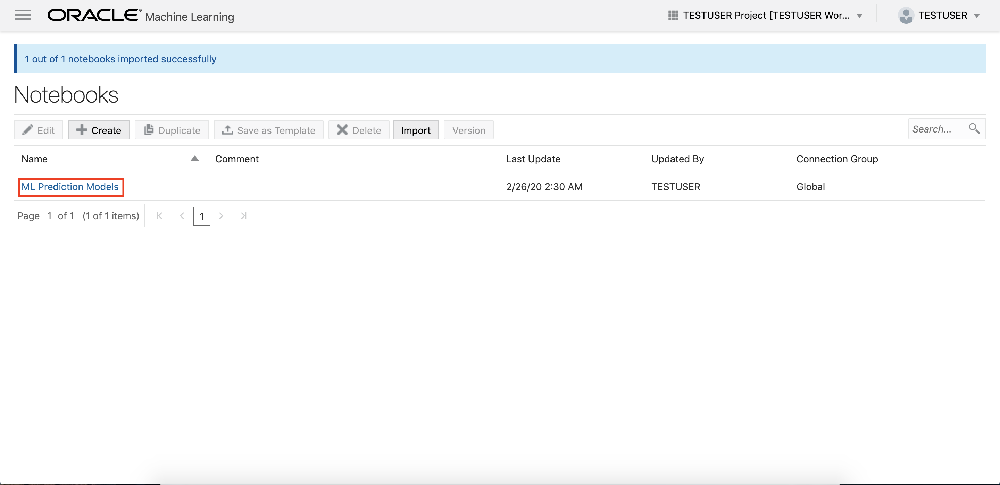

## Task 1: Run the OML script
1. OML notebooks are structured with Paragraph sections that consist of markdown and SQL code. The paragraphs can be run one by one or all together.

2. In order for the notebook to communicate with the database, an interpreter binding must be set for the database connection. Click on the **Gear** interpreter binding button and click on **adwdemo_low**. This service name will be labeled with your ADW instance name (which we name **adwdemo** by default in this workshop) and then low, medium, or high. To run this script, a low concurrency option is preferred to avoid script errors.

3. Click **Save** to bind the connection to the OML interpreter.

    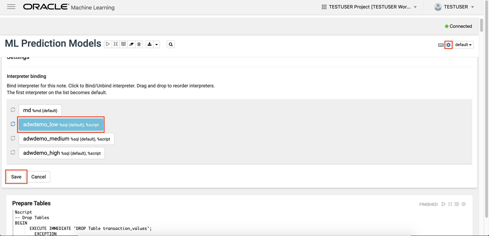

4. Then, in order for the interpreter binding to go through, refresh your browser window by clicking on your browser's **refresh icon**. The OML code should appear with colors now, signalling that the interpreter is correctly interpreting the code as SQL.

    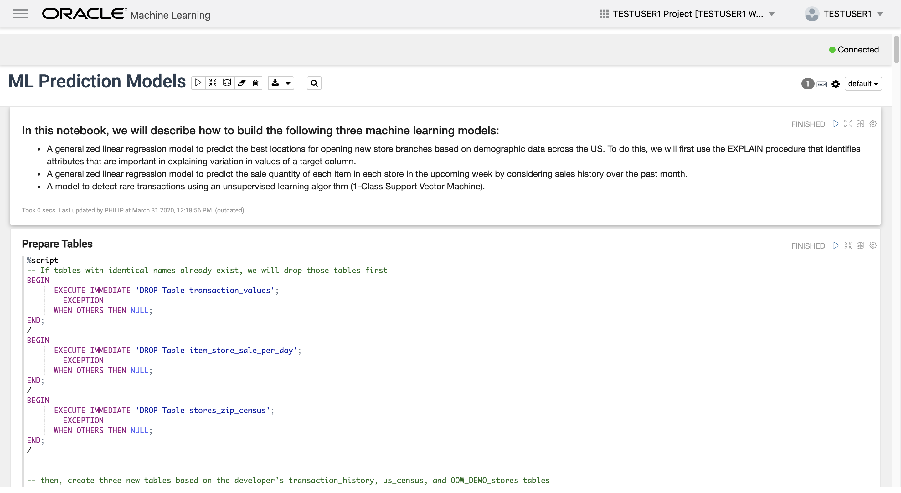

5. Now we have to run the scripts in the ML Notebook. Some notebooks may take longer to run than others. In particular, the "build glm model" script block will likely take up to 10 minutes to fully run. This is an important step in building the ML model, so be sure to be patient and wait until this script completely finishes each code block.

6. Select the "Run all Paragraphs" button at the top of the screen, highlighted in the image below. You should see output messages at the end of code blocks indicating the time taken to complete running the code. There should be no **outdated** tags at the end of these output messages. This is how you will confirm that each code block runs successfully at the end of running the entire notebook.

    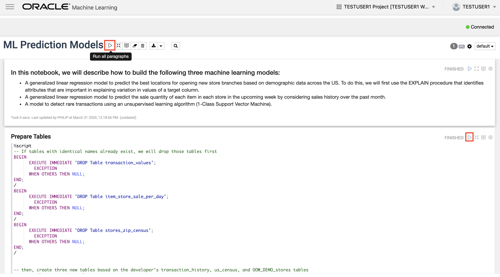

    Note: the Run all Paragraphs option may lead to some errors. If that occurs, it is recommended that you run each of the notebooks separately.  To do so, click the **Run** button on the top right of each script, outlined in red in the image below.  You must do this for each script in the notebook.  Do not run the next script until the script before it has finished running.  These must be done sequentially.  When the script has finished running, it will say **FINISHED** next to the "run" button.  If the run was unsuccessful, it will say **ERROR** next to the "run" button.  If this happens, try running the script again.  Make sure to run every script in the notebook. Additionally, if there is no "run" button next to a script, it does not need to be run.  Once all scripts have successfully finished running, you are ready to move on!

    Note: feel free to learn more about Oracle Machine Learning (OML) by clicking on the following text link: [OML Overview](https://www.oracle.com/database/technologies/datawarehouse-bigdata/oml-notebooks.html)

7. You have just ran a prediction model using OML through a SQL script! Let's view some of the data using your APEX app.

## Task 1: Access Your APEX App

1. Navigate to and click on **Oracle APEX** from the development page of your ADW instance service console.

    

2. Sign in as **developer** to the **developer** workspace with the appropriate browser.

    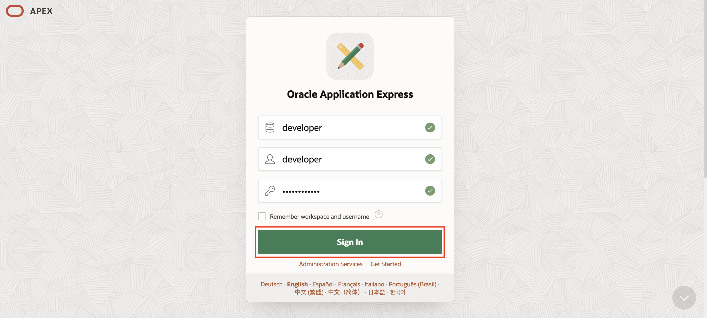

## Task 1: Access the New OML Generated Tables

3. Click on **SQL Workshop** and then on **Object Browser** to view the tables of your Autonomous Data Warehouse.

    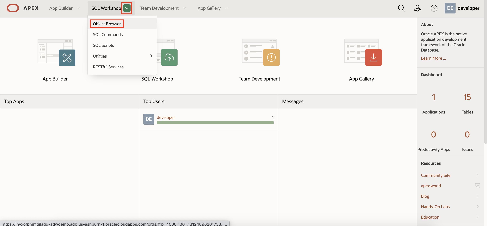

4. Notice the new tables that have been added through the OML script run by the OML user you made and gave privileges to.

    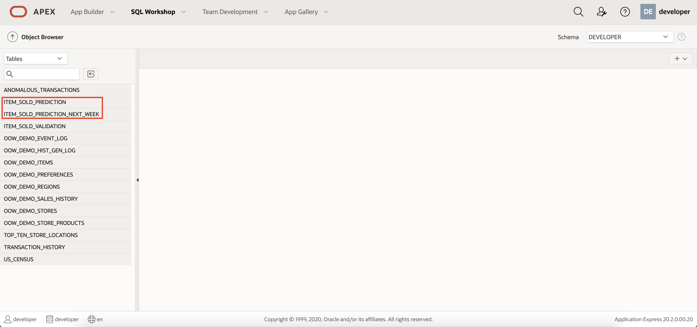

## Summary

-   In this lab, you made an OML user, connected to your new Autonomous Data Warehouse using SQL developer web, granted user privileges using SQL developer, and ran an OML script to generate a machine learning model.

## Acknowledgements

- **Author** - NATD Cloud Engineering - Austin Hub (Khader Mohiuddin, Jess Rein, Philip Pavlov, Naresh Sanodariya, Parshwa Shah)
- **Contributors** - Jeffrey Malcolm, QA Specialist, Arabella Yao, Product Manager Intern, DB Product Management
- **Last Updated By/Date** - Kamryn Vinson, June 2021
