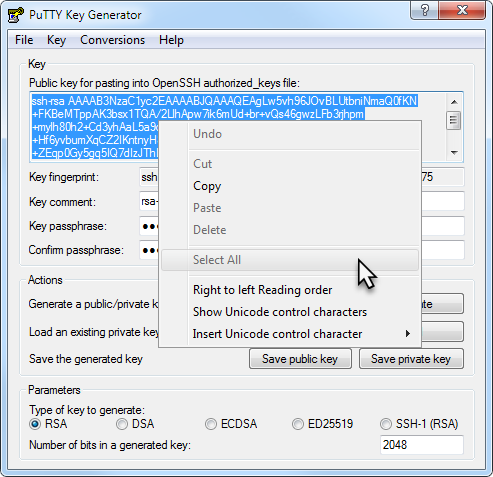

# APPENDIX

## Overview
This Appendix covers some general help for Windows users and other occasional issues you may encounter while working with your ADB Dedicated service.

### Objectives
- Instructions for windows users and other items.

##  Generating ssh key pairs using Puttygen
SSH keys are required to access a running OCI instance securely. You can use an existing SSH-2 RSA key pair or create a new one. Below are instructions for generating your individual key pair for Linux, Mac, Windows, and Windows 10.  Windows 10 is the first Windows version to natively support ssh and terminal access. Instructions for creating SSH keys can also be found on the [OCI documentation page](https://docs.cloud.oracle.com/iaas/Content/GSG/Tasks/creatingkeys.htm).

### Windows versions older than Windows 10

- A third party SSH client needs to be installed for Windows versions prior to Windows 10 in order to generate SSH keys. You can use Git Bash, Putty, or a tool of your choice. This tutorial will use Putty as an example. Git Bash or any third party shell program instructions will likely be the same as the Linux instructions above.

- If you don’t already have it, download the Putty application and install it on your Windows machine. [Download Putty](https://www.chiark.greenend.org.uk/~sgtatham/putty/latest.html). Puttygen is a utility that comes with the Putty package and is used to generate SSH keys.

    *For Oracle employees, Putty is also available from the MyDesktop application.*

- If you clicked on the link above you will be at the main putty download page.
    

- From the *Package Files* section select the 32 or 64 bit version depending of which version of Windows you are running. The download windows will pop up as shown above. Save the file on your local Windows system. Most likely to your *Downloads* directory unless you select a different location.

- Double-click on the downloaded file (for example *putty-64bit-0.73-installer.msi*). This will launch the Putty installer.
    

- Click *Next* and leave the Destination Folder unchanged unless you have a good reason to select a different destination. Click *Next*.
    

- On the next screen don't change any settings, and click *Install*.
    

- After installing Putty, from the Windows start menu, run the PuTTYgen utility.
    

- Click the Generate button and follow the instructions for generating random information.
    


- After the key information has been generated, enter an optional *passphrase* and press the *Save private key* button to save the key to your system.

    *Note: A passphrase is not required but recommended for stronger security.*

- The private key should have the .ppk extension. Name it whatever you want and store it in a folder that’s easily accessible.
    

    *NOTE: We will not use the ‘Save public key’ option in PuttyGen, as the keyfile is not compatible with Linux openSSH. Instead, we will copy and paste the key information into a text file.*

- Left click on the Public key information and choose ‘Select All’ to select everything in the key field. Then left click again and copy the selected information to the clipboard.
    

- Save your public key to a text file with Notepad. Open a plain text editor and paste the key information. Name and save the file with a .pub extension.
    

- Close the Puttygen application

### Generating ssh keys using powershell on Windows 10

- Windows 10 users, *open Powershell terminal window*. Either select the application from the Windows Start menu or type 'cmd' or 'powershell' from the Windows search menu.  
    

- From your home directory, which should be the default C:\Users\\(Your Name), type the `ssh-keygen` command. Press *Enter* when asked for the filename, and press *Enter* twice for *no passphrase*.

    `PS C:\Users\myhome> ssh-keygen`

    


- Typing *ssh-keygen* by itself creates a key named id_rsa under the default .ssh directory.  If you want to name your key, store it in another directory, or add other security options, the ssh-keygen command takes a number of useful switches.  

    **ssh-keygen command switch guide:**
    ```
    -t – algorithm
    -N – “passphrase” Not required but best practice for better security
    -b – Number of bits – 2048 is standard
    -C – Key name identifier
    -f - \<path/root\_name\> - location and root name for files
    ```

- The key pair you generated is now stored in the default .ssh directory.  Use the `ls -l .ssh` command to verify.
    


##  Creating an ssh tunnel from your Windows system to your OCI dev client

### Windows 10 Users
- Open powershell and run the following command replace values for ssh key file and instance IP address as applicable to your deployment.

    ```
    <copy>
    ssh -L 5901:localhost:5901 –i <path/to/private/key/id_rsa opc@<IP_address_of_dev_client>
    </copy>
    ```

### Older versions of Windows
Older versions of Windows can use Putty to create an ssh tunnel.

Start with creating an ssh session in Putty as usual.

  1. Specify public IP address of host. Provide a name and save your session.
      


  2. Go to ssh --> Auth from the Category menu on the left. Provide your private .ppk key
      

   One final step before you click Open. In ssh -->Tunnel, provide port forwarding information as shown below
      

  3. Click 'Open' and provide user name when prompted.

Note that you may establish an ssh connection to your remote host without port forwarding, in which case your VNC session may fail. Please check your port forwarding parameters and retry.

##  Connecting to your OCI Developer client linux desktop using VNC

To connect to your instance, you can SSH directly from your machine and use command line to interact, or you can use a VNC viewer to access the image through a full graphical interface. This later method is highly recommended as you will have full graphical access to your cloud developer image vs. command line access through SSH.
However some initial setup may need to be done with SSH commands before full GUI access to the image is possible.

**Usage Instructions Getting Connected with SSH**

- When launching the instance, you will need to provide an SSH key that you previously created. Once the instance launches, you can connect to it using SSH. When attempting a connection from your Windows system to the cloud developer image, make sure that you are in the directory that contains your *id\_rsa* file generated in the step above or your connection will not work.

- On your Windows machine launch a *Command Prompt* window.

- Use the following information to connect to the instance when issuing the command below:


    *User:* opc

    *IP Address*: public IP address of the instance

    *id_rsa:* path to the SSH-2 RSA private key file

    For example:

    ```
    $ cd .ssh

    $ ssh –i id_rsa opc@IP Address
    ```

    

- Once connected to the cloud developer image you will see the remote prompt *[opc@devclient ~]$*


**Usage Instructions Accessing via VNC  Graphical User Interface (GUI)**

To access a GUI via VNC, do the following:

- Install a VNC viewer on your local computer. A common VNC Viewer can be downloaded from [Real VNC](https://www.realvnc.com/en/connect/download/viewer/).
    

- From the website select, select Windows and *Download VNC Viewer*. That will save a file to your downloads directory as in the previous step. Doublick on the file and it will launch the installer.
    

    Follow the installation steps in the installer to install VNC Viewer.

- In order to use VNC viewer, you must still establish an initial connection to the image through SSH to enable the remove VNC service to start and configure security in your newly created cloud developer image. This is a one time process on the image.

- Use SSH to connect to the compute instance running the Oracle Cloud Developer Image, as described above in *Usage Instructions Getting Connected with SSH* (connect to the opc user).

  - Once connected and at the remote image prompt, configure a VNC password by typing *vncpasswd*.

    - When prompted, enter a new password and verify it.
    - Optionally, enter a view only password.
    - After the vncpasswd utility exits, start the VNC server by typing *vncserver*.

  - This will start a VNC server with display number 1 for the opc user, and the VNC server will start automatically if your instance is rebooted.

- Now to connect to the image from your local Windows computer you need to execute the following command after every restart of your local Windows computer to re-establish a connection to the remote image. On your local computer,

    - Connect to your instance and create an ssh tunnel for port 5901 (for display number 1): by running the following in a *Command Prompt* window:

        *cd .ssh* - make sure you are in the .ssh directory on your local machine

        *ssh -L 5901:localhost:5901 –i id\_rsa opc@IP Address* - specify your images IP address

- If the connection request times out, try again.
    

- Start a VNC viewer on your local machine by selecting *VNC Viewer* from the *Start* menu, or typing *VNC Viewer* in the search bar.

- Establish a VNC connection to: *localhost:1*
    

- If you get a warning message about the communication not being encrypted click Continue.
    

- Enter the VNC password you set earlier, when you ran the *vncpasswd* command in the cloud developer image, in the password dialog and you will be connected!
    


##  Finding private IP address of your Autonomous Exadata infrastructure (AEI)

### Step 1: Locate the SCAN hostname of your AEI

- Go to your Autonomous Database Console and open the details page of any ADB instance you have already provisioned on this AEI. Click the DB Connection button.
    

- On the Database Connection popup, pick any TNS Connection String entry and expand it as shown below. Your exadata hostname is embedded in this TNS entry. Click 'copy' and paste the entire TNS string onto a notepad. You may then pick out the hostname when you need it in the steps below.
    


### Step 2: Deploy and ssh into your developer client VM

- Next, deploy any linux VM in the same VCN hosting your Autonomous Exadata Infrastructure (AEI).

- You may follow steps [in this lab guide](./ConfigureDevClient.md) to provision the Oracle Developer Client VM from the OCI marketplace.

- Note that the VM can be in a public or private subnet as long as you can ssh into it and **its in the same VCN as your AEI.**

- If your company has deployed FastConnect and setup VPN into the OCI network, you may ssh into your client machine using its private IP or a hostname registered in your corporate DNS. Check with your network administrator responsible for the OCI network.

    Here, we assume that you have deployed a VM in a public subnet and can ssh into it using its public IP.

    ````
    <copy>
    $ ssh -i <private-key-file> opc@<Public-IP-of-machine>
    </copy>
    ````

### Step 3: Query your VCN's DNS service to locate IP address of AEI Cluster

- Once you are ssh'd into a client VM, simply run nslookup on the scan-host name you picked out from step 1 above.

    ````
    <copy>
    $ nslookup host-xxxx-scan.exasubnet.ocivcn.oraclevcn.com
    Server:		169.XXX.169.254
    Address:	169.XXX.169.254#53

    Non-authoritative answer:
    Name:	host-xxxx-scan.exasubnet.ocivcn.oraclevcn.com
    Address: 10.0.11.36
    Name:	host-xxxx-scan.exasubnet.ocivcn.oraclevcn.com
    Address: 10.0.11.34
    Name:	host-xxxx-scan.exasubnet.ocivcn.oraclevcn.com
    Address: 10.0.11.35
    </copy>
    ````

You now have the 3 SCAN IP's of your AEI cluster. Once your network admin adds the SCAN hostname and the 3 IPs to your corporate DNS Server, you may then be able to access your database instances via hostname using the downloaded wallet.


## Acknowledgements

- **Author** - Tejus S. & Kris Bhanushali
- **Adapted by** -  Yaisah Granillo, Cloud Solution Engineer
- **Last Updated By/Date** - Kris Bhanushali, Autonomous Database Product Management, March 2022

## See an issue or have feedback?  
Please submit feedback [here](https://apexapps.oracle.com/pls/apex/f?p=133:1:::::P1_FEEDBACK:1).   Select 'Autonomous DB on Dedicated Exadata' as workshop name, include Lab name and issue / feedback details. Thank you!
