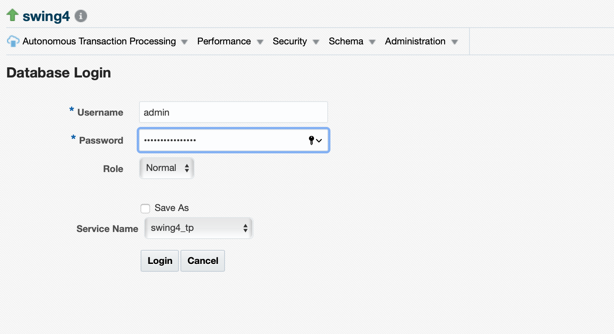
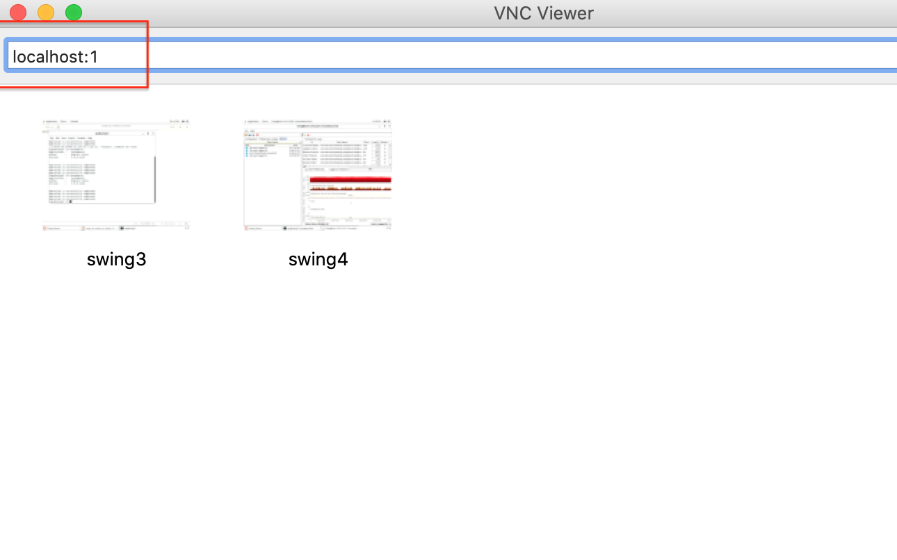

# The Power of Automatic Indexing
Indexes are at the center of performance management for any OLTP application. While writing good SQL code tops the list, creating the right set of indexes is the next best thing you can do to improve the performance of your application. As applications changes over time and new ad-hoc queries start hitting the database, they may impact performance. Developers and DBAs react by creating additional indexes and over time the number of indexess may become too large and cumbersome to manage. Index lifecycle management becomes a significant part of database maintenance and performance management.

The automatic indexing feature of Oracle 19c database can autonomously detect and create indexess based on application workload. It can also keep track of index usage and remove indexes that have not been using for a period of time. All of this with the right set of controls to make sure the DBA/Developer has full control over how this automation works.

## Introduction
The Autonomous Database on dedicated infrastructure cloud service in OCI runs on Exadata infrastructure in OCI and supports automatic Indexing. In this hands-on lab we take a look at enabling and using automatic indexing with an OLTP workload.


Estimated Time: 30 minutes

### Objectives

As a database user, DBA or application developer,
1. Download and configure the swingbench workload generator in a compute VM
2. Deploy the swingbench schema in your autonomous database without indexes
3. Enable automatic indexing on your autonomous database
4. Run workload and observe how indexes are created automatically
5. Understand various SQL commands to control & monitor automatic indexing

### Required Artifacts

- An Oracle Cloud Infrastructure account with IAM privileges to provision compute instances
- A pre-provisioned dedicated autonomous database instance. Refer to the lab **Provisioning Databases** in the *Autonomous Database Dedicated for Developers and Database Users* workshop on how to provision an ATP database
- A pre-provisioned Oracle Developer Client compute image. Refer to the lab **Configuring a Development System** in the *Autonomous Database Dedicated for Developers and Database Users* workshop on how provision a developer client
- VNC Viewer or other suitable VNC client on your local laptop


## Task 1: Download and install Swingbench

- The Oracle Cloud Infrastructure Marketplace provides a pre-configured developer client image that come with database drivers for Java, node.js, python and other popular languages. Instructions to install and use this developer client are provided in the lab **Configuring a Development System** in the *Autonomous Database Dedicated for Developers and Database Users* workshop.

- Please provision a developer client image and connect it to your autonomous database instance before proceeding with the rest of this lab.

- Let's ssh into the dev client and download the swingbench application in the /home/opc folder.

- Mac users can ssh using command below in terminal, while Windows users may use powershell or an ssh client as explained in the **Appendix**.

    ````
    $ ssh -i <[ath-to-key-file]> opc@<ip-address-of-dev-client>

    ````

- Download swingbench using curl.

    ````
    wget -cO - https://github.com/domgiles/swingbench-public/releases/download/production/swingbenchlatest.zip > swingbench.zip

    ````

- Unzip swingbench.

    ````
    $ unzip swingbench.zip
    ````

    This will create a folder /home/opc/swingbench and unzip contents in there. Optionally, add the folder /home/opc/swingbench/bin to the PATH variable in .bash_profile.

Thats all it takes to install this app.

## Task 2: Deploy swingbench schema without indexes

Assuming you have uploaded your database wallet and can connect to your autonomous database via sql*plus or sqlcl, you are now ready to deploy the swingbench schema.

- Run the following command from your developer client, customizing it appropriately for your environment.

    ````
    $ /home/opc/swingbench/bin/oewizard -cf ~/<DB-wallet-file-name.zip \
            -cs <TNS_service> \
            -ts DATA \
            -dbap <DB-admin-passwd> \
            -dba admin \
            -u soe \
            -p Welcome1234# \
            -async_off \
            -scale 1 \
            -noindexes \
            -hashpart \
            -create \
            -cl \
            -v

    ````

    In the command above we use the swingbench Order Entry wizard (oewizard) to provision the 'soe' schema and load it with sample data.

- Replace parameters DB-wallet-file-name, TNS_service and DB-admin-passwd to match your environment. You may also change password for 'soe' from Welcome1234# to something more complex.

**Note: We've instructed oewizard to build the schema without any indexes.**

The time required to build the soe schema depends on the degree of parallelism available on the database instance and the size of the schema. Above we've chosen a 1 GB schema which should take less than 15 minutes in most cases.

## Task 3: Enable Automatic Indexing

- Once the schema is built you may now go ahead and enable automatic indexing. First, let's ensure there are no indexes. Connect to your autonomous database as 'admin' using SQL*Developer or any SQL Client.

    ````
    SQL> select * from dba_indexes where owner like 'SOE';
    ````

- OR you may also query the dba\_indexes table to see if any automatically created indexes exist.

    ````
    SQL> select owner, index_name, Index_type, table_name from dba_indexes where AUTO like 'YES';

    ````

    Both queries above should return zero rows if the schema was built as desired.

- Next, we turn on automatic indexing using the following SQL Command.

    ````
    SQL> EXEC DBMS_AUTO_INDEX.CONFIGURE('AUTO_INDEX_MODE','IMPLEMENT');
    ````

The dbms\_auto\_index PL/SQL package can be used to set Auto Indexing ON  (IMPLEMENT), OFF and REPORT-ONLY modes.

You may also manage Auto Indexing setting from Enterprise Manager 13.4 or higher. Installation and setup of EM is beyond the scope of this guide.

- Once you've successfully installed EM and added your autonomous database as a 'target' you can manage Auto Indexing under Performance --> Automatic Indexing Menu item as shown in the screenshot below.

    

- Simply select 'Settings' as shown in the screen shot above, provide an admin username/password and select a TNS Service from the drop down.

    

- The Automatic Indexing Settings page is where you can:

1. Change AI to IMPLEMENT, OFF or REPORT-ONLY.
2. Specify retention periods.
3. Include or Exclude Schemas.

    

## Task 4: Run workload and observe automatic index creation

Next, let's fire up swingbench and simulate an OLTP order-entry workload.

- Open an ssh tunnel from your laptop into the developer client machine. Step by step instructions on setting up an ssh tunnel and opening a VNC connection to your developer client image are provided in the lab **Configuring a Development System** in the *Autonomous Database Dedicated for Developers and Database Users* workshop.

    ````
    $ ssh -N -L 5901:127.0.0.1:5901 -i ~/<key-file> opc@<IP-address-of-dev-client>

    ````

- Now open a VNC Viewer client on your local laptop and connect to localhost:1 as shown below.

    

- Open a terminal window once you are connected to the developer client over VNC. Navigate to /home/opc/swingbench/bin and start up swingbench workload generator application. Detailed instructions on configuring swingbench are provided in the lab **Build Apex Application** in the *Autonomous Database Dedicated for Developers and Database Users* workshop.

    ````
    $ cd /home/opc/swingbench/bin
    $ ./swingbench
    ````

- Provide username, password, connect string and load parameters as shown below or as per your preference.

    

- The Auto Indexing task runs every 900 seconds, that is 15 minutes, so you may have to wait 15 minutes before any index creation begins. Here's a screen shot of a SQL statement that queries the dba\_autotask\_schedule\_control table to list all of the automatic tasks scheduled in the database. You can see the status of the Auto Index task and its scheduled interval of 900 seconds.

    ````
    select * from DBA_AUTOTASK_SCHEDULE_CONTROL where dbid = (select dbid from v$pdbs);
    ````

    

- Poll the dba\_auto\_index\_ind\_actions view to see all of the auto indexing activities on the database.

    

This view shows all auto indexing activities including statements used for index creation, rebuilds and visibility.

You may now **proceed to the next lab**.

## Acknowledgements

*Great Work! You successfully created a client machine and connected to your autonomous database instance using SQL Developer and command line tools.*

- **Contributors** - Kris Bhanushali, Govardhanan Ramachandran
- **Last Updated By/Date** - Kris Bhanushali, Autonomous Database Product Management, March 2022

## See an issue or have feedback?  
Please submit feedback [here](https://apexapps.oracle.com/pls/apex/f?p=133:1:::::P1_FEEDBACK:1).   Select 'Autonomous DB on Dedicated Exadata' as workshop name, include Lab name and issue / feedback details. Thank you!
