# Build 'Always-On' applications on the Autonomous Database


## Introduction
The Oracle Autonomous Database allows you to build 'Always-On' applications. i.e. applications need not go down during planned maintenance operations on the database, database scaling or even unplanned database outages such as node failures. This is possible due to a feature of the Oracle Autonomous Database called 'Transparent Application Continuity'.

TAC uses a combination of Oracle RAC, Oracle Notification Service (ONS), Transparent Application Failover and Application Replay to cleanly failover your application to a surviving node and replaying in-transit transaction to provide a seamless user experience.

In this lab we will install and configure a workload generation tool called Swingbench, configure it for TAC and demonstrate the high availability features of the service while simulating a planned maintenance operation.

Estimated Time: 30 minutes

### Objectives

As an administrator:
1. Install and configure Swingbench to simulate a transaction processing workload.
2. Configure application side parameters for Transparent Application Continuity.
3. Trigger a RAC failover operation and observe impact to workload.

### Required Artifacts

- An Oracle Cloud Infrastructure account.
- A pre-provisioned instance of Oracle Developer Client image in an application subnet. Refer to the lab **Configuring a Development System** in the **Autonomous Database Dedicated for Developers and Database Users** workshop on how provision a developer client.
- A pre-provisioned Autonomous Transaction Processing instance. Refer to the lab **Provisioning Databases** in the **Autonomous Database Dedicated for Developers and Database Users** workshop on how to provision an ATP database.

## Task 1: Download and install Swingbench

- We will start with downloading and installing Swingbench in a developer client virtual machine provisioned in the lab **Configuring a Development System** in the **Autonomous Database Dedicated for Developers and Database Users** workshop.

- Connect to your developer client machine via VNC. Detailed instructions are provided in that lab, **Configuring a Development System**.

    *The remainder of this lab assumes you are connected to the image through VNC Viewer and are operating from the image itself and not your local machine (except if noted).*

- Once connected, open a terminal window and download the latest version of swingbench using the curl command below.

    ````
    <copy>
    wget -cO - https://github.com/domgiles/swingbench-public/releases/download/production/swingbenchlatest.zip > swingbench.zip
    </copy>
    ````

- unzip swingbench.zip. It unzips contents in the swingbench folder.

    ```
    <copy>
    unzip /home/opc/swingbench.zip
    </copy>
    ```

### JDBC Drivers in Swingbench
- If you are already running an older version of swingbench, you would need to update the jdbc drivers in swingbench/lib to 18c jdbc drivers for TAC to work. Oracle 18c jdbc drivers may be downloaded from [JDBC Downloads](https://www.oracle.com/database/technologies/appdev/jdbc-ucp-183-downloads.html).

    *Note: 19c drivers have not been tested with swingbench and may produce unpredictable results.*

- Use instructions below to update drivers if needed, otherwise move on to transfer DB wallet.

1. Download ojdbc8-full.tar.gz to the downloads folder in your dev. client instance.

2. Untar the archive.

    ```
    <copy>
    tar -xvf ojdbc10-full.tar.gz
    </copy>
    ```

3. Copy the contents of ojdbc10-full to /home/opc/swingbench/lib, replacing the existing files.

    *Note: Do not modify the launcher directory or the existing swingbench.jar.*

### Transfer DB Wallet to swingbench client machine
Unless you have already moved the wallet to your Dev Client machine in an earlier lab, follow these steps.

- Create a VNC connection to your machine following steps in the lab **Configuring a Development System** in the **Autonomous Database Dedicated for Developers and Database Users** workshop.
- Open up Firefox in your VNC terminal from the Applications menu on the top left.
   -  Once Firefox is open, go to **cloud.oracle.com**.

- Log in to Oracle Cloud Infrastructure account and select **Autonomous Transaction Processing** from the menu.
    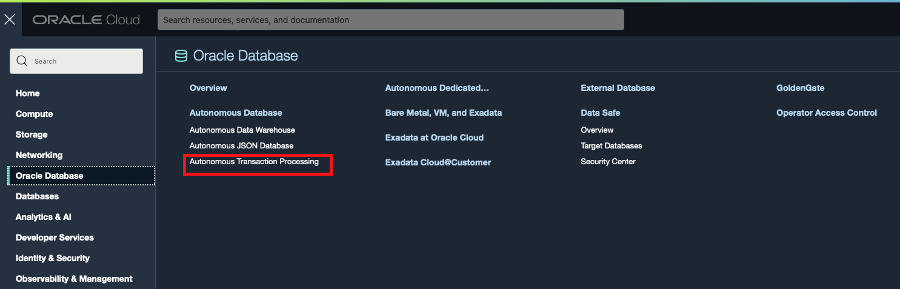

- Click **Autonomous Database** and select your previously created database.

    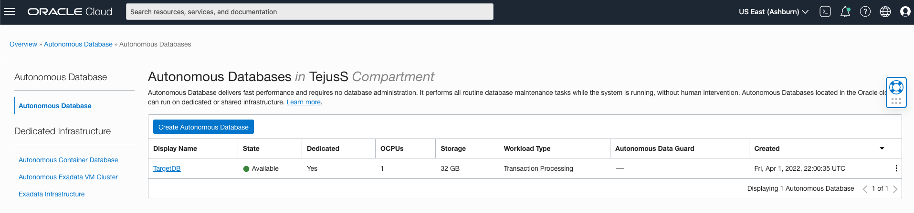

- Click on DB Connection and under Download Client Credential(Wallet) click **Download**.

    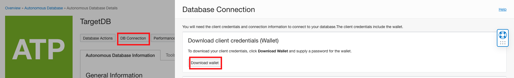

- Provide a password for your wallet and  download wallet.

    

- The credentials zip file contains the encryption wallet, Java keystore and other relevant files to make a secure TLS 1.2 connection to your database from client applications. The wallet will be downloaded to your downloads directory.

## Task 2: Build and setup sample swingbench schema

Now that you have installed swingbench, the next step is to build the sample Order Entry schema in the database.

- SSH into your dev client machine and change directory to /home/opc/swingbench/bin.

    ```
    <copy>
    cd /home/opc/swingbench/bin
    </copy>
    ```

- Run the Order Entry wizard, replacing parameters as applicable to your environment.

    ```
    <copy>
    ./oewizard -cf ~/Downloads/your_wallet \
            -cs yourdbname_medium \
            -ts DATA \
            -dbap adminuserpassword \
            -dba admin \
            -u soe \
            -p adminuserpassword \
            -async_off \
            -scale 5 \
            -hashpart \
            -create \
            -cl \
            -v
    </copy>
    ```

    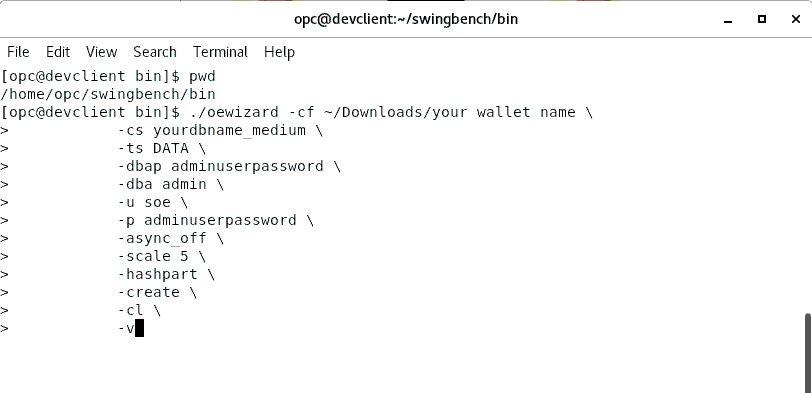


    - *cf* speficies the location of the wallet file
    - *cs* specifies the ATP service to connect to
    - *ts*  name of the table space to install swingbench into. For ATP it is always DATA
    - *dba* user admin created during ATP instance creation
    - *dbap* admin user password
    - *u* new database user created for swingbench data
    - *p* new user (above) password
    - *async\_off* async commits are not supported in  ATP
    - *scale* in GB’s, data size, plus additional 50% of data for indexes

- Creation time will vary depending on where you are running it from and may take many minutes. The creation screen will look similar to this:

    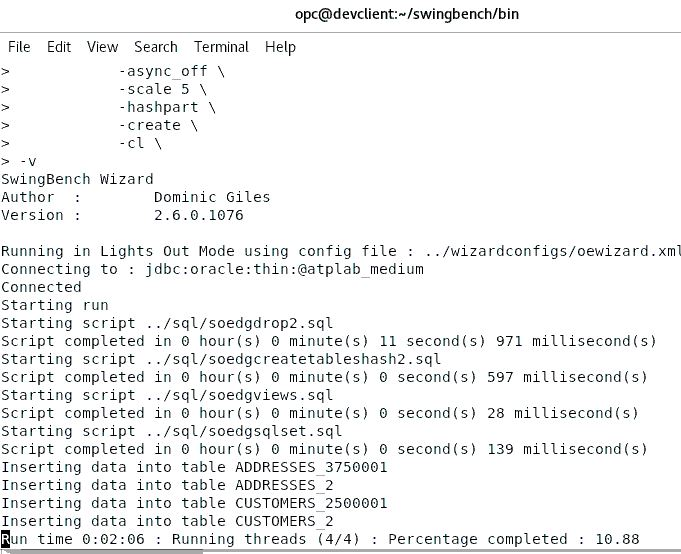

- Ignore any creation or priviledges error messages that display during the creation process. When finished, your screen should look similar to this:

    

- Once complete, verify the tables created correctly by running the following command (from the swingbench bin directory, make sure to use your wallet location and password):

    ```
    <copy>
    ./sbutil -soe -cf ~/Downloads/your_wallet.zip -cs yourdb_medium -u soe -p yourpassword -val
    </copy>
    ```

    Your output should be similar to this:

    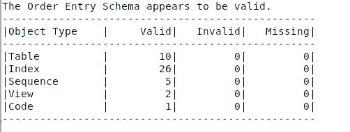

- To collect statistics on the tables that were created run the command below. If you will be conducting performance testing with Swingbench it is recommended that you collect statistics.

    ```
    <copy>
    ./sbutil -soe -cf ~/Downloads/your_wallet.zip -cs yourdb_medium -u soe -p yourpassword -stats
    </copy>
    ```

- To see how many rows were inserted on each table run the following command:

    ```
    <copy>
    ./sbutil -soe -cf ~/Downloads/your_wallet.zip -cs yourdb_medium -u soe -p yourpassword -tables
    </copy>
    ```

- You are ready to run Swingbench workloads on ATP. Workloads are simulated by users submitting transactions to the database. To do this, the user process must be configured. Run the following command unchanged from the same **bin** directory you have been running the other commands:

    ```
    <copy>
    sed -i -e 's/<LogonGroupCount>1<\/LogonGroupCount>/<LogonGroupCount>5<\/LogonGroupCount>/' \
        -e 's/<LogonDelay>0<\/LogonDelay>/<LogonDelay>300<\/LogonDelay>/' \
        -e 's/<WaitTillAllLogon>true<\/WaitTillAllLogon>/<WaitTillAllLogon>false<\/WaitTillAllLogon>/' \
        ../configs/SOE_Client_Side.xml
    </copy>
    ```

## Task 3: Setup TAC parameters and run workload

There are at least 2 options to run your swingbench workload.

**Using the Swingbench GUI**

- Simply fire up swingbench from a terminal window in your VNC session and select 'SOE\_Client\_Side' from the opening menu. This will use the Simple Order Entry workload using client side jdbc calls.

    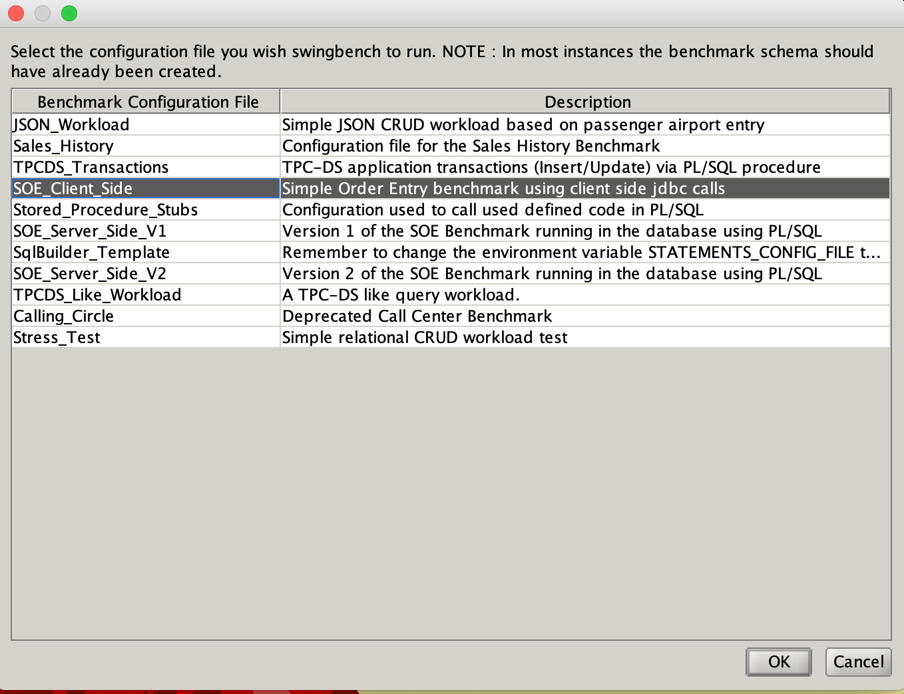

- On the **Configuration** --> **User Details** tab, provide user/pass information as shown below.
    *Note: Username needs to be soe and password as set in previous step*.

      - Copy connect string from OCI console or from tnsnames.ora in the downloaded .zip wallet. Copy the entire TNS alias string that looks similar to:

        ```
        <copy>
        (DESCRIPTION=(CONNECT_TIMEOUT=120)(RETRY_COUNT=20)(RETRY_DELAY=3)(TRANSPORT_CONNECT_TIMEOUT=3)(ADDRESS_LIST=(LOAD_BALANCE=on)(ADDRESS=(PROTOCOL=TCP)(HOST=host-xyz.oraclevcn.com)(PORT=1521)))(CONNECT_DATA=(SERVICE_NAME=myDB_tp.atp.oraclecloud.com)))
        </copy>
        ```
      - Specify the location of credentials wallet.

      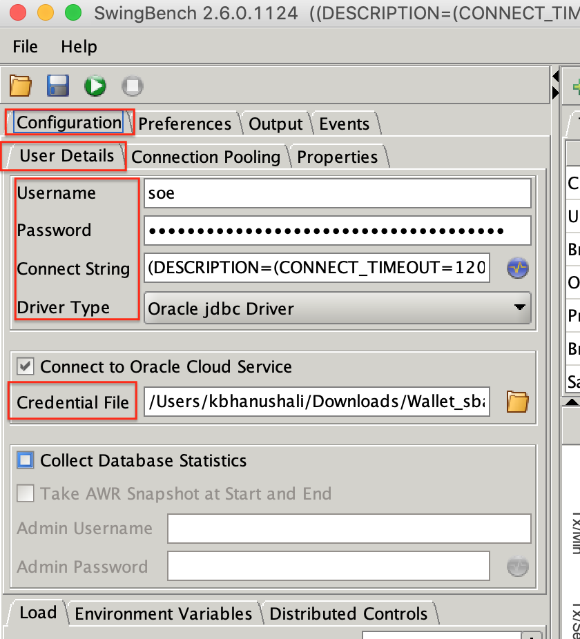

- On the **Configuration** --> **Connection Pooling** tab, setup connection pooling as shown below.

    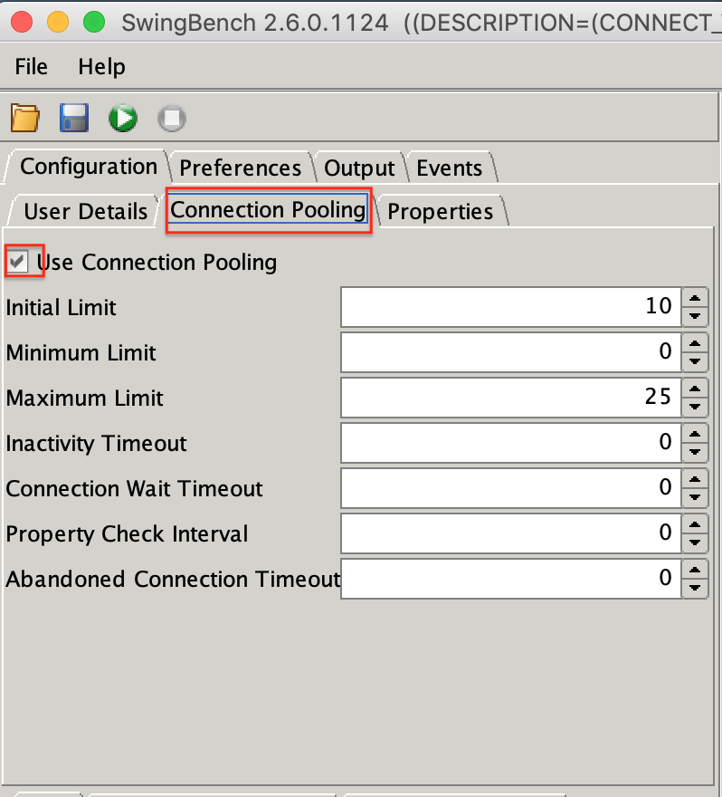

- On the **Configuration** --> **Properties** tab, set the following parameter.

    StatementCaching 120
    FetchSize  20
    AppContinuityDriver  True
    FastFailover  True
    OnsConfiguration nodes=10.0.0.7:6200,10.0.0.8:6200

    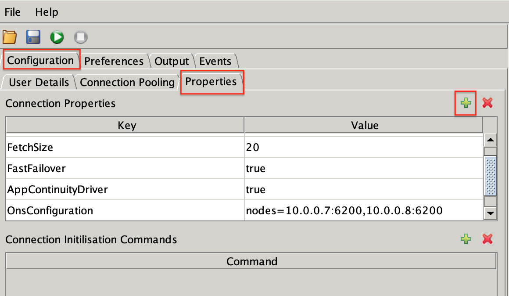

    *Note: For the OnsConfiguration parameter, you will need to provide the private IP address of the RAC nodes in your Autonomous Exadata Infrastructure. For instructions on obtained node private IP, refer to Appendix.*

- You may adjust the workload mix using the Transactions tab on the right.

    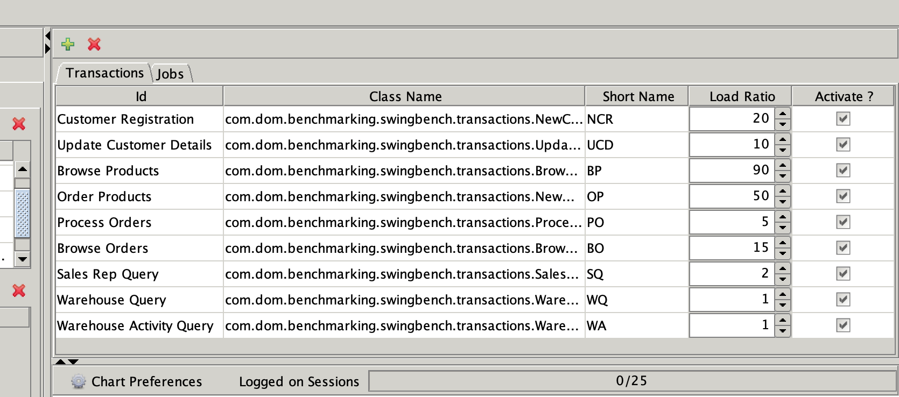

That is it. You are now ready to start up your transactional workload.

## Task 4: Simulate a failover event and observe workload

- Start up your workload and confirm all users are connected. Wait a few seconds while the charts load up.

    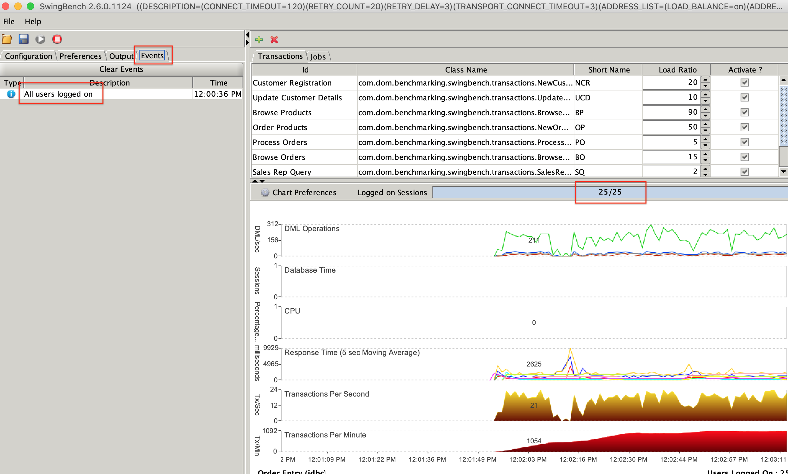

- To monitor client connections on each RAC node, open a terminal window, connect to your database instance using SQL*Plus, SQLcl or SQL Developer and run the following SQL command:

    ```
    <copy>
    select i.inst_id, count(*) from gv$session s , gv$instance i where (i.inst_id=s.inst_id) and username is not null group by i.inst_id;
    </copy>
    ```

- The output of the command should appear something like this.

    

    - In this case you can see we have a 2 instance RAC cluster with 27 connections on instance 1 and 1 connection on instance 2. This may vary a bit in your configuration.

    - Keep this terminal window open as we will re-run this command a few times to keep track of the connections.

- Next, we trigger a RAC rollover using Autonomous Container Database (ACD) restart.

- Navigate to your ADB details page on the OCI console to locate the container database as shown:

    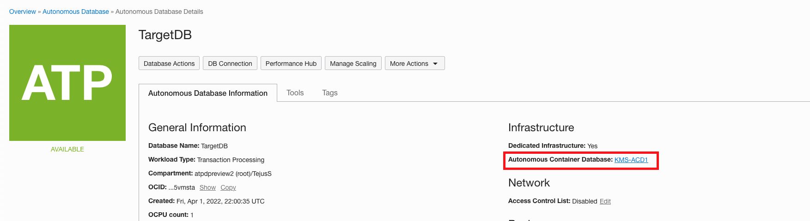

- When ready, restart the container database.

    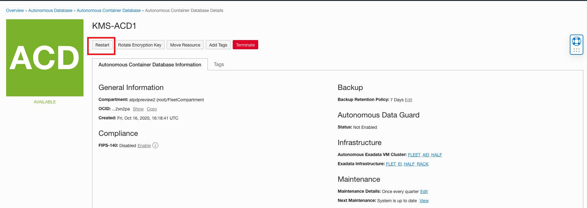

- Notice how the swingbench workload continues to run unaffected.

- Go back to the terminal window and rerun the connection monitoring SQL. You will notice the connections draining from instance 1 to instance 2. When all the connections are drained, your SQL session may get temporarily disconnected as node 1 is restarted. Give it a few minutes and reconnect your SQL Client.

- Re-run the SQL. This time your client has connected to instance 2. Once node 1 restart completes, the service will repeat the sequence on node 2 but draining all connections back to instance 1 and restarting node 2.

- All this time, your swingbench workload should continue to run. In case you notice application connection issues, failures, and so on, re-check your configuration parameter and make sure your application is using 18c jdbc drivers.

You may now **proceed to the next lab**.

## Acknowledgements
*Congratulations! You successfully configured the swingbench java application with Transparent Application Continuity and tested it with a simulated planned maintenance scenario.*

- **Author** - Tejus S. & Kris Bhanushali
- **Adapted by** -  Yaisah Granillo, Cloud Solution Engineer
- **Last Updated By/Date** - Kris Bhanushali, Autonomous Database Product Management, March 2022

## See an issue or have feedback?  
Please submit feedback [here](https://apexapps.oracle.com/pls/apex/f?p=133:1:::::P1_FEEDBACK:1).   Select 'Autonomous DB on Dedicated Exadata' as workshop name, include Lab name and issue / feedback details. Thank you!
