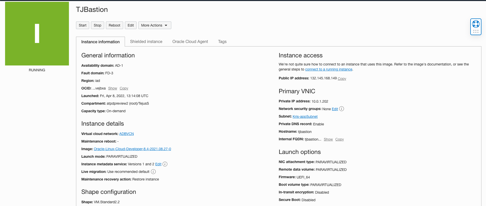
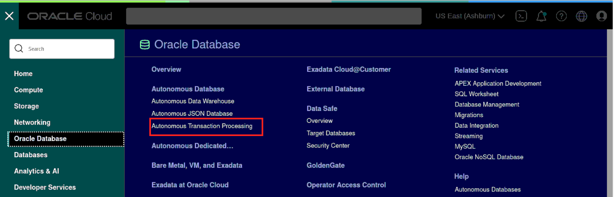
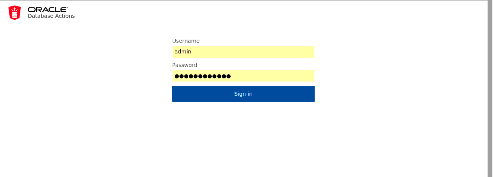

# Configure a development system for use with your dedicated autonomous database

## Introduction
The Oracle Linux Cloud Developer image provides the latest development tools, languages, and Oracle Cloud Infrastructure Software Development Kits (SDKs) to rapidly deploy a comprehensive development environment. You can use the command line and GUI tools to write, debug, and run code in various languages, and develop modern applications on Oracle Cloud Infrastructure. As an application developer you can now provision a developer image within minutes and connect it to your dedicated or serverless database deployment.

The image is pre-configured with tools and language drivers so that you can configure a secure connection using SQLCL and SQL*Plus.
For a complete list of features, and preinstalled components click [this documentation](https://docs.oracle.com/en-us/iaa.s/oracle-linux/developer/index.htm).

***NOTE: The Oracle Linux Cloud Developer Image is supported on all Compute shapes, except the GPU shapes. A minimum of 8 GB of memory is required for this image for all standard and flexible shapes. The one exception is the VM.Standard.E2.1.Micro shape, which only has 1 GB of memory allocated to it. Because of the small memory size in the VM.Standard.E2.1.Micro shape, some graphical intensive programs are not installed in the image. For more information, see x86_64 Notices.***

Estimated Time: 30 minutes

### Objectives

As a database user, DBA or application developer,
1. Create a development system from a pre-built Platform images
2. Create an ssh tunnel from your local laptop into your development system
3. Configure a secure connection from your development system to your dedicated autonomous database using Oracle SQL Developer, SQLCL and SQL*Plus.

### Required Artifacts

- An Oracle Cloud Infrastructure account with IAM privileges to provision compute instances
- A pre-provisioned dedicated autonomous database instance. Refer to the lab **Provisioning Databases** in the **Autonomous Database Dedicated for Developers and Database Users** workshop on how to provision an ATP database.
- VNC Viewer or other suitable VNC client on your local laptop


## Task 1: Provision Oracle Linux Cloud Developer Client image instance

Deploying a pre-configured client machine instance.

- Log in to your cloud account using your tenant name, username and password.
- Click **Compute --> Instances** in the left side menu under services.
    

- Click **Create Instance**.
    

- Specify a name for the compute instance and choose the right Compartment.

- Click on *Change image* under *Image and shape* select **Oracle Linux Cloud Developer Image** from Oracle Image section.
    

- Select *Oracle Linux Cloud Developer* image under *Platfor images* and click *Select image*.

    

- Click *Change shape* to change the VM shape.

    

- Choose *Virtual Machine* as the instance type, *Specialty and previous generation* as Shape series, *VM.Standard2.2*.
    
    

- Choose the VCN and subnet where you would like your client machine deployed. This would likely be the application subnet created in previous labs.

    *Note:
    Please ensure you have picked the right compartments where network resources exist.*
    - A network administrator needs to pre-provision a client network and setup access path to your autonomous database network. Please contact your cloud account / network / fleet administrator for application subnet information.

    


    Ensure the public IP address button is selected. You would need to ssh into this instance over public internet.
    

- Add SSH key, you can choose to import ssh public key or paste ssh public key.
    


- Once provisioned, you can click on the instance name to see details.
    


## Task 2: Download and transfer DB wallet to client machine

Let's first download the DB wallet to your local machine (laptop) and then scp / sftp it to the developer client machine.

 *Note: You may skip the download and secure copy steps below and download the wallet directly into your developer client machine once you connect to it via VNC*

- From your local browser, navigate to OCI console.

- On the ATP console, select the dedicated ATP instance provisioned in the lab **Provisioning Databases** in the **Autonomous Database Dedicated for Developers and Database Users** workshop on how to provision an ATP database.
    

- Click **DB Connection** to open the Database Connection pop-up window.
    

- Click **Download** to supply a password for the wallet and download your client credentials.
    Please use below Keystore password to download the client credentials.

    ```
    <copy>
    WElcome#1234
    </copy>
    ```

    
    

- The credentials zip file contains the encryption wallet, Java keystore and other relevant files to make a secure TLS 1.2 connection to your database from client applications.

- Next we upload the wallet to the dev client.

    *Mac users can scp the file using command below. Windows 10 users can use the same command from powershell. Older versions of windows may need to install an SFTP client on their local machine to upload the wallet*

- Secure copy the file using scp, sftp or a Windows ftp client.

    ```
    <copy>
        $ scp -i <path/to/keyfile> <wallet_filename.zip>  opc@<ipaddress-of-dev-client>:/home/opc
    </copy>
    ```

    Example, for mac users with a private key file named id_rsa in their home directoy,

    ```
    <copy>
        $ scp -i ~/id_rsa My-ATPDB-wallet.zip  opc@129.162.23.12:/home/opc
    </copy>
    ```


## Task 3: Connect to dev client desktop over VNC

First we shh into the dev client and invoke the VNC server that comes pre-installed.

- SSH into your dev client compute instance.

    ```
    <copy>
    $ ssh -i <private-key> opc@PublicIP
    </copy>
    ```

- Change the password on the VNC server.

    ```
    <copy>
    $ vncpasswd
    </copy>
    ```
- Once you update the password, start your VNC server with the following command:

    ```
    <copy>
    $ sudo systemctl daemon-reload
    $ sudo systemctl enable --now vncserver@:1.service
    </copy>
    ```
- Your development system may now be ready for accepting VNC connections.

**Mac Users**

  - Open a new terminal window and create an ssh tunnel using the following command:

    ```
    <copy>
    $ ssh -N -L 5901:127.0.0.1:5901 -i \<priv-key-file\> opc@<publicIP-of-your-devClient>
    </copy>
     ```

**Windows Users**
  - Windows 10 users can use powershell to connect using command above.

  - Alternatively, you may create and ssh tunnel using putty. Detailed instructions on using putty for ssh tunnels are provided in the [Appendix](?lab=appendix).

  You now have a secure ssh tunnel from your local laptop to your development system in OCI on VNC port 5901.

  *Note: As mentioned earlier, you need a VNC client installed on your laptop. This lab uses VNC Viewer.*

  Start VNC Viewer on your laptop and configure a client connection using the settings as shown.
      

  - Note how the connect string for VNC Server is simply **localhost:1**.  That is because the default port 5901 on your local machine is forwarded to 5901 on your OCI dev client over an ssh tunnel.

  - Connect to your VNC desktop and provide the password you changed on the host earlier.

  - If all goes well, you should now see a linux desktop in your VNC window.

## Task 4: Connect to your autonomous DB using SQL Worksheets from Database Actions, SQLCL and SQL Plus

- On successful conection to VNC desktop, click on *Activities* from your VNC Viewer and click on *Firefox* browser. 
    

- Login to your OCI console and navigate to your Autonomous Database.
    

- Click on *Database Actions* from Autonomous Database page and copy the URL. 
    
    

- Paste the URL in new tab and enter **admin** as *Username* and the password for your Autonomous database. 

    

- You are now connected to *Database actions* *SQL worksheet*. 
    

- *Let's also test connectivity through some command line client tools such as SQLCL and SQL-Plus.*

- Connect to ATP instance using Oracle SQLCL.

    Assuming you are still connected to your OCI development system over VNC, simply open a terminal window and start command line sql as follows:

    ```
    <copy>
    $ sql /nolog
    </copy>
    ```
    Point to your database wallet folder:

    ```
    <copy>
    SQL> set cloudconfig /home/opc/Wallet_ATPD.zip
    </copy>
    ```
    Connect to your database:
        

    ```
    <copy>
    SQL> connect admin@atpd_high  (replace 'atpd_high' with an appropriate service for your instance)
    </copy>
    ```
    Provide your admin password and you are in!
        


- Connect to ATP instance using Oracle SQL Plus.

    For SQL*Plus, you will need to unzip the wallet in your local folder and edit sqlnet.ora as follows:

    - Edit the sqlnet.ora file in /home/opc/wallet and change the line ?/network/admin:

    Before:

    ```
    <copy>
    WALLET_LOCATION = (SOURCE = (METHOD = file) (METHOD_DATA = (DIRECTORY="?/network/admin")))
    SSL_SERVER_DN_MATCH=yes
    </copy>
    ```

    After:
    ```
    <copy>
    WALLET_LOCATION = (SOURCE = (METHOD = file) (METHOD_DATA = (DIRECTORY="/home/opc/wallet")))
    SSL_SERVER_DN_MATCH=yes
    </copy>
    ```

    Set the TNS_ADMIN env variable to point to wallet folder:

            $export TNS_ADMIN=/home/opc/wallet

    - Now, run:

    ```
    <copy>
    sqlplus admin@atpd_high
    </copy>
    ```

    Provide your admin password when prompted and you should be in!

You may now **proceed to the next lab**.

## Acknowledgements

*Great Work! You successfully created a client machine and connected to your autonomous database instance using SQL Developer and command line tools.*

- **Author** - Tejus S. & Kris Bhanushali
- **Adapted by** -  Yaisah Granillo, Cloud Solution Engineer
- **Last Updated By/Date** - Kris Bhanushali, Autonomous Database Product Management, April 2022

## See an issue or have feedback?  
Please submit feedback [here](https://apexapps.oracle.com/pls/apex/f?p=133:1:::::P1_FEEDBACK:1).   Select 'Autonomous DB on Dedicated Exadata' as workshop name, include Lab name and issue / feedback details. Thank you!
