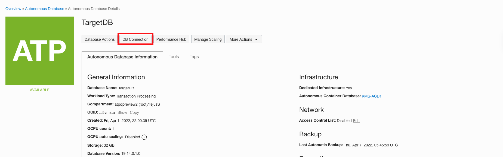
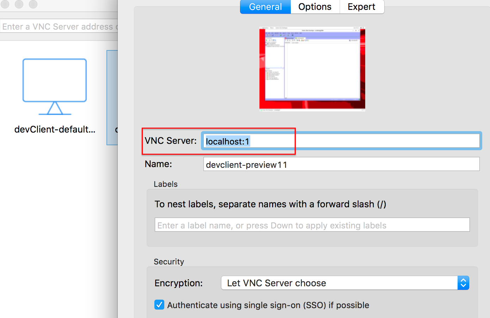
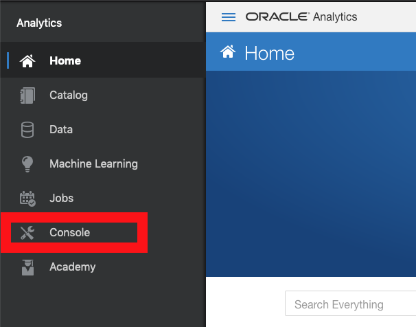
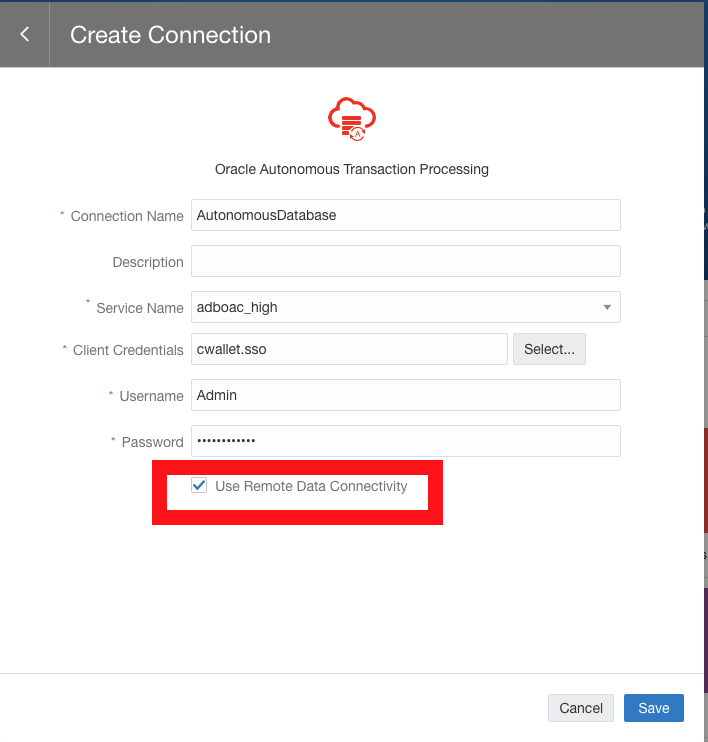

# Connect Oracle Analytics Cloud with your dedicated autonomous database

## Introduction
Oracle Analytics Cloud empowers business analysts and consumers with modern, AI-powered, self-service analytics capabilities for data preparation, visualization, enterprise reporting, augmented analysis, and natural language processing/generation.

Oracle Analytics Cloud is a scalable and secure public cloud service that provides a full set of capabilities to explore and perform collaborative analytics for you, your workgroup, and your enterprise.

With Oracle Analytics Cloud you also get flexible service management capabilities, including fast setup, easy scaling and patching, and automated lifecycle management.

Estimated Time: 45 minutes

### Objectives

As a LOB user
1. Install and configure Remote Data Gateway in Oracle Cloud Developer Image.
2. Configure Remote Data Gateway with Oracle Analytics Cloud.
3. Connect Autonomous Database Dedicated with Oracle Analytics Cloud.

### Required Artifacts

- A pre-provisioned instance of Oracle Developer Client image in an application subnet. Refer to the lab **Configuring a Development System** in the **Autonomous Database Dedicated for Developers and Database Users** workshop on how provision a developer client.
- A pre-provisioned Autonomous Transaction Processing instance. Refer to the lab **Provisioning Databases** in the **Autonomous Database Dedicated for Developers and Database Users** workshop on how to provision an ATP database.
- A pre-provisioned Oracle Analytics Cloud instance. Refer [to this documentation](https://docs.oracle.com/en/cloud/paas/analytics-cloud/acoci/create-services.html#GUID-D2F03D22-95FB-45C8-AB94-928AE4E167AB) to create Oracle Analytics Cloud.
- VNC Viewer or other suitable VNC client on your local laptop.

## Task 1: Download DB wallet to local machine

Let's first download the DB wallet to your local machine (laptop) and then scp / sftp it to the developer client machine.

 *Note: You may skip the download and secure copy steps below and download the wallet directly into your developer client machine once you connect to it via VNC*

- From your local browser, navigate to OCI console.

- On the ATP console, select the dedicated ATP instance provisioned in the lab **Provisioning Databases** in the **Autonomous Database Dedicated for Developers and Database Users** workshop.
    

- Click **DB Connection** to open up a Database Connection pop-up window.
    

- Click **Download** to supply a password for the wallet and download your client credentials.
    Please use the following Keystore password to download the client credentials:

    ```
    <copy>
    WElcome#1234
    </copy>
    ```

    
    

- The credentials zip file contains the encryption wallet, Java keystore and other relevant files to make a secure TLS 1.2 connection to your database from client applications.

## Task 2: Connect to dev client desktop over VNC

First we SSH into the dev client and invoke the VNC server that comes pre-installed.

- SSH into your dev client compute instance.

    ```
    <copy>
    $ ssh -i <private-key> opc@PublicIP
    </copy>
    ```

- Change the password on the VNC server.

    ```
    <copy>
    $ vncpasswd
    </copy>
    ```
- Once you update the password, start your VNC server with the following command:

    ```
    <copy>
    $ vncserver -geometry 1280x1024
    </copy>
    ```
- Your development system may now be ready for accepting VNC connections.

**Mac Users**

  - Open a terminal window and create an ssh tunnel using the following command:

    ```
    <copy>
    $ ssh -N -L 5901:127.0.0.1:5901 -i \<priv-key-file\> opc@<publicIP-of-your-devClient>
    </copy>
     ```

**Windows Users**
  - Windows 10 users can use powershell to connect using the command above.

  - Alternatively, you may create an ssh tunnel using putty. Detailed instructions on using putty for ssh tunnels are provided in the [Appendix](?lab=appendix).

  You now have a secure ssh tunnel from your local laptop to your development system in OCI on VNC port 5901.

  *Note: As mentioned earlier, you need a VNC client installed on your laptop. This lab uses VNC Viewer.*

  Start VNC Viewer on your laptop and configure a client connection using the settings as shown.
      

  - Note how the connect string for VNC Server is simply **localhost:1**. That is because the default port 5901 on your local machine is forwarded to 5901 on your OCI dev client over an ssh tunnel.

  - Connect to your VNC desktop and provide the password you changed on the host earlier.

  - If all goes well, you should now see a linux desktop in your VNC window.

## Task 3: Download, install and configure Remote Data Gateway

1. Download OAC Data Gateway 5.6.0+ from [this download site.](https://www.oracle.com/middleware/technologies/oac-downloads.html)

2. Secure copy the file using scp, sftp or a windows ftp client.

#### Note: You will be secure copying the zip file from your local machine to Cloud Developer Image

    ```
    <copy>
        $ scp -i <path/to/keyfile> <datagateway-linux.zip>  opc@<ipaddress-of-dev-client>:/home/opc
    </copy>
    ```

    Example, for mac users with a private key file named id_rsa in their home directory,

    ```
    <copy>
        $ scp -i ~/id_rsa datagateway-linux.zip  opc@129.162.23.12:/home/opc
    </copy>
    ```

3. In your VNC session, unzip the data gateway file.

    ```
    unzip 'datagateway_file.zip'
    ```

    

4. Run the bin file.

    ```
    ./datagate_file.bin
    ```
    

5. Oracle Analytics Cloud RDC Installer should pop-up. Select default Inventory Directory and click **OK**.

    

6. Click **Next** on the Welcome page.

    

7. Enter RDC installer location and click **Next**.

    ```
    /home/opc/Oracle/Middleware/Oracle_Home
    ```
    

8. Select Remote Data Gateway in Remote Data Version and click **Next**.

    

9. Enter Username and Password for Agent Configuration Credentials and click **Next**.

    ```
    Username: admin
    Password: WElcome_123#
    ```

    

10. Verify the Installation Summary and click **Install**.

    

11. Once the installation progress is 100% click **Next**.

    

12. Verify Start Jetty is checked and click **Finish**.

    

13. Configure Data Gateway with Oracle Analytics Cloud. Open web browser in your Cloud Developer Image and type in the below URL.

    ```
    http://localhost:8080/obiee/config.jsp
    ```

    

14. Enter the Username and Password as specified earlier in this lab and click **OK**.

    ```
    Username: admin
    Password: WElcome_123#
    ```

15. Enable Data Gateway, enter OAC URL and click **Generate Key** to generate a json key.

    #### Note: Copy the Generated key to a note pad. We will be using the key in Oracle Analytics Cloud console.

    

    

16. Click **Test** and scroll down to bottom of the page to verify. You should see the following message:

    ```
    Sucecessfully authenticated
    ```

    

17. Click **Save** and scroll down to bottom of the page to verify.

    ```
    Successfully Submitted
    ```

    


## Task 4: Configure Remote Data Connectivity and connect Autonomous Database Dedicated to Oracle Analytics Cloud

- Open Oracle Analytics Cloud URL in you local machine and log in to the console.

    

- Open the menu on the top left corner and click **Console**.

    

- Click **Remote Data Connectivity** on the Console page.

    

- Click **Add** in the Remote Data Connectivity page.

    

- Paste the key you copied in Task 3, step number 15, into the **Public Key** field and click **OK**.

    #### Note Name, ID and Host will be auto populated once you paste the public key.

    

- Open the Menu on the top left corner and click **Home**.

    

- Click **Create** on the top right corner and click **Connection**.

    

- Select Oracle Autonomous Transaction Processing.

    

- Enter a **Connection Name** and click **Select** to upload your database wallet.

    

- Once you upload your wallet, Service Name and Client Credentials should be automatically populated.

    

- Enter Username and Password of your Autonomous Database and place a check mark on **Use Remote Data Connectivity**.

    

- Click the **Search** bar and select **Connection**.

    

- You can see Autonomous Database connected to Oracle Analytics Cloud.

    

For more information on Oracle Analytics Cloud please visit [this OAC website](https://www.oracle.com/business-analytics/analytics-cloud.html).

To further explore Oracle Analytics Cloud you can visit [our blogs](https://blogs.oracle.com/analytics/).

You may now **proceed to the next lab**.

## Acknowledgements

*Great Work! You successfully connected Autonomous Database Dedicated to Oracle Analytics Cloud through Remote Data Gateway.*

- **Author** - Tejus S. & Kris Bhanushali
- **Adapted by** -  Yaisah Granillo, Cloud Solution Engineer
- **Last Updated By/Date** - Kris Bhanushali, Autonomous Database Product Management, March 2022

## See an issue or have feedback?  
Please submit feedback [here](https://apexapps.oracle.com/pls/apex/f?p=133:1:::::P1_FEEDBACK:1).   Select 'Autonomous DB on Dedicated Exadata' as workshop name, include Lab name and issue / feedback details. Thank you!
