# Use Autonomous Data Guard to protect Autonomous AI Databases from failures

## Introduction

The Autonomous Data Guard feature enables you to keep your critical production databases available to mission critical applications despite failures, disasters, human error, or data corruption. In Autonomous AI Database on Dedicated Exadata Infrastructure, you configure and manage Autonomous Data Guard at the Autonomous Container Database level.

Autonomous Data Guard creates and maintains two completely separate copies of your database: a primary database that your applications connect to and use, and a standby database that is a synchronized copy of the primary database. Then, should the primary database become unavailable for any reason, Autonomous Data Guard can convert the standby database to the primary database and, as such, it will begin servicing your applications.

The primary and standby databases are often called peer databases of each other. You can have up to two standby databases per Autonomous Container Database.

Estimated Time: 45 minutes

### Objectives:

- As a fleet administrator, Add a standby database to an existing Autonomous Container Database (ACD)

- As a database user, DBA or application developer:

    1. Provision an Autonomous AI Database within an Autonomous Container Database (ACD).
    2. Install and configure Swingbench against the primary Autonomous AI Database, then test both switchover and failover scenarios.
    3. Reinstate an Autonomous Data Guard standby database after a failover operation.
    4. Convert a physical standby database to a snapshot standby database and convert it back to a physical standby database.

### Required Artifacts

- An Oracle Cloud Infrastructure (OCI) account with two Autonomous VM Clusters (AVMCs) provisioned in the tenancy: one designated as the primary AVMC and the other as the standby AVMC.
- A provisioned Autonomous Container Database (ACD). Refer to [Lab 6: Provisioning an Autonomous Container Database](?lab=adb-provisioning-autonomous-container) for instructions.

## Task 1: Add a standby database to an ACD

- Go to the Details page of the Autonomous Container Database for which you want to add a standby database.
- Click **Enable** under **Autonomous Data Guard** in Autonomous Container Database information. Alternatively, you can also click **Add Standby** on **Autonomous Data Guard Groups**. 

  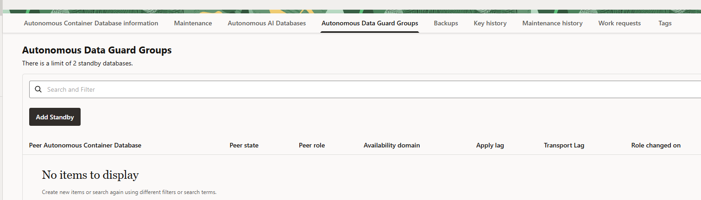

  Fill out the **Add Standby** dialog with the following information:

    - Peer Autonomous Container Database compartment: Select the standby Autonomous Container Database compartment.
    - Peer Autonomous Container Database name: Enter a name for the standby ACD.
    - Peer database backup configuration: Select a Backup Destination type from the drop-down list.
    - Peer region: Select a region for the standby ACD. The primary and secondary ACDs can also be deployed in different regions (cross-region).
    - Peer Exadata Infrastructure: Select the underlying Exadata Infrastructure resource for the standby ACD.
    - Peer Autonomous Exadata VM Cluster (AVMC): Select the parent AVMC for the standby ACD.
    - Protection Mode: Select Maximum performance or Maximum availability from the drop-down list. Maximum Performance is selected by default.

    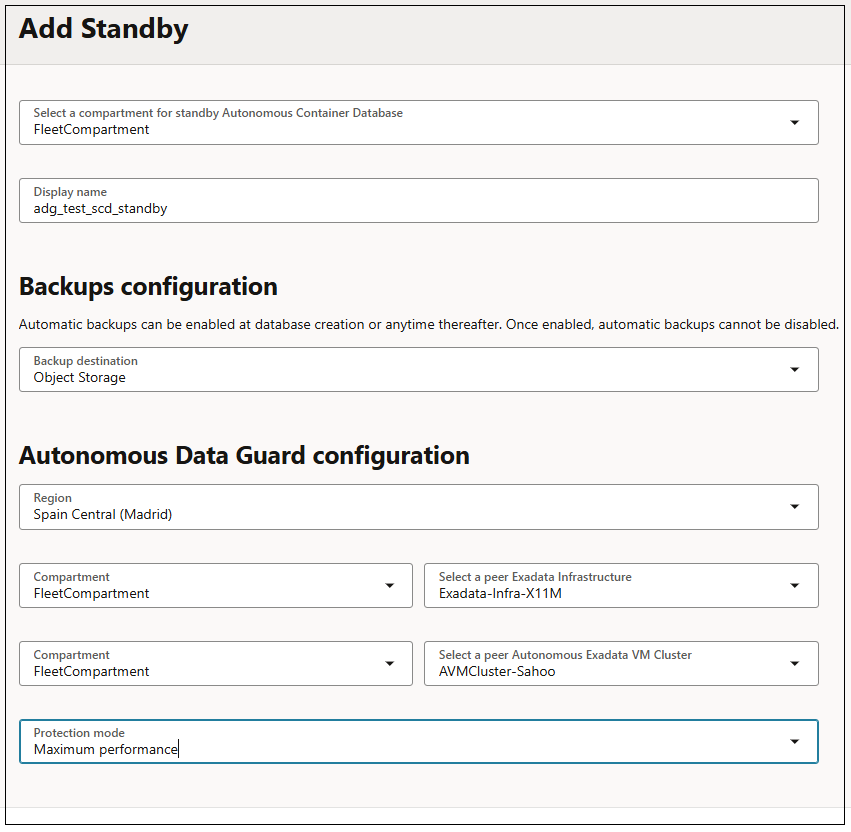

- Confirm to add the standby database.

**Note**: In an Autonomous Data Guard setup, you can add a second standby Autonomous Container Database (ACD) to the primary ACD. The second standby ACD must be in the same tenancy as the primary ACD. To be able to add a second standby ACD, the first standby ACD should not have automatic failover enabled. You must disable automatic failover on the first standby before adding the second standby and can re-enable later.

## Task 2: Create an Autonomous AI Database

- Go to **Autonomous AI Database** in the Oracle Cloud Infrastructure Console. If needed, switch to the region where you want to create the database.
- Click **Create Autonomous AI Database**. Fill out the Create Autonomous AI Database page with the following information:

    - Compartment: Select a compartment to host the Autonomous AI Database.
    - Display name: Enter a user-friendly description or other information that helps you easily identify the Autonomous AI Database.
    - Database name: Provide a name for the new Autonomous AI Database.
    - Workload type: Choose Transaction Processing.
    - Autonomous Container Database: Select the primary ACD in which to create the Autonomous AI Database.

    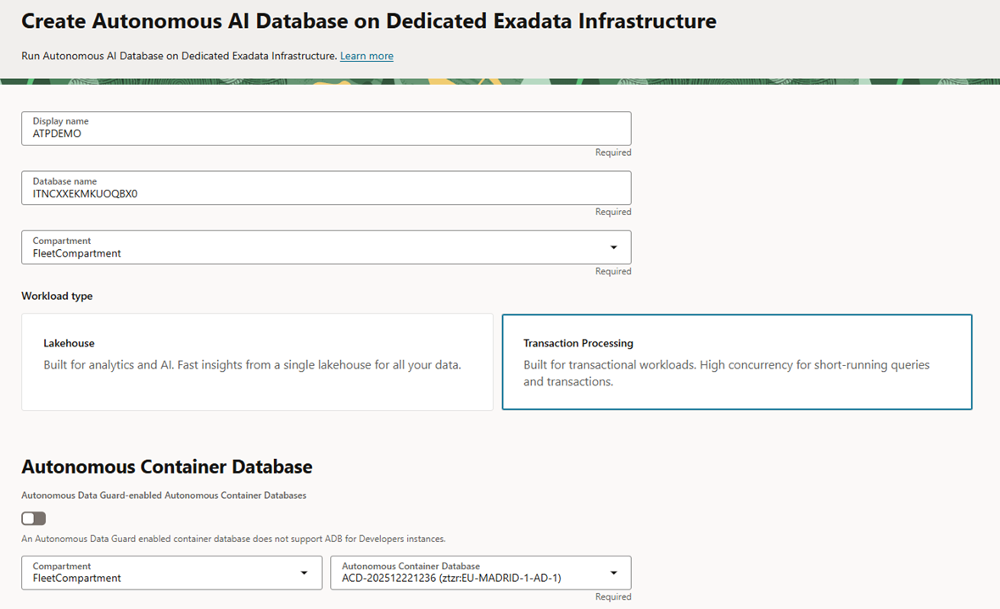

    - Configure the database - CPU count: Select the number of CPUs for your database from the list of provisionable CPUs.
    - Configure the database - CPU auto scaling: Enable or disable CPU auto scaling, which permits Autonomous AI Database to automatically use up to three times as many CPUs as specified by CPU Count as the workload on the database increases.
    - Configure the database - Storage (GB): Specify the storage to allocate to your database in terabytes (GB), with a minimum value of 32 GB.

    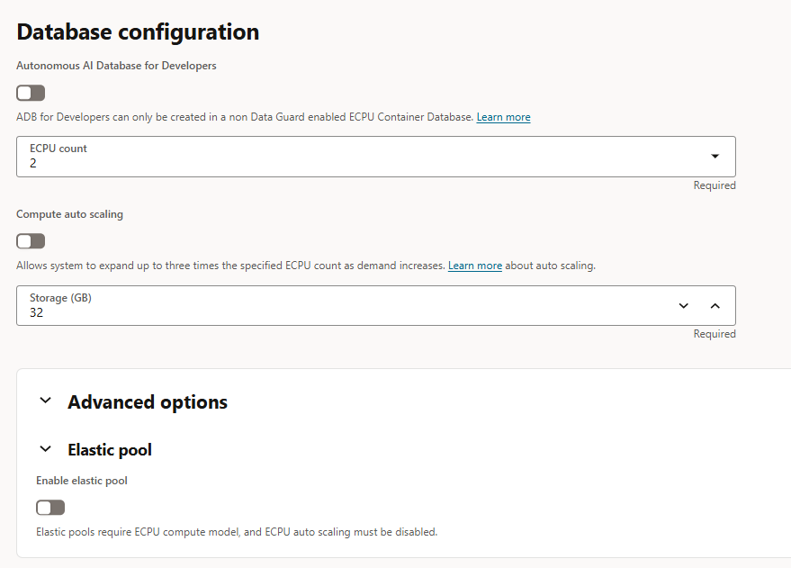

    - Username: Denotes the database’s username. This is a read-only value.
    - Password: Set the password for the Admin database user in your new database. Re-confirm the password.
    - Access Control:  Optionally, click Modify Access Control to configure network access by enabling database level access control, which is disabled by default.
    - Contact email:  Provide contact emails where you can receive operational notifications, announcements, and unplanned maintenance notifications.

    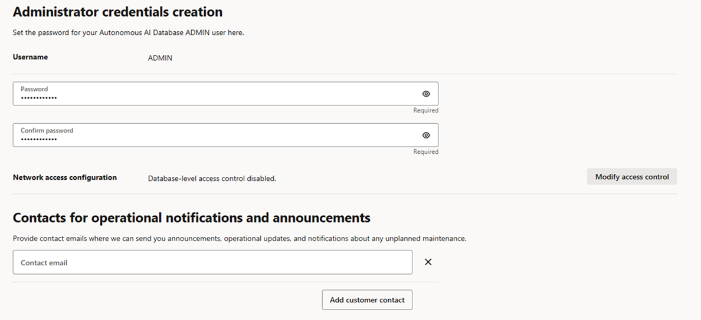

    - Advanced options - Encryption key: The encryption key settings are inherited from the parent Autonomous Container Database.
    - Advanced options - Management: Choose a Character Set and National Character Set from the drop-down list.
    - Advanced options - Database In-memory: Optionally, select Enable database In-memory and adjust the percentage of System Global Area (SGA) to allocate.
    - Advanced options - Tags: If you want to use tags, add tags by selecting a Tag Namespace, Tag Key, and Tag Value.

    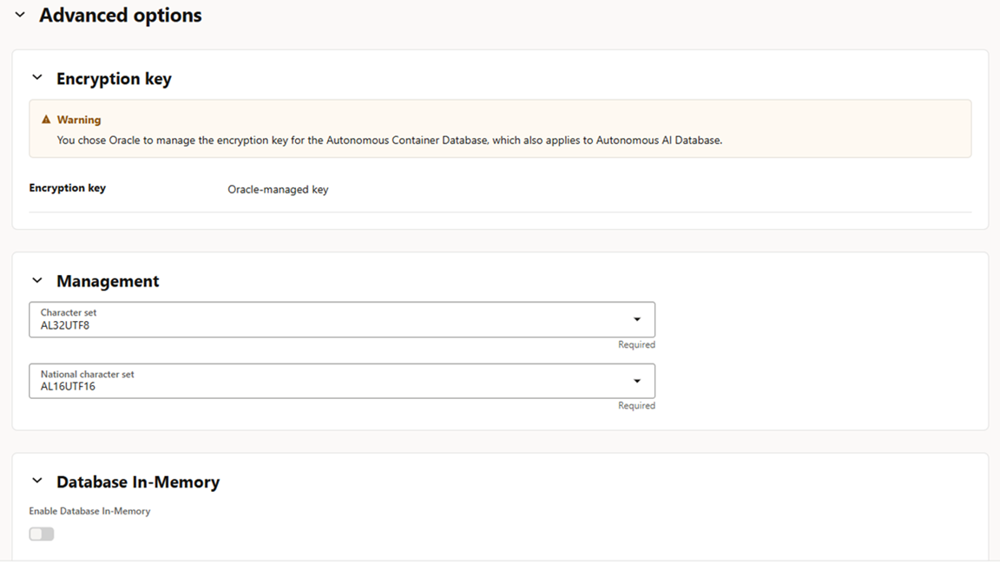

- Submit the details to create the Autonomous AI Database.

## Task 3: Configure Swingbench in your new Autonomous AI Database

Complete **Task 1**, **Task 2** and **Task 3** from the lab **Build Always On Applications** in the [Introduction to ADB Dedicated for Developers and Database Users](https://livelabs.oracle.com/ords/r/dbpm/livelabs/run-workshop?p210_wid=3197) workshop.

You have now installed and configured Swingbench to generate a transactional workload against an Autonomous AI Database. You have also configured the required client-side settings to enable Transparent Application Continuity (TAC).

## Task 4: Switchover to the Standby

- Once the load has stabilized from starting the **SOE\_Client\_Side** Swingbench benchmark, log in to the cloud console and navigate to your **primary** Autonomous Container Database.

- Under Actions, click **Switchover**.

- Select **Switchover** from the drop down menu (3 dots) on the lower right of the screen.

  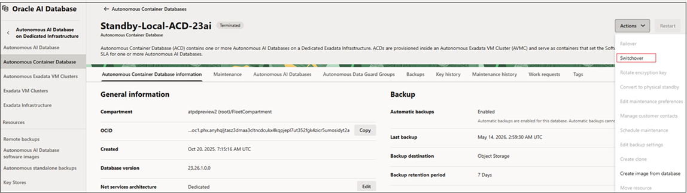

- Select **Switch Over** from the dialog box and wait for the role change to finish.

  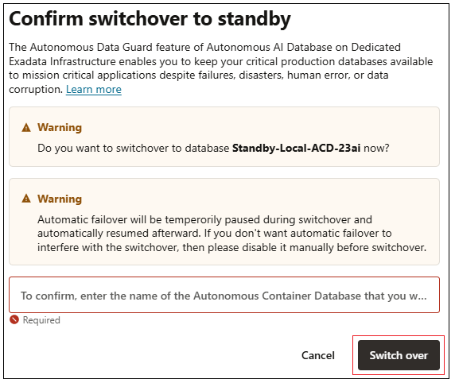

- Wait a few minutes while a clean switchover is done automatically and the standby becomes the new primary and the previous primary becomes a standby. There will be a small lag in transactions while this process is completed and zero data is lost. The Swingbench application will automatically retry and continue transactions on the new primary once it is opened.  

## Task 5: Failover to the Standby

- Once the load has stabilized on the new primary, log into the cloud console and navigate to your **standby** Autonomous container database.

- Under Actions, click **Failover**.

  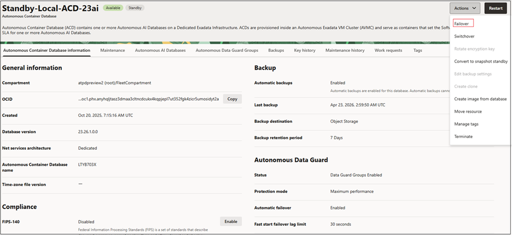

- In case of a snapshot standby Autonomous Container Database, you see a message alerting you that the snapshot standby will be converted to physical standby after discarding all its local updates and applying data from your primary database. Click **Failover** to proceed.

  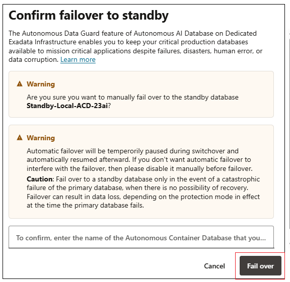

- Wait a few minutes while the failover is done automatically and the standby becomes the new primary and the previous primary will be disabled. There will be a small lag in transactions while this process is completed. The Swingbench application will automatically retry and continue transactions on the new primary once it is opened.

## Task 6: Reinstate the disabled standby

- Log in to the cloud console and navigate under Autonomous AI Database and select Autonomous Container Database.

- Select the ACD labeled **Disabled Standby**.

- Under Actions, click **Reinstate Database**.

- Provide a confirmation to proceed with the reinstatement of the disabled standby ACD. The states of the peer databases become **Role Change in Progress** until the reinstate action is complete. Upon completion, the role of the Disabled Standby container database becomes **Standby** and its state changes to **Available**.

## Task 7: Convert to snapshot standby

- Log on to the cloud console and navigate to your standby ACD.

- On the standby ACD details page , click **Convert to snapshot standby** under Actions.

  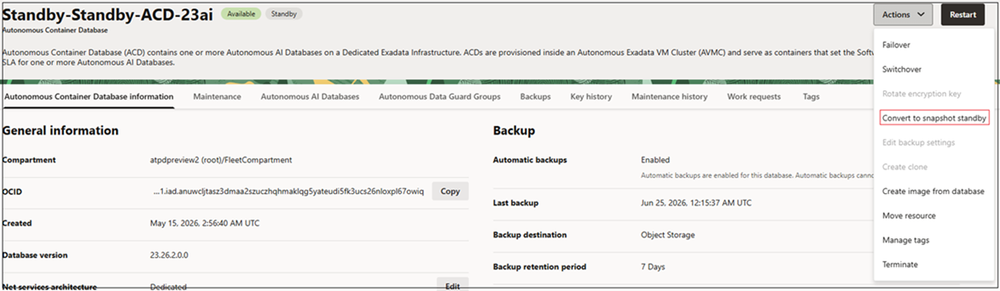

- The Convert to snapshot standby dialog displays with options to use new Database services or primary Database services for the snapshot standby database connections.

    - Use new Database services: Click this option to connect to snapshot standby using new services that are active only in the snapshot standby mode.
    - Use primary Database services: Click this option if you wish to connect to snapshot standby database using the same services as the primary database.

- You will be presented with two options while converting the database to snapshot mode.

    - Use new database services: New snapshot standby services will be created in your standby database that you will use to connect to it.
    - Use primary database services: Databases services that are active on primary ACD will be enabled on the snapshot standby ACD also. Extreme caution must be taken while using the primary services.

  Select your option and click convert.

  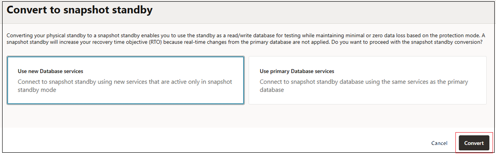

- Once the standby database is converted to snapshot standby database, you will see a new pill at the top of the ACD details page highlighting the database mode. You will also see a warning message about snapshot standby database reverting to physical standby after 7 days.

## Task 8: Convert to physical standby

- Log on to the cloud console and navigate to your standby ACD.

- On the standby ACD details page , click **Convert to physical standby** under Actions.

- The Convert to physical standby dialog displays a message alerting you that converting the snapshot standby to physical standby will discard all its local updates and apply data from your primary database. Click **Convert**.

- Once the conversion to physical standby is complete, the pill at the top of the ACD will change back to standby mode.

*Congratulations! You successfully built and tested using the switchover and failover functionality of Autonomous Data Guard!*

You may now **proceed to the next lab**.

## Acknowledgements

- **Author** - Jeffrey Cowen, Ranganath S R
- **Adapted By/Date :** - Vandana Rajamani, Consulting UA Developer, June 2026
- **Last Updated By/Date** - Vandana Rajamani, Consulting UA Developer, July 2026
