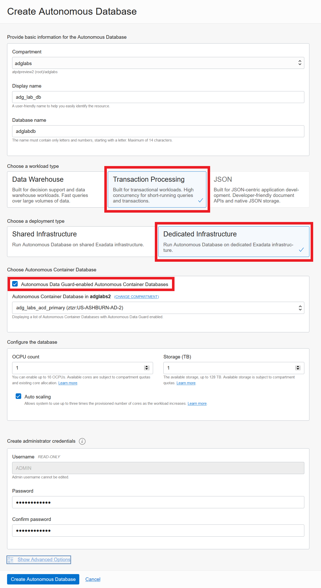

# Autonomous Data Guard

## Introduction
Autonomous Data Guard (AuDG) gives users the ability to create a standby database for an Autonomous Container Database (ACD) and all Autonomous Databases (ADB) built inside the ACD in just a few clicks.  As always in the Autonomous world - It is completely automated!

Estimated Time: 45 minutes

### Objectives:

As a fleet administrator:
1.  Deploy an Autonomous Container Database (ACD) onto an Cloud Exadata Infrastructure (CEI) with Autonomous Data Guard (AuDG) enabled.
2.  Review the AuDG setup and understand options and monitoring available.

As a database user, DBA or application developer:
1.  Deploy an autonomous transaction processing database inside of the Autonomous Data Guard enabled ACD.
2.  Build and configure Swingbench on the primary ADB and test switchover and failover scenarios.
3.  Reinstate a failed over AuDG database.


### Required Artifacts

- An Oracle Cloud Infrastructure account with two Cloud Exadata Infrastructure (CEI) created in the tenancy (primary and standby)


## Task 1: Create an ADG enabled ACD

- Log in to your OCI account as a fleet administrator

- Navigate to the **Oracle Database** option in the top left hamburger menu from your OCI home screen and click **Autonomous Transaction Processing** on the page that comes up.

- Pick **Autonomous Container Database** from the three options and click the blue **Create Autonomous Container Database** button.

    

- In the **Create Autonomous Container Database** dialog box you can choose / modify the compartment to create your ACD. You also need to select the compartment hosting your CEI and the CEI instance as highlighted below.

- Check the box titled **Enable Autonomous Data Guard**. You will be able to select the region and CEI that you want to use for your standby databases.

- Under Protection Mode select '**Maximum Performance**'

- Enable automatic failover by selecting the Enable automatic failover option. Both the maximum performance and maximum availability protection modes support automatic failover:

    - In the Maximum availability mode, automatic failover guarantees zero data loss.
    - In the Maximum performance mode, automatic failover ensures that the standby database does not fall behind the primary database beyond the value specified for Fast Start failover lag limit. By default, Fast Start failover lag limit is set to 30 seconds and is applicable only to the Maximum performance mode. In this case, automatic failover is only possible when the configured data loss guarantee can be upheld.

***Maximum Performance: Provides the highest level of data protection that is possible without affecting the performance of a primary database. This is the default protection mode.***

***Maximum Availability: Provides the highest level of data protection that is possible without compromising the availability of a primary database.***

  

***Note: If you select modify maintenance and click custom schedule you will see that it is possible to have the standby ACD patched up to 7 days before the primary for an extra buffer of patch verification time.***

  

- That's it! Simply scroll down to the bottom and hit the blue 'Create Autonomous Container Database' button to deploy your primary and standby ACD automatically.

- Continue to Task 2 once the ACD has finished being created.

## Task 2: Create an Autonomous Transaction Processing Database

- Log in to your OCI account as a database user.

- Navigate to the **Oracle Database** option in the top left hamburger menu from your OCI home screen and click **Autonomous Transaction Processing** on the page that comes up.

- Pick **Autonomous Database** from the three options in the left menu.

- Select **userXX-Compartment** under the Workshop Compartment.

    

    *Note: Oracle Cloud Infrastructure allows logical isolation of users within a tenancy through Compartments. This allows multiple users and business units to share an OCI tenancy while being isolated from each other.*

    *More information about Compartments and Policies is provided in the OCI Identity and Access Management [documentation](https://docs.cloud.oracle.com/iaas/Content/Identity/Tasks/managingcompartments.htm?tocpath=Services%7CIAM%7C_____13).*

- Click **Create Autonomous Database** to start the instance creation process.
    

- This will bring up the **Create Autonomous Database** screen where you specify the configurations of the instance.

- Fill in the dialog box following the screenshot below while using your user compartment and unique ADB name.

    *For this lab, we will be using the following as a password.*

    ```
    <copy>
    WElcome#1234
    </copy>
    ```

    

- Click **Create Autonomous Database** to start provisioning the instance.

- Your autonomous database instance should be up and running in a few minutes and is protected by AuDG.

- Once provisioned, you can click on the instance name to see instance details.

- Continue to Task 3 once creation has completed.

## Task 3: Configure Swingbench in your new ATP database

- Refer to the lab **Build  Always On  Applications** in the **Introduction to ADB Dedicated for Developers and Database Users** workshop, to create a Swingbench schema in your new ATP ADB.

- You will need to download the wallet from your new ATP and upload to your client.

- Here is a sample TNS entry from an AuDG ATP enabled instance. Notice how both the primary and standby are in the connection string and the extra parameters to facilitate reconnecting.

***adglabdb_medium=(DESCRIPTION=(CONNECT_TIMEOUT=90)(RETRY_COUNT=50)(RETRY_DELAY=3)(TRANSPORT_CONNECT_TIMEOUT=3)(ADDRESS_LIST=(LOAD_BALANCE=on)(ADDRESS=(PROTOCOL=TCP)(HOST=host-qr7it-scan.fleetsubnet.adbvcn.oraclevcn.com)(PORT=1521)))(ADDRESS_LIST=(LOAD_BALANCE=on)(ADDRESS=(PROTOCOL=TCP)(HOST=host-zsge4-scan.fleetsubnet.adbvcn.oraclevcn.com)(PORT=1521)))(CONNECT_DATA=(SERVICE_NAME=ADGLABDB_medium.atp.oraclecloud.com)))***

- Complete steps 1-3 in the lab **Build  Always On  Applications** in the **Introduction to ADB Dedicated for Developers and Database Users** workshop before continuing on with this AuDG lab.

- Make sure proper network connectivity is open from the Swingbench client and the autonomous primary and standby databases (1521 (listener),6200 (ons), 2484(TLS if testing) )

## Task 4: Switchover to the Standby

- Once the load has stabilized from starting the **SOE\_Client\_Side** Swingbench benchmark, log into the cloud console and navigate to your **primary** Autonomous Container Database.

- On the lower left under Resources select **Autonomous Data Guard Associations**.

    

 - Notice under Autonomous Data Guard we can see the details and performance of our configuration including: state of the standby, the Apply/Transport lag, and the last role change.

- Select **Switchover** from the drop down menu (3 dots) on the lower right of the screen.

    

- Select **Switch Over** from the dialog box and wait for the role change to finish.

    

- Wait a few minutes while a clean switchover is done automatically and the standby becomes the new primary and the previous primary becomes a standby. There will be a small lag in transactions while this process is completed and zero data is lost. The Swingbench application will automatically retry and continue transactions on the new primary once it is opened.  

## Task 5: Failover to the Standby

 - Once the load has stabilized on the new primary, log into the cloud console and navigate to your **standby** Autonomous container database.

- On the lower left under Resources select **Autonomous Data Guard Associations**.

    

- Select **Failover** from the drop down menu (3 dots) on the lower right of the screen.

    

- Select **Fail Over** from the dialog box and wait for the role change to finish.

    

- Wait a few minutes while the failover is done automatically and the standby becomes the new primary and the previous primary will be disabled. There will be a small brownout in transactions while this process is completed. The Swingbench application will automatically retry and continue transactions on the new primary once it is opened.

## Task 6: Reinstate the disabled standby

 - Log in to the cloud console and navigate under Autonomous Database and select Autonomous Container Database. If your primary and standby database are in the same compartment you should see the following:
    

- Select the ACD labeled **Disabled Standby**.

- On the lower left under Resources select **Autonomous Data Guard Associations**.

    

- Select **Reinstate Database** from the drop down menu (3 dots) on the lower right of the screen.

    

- On the pop-up box select **Reinstate Database** and wait for the process to finish reinstating the standby database.

    

- Wait for the state to change to **Available** for the standby database and you are back to being fully protected!

    

You may now **proceed to the next lab**.

## Acknowledgements
*Congratulations! You successfully built and tested using the switchover and failover functionality of Autonomous Data Guard!*

- **Author** - Jeffrey Cowen
- **Last Updated By/Date** - Jeffrey Cowen, March 2022

## See an issue or have feedback?
Please submit feedback [here](https://apexapps.oracle.com/pls/apex/f?p=133:1:::::P1_FEEDBACK:1).   Select 'Autonomous DB on Dedicated Exadata' as workshop name, include Lab name and issue / feedback details. Thank you!
