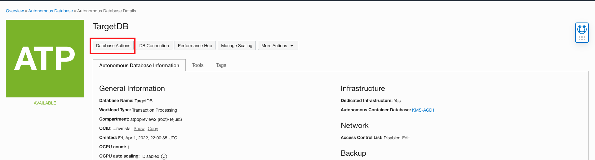

# Assess Users with Oracle Data Safe
## Introduction

Using Oracle Data Safe, assess user security in your target database by using the User Assessment feature and fix issues.

Estimated Time: 30 minutes

### Objectives

In this lab, you learn how to:
- Assess user security in your target database by using the User Assessment feature in Oracle Data Safe.
- Fix some issues pertaining to user security.

### Challenge

Suppose that recent data breaches in your industry occurred due to stolen credentials of high-privileged users. You are notified by “Audit and Compliance” to quickly report high risk users on your target database and show their recent activity. You want to know who the users are and what entitlements they have.

## Task 1: Sign in to the Oracle Data Safe Console for your region

- Go to your ATP details page.
- Click on View Console under **Data Safe** status.

## Task 2: Run User Assessment on your target database

- In the Oracle Data Safe Console, click the **Home** tab, and then click **User Assessment**. The User Assessment page is displayed.
- Select the check box for your target database, and click **Assess**.

    

- Wait for the report to generate.
- When the report is generated, view the totals in the **Critical Risk**, **High Risk**, **Medium Risk**, and **Low Risk** columns.
- In the Last Generated Report column, click **View Report**. The User Assessment report is displayed.

## Task 3: Analyze the information in the User Assessment report

- View the **User Risk** chart. This chart compares the number of critical, high, medium, and low risk users.
- View the **User Roles** chart. This chart compares the number of users with the DBA, DV Admin, and Audit Admin roles.

    

- View the **Last Password Change** chart. This chart shows you the number of users who have changed their passwords in the last 30 days, the last 30-90 days, and 90 days ago or more.
- View the **Last Login** chart. This chart shows you the number of users that logged in in the last 24 hours, in the last week, within the current month, within the current year, and a year ago or more.

    

## Task 4: Search the results for Critical and High risk users

- Click the **+** sign to view the list of columns that you can display in the table. Add and remove columns as you wish, and then close the list.

    

- In the **Audit Records** column, click **View Activity** for the following users to view the audit records that they generated. Filters are automatically applied to **Operation Time** and **User Name**. Click Back to **User Assessment report** to return to the **User Assessment** report.

    

- You can check User details by clicking on the usernames in the table. The **User Details** dialog box is displayed.

    

- On the right, you may expand the roles to view the privileges.
- On the left, click the question mark next to **Risk**. Here you can review the factors that designate a user as Critical, High, Medium, or Low risk.

    

- Click outside the dialog box to close it.
- Close the **User Details** dialog box.

- **Note**: You might notice that `SECURE_STEVE` has not generated any audit records. This use may be a rogue user. Or that `DBA_DEBRA` has the Audit Admin role, but has not generated any audit records. Also, `DBA_DEBRA` has had several login failures. Some other user may be trying to log in with this account.

    

    

## Task 5: Use SQL Developer to make changes to the user accounts

**NOTE: In order to work with SQL Worksheet in Database Actions, users need to be connected to VPN or open SQL Worksheet in Database Actions from Developer image. 

- Go to your ATP details page. Click **Database Actions**.

    

- Copy the Access URL from **Database Actions** popup 

    

- Enter **admin** as **Username** and **Admin's** password and click **Sign in**.

    

- You will be navigated to **Database Actions** **SQL Worksheets** page.

    

- You may now use the SQL Worksheet to grant, revoke privileges or drop users or any changes suggested to mitigate your risks from **Task 4**.

1. Drop `SECURE_STEVE`:

    ```
    <copy>drop user SECURE_STEVE cascade;</copy>
    ```

2. Run the following code to revoke the `AUDIT_ADMIN` role from `DBA_DEBRA`:

    ```
    <copy>revoke audit_admin from DBA_DEBRA</copy>
    ```

## Task 6: Re-run User Assessment on your target database

- Return to Oracle Data Safe.
- Click the **Home** tab, and then click **User Assessment**.
- Select the check box for your target database, and then click **Assess**.
- Click **View Report**.
- Look for changes in the **User Assessment** report. Notice that no errors or rogue user exists.

You may now **proceed to the next lab**.

## Acknowledgements

*Great Work! You successfully completed the Data Safe Assessment Lab 2*

- **Author** - Jayshree Chatterjee
- **Last Updated By/Date** - Kris Bhanushali, Autonomous Database Product Management, March 2022

## See an issue or have feedback?  
Please submit feedback [here](https://apexapps.oracle.com/pls/apex/f?p=133:1:::::P1_FEEDBACK:1).   Select 'Autonomous DB on Dedicated Exadata' as workshop name, include Lab name and issue / feedback details. Thank you!
