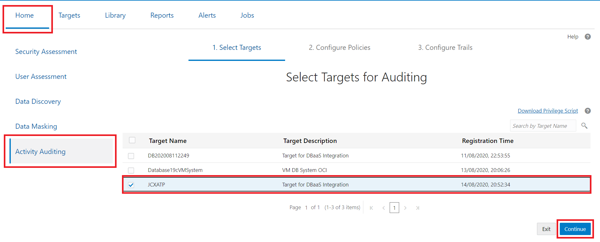
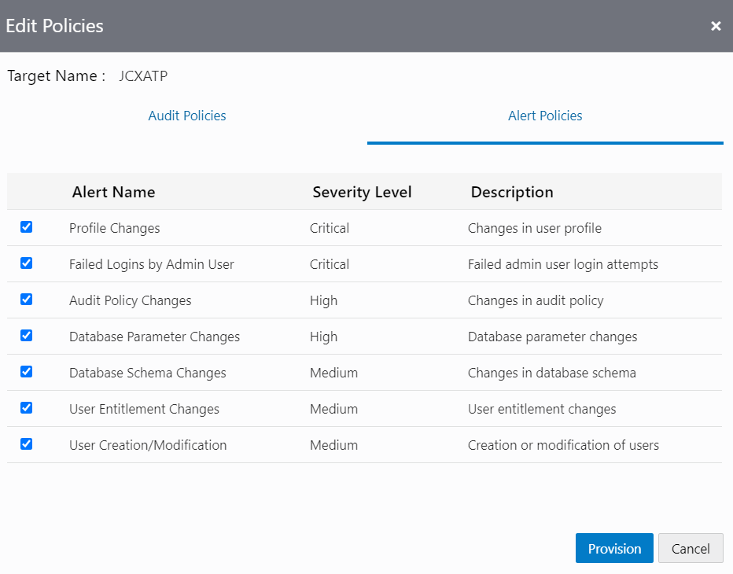

# Provision Audit and Alert Policies and Configure an Audit Trail in Oracle Data Safe
## Introduction
Using Data Safe, provision audit and alert policies for a target database and configure an audit trail for a target ATP-D database for collecting audit data.

Estimated Time: 40 minutes

### Objectives
In the lab, you learn how to do the following:
- Provision audit and alert policies for a target database.
- Configure an audit trail for a target database for collecting audit data.

### Requirements
To complete this lab, you need to have the following:
- Login credentials for your tenancy in Oracle Cloud Infrastructure
- An Oracle Data Safe service enabled in a region of your tenancy
- A registered target ATP-D database in Oracle Data Safe with sample audit data

### Challenge
Suppose that you are notified that your database may have been breached. You plan to use Oracle Data Safe to collect audit data on your database and review it. Do the following:

- Sign in to the Oracle Data Safe Console for your region.
- Review the recommended audit policies for your target ATP-D database in the Oracle Data Safe Console.
- Sign in to your ATP-D database as the ADMIN user with SQL Developer Web.
- In SQL Developer Web, query the unified auditing policies available on your target database and those that are already enabled. Compare the results with the audit policies being recommended by Oracle Data Safe.
- In the Oracle Data Safe Console, provision the following audit policies in the target database and alert policies in Oracle Data Safe.
  1. Critical Database Activity
  2. Login Events
  3. Database Schema Changes (DDL) Admin Activity
  4. Custom Policies (`APP_USER_NOT_APP_SERVER`, `EMPSEARCH_SELECT_USAGE_BY_PETE`, and `EMP_RECORD_CHANGES`)
  5. Oracle Predefined Policies (all of them) CIS All of the alert policies
- Configure the audit trail to collect audit data from the target database and start the audit trail.
- Review the audit policies for your target database to ensure that the policies you selected are correctly provisioned.

## Task 1: Sign in to the Oracle Data Safe Console in your region

Refer to the previous lab, **Register a Target Database**, in this workshop **Introduction to ADB Dedicated for Database Security Administrators**.

## Task 2: Review the recommended audit policies for a target database in the Oracle Data Safe Console

- In the Oracle Data Safe Console, click the **Home** tab, and then click **Activity Auditing**. The **Select Targets for Auditing** page is displayed.

    

- Select the check box for your database, and then click **Continue**. The **Retrieve Audit Policies** page is displayed.
- Select the check box for your database, and then click **Retrieve** to retrieve the audit policies for your database.

    
- Wait until a green check mark is displayed in the **Retrieval Status** column. The check mark means that all of the audit policies are successfully retrieved.

    

- Click **Continue**.
The Review and Provision Audit and Alert Policies page is displayed.

    

- Review the audit policies created on your database.
- Notice that you have a check mark under **Additional Policies**. By default, additional audit policies (including custom and Oracle predefined audit policies) are provisioned on an ATP-D database.
- Notice that there are currently no basic, admin activity, user activity, and alert auditing policies provisioned on your database. To learn more about the preconfigured audit policies, see [Audit Policies](https://docs.cloud.oracle.com/en-us/iaas/data-safe/doc/audit-policies.html) in the Using Oracle Data Safe guide.
- Click your database name. The Edit Policies dialog box is displayed and shows the Audit Policies tab by default.

    

- Notice that the following basic auditing and admin activity auditing policies are selected by default. Oracle recommends that you provision (create and enable) these policies. They are not provisioned by default. If you are visiting this dialog box for the first time for your database, then the selected policies are what Oracle recommends you provision; else, the selected policies are already provisioned.

    

- Notice that the check box for **Center for Internet Security (CIS)** Configuration is not selected. By default, this policy is not provisioned for your ATP-D target. Click the checkbox for **CIS**.
- Leave this dialog box open because you return to it in a later step.

    

## Task 3: Connect to ATP-D DB using SQL Developer Web

- Refer to Step 5 from the earlier lab, **Assess Users with Oracle Data Safe**, in this workshop.

## Task 4: Query the unified auditing policies on your database by using SQL Developer Web and compare with the audit policies being recommended by Oracle Data Safe

- In SQL Developer Web, run the following query to view the list of unified audit policies.

    ```
    <copy>select distinct policy_name from audit_unified_policies order by policy_name asc;</copy>
    ```

- Notice that the policies listed in the Oracle Data Safe Console are the same as the query results. If you are using a different type of database, the list may be different.

    

- Run the following query to view the list of unified audit policies that are enabled.

    ```
    <copy>select * from audit_unified_enabled_policies order by policy_name asc;</copy>
    ```

- Notice that only the `ORA_LOGON_FAILURES` and `ORA_SECURECONFIG` are listed by default. If you are using a different type of database, the list may be different.

## Task 5: In the Oracle Data Safe Console, provision audit policies in the target database and alert policies in Oracle Data Safe

- Return to the Oracle Data Safe Console. You should be in the **Edit Policies** dialog box, where you left off.
- Select the checkboxes for each of the policies under the **Oracle pre-defined policies**.
- Click the **Alert Policies** tab.

    

- Notice that by default, all of the alert policies are selected to be provisioned.
- Click the Audit Policies tab and double-check that all the policies are selected.
- Click **Provision**.
The **Review and Provision Audit and Alert Policies** page shows check marks for all audit policy types, except for **All User Activity**.

    

## Task 6: Configure the audit trail to collect audit data from the target ATP-D database and start the audit trail

- Click **Continue**.
- On the Start Audit Collection page, notice the following defaults:
    - The audit trail location is `UNIFIED_AUDIT_TRAIL` for an ExaCS database.
    - Audit collection is not yet started.
    - The auto purge feature is disabled.

    

- View other options for audit trails:
    - Click **Add**. The **Register Audit Trail** dialog box is displayed.
    - In the **Target Name** drop-down list, select your target ATP-D database.

    

- Select the trail location to be `UNIFIED_AUDIT_TRAIL`.
- Notice that you can set the **Auto Purge Trail** feature for the newly selected audit trails. By default, the feature is off.

**IMPORTANT**: Turn off the auto purge feature by sliding the Auto Purge Trail slider to the left. You need to turn this feature off if you want to keep the audit data on your target ATP-D database.
- Select a **Collection Date**.
- Click **Compute Audit Record Count** and then **Register** the ATP-D target database.

    

- Click **Start** to start collecting audit data. A message at the top of the page states the `UNIFIED_AUDIT_TRAIL` is successfully created.

    

- Notice that the **Collection State** column indicates **COLLECTING**, meaning that collection is running.
- Wait a couple of minutes for the audit data to be collected from your target database. Click **Done**. You are directed to the **Audit Trails** page.
- When collection is finished, the **Collection State** column reads **IDLE**.
- If you suspect that the audit collection is not working properly, restart the collection process. To do this, select the check box for your target database, click **Stop**, wait until collection stops (the **Collection State** column reads **STOPPED**), and then click **Start**.

    

## Task 7: Review the audit policies for your target database to ensure that the policies you selected are correctly provisioned

- Click the **Targets** tab, and then click **Audit Policies**. The **Audit and Alert Policies page** is displayed.
- Click the name of your target database. The **Edit Policies** dialog box is displayed. Here you can provision and disable audit and alert policies, if needed.
- Click **Cancel**.

    


You may now **proceed to the next lab**.

## Acknowledgements

*Great Work! You successfully completed the Data Safe Auditing Lab 1*

- **Author** - Jayshree Chatterjee
- **Last Updated By/Date** - Kris Bhanushali, Autonomous Database Product Management, March 2022


## See an issue or have feedback?  
Please submit feedback [here](https://apexapps.oracle.com/pls/apex/f?p=133:1:::::P1_FEEDBACK:1).   Select 'Autonomous DB on Dedicated Exadata' as workshop name, include Lab name and issue / feedback details. Thank you!
