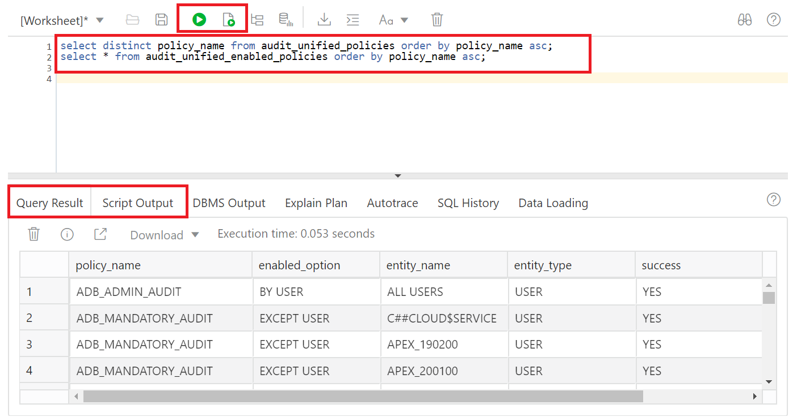
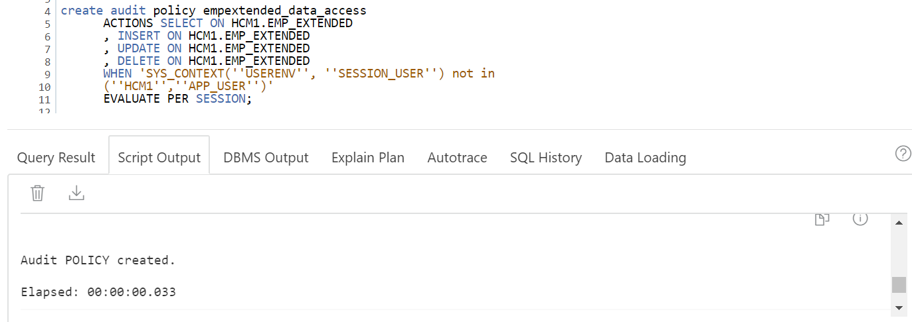
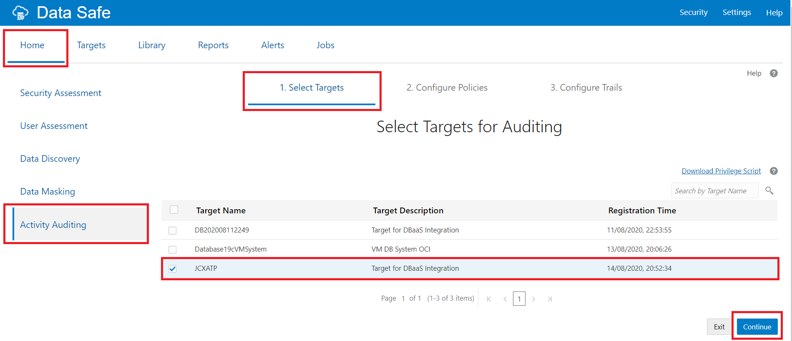
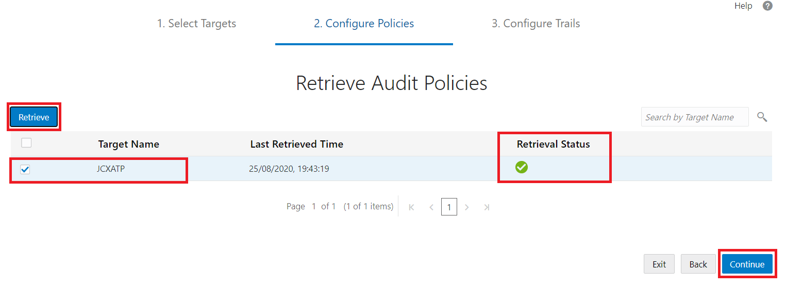
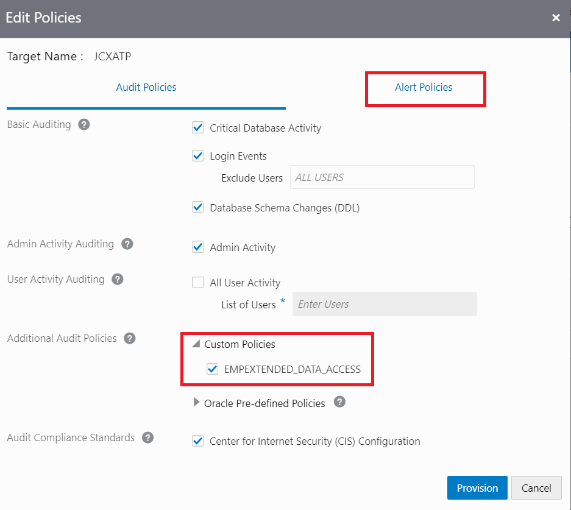
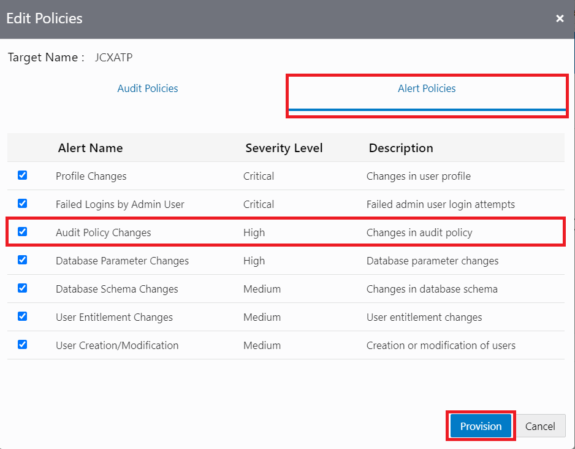
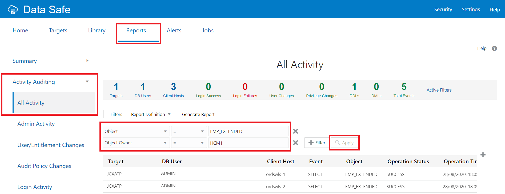
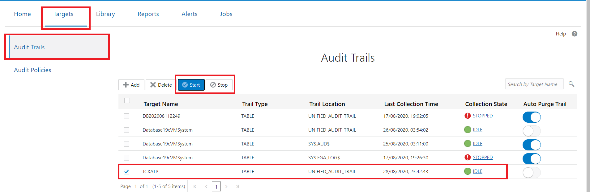
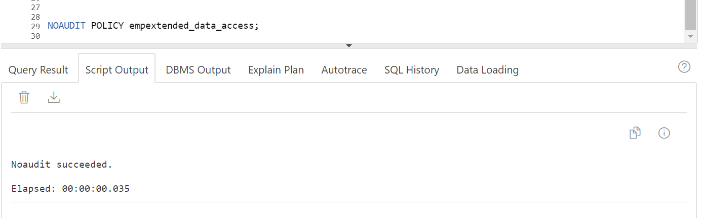
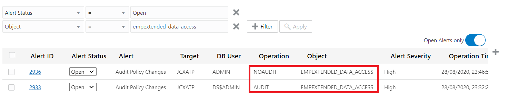

# Create and Provision a Custom Audit Policy and View Audit Data in Oracle Data Safe
## Introduction
Using Data Safe, create a custom audit policy on a target database, and enable a custom audit policy in the Oracle Data Safe Console. Perform some operations against the table defined in the audit policy and view the generated audit records in the Oracle Data Safe Console.

Estimated Time: 40 minutes

### Objectives
In this lab, you learn how to do the following:
- Create a custom audit policy on a target database
- Enable a custom audit policy in the Oracle Data Safe Console
- Perform some operations against the table defined in the audit policy
- View the generated audit records in the Oracle Data Safe Console

### Requirements
To complete this lab, you need to have the following:
- Login credentials for the Oracle Data Safe Console
- An Oracle Data Safe service enabled in a region of your tenancy
- A registered target ATP-D database in Oracle Data Safe with sample audit data and the password for the ADMIN user account.
An audit trail is running on your target database and alert policies are enabled in Oracle Data Safe. If not, see the earlier lab, **Provision Audit and Alert Policies and Configure an Audit Trail in Oracle Data Safe**.

### Challenge
You've identified a sensitive column in your ExaCS database that contains credit card data: `HCM1.EMP_EXTENDED.PAYMENTACCOUNTNO`. You decide to create a unified audit policy on your target database that audits the `EMP_EXTENDED` table.

Follow these general steps:
1. Sign in to your ATP-D database as the ADMIN user with SQL Developer Web.
2. In SQL Developer Web, create a query to view the list of enabled audit policies and their details.
3. In SQL Developer Web, create a unified audit policy on your target ATP-D database to audit **SELECT**, **INSERT**, **UPDATE**, and **DELETE** statements on the `HCM1.EMP_EXTENDED` table (which contains the sensitive column `PAYMENTACCOUNTNO`). Audit user access to this table, excluding the application schemas that should be able to access the table.
4. Sign in to the Oracle Data Safe Console for your region.
5. In the Oracle Data Safe Console, enable your custom audit policy on your target database.
6. In SQL Developer Web, execute some SQL statements which consist of some **SELECT** statements against the `HCM1.EMP_EXTENDED` table.
7. In the Oracle Data Safe Console, examine the **All Activity** report to view the newly generated audit records.
8. In SQL Developer Web, disable the recently created audit policy, and then verify if any alerts are generated in the Oracle Data Safe Console.

## Task 1:  In SQL Developer Web, create a query to view the list of enabled audit policies and their details

- In SQL Developer Web, run the following query to view a list of enabled unified audit policies.

    ```
    <copy>select * from audit_unified_enabled_policies order by policy_name asc;</copy>
    ```

- Notice that the `empextended_data_access audit` policy is not in this list. You create it in Task 3.
- Run the following query to view details for the created unified audit policies. Notice that the `empextended_data_access` audit policy is not in this list.

    ```
    <copy>select * from audit_unified_policies order by policy_name asc;</copy>
    ```

    

## Task 2: Create a unified audit policy on your target database

In SQL Developer Web, create a unified audit policy on your target database to audit SELECT, INSERT, UPDATE, and DELETE statements on the HCM1.EMP_EXTENDED table (which contains the sensitive column PAYMENTACCOUNTNO).

*Note: Your dataset may vary and so can your sensitive columns. Hence, do manipulate the queries listed here according to your dataset.*

- Copy the following lines of code and paste them into the SQL Worksheet, and then click the **Run Script** button.

    ```
    <copy>create audit policy empextended_data_access
        ACTIONS SELECT ON HCM1.EMP_EXTENDED
        , INSERT ON HCM1.EMP_EXTENDED
        , UPDATE ON HCM1.EMP_EXTENDED
        , DELETE ON HCM1.EMP_EXTENDED
        WHEN 'SYS_CONTEXT(''USERENV'', ''SESSION_USER'') not in
        (''HCM1'',''APP_USER'')'
        EVALUATE PER SESSION;</copy>
    ```

    

- Notice that a message is displayed stating that the audit policy is created.
- How could you extend this unified audit policy to be more effective? What could you add or remove to the `WHEN` clause?
- Keep this tab open because you return to it in a later step.

## Task 3: In the Oracle Data Safe Console, enable your Custom Audit Policy on your target ATP-D database

- In the Oracle Data Safe Console, click the **Home** tab, and then click **Activity Auditing**.
- Select the check box for your target database, and then click **Continue**.

    

- On the **Retrieve Audit Policies** page, select the check box for your target database, and then click **Retrieve**.
- Wait for the **Retrieval Status** column to show a green check mark, which indicates that the audit policies are successfully retrieved from the target database.
- Click **Continue**.

    

- On the **Review and Provision Audit and Alert Policies** page, click the name of your target database.
- Expand **Custom Policies**.
- Select your new policy, `EMPEXTENDED_DATA_ACCESS`.

    

- Click the **Alert Policies** tab and verify that the alert policy called **Audit Policy Changes** is enabled. If it's not, enable it now. You enable this policy in the earlier lab in this workshop, **Provision Audit and Alert Policies and Configure an Audit Trail in Oracle Data Safe**.

    

- Click **Provision**.
- Wait until the provisioning is finished. The dialog box is closed.
- Click **Exit**.

## Task 4: In SQL Developer Web, execute some SQL statements against `HCM1.EMP_EXTENDED`

- Return to SQL Developer.
- Run the following SQL statement twice to generate some audit data. In STEP 6, you view the audit records generated.

    ```
    <copy>select * from HCM1.EMP_EXTENDED;</copy>
    ```

## Task 5: In the Oracle Data Safe Console, examine the All Activity report to view the newly generated audit records

- Return to the Oracle Data Safe Console.
- Click the **Reports** tab.
- In the left pane, click **Activity Auditing**, and then click the **All Activity** report.
- Add the **Object Owner** column to the report:
a. To the right of the table, click the plus sign.
b. In the **Select Columns** dialog box, select **Object Owner**, and then click **Apply**.
- Click **+ Filter** and define another filter: **Object = EMP_EXTENDED**.
- Click **+ Filter** and define another filter: **Object Owner = HCM1**.
- Click **Apply**.

    

- Review the results in the report.
- Notice there are actions recorded by the `ADMIN` user as per the custom policy you created.
- If there are no audit records, restart the audit trail by doing the following:
  - Click the **Targets** tab.
  - Select **Audit Trails**.
  - Click **Stop**, and wait until audit collection has stopped.
  - Click **Start** to force immediate audit collection.
  - Wait until the **Collection State** column reads **COLLECTING**, and then **IDLE**.
  - Repeat the steps from **Activity Auditing** again.

    

## Task 6: In SQL Developer Web, disable the recently created audit policy and verify if any alerts are generated in Oracle Data Safe

- Return to the SQL Developer Web.
- Run the following SQL statement:

    ```
    <copy>NOAUDIT POLICY empextended_data_access;</copy>
    ```
    

- Return to the Oracle Data Safe Console.
- Click the **Alerts** tab.
- Click **+ Filter** and define a filter: **Object = empextended_data_access**. (Select Filters on top of the alerts page first, if no filters are displayed.)
- Notice that Oracle Data Safe generated an alert for the disabled `empextended_data_access` audit policy. An alert is generated because you enabled the alert policy called **Audit Policy Changes**.

    

- If an alert is not generated, restart the audit trail and then check again.

You may now **proceed to the next lab**.

## Acknowledgements

*Great Work! You successfully completed the Data Safe Auditing Lab 3*

- **Author** - Jayshree Chatterjee
- **Last Updated By/Date** - Kris Bhanushali, Autonomous Database Product Management, March 2022

## See an issue or have feedback?  
Please submit feedback [here](https://apexapps.oracle.com/pls/apex/f?p=133:1:::::P1_FEEDBACK:1).   Select 'Autonomous DB on Dedicated Exadata' as workshop name, include Lab name and issue / feedback details. Thank you!
