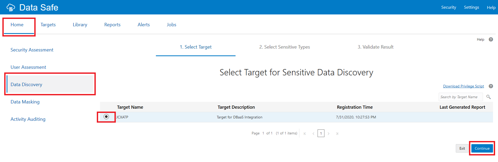
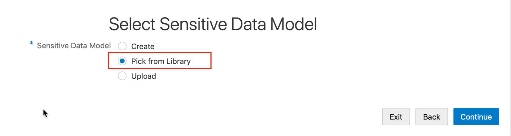
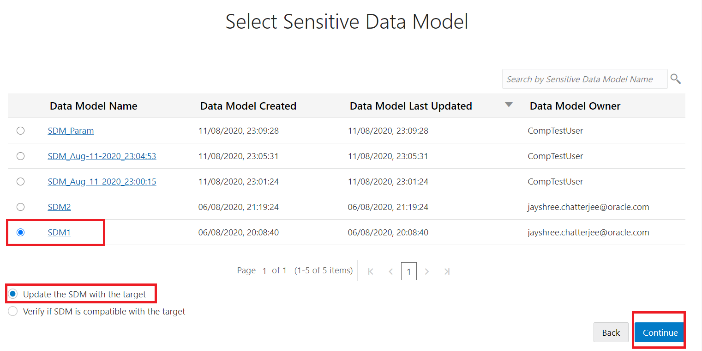

# Update a Sensitive Data Model with Oracle Data Safe
## Introduction
Using Oracle Data Safe, perform an incremental update to a sensitive data model by using the Data Discovery wizard.

Estimated Time: 20 minutes

### Objectives
In this lab, you learn how to do the following:
- Perform an incremental update to a sensitive data model by using the Data Discovery wizard

### Challenge
Suppose your ATP-D database has a new column added to it and you want to update your sensitive data model to include that column.

Follow these general steps:
1. Connect to your ATP-D database as the ADMIN user with SQL Developer Web.
2. In SQL Developer Web, add an AGE column to the HCM1.EMPLOYEES table in your ATP-D database. Gather schema statistics on your database.
3. Sign in to the Oracle Data Safe Console in your region.
4. In the Oracle Data Safe Console, update your sensitive data model against your target database by using the update option in the Data Discovery wizard. What does the update test find?

## Task 1: Add a sensitive column to a table

Connect to ATP-D DB using SQL Developer Web.

Refer to Task 5 from the earlier lab in this workshop, **Assess Users with Oracle Data Safe**.

In SQL Developer Web, add an `AGE` column to the `HCM1.EMPLOYEES` table in your ATP-D database.

- On the SQL Worksheet, run the following commands to add an `AGE` column to the `EMPLOYEES` table.

    ```
    <copy>ALTER TABLE HCM1.EMPLOYEES ADD AGE NUMBER;</copy>
    ```

- On the Navigator tab, click the Refresh button. `AGE` is added to the bottom of the list in the `EMPLOYEES` table.
- Run the following command to gather schema statistics:

    ```
    <copy>EXEC DBMS_STATS.GATHER_SCHEMA_STATS('HCM1');</copy>
    ```

- Keep this tab open to return to later.

## Task 2: Update your sensitive data model

Sign in to the Oracle Data Safe Console in your region.

Refer to the earlier lab in this workshop, **Register a Target Database**.

Update your sensitive data model against your database by using the update option in the Data Masking wizard.

- In the Oracle Data Safe Console, click the **Home** tab, and then click Data Discovery. The Select Target for **Data Discovery** page is displayed.

    

- Select your target database, and then click **Continue**. The **Select Sensitive Data Model** page is displayed.
- For Sensitive Data Model, click **Pick from Library**.

    

- Click **Continue**. The **Select Sensitive Data Model** page is displayed.
- Select your sensitive data model (**SDM1**).

    

- Leave **Update the SDM with the target** selected.
- Click **Continue**. The wizard launches a data discovery job.
- When the job is finished, notice that the **Detail** column reads **Data discovery job finished successfully**.
- Click **Continue**. The **Sensitive Data Model: <username> SDM1** page is displayed.
- Notice that you have the newly discovered sensitive column, `AGE`. Only newly discovered columns are displayed at the moment.
- **Expand all** of the nodes.
- To view all of the sensitive columns in the sensitive data model, click **View all sensitive columns**.
- You can toggle the view back and forth between displaying all of the sensitive columns or just the newly discovered ones.
- Click **Exit**.

You may now **proceed to the next lab**.

## Acknowledgements

*Great Work! You successfully completed the Data Safe Discovery Lab 3*

- **Author** - Jayshree Chatterjee
- **Last Updated By/Date** - Kris Bhanushali, Autonomous Database Product Management, March 2022

## See an issue or have feedback?  
Please submit feedback [here](https://apexapps.oracle.com/pls/apex/f?p=133:1:::::P1_FEEDBACK:1).   Select 'Autonomous DB on Dedicated Exadata' as workshop name, include Lab name and issue / feedback details. Thank you!
