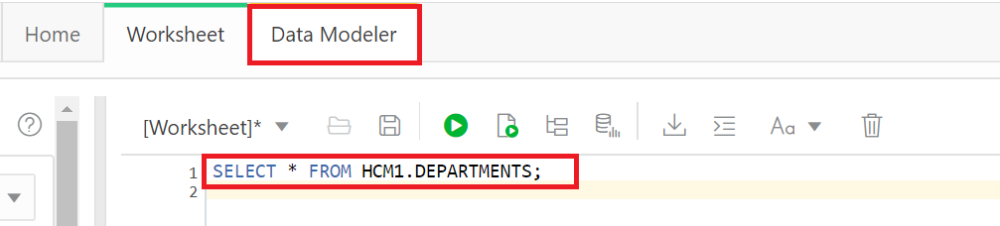
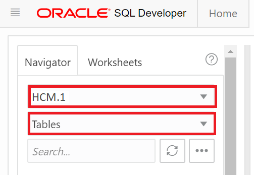
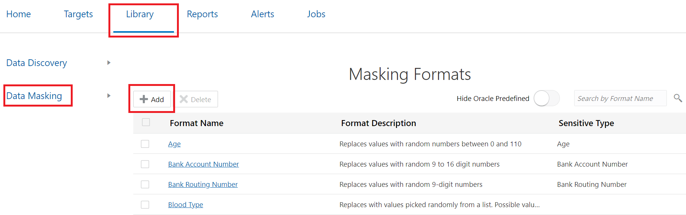
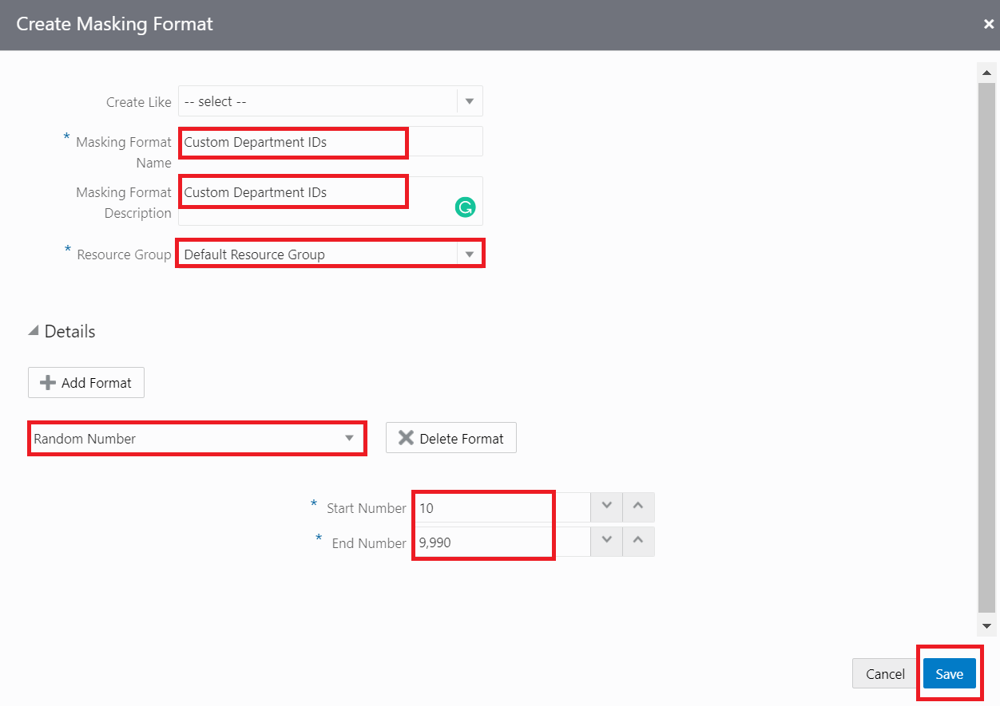
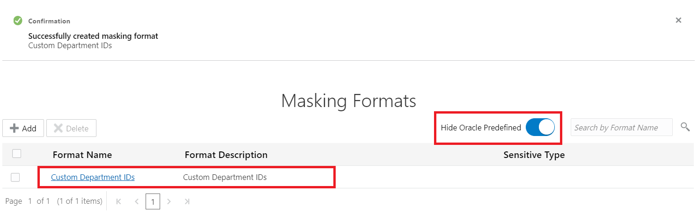

# Create a Custom Masking Format in Data Safe
## Introduction
Using Data Safe, create a masking format and assign a default masking format to a user-defined sensitive type.

Estimated Time: 20 minutes

### Objectives
In this lab, you learn how to do the following:
- Create a masking format.
- Assign a default masking format to a user-defined sensitive type.

### Challenge
You have department IDs in your target database that you need to mask. You decide to create a masking format in Oracle Data Safe to mask the data.

Follow these general steps:
1. Sign in to your ATP-D database as the ADMIN user with SQL Developer Web.
2. In SQL Developer Web, research the `DEPARTMENT_ID` column in your target database to help you figure out how to create a masking format for it.
3. Sign in to the Oracle Data Safe Console for your region.
4. In the Oracle Data Safe Console, create a masking format to mask the `HCM1.DEPARTMENT_ID` column in your target database.
5. Select your masking format as the default masking format for the sensitive type that you created in the lab **Create a Sensitive Type and Sensitive Category with Oracle Data Safe** (**Custom Department ID Number**).

## Task 1: Create a custom masking format

Connect to ATP-D DB using SQL Developer Web.

Refer to Task 5 from the earlier lab in this workshop, **Assess Users with Oracle Data Safe**.

In SQL Developer Web, search the `DEPARTMENT_ID` column in your target database to help you figure out how to create a masking format for it.

- On the SQL Worksheet, run a select on the `DEPARTMENTS` table.

    ```
    <copy>SELECT * FROM HCM1.DEPARTMENTS;</copy>
    ```

- Notice that the department ID values are 10, 20, 30, up to 270.
- Click the **Data Modeler** tab.

    

- In the first drop-down list, select `HCM1`.
- In the second drop-down list, select **Tables**.

    

- Drag the `DEPARTMENTS` table to the worksheet.
- Notice that the `DEPARTMENT_ID` column has the data-type `NUMBER(4)`, which means it can take up to four digits (no decimals). It is also a primary key column.

Sign in to the Oracle Data Safe Console in your region.

Refer to the earlier lab in this workshop, **Register a Target Database**.

In the Oracle Data Safe Console, create a masking format to mask department IDs.

- In the Oracle Data Safe Console, click the **Library** tab.
- Under **Data Masking**, click **Masking Formats**, and then click **Add**.

    

- The **Create Masking Format** dialog box is displayed.
- Leave the **Create Like** drop-down list as is.
- In the **Masking Format Name** field, enter **<username> Custom Department IDs**.
- In the **Masking Format Description** field, enter **Custom Department IDs**.
- Select your resource group.
- From the Format drop-down list, select **Random Number**.
- In the **Start Number** field, enter **10**.
- In the **End Number** field, enter **9990**.

    

- Click **Save**. A confirmation message states that you successfully created the masking format.
- Move the **Hide Oracle Predefined** slider to the right and verify that your masking format is listed.

    

You may now **proceed to the next lab**.

## Acknowledgements

*Great Work! You successfully completed the Data Safe Masking Lab 3*

- **Author** - Jayshree Chatterjee
- **Last Updated By/Date** - Kris Bhanushali, Autonomous Database Product Management, March 2022

## See an issue or have feedback?  
Please submit feedback [here](https://apexapps.oracle.com/pls/apex/f?p=133:1:::::P1_FEEDBACK:1).   Select 'Autonomous DB on Dedicated Exadata' as workshop name, include Lab name and issue / feedback details. Thank you!
