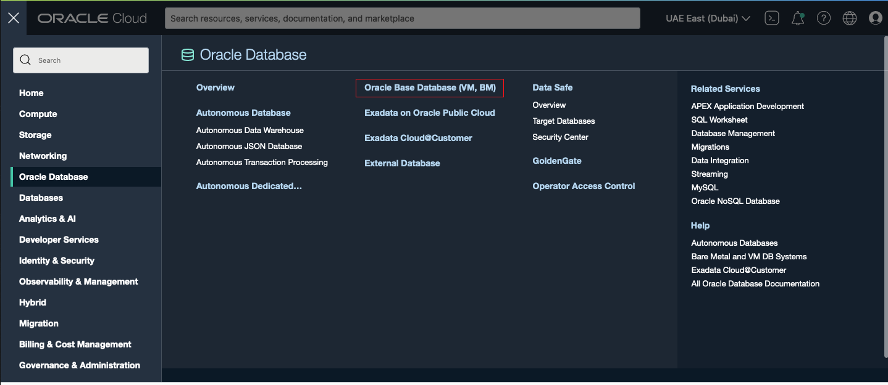
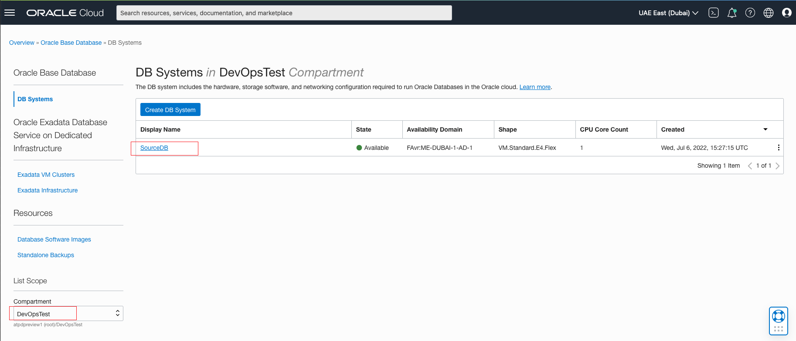
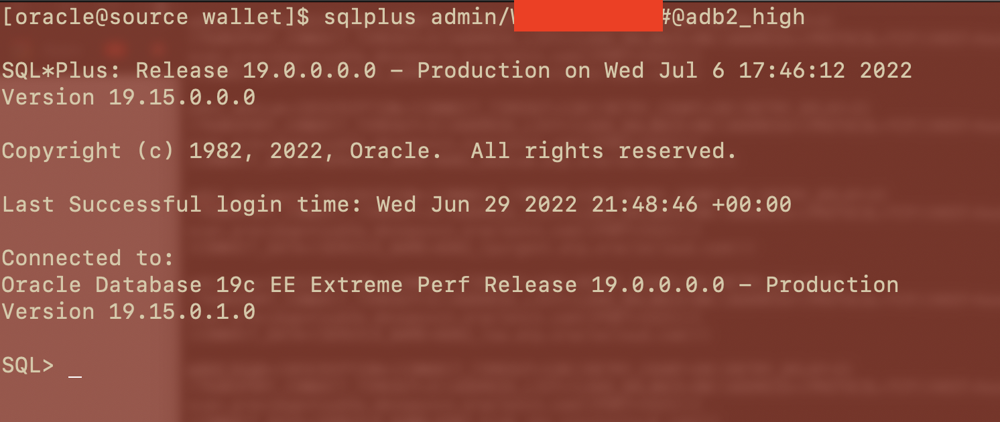
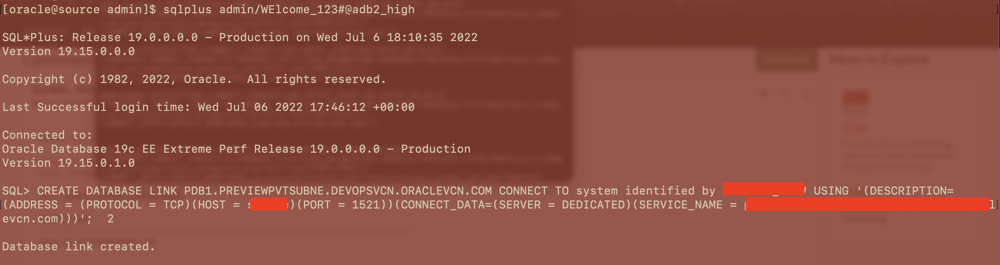
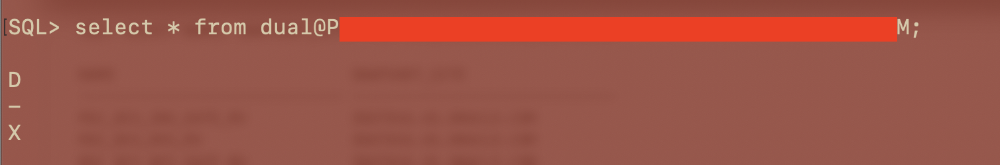
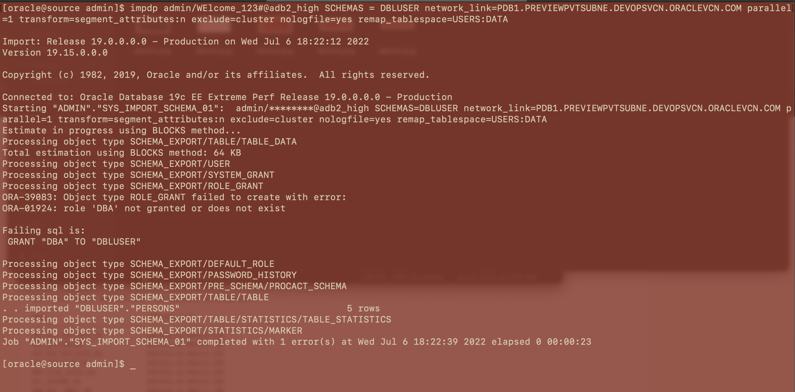
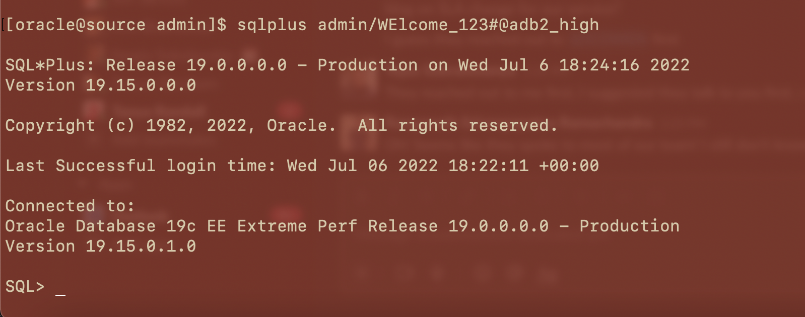
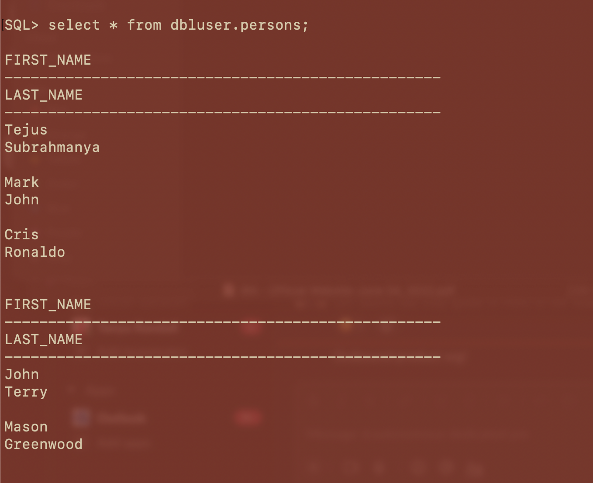

# Migrating to Autonomous Database Dedicated using Database Link

## Introduction

The Autonomous database supports outgoing Database Links to other Oracle databases.  Database Links can be used with Autonomous Database to read or transfer data between 2 hosts. As long as there is right network connectivity from Source database to Autonomous Database, Database Links can used to Migrate the databases. 

This lab walks you through how to migrate oracle database to Autonomous Database using Datapump and Database Links.

Estimated Time: 40 minutes

### Objectives

As a database administrator:
1. Configure Database Links between Source and Autonomous Database.
2. Use Datapump to import the database from Source system to Autonomous Database.

### Required Artifacts

- An Oracle Cloud Infrastructure account.
- Source Database (Oracle Database Cloud Service) and Autonomous Database 
- Network Connectivity between Source and Autonomous Database

## Task 1: Test Network connection between your Source System and Autonomous Database

This Lab assumes you have a pre-provisioned Database Cloud service in your tenancy as a Source database. Learn how to create Database Cloud Service [here](https://docs.oracle.com/en-us/iaas/dbcs/doc/create-db-system-using-console.html).

NOTE: Network should be configured prior to next steps for Source Database to talk to Autonomous Database. 
Refer [here]() to setup your Network configuration. 

- Log in to your OCI tenancy and navigate to Oracle Base Database(VM,BM) from the main hamburger menu.

    

- Select the right Compartment and Click on your Source Database.

    

- SSH into your Bastion host and sqlplus to your Autonomous Database.

Note: Please refer to Lab guide ***Configure a development system for use with your dedicated autonomous database*** under Developer and Database Users to configure your Development system to be able to ssh or sqlplus into Oracle database. 

- Ensure the network is configured from your Source System to talk to Autonomous Database. Download and copy the wallet to your Source System and test the connection to ADB.

    


## Task 2: Create Database Link

Once you are sucessfully connected the network configuration from your Source Database to Autonomous Database in Task 1, we are not going to create a Database link from Autonomous Database to Source Oracle Database. 

- SQLPLUS into Autonomous Database from your Source System

    

- Create the the Database link from your Autonomous database to Source Database 

NOTE: sqlplus into Autonomous Database using **admin** as Username and the Password and Create Database link.

    


````
<copy>
CREATE DATABASE LINK <Source_Database_global_unique_name> CONNECT TO system identified by <SourceDB_password> USING '<Connect_string_Source_DB>';
</copy>
````

- Test if the Database Link you created works from Autonomous Database


    

````
<copy>
select * from dual@<Database_Link>;
</copy>
````

NOTE: Create Profiles and Roles prior to importing 


## Task 3: Import data from Source Oracle database to Autonomous Database

You are now ready to import data from your Source database to Autonomous Database using import data pump.


- Select the schema / schemas you want to import to Autonomous Database and run Import datapump from your source System.


    

````
<copy>
impdp admin/<ADB_Password>@adb2_high SCHEMAS = <schemas> network_link=<Database_Link> parallel=1 transform=segment_attributes:n exclude=cluster nologfile=yes remap_tablespace=USERS:DATA
</copy>
````

- SQLPLUS into Autonomous Database to verify the data migration.

    

- Select values from the table you want to verify

    

You have now successfully migrated your Source Database to Autonomous Database using Database Links.


## Acknowledgements
*Congratulations! You successfully migrated your Oracle database to Autonomous Databases*

- **Author** - Tejus S
- **Last Updated By/Date** -  Tejus S, July 2022


