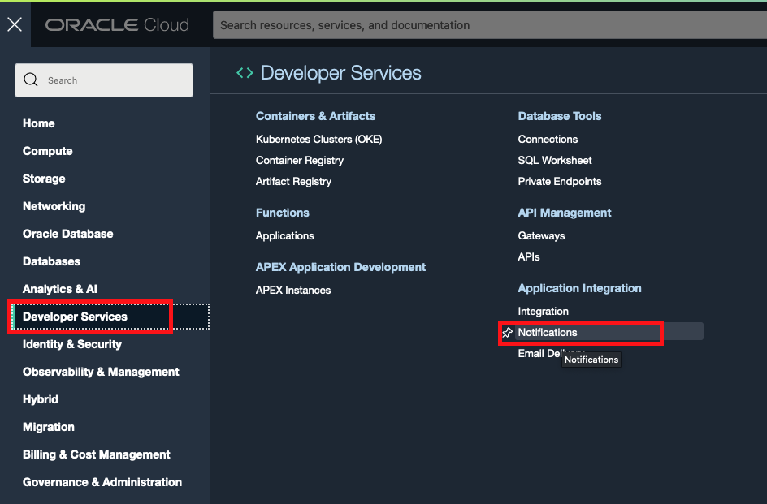
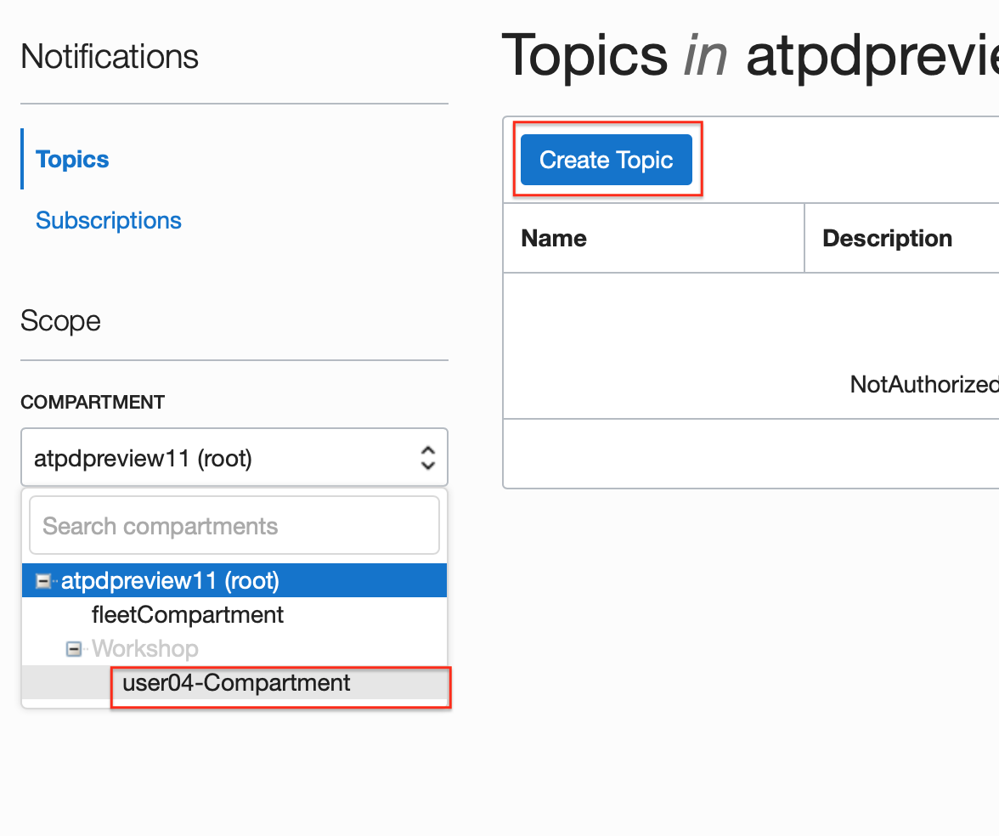
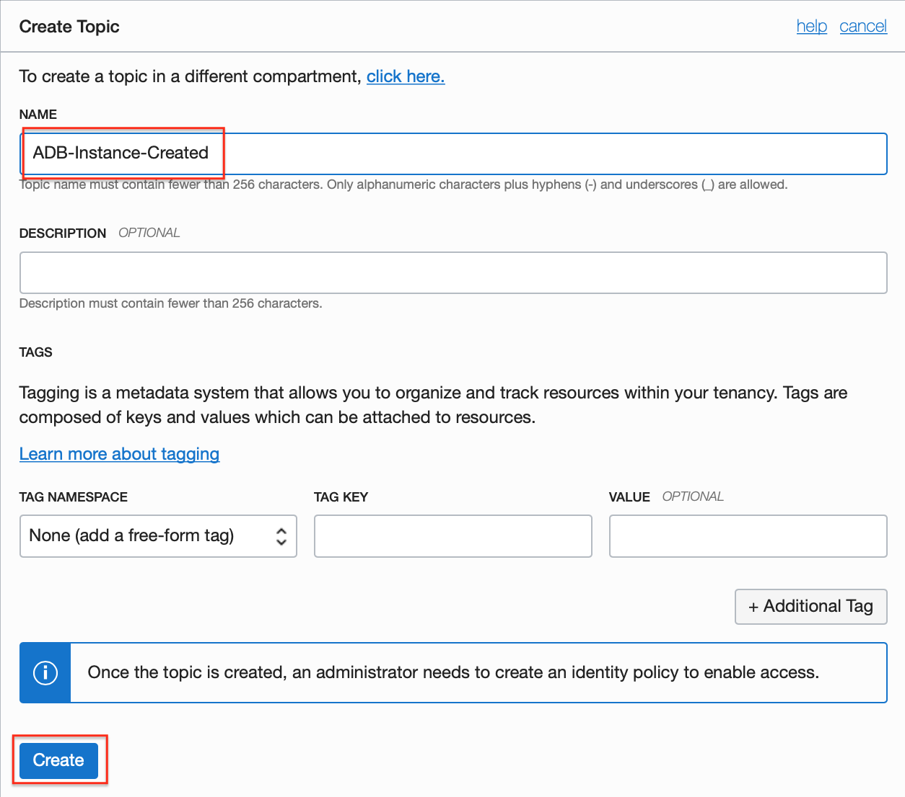
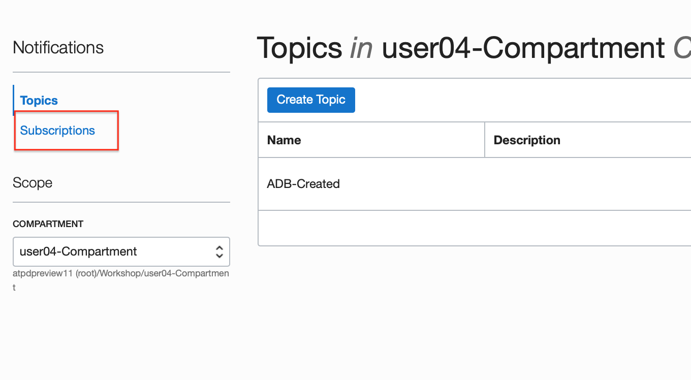
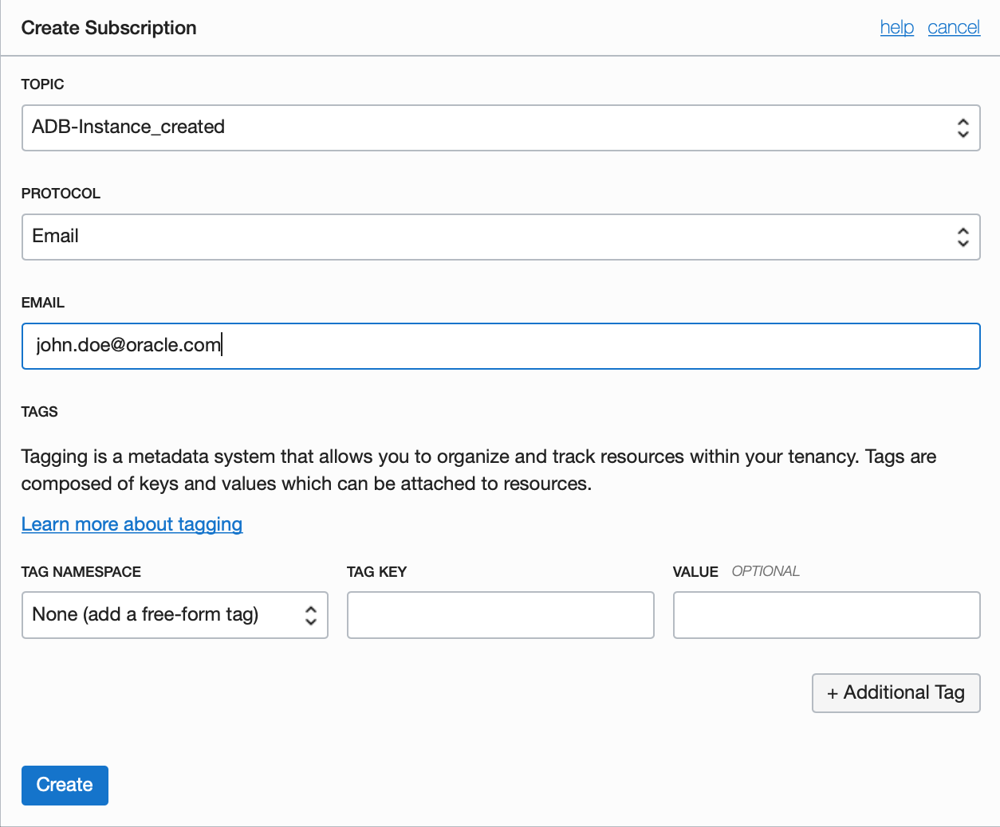
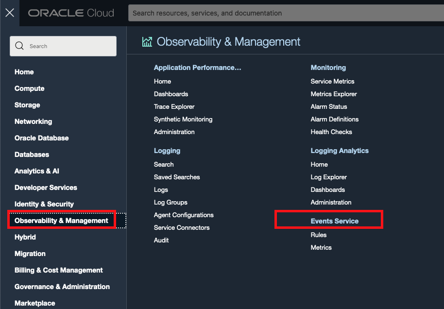
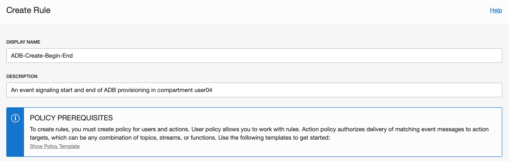
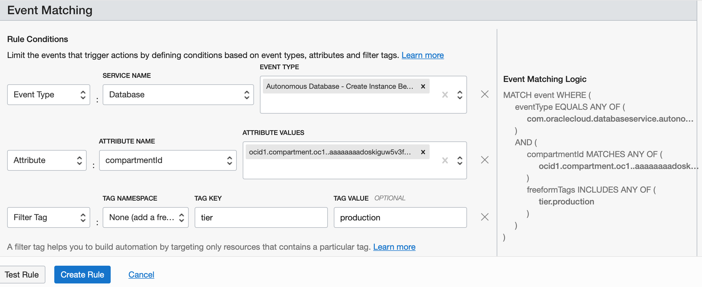
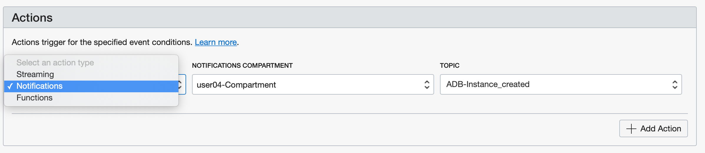

# Set up ADB event notifications through OCI Notification Service

## Introduction
The Oracle Cloud Infrastructure Notifications service broadcasts messages  to distributed components through a publish-subscribe pattern, delivering secure, highly reliable, low latency and durable messages for applications hosted on Oracle Cloud Infrastructure and externally.

You may get notified when service events occur, such as database creation, termination etc. or when alarms trigger eg. CPU usage exceeds threshold. Subscribers may choose to be notified via email, SMS messages to their phones or via Slack channels.

Estimated Time: 20 minutes

### Objectives
As an database developer or administrator:
1. Learn how to set up autonomous database event topics.
2. Subscribe to database events via email and SMS.

### Required Artifacts
- An Oracle Cloud Infrastructure account with privileges to provision an autonomous database and create ONS topics and events.

## Task 1: Set up email / SMS notification on ADB provisioning events

- Let's start by setting up a simple email / SMS notification when autonomous database instances are provisioned in the user's compartment.

- Log in to your OCI tenancy and navigate to **Developer SErvices** --> **Application Integration** --> **Notifications** from the top left hamburger menu.

    

- Select the desired compartment from the drop down and click **Create Topic**.

    

- Provide a topic name, an optional description, and click **Create**.

    

- Next, let's add some subscribers to this topic. On the **Notification** page, select **Subscriptions** at the top left.

    

- On the **Create Subscription** page, select the topic you just created, pick **Email** from the protocol dropdown and provide your email address as shown.

    

- To set up an SMS notification, simply add your email-to-SMS address. Most carriers support sending SMS over email. For example, AT&T users can send SMS messages using the email id <10-digit-phone#>@mms.att.net.

- A complete list of email-to-SMS formats supported by various carriers is provided [on this website](https://avtech.com/articles/138/list-of-email-to-sms-addresses/).

    

- Now that we have a topic and subscribers in place, let's create an event that feeds to this topic. Navigate to **OCI Events** from the main menu.

    

- On the **Create Rule** page, provide a name and event conditions as shown in the screen shot below. A rule condition can be an event-type with one or more attributes and filter tags.

    - For example, here our event-type is **Autonomous Database - Create Instance Begin** and is set on the **Database** service for compartment user04Compartment (we provide the OCID in the attribute) with a filter tag to indicate **production** instances only.

    - Basically, what we are saying here is 'Trigger a notification event when an Autonomous Database with a tag tier=production is created in the compartment with OCID xyz...'.

    

    

- Scroll down to select the Action type for this event and pick Notifications and the topic you just created.

    

- That's it! To test your notification setup, create an autonomous database service instance as explained in the lab, **Provisioning Databases**, in the **Introduction to ADB Dedicated for Developers and Database Users** workshop.

You may now **proceed to the next lab**.

## Acknowledgements
*Congratulations! You successfully learnt to create DB event subscriptions and setup notifications!*

- **Author** - Tejus Subrahmanya & Kris Bhanushali
- **Adapted by** -  Yaisah Granillo, Cloud Solution Engineer
- **Last Updated By/Date** - Kris Bhanushali, Autonomous Database Product Management, April 2022

## See an issue or have feedback?
Please submit feedback [here](https://apexapps.oracle.com/pls/apex/f?p=133:1:::::P1_FEEDBACK:1).   Select 'Autonomous DB on Dedicated Exadata' as workshop name, include Lab name and issue / feedback details. Thank you!
