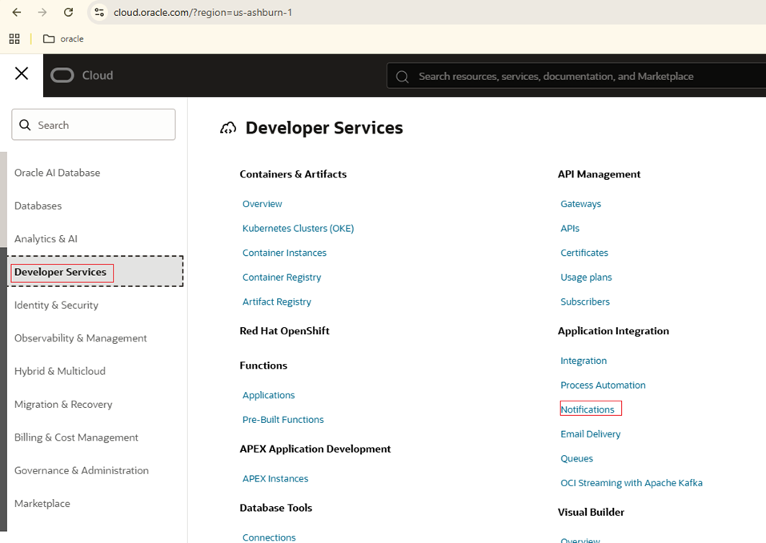
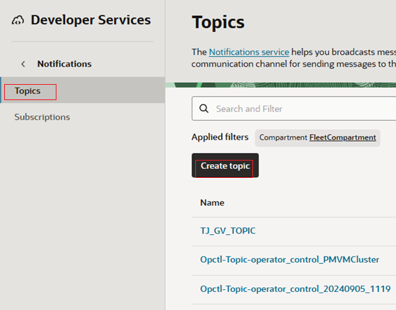
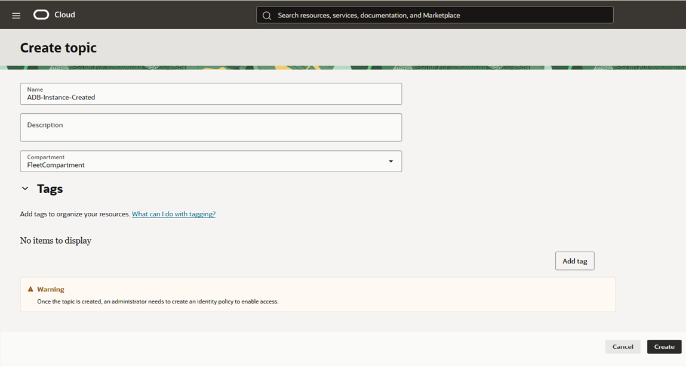
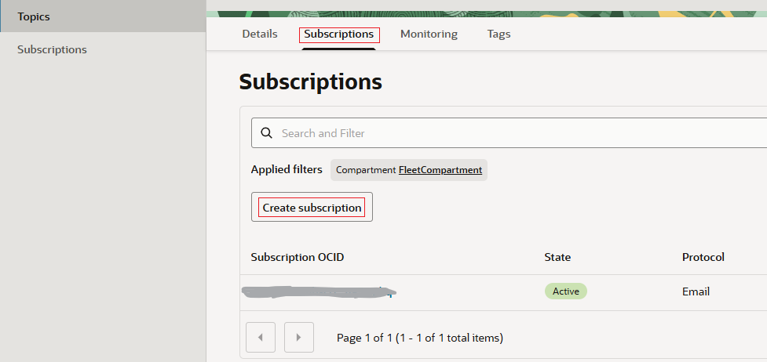
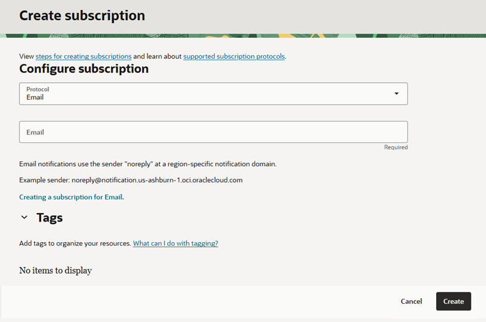
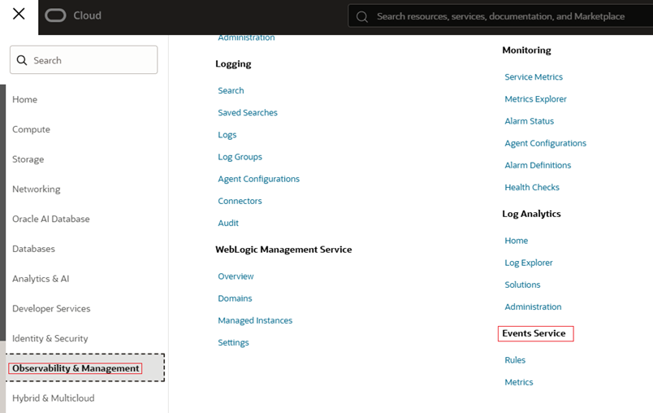
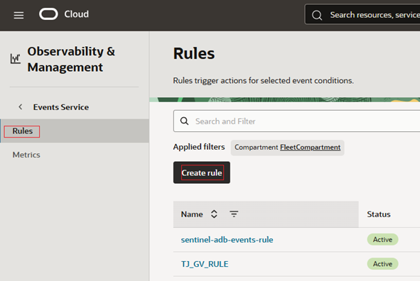
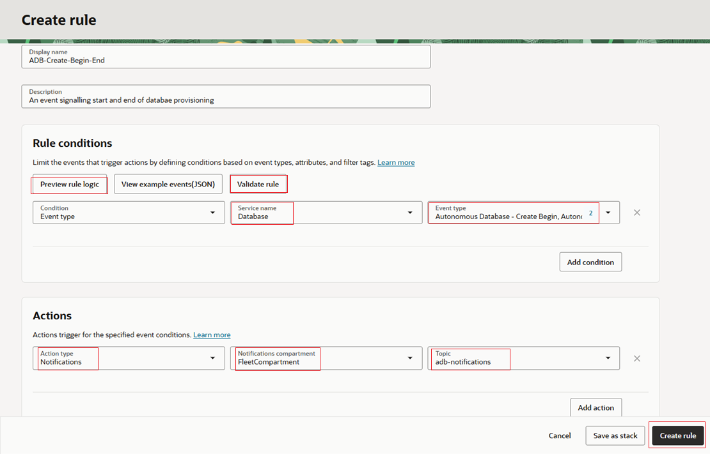

# Set up Autonomous AI Database event notifications through OCI Notification Service

## Introduction

The Oracle Cloud Infrastructure Notifications service delivers messages to distributed components through a publish-subscribe model. It is commonly used to notify users when service events occur, such as the creation or termination of a database, or when alarms are triggered.

You can send these notifications by email, SMS, or other supported channels such as Slack.

Estimated Time: 20 minutes

### Objectives

As a database developer or administrator, you will:

 1. Learn how to create an Autonomous AI Database event topic.
 2. Subscribe to database events by email and SMS.

### Required Artifacts

- An Oracle Cloud Infrastructure account with privileges to provision an Autonomous AI Database and create ONS topics and events.

## Task 1: Set up email or SMS notifications for Autonomous Database provisioning events

- Start by creating a topic in the Notifications service. In the OCI Console, open the navigation menu and go to **Developer Services** > **Application Integration** > **Notifications**.

    

- Select the compartment where you want to create the topic, then click **Create Topic**.

    

- Enter a topic name and an optional description, then click ****Create**.

    

- Next, add a subscription to the topic. Open the topic details page, select **Subscriptions**, and then click **Create Subscription**.

    

- In the **Create Subscription** dialog, select **Email** as the protocol, and enter the email address that should receive notifications.

    

- After the topic and subscription are ready, create an event rule. Open the navigation menu and go to **Observability & Management** > **Events Service**.

    .

- Click **Rules** > **Create Rule**.

    .

- On the **Create Rule** page, enter a name for the rule and define the event conditions. For example, you can configure the rule to trigger when an Autonomous AI Database instance is created in a specific compartment. You can also create more than one event in a single rule. You can Preview rule logic and also validate the rule before creating it.

- In the **Actions** section, select **Notifications** as the action type and choose the topic you created earlier.

    

- To test the setup, you can provision an Autonomous AI Database as described in the earlier lab, [Provisioning Databases](https://livelabs.oracle.com/ords/r/dbpm/livelabs/run-workshop?p210_wid=3197). If you have not completed that lab yet, complete it first.

Congratulations! You have successfully created notification subscriptions and configured event-based notifications.

You may now **proceed to the next lab**.

## Acknowledgements

- **Author** - Tejus Subrahmanya & Kris Bhanushali
- **Adapted by** -  Vandana Rajamani, Consulting UA Developer, June 2026
- **Last Updated By/Date** - Vandana Rajamani, Consulting UA Developer, July 2026

