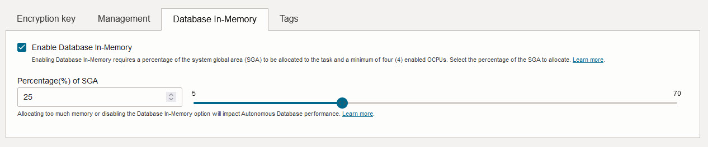
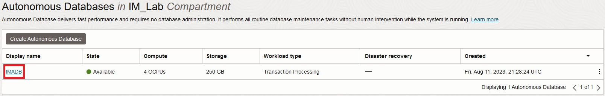
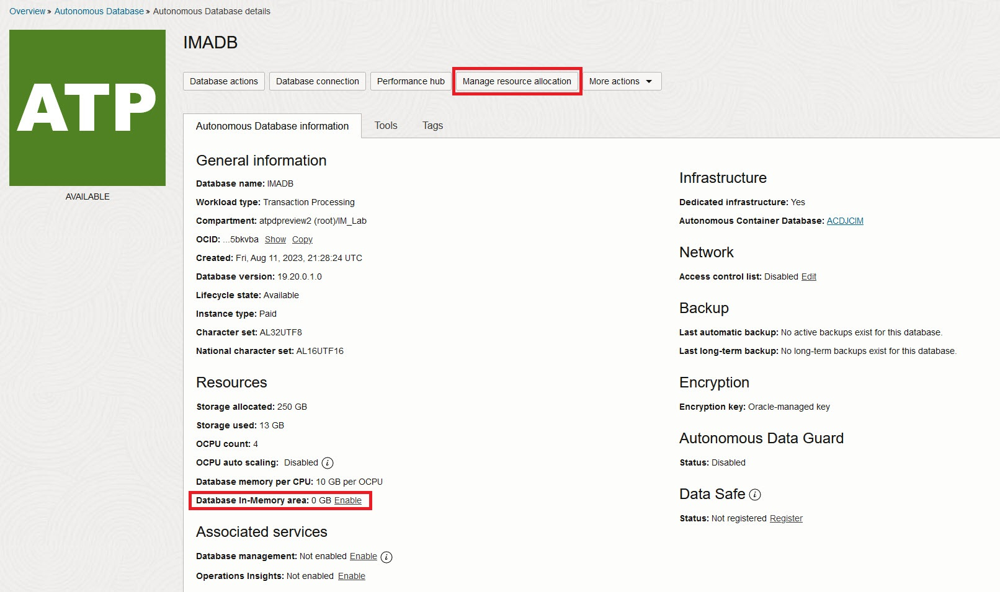
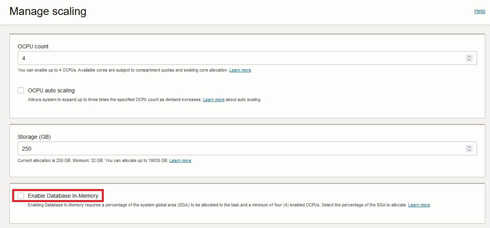
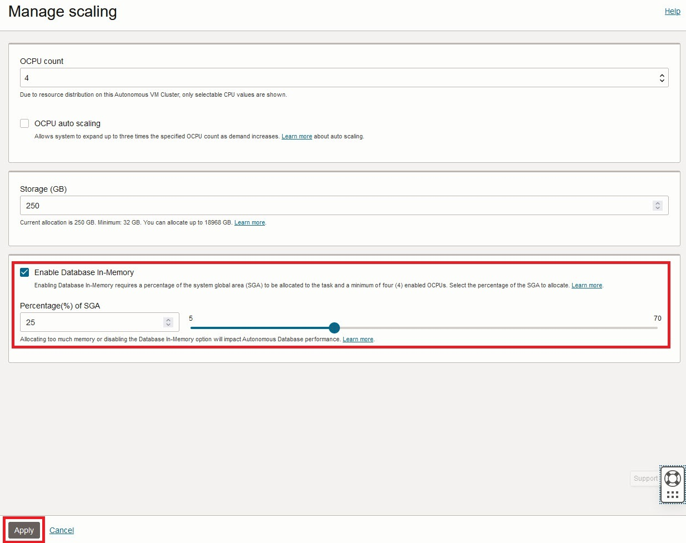
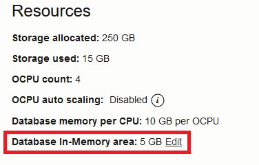

# Database In-Memory on Autonomous Database Dedicated

## Introduction

This lab walks you through enabling the In-Memory feature and configuring objects to use the In-Memory column store on an Autonomous Database on Exadata Cloud@Customer and Dedicated Infrastructure (ADB-D). 

Oracle Database In-Memory adds columnar functionality to Oracle Databases for transparently accelerating analytic queries by orders of magnitude. Oracle Database In-Memory enables decision-making based on real-time data to lower costs, improve productivity, and increase competitiveness.

Estimated Time: 15 minutes

### Objectives

As an Autonomous Database administrator:
1. Enable In-Memory on an existing Autonomous Database 
2. Enable database tables to store data in the IM Column store
3. Run a workload against the IM objects to validate performance gains.  

### Required Artifacts

- An Oracle Cloud Infrastructure account with a pre-provisioned Exadata Infrastructure and Autonomous Container Database
- A pre-provisioned Autonomous Transaction Processing or Autonomous Datawarehouse instance. Refer to the lab **Provisioning Databases** in the **Autonomous Database Dedicated for Developers and Database Users** workshop on how to provision an Autonomous database.
    - minimum ADB version is 19.20.0.1
    - minimum of 4 OCPU to enable IM option on ADB-D
- Ability to connect to your In-Memory enabled ADB with SQLPlus/SQLcl.  If needed follow the lab **Configure a development system for use with your dedicated autonomous database**

## Task 1: Enable In-Memory

**NOTE:** The below steps demonstrate enabling In-Memory on an existing ADB but this can also be configured during ADB creation, ADB live clone, and ADB clone from backup.  This is done in the create workflow under advanced options as shown in the following screenshot:



- Log in to your OCI tenancy and navigate to Oracle Database and select Autonomous Database from the main menu.

- Select the Compartment where your Autonomous Database is located.  

- Click your ADB resource name.

    

- To enable In-Memory in your ADB you can click "Manage resource allocation" at the top or the "Enable" button next to "Database In-Memory area: 0 GB" under Resources

    

- Click the check box next to "Enable Database In-Memory"

    

- Move the slider to the desired percent of the SGA that you want to dedicate to the In-Memory column store.  This value can be dynamically increased or decreased as needed and the minimum is 5% and the maximum is 70%.  For the lab we will use 25%. Once that is done click apply.



**Note:** Even though the amount of memory available is based on OCPU, the slider is based on a percentage of the total memory available in the SGA of the ADB instance.

- The ADB will go into "SCALING IN PROGRESS" status while the IM parameters are applied to the Autonomous Container and Autonomous Database. 


- This will take a few minutes and once the ADB returns to Available state IM is ready to be used.  We can now see the exact size of the IM column store:

 

## Task 2: Prepare the IM ADB resource

- Log into your IM enabled ADB using the low service connection string

    ```
    sqlplus admin/DemoDemo2023##@imadb_low
    ```

- Create the IM demo user:

    ```
    SQL> CREATE USER imdemo IDENTIFIED BY DemoDemo2023## QUOTA UNLIMITED ON DATA;
    ```
    
- Grant the necessary privileges to the imdemo user we created above:

    ```
    SQL> 
         GRANT CREATE SESSION TO imdemo;
         GRANT CREATE TABLE TO imdemo;
         GRANT CREATE VIEW TO imdemo;
         GRANT CREATE SEQUENCE TO imdemo;
         GRANT EXECUTE ON DBMS_INMEMORY_ADMIN TO imdemo;
         GRANT SELECT ON SYS.V_$IM_SEGMENTS TO imdemo;
         GRANT SELECT_CATALOG_ROLE TO imdemo;

    ```

## Take 3:  Run the data generator and demo sql

For the rest of this lab we will use the Database In-Memory demo script from the Oracle In-memory team.  The script is available here: https://github.com/AndyRivenes/DBIM/tree/master/Simple%20Demo

The script will create an orders table and generate ~8M records covering 4 years of data.  Once the data is loaded stats will be gathered, and the table will be populated into the IM column store.  The script finishes by running two different queries twice, once with IM enabled and a second time with IM disabled so we can compare the performance difference.  

- Download the SQL file to the machine you are running your sqlplus commands from:

    ```
    wget https://raw.githubusercontent.com/AndyRivenes/DBIM/master/Simple%20Demo/dbim_simple_demo.sql
    ```

- Login as the imdemo user from the directory that contains the above script:

    ```
    sqlplus imdemo/DemoDemo2023##@imadb_low
    ```

- Run the IM Demo script and follow the prompts to press enter as the script runs:

    ```
    set linesize 250
    set pagesize 5000
    @dbim_simple_demo.sql
    ```

The above workload is a small data set and is running on a very fast infrastructure but you can see that both queries benefit from the use of In-Memory!  Also notice in the explain plans in the script output that the queries with IM enabled have "TABLE ACCESS INMEMORY FULL"  vs the IM disabled showing "TABLE ACCESS STORAGE FULL".    

- Enabling In-Memory on an existing table is as simple as running the following just like you would in an on-prem environment:

    ```
    ALTER TABLE imtable INMEMORY PRIORITY HIGH;
    ```

- Disabling In-Memory is just as simple:
   
    ```
    ALTER TABLE imtable NO INMEMORY;
    ```

- To review which tables have In-Memory enabled for your connected user you can run:

    ```
    set linesize 250
    col TABLE_NAME format a35
    SELECT table_name, inmemory, inmemory_priority, inmemory_distribute,      
    inmemory_compression, inmemory_duplicate 
    FROM user_tables 
    WHERE inmemory = 'ENABLED'
    ORDER BY table_name;
    ```

## Acknowledgements
*Congratulations! You successfully enabled and tested the In-Memory option in your Autonomous Database on Dedicated Infrastructure environment.*

- **Author** - Jeffrey C
- **Last Updated By/Date** -  Jeffrey C, August 2023


