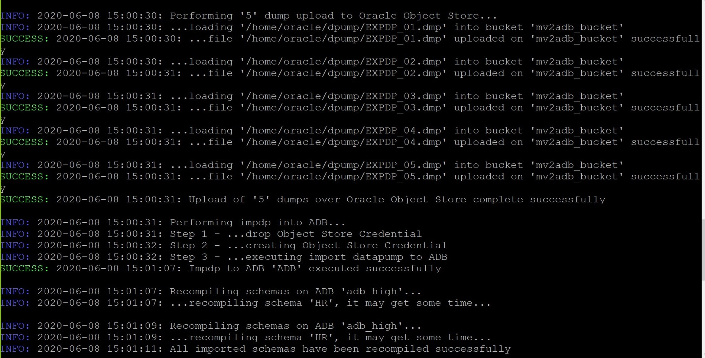

# Migrate Workloads to ATP-D using MV2ADB
## Introduction
Data Replication is an essential part of your efforts and tasks when you are migrating your Oracle databases on OCI. **Move to Autonomous Database (MV2ADB)** is a tool, permitting the data loading and migration from “on premises” to Autonomous Database Cloud leveraging Oracle Data Pump and with one command. Data Pump Import lets you import data from Data Pump files residing on the Oracle Cloud Infrastructure Object Storage. You can save your data to your Cloud Object Store and load them to Autonomous Database Cloud using “mv2adb”.

This lab is a 3 step process – take export from source, upload the dumpfiles on object storage and import files into ATP-D. However, we would be performing all the 3 steps using a single command. In this lab we will use a 12c DBCS instance as source and an ATP-D instance as our target.

*Note: For using mv2adb for migration from source DB to ATPD, the source DB should be at lower version than ATP-D Database.*

Estimated Time: 20 minutes

### Objectives

As a LOB user:
1. Establish connectivity from Source instance to Target instance.
2. Install and Configure MV2ADB tool on Source.
3. Run the MV2ADB config script to migrate workloads from Source to Target.

### Required Artifacts

- A pre-provisioned dedicated autonomous database instance. Refer to the earlier lab, **Provisioning Databases**.
- A pre-provisioned Source with connectivity to target ATP-D. We are using DBCS as Source here.
- Download and transfer ATP-D Wallet to Source Machine. Refer to Task 2 of the earlier lab, **Configure a Development System**.
- A pre-generated Auth Token from the console. (**Menu** > **Identity** > **Users** > **User Details** > **Auth Tokens** > **Generate Tokens**)

## Task 1: Create a Bucket

- Log in to the OCI tenancy. Go to **Menu** > **Core Infrastructure** > **Oject Storage** > **Object Storage**.

    

- Ensure you are in the right compartment and click **Create Bucket**.

    

## Task 2: Install Instant Client on the Source DBCS instance

- ssh into the Source DBCS instance.

    ```
    <copy>
    ssh -i <private-key> opc@PublicIP
    </copy>
    ```

- Download the Instant Client RPM [from this website](https://www.oracle.com/database/technologies/instant-client/downloads.html). We used [Version 18.5.0.0.0 Basic Package ZIP](https://www.oracle.com/database/technologies/instant-client/linux-x86-64-downloads.html).
*Note: It is preferred to do this installation from root user.*

    ```
    <copy>
    sudo su - root
    scp -i <private key path> <full path of downloaded zip file> opc@<publicIP>:/home/opc/
    mv /home/opc/clientrpms.zip /root/
    unzip clientrpms.zip
    rpm -ivh clientrpms/oracle-instantclient18.5-basic-18.5.0.0.0-3.x86_64.rpm clientrpms/oracle-instantclient18.5-sqlplus-18.5.0.0.0-3.x86_64.rpm clientrpms/oracle-instantclient18.5-tools-18.5.0.0.0-3.x86_64.rpm
    </copy>
    ```

    

The instant cient package containing Basic Package, SQLPlus Package and Tools Package is now installed.

## Task 3: Check connectivity to the Target ATP-D instance from Source

- Download and transfer ATP-D DB Wallet to Source Machine (DBCS instance).  
*Note: We have downloaded the DB Wallet onto our local machine and uploaded it to object storage. We then used scp to transfer it to DBCS. Refer to Task 2 of the earlier lab,  **Configure a Development System***.

    ```
    <copy>
    mkdir -p /root/wallet
    scp -i <private key path> <full path of downloaded DB Wallet file> opc@<publicIP>:/home/opc/
    mv /home/opc/Wallet.zip /root/wallet/
    </copy>
    ```

    

- Edit the sqlnet file to change the wallet directory to the new location of /root/wallet and export the following paths:

    ```
    <copy>
    export TNS_ADMIN=/root/wallet
    export LD_LIBRARY_PATH=/usr/lib/oracle/18.5/client64/lib:$LD_LIBRARY_PATH
    export PATH=/usr/lib/oracle/18.5/client64/bin:$PATH
    </copy>
    ```

    *Note: These paths may vary on your system. Please check prior to performing export.*

    

- Copy the connect string from tnsnames.ora file existing in the Wallet folder to connect to ATP-D instance.

    ```
    <copy>
    sqlplus ADMIN/<password of ATPD>@<connect string>
    SQL> exit
    </copy>
    ```

## Task 4: Download and install MV2ADB on source DBCS instance.

- Download the MV2ADB rpm file [from this website](https://support.oracle.com/epmos/faces/DocContentDisplay?_afrLoop=291097898074822&id=2463574.1&_afrWindowMode=0&_adf.ctrl-state=v0102jx12_4). Platform specific rpm can be downloaded under the **History** Tab.

- Transfer this file to your Source DBCS using scp:

    ```
    <copy>
    scp -i <private key path> <full path of downloaded RPM file> opc@<publicIP>:/home/opc/
    mv /home/opc/<RPM file> /root/<RPM file>
    </copy>
    ```

- Install the rpm using the given command from the directory where the rpm exists.

    ```
    <copy>
    sudo su -
    rpm -i <name of the rpm file downloaded>
    </copy>
    ```

    

- Validate the installation.

    ```
    <copy>
    sudo yum install tree (Optional Step - Do only if your Source is a Compute Instance)
    tree /opt/mv2adb/
    </copy>
    ```

    

*Note: The cfg file created here will be used as a reference for our configuration file.*

## Task 5: Encrypt Passwords

Generate encrypted passwords using the **`mv2adb encpass`** command for system password, Admin password and auth token (OCI Password) and copy the values to a safe location (for example, Notepad).

    ```
    <copy>
    cd /opt/mv2adb
    ./mv2adb encpass
    </copy>
    ```


## Task 6: Run the Migration Script

- Take a backup of the existing configuration file and edit the **`DBNAME.mv2adb.cfg`** file.

    ```
    <copy>
    cd /opt/mv2adb/conf/
    cp DBNAME.mv2adb.cfg DBNAME.mv2adb.cfg_bkp
    vi DBNAME.mv2adb.cfg
    </copy>
    ```
#### Note: Edit the following parameters

    ```
    <copy>
    DB_CONSTRING =//<hostname>:1521/<servicename of DB>
    SYSTEM_DB_PASSWORD=<enc_password>
    SCHEMAS=<schemas to be migrated>
    REMAP=<Source tablespace>:<Target tablespace>
    DUMP_NAME=<name for your dump file>
    DUMP_PATH=<path to store your dump file>
    DUMP_FILES=<full path of dump file>
    OHOME=<Oracle Home Path>
    ICHOME=<Instant Client Path>
    ADB_NAME=<Name of Target>
    ADB_Password=<Encrypted Value>
    ADB_TARGET=ATPD
    ADB_CFILE=<location of ATPD Wallet file>
    </copy>
    ```

- Click [this download link](https://objectstorage.us-ashburn-1.oraclecloud.com/p/ccTZey-FamcBZ02nCaU7J9yzy20c0a5UxCQf-3IciWE/n/atpdpreview11/b/mv2adb/o/samplesource.mv2adbfinal.cfg) to download a sample config file for reference.

    

- Navigate to your console and get the OCI Details.

    

    

- Run the migration script in auto mode.

    ```
    <copy>
    cd /opt/mv2adb
    ./mv2adb auto -conf /opt/mv2adb/conf/DBNAME.mv2adb.cfg
    </copy>
    ```

    

    

Migration of schema from source machine to Autonomous Database is complete.

## Task 7: Validate the Data Migration

- We had migrated a sample HR schema in this lab. Let's connect to the ATPD (Target) and validate the migration of data.

    ```
    <copy>
    echo "WALLET_LOCATION = (SOURCE = (METHOD = file) (METHOD_DATA = (DIRECTORY="/root/wallet")))" > /root/wallet/sqlnet.ora
    export TNS_ADMIN=/root/wallet
    export LD_LIBRARY_PATH=/usr/lib/oracle/18.5/client64/lib:$LD_LIBRARY_PATH
    export PATH=/usr/lib/oracle/18.5/client64/bin:$PATH
    sqlplus ADMIN/Password@<ATPD Connect String>
    SQL> select * from hr.sourcetable;
    </copy>
    ```

    


## Acknowledgements

*Great Work! You have successfully migrated HR schema from source database to ATP-D. You can do the same and more by making appropriate changes to the cfg file for various parameters.*

- **Author** - Padma Priya Rajan, Navya M S & Jayshree Chatterjee
- **Last Updated By/Date** - Kris Bhanushali, Autonomous Database Product Management, March 2022


## See an issue or have feedback?  
Please submit feedback [here](https://apexapps.oracle.com/pls/apex/f?p=133:1:::::P1_FEEDBACK:1).   Select 'Autonomous DB on Dedicated Exadata' as workshop name, include Lab name and issue / feedback details. Thank you!
