# Prepare your private network in the Oracle Cloud Infrastructure

## Introduction

Oracle Autonomous AI Database on Dedicated Exadata Infrastructure runs on dedicated Exadata hardware in Oracle Cloud Infrastructure (OCI). It provides isolated, high-performance hardware resources, similar to operating a private cloud within a public cloud environment. In this hands-on lab, you review best practices for setting up a secure Autonomous AI Database platform. Although every organization should implement its own corporate security policies, this guide provides a framework for working with the Autonomous AI Database platform in OCI. The two key concepts covered are: separation of duties and network setup.

When configuring the dedicated infrastructure feature of Oracle Autonomous AI Database, you need to ensure that your cloud users have access to use and create only the appropriate kinds of cloud resources to perform their job duties. Additionally, you need to ensure that only authorized personnel and applications have network access to the Autonomous AI Databases created on dedicated infrastructure.

To institute access controls for cloud users, you define policies that grant specific groups of users specific access rights to specific kinds of resources in specific compartments.

To implement network access controls, create VCNs and subnets. Then, using the same policy mechanism, permit only the appropriate VCN and subnet to be used when you create dedicated infrastructure resources. This helps ensure proper network isolation of resources.

Estimated Time: 60 minutes

### Objectives

As an OCI account administrator with network resource privileges:

1. Create compartments and user groups with the right set of access policies for separation of duties.
2. Create fleet admin and database user accounts.
3. Layout a secure network for the database and application infrastructure.

### Required Artifacts

- An Oracle Cloud Infrastructure account with privileges to create users, IAM policies, and networks.
- Since this is the starting point to building your dedicated Autonomous AI Database platform, an admin account is recommended.

## Task 1: Create compartments, groups, users and IAM policies

For separation of duties, Oracle recommends that a fleet administrator provisions the Exadata Infrastructure, Autonomous VM Clusters, and Autonomous Container Databases, while database users consume those resources and provision their databases on them.

You will use the following IAM structure in line with the bare minimum isolation recommended:

- A **fleetCompartment** to hold the network resources, Cloud Exadata Infrastructure, Autonomous VM Clusters, and Autonomous Container Databases (ACDs).
- A **dbUserCompartment** for database and application-user resources, such as Autonomous AI Databases and application client machines. Although this lab creates one dbUser compartment, in practice, each line of business can have a separate compartment for additional isolation.
  - The fleet administrator has IAM policies to create and manage Cloud Exadata Infrastructure, ACDs, and network resources in the fleet compartment.
  - Alternatively, a network administrator can provision the VCN and subnets first, after which a fleet administrator provisions the Exadata Infrastructure, Autonomous VM Clusters, and Autonomous Container Databases. The Exadata subnet can reside in a separate compartment.

- Database users in the **dbUserCompartment** have *READ* privileges for ACD resources in the **fleetCompartment** only. They cannot create, delete, or modify those resources. A database user can have full privileges in their own compartment, where they can create and delete database and application resources.

### Steps:

1. Create two compartments: **fleetCompartment** and **dbUserCompartment**. In the OCI Console navigation menu, select **Identity & Security**, then **Compartments**. Click **Create compartment**, enter a name and description, and then click **Create compartment**. See [Working with Compartments](https://docs.oracle.com/en-us/iaas/Content/Identity/compartments/Working_with_Compartments.htm) for more information on Compartments.

    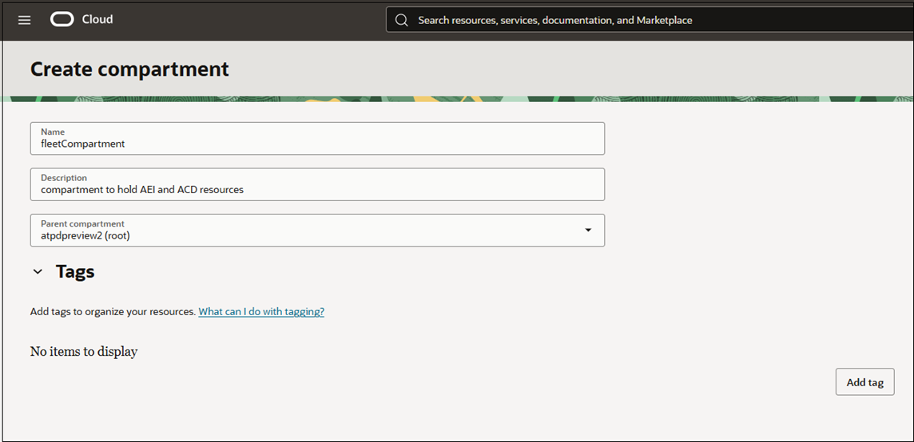

    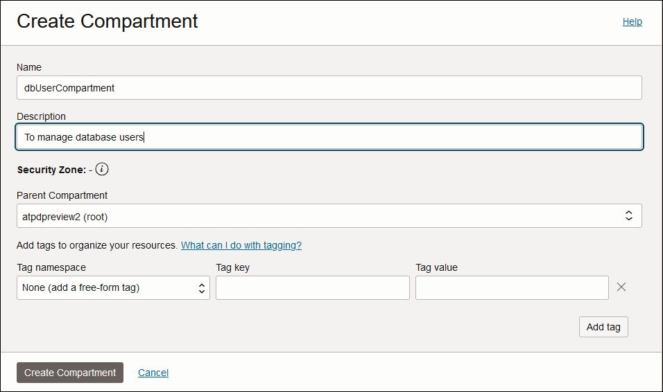

2. Next, create the **fleetAdmins** and **dbUsers** groups. See [Working with Groups](https://docs.oracle.com/en-us/iaas/Content/Identity/Tasks/managinggroups.htm) for more information on groups.

   In the OCI Console navigation menu, select **Identity & Security**, then **Domains**, and select the identity domain you use. On the domain details page, select **Groups** under **User management**. For each group, click **Create group**, enter a name and description, and then click **Create**.

    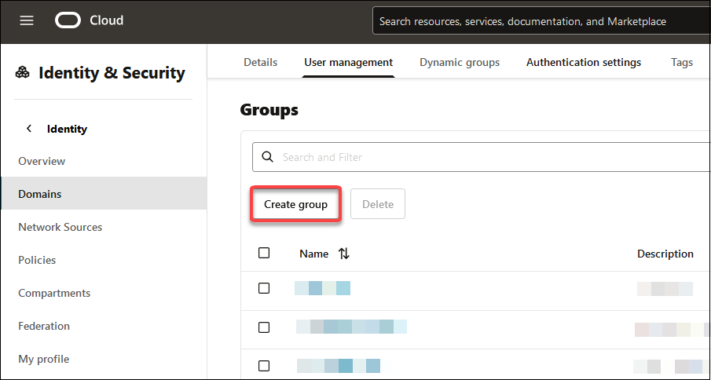
    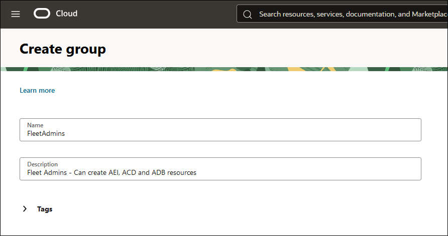
    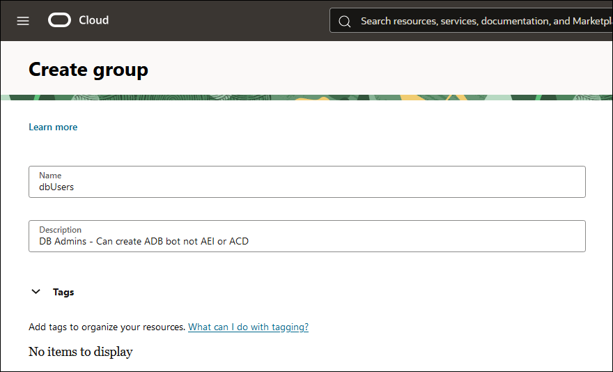

3. Now add the required IAM policies for the compartments you created. In the OCI Console navigation menu, select **Identity & Security**, then **Policies**. Click **Create Policy**, enter the required information, and then click **Create**.

    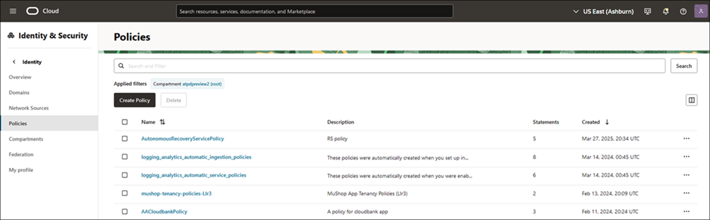

    - The following policy statements on the **fleetCompartment**  are the minimum policies required to ensure the groups **fleetAdmins** and **dbUsers** have the right privileges as explained earlier.

        ```
        <copy>
        Allow group fleetAdmins to MANAGE cloud-exadata-infrastructures in compartment fleetCompartment
        Allow group fleetAdmins to MANAGE autonomous-database-family in compartment fleetCompartment        
        </copy>
        ```

    - The only privilege **dbUsers** need in the **fleetCompartment** is `READ` access to Autonomous Container Databases, which is required to create their own Autonomous AI Databases. Add the following policy statement for the **fleetCompartment**:

        ```
        <copy>
        Allow group dbUsers to READ autonomous-container-databases in compartment fleetCompartment
        </copy>
        ```

   - To continue the lab, you need to create these additional policies.

       ```
        <copy>
        Allow group fleetAdmins to USE virtual-network-family in compartment fleetCompartment
        Allow group fleetAdmins to USE tag-namespaces in compartment fleetCompartment
        Allow group fleetAdmins to USE tag-defaults in compartment fleetCompartment
        </copy>
      ```

   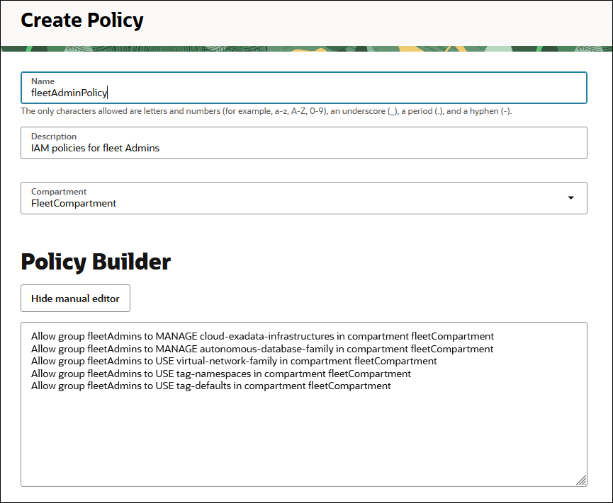

4. Similarly, create a **dbUserPolicy** for the **dbUserCompartment** as shown. Ensure that you select the correct compartment before clicking **Create Policy**.

    **Note:** The assumption here is that the DB user will need to create other resources such as network, compute instances, storage buckets, and more, in their own compartment. This is highly dependent on a customer's individual requirement and can be configured in many different ways.

    ```
    <copy>
    Allow group dbUsers to MANAGE autonomous-databases in compartment dbUserCompartment
    Allow group dbUsers to MANAGE autonomous-backups in compartment dbUserCompartment
    Allow group dbUsers to USE virtual-network-family in compartment dbUserCompartment
    Allow group dbUsers to MANAGE instance-family in compartment dbUserCompartment
    Allow group dbUsers to MANAGE buckets in compartment dbUserCompartment
    Allow group dbUsers to MANAGE objects in compartment dbUserCompartment
    Allow group dbUsers to MANAGE app-catalog-listing in compartment dbUserCompartment
    </copy>
    ```

    **NOTE: [This documentation](https://docs.oracle.com/iaas/autonomous-database/doc/iam-policies-autonomous-database-dedicated-exadata-infrastructure.html) lists the IAM policies for Autonomous AI Database on Dedicated Exadata Infrastructure.**

5. Finally, create a fleet administrator and a database user, and add them to their respective groups. See [Managing Users](https://docs.oracle.com/en-us/iaas/Content/Identity/Tasks/managingusers.htm) for more information on Users. On your identity domain details page, select **Users** under **User management**. Click **Create user** and enter the required information.

    Any additional fleet admins or database users will simply need to be added to their groups and they will automatically assume their group privileges.

    After creating a user, open the user's details page and select **Groups**. Click **Assign user to group**, select the required group, and then click **Assign user**.

    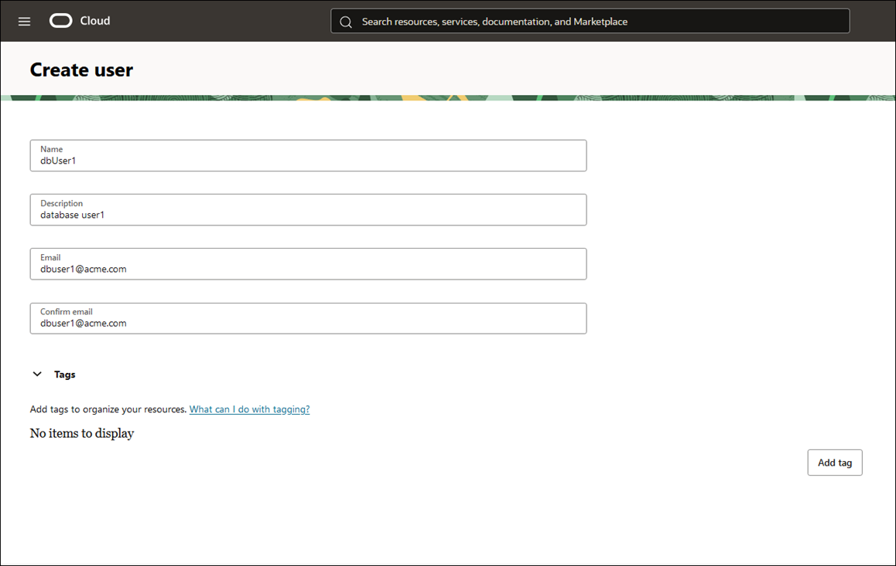

    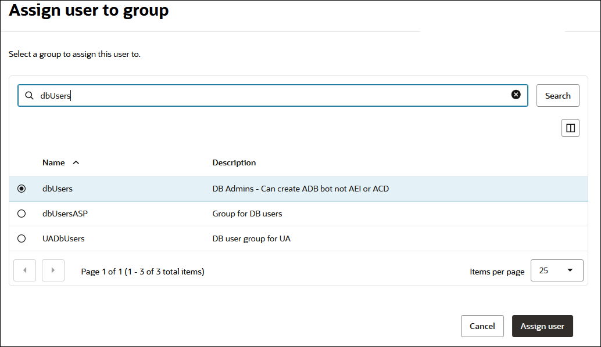

You now have the users, groups, and compartments set up to provision Autonomous AI Database resources.

## Task 2: Layout a secure network for the database and application infrastructure

Setting up the right network from the outset is important because changing foundational network design choices can require significant reconfiguration. Although your network administrators are ultimately responsible for selecting a topology that meets corporate network guidelines, the following is a best-practice recommendation for setting up a secure network for your database and applications.

This lab assumes that you have a basic understanding of networking components and software-defined networks (SDNs). If you are new to this subject, refer to the [OCI networking documentation](https://docs.oracle.com/iaas/Content/Network/Concepts/overview.htm) for an introduction to VCNs, subnets, security lists, route tables, and gateways.

Your OCI network can be treated as your own private data center. Although many network topologies are possible, this lab uses a topology in which the database infrastructure is in a private subnet and the application and VPN infrastructure are in a public subnet. For production scenarios, separate the VPN and application servers into their own subnets and configure additional firewalls as appropriate.

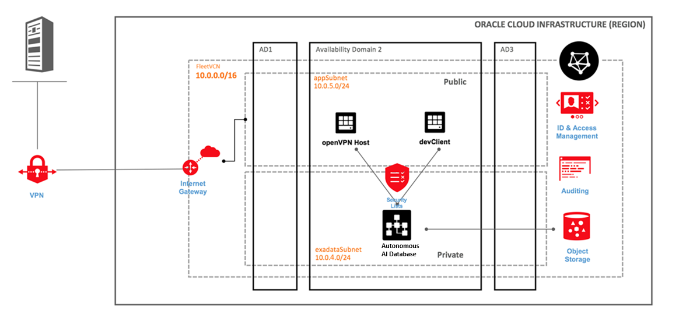

You will also follow these security guidelines as you build the network:

1. Each subnet has its own security list and route table. Do not use the default security list or route table, or share them between subnets.
2. Database infrastructure will be in a private subnet with no internet access.
3. Open ingress ports for the Exadata subnet only as needed.
4. Only external facing public subnets will have an internet gateway.
5. External-facing hosts have port 22 open for inbound SSH traffic only when required.

For simplicity, this lab creates only two subnets: a private subnet for Exadata and a public subnet for everything else. In practice, use multiple subnets to host web servers, application servers, VPN servers in perimeter networks, and other resources.

## Task 3: Create the network resources as a network administrator or fleet administrator

- Sign in to the OCI Console as a network administrator or fleet administrator.
 Create a VCN in **fleetCompartment** with the CIDR block `10.0.0.0/16`, which provides 65,536 IP addresses for subnets in this network. In the OCI Console navigation menu, select **Networking**, then **Virtual cloud networks**. Select **Create VCN**, enter the required information, and then select **Create VCN**.

    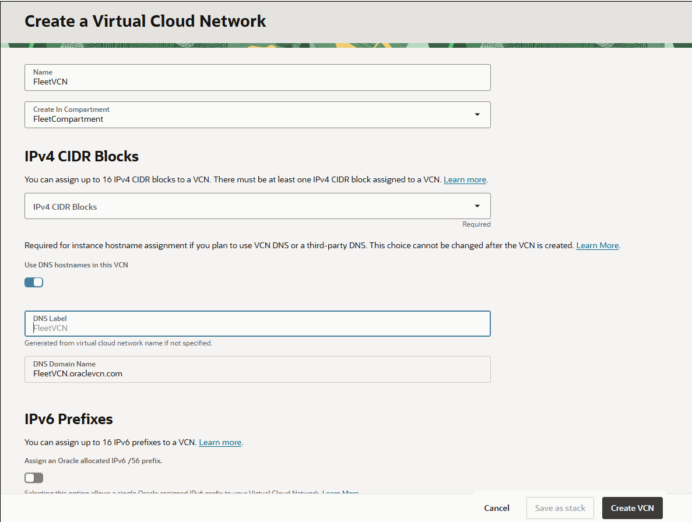

    In Oracle Public Cloud deployments, you can use IPv4/IPv6 dual-stack networking, enabling both IPv4 and IPv6 addresses. You can enable this option while creating a VCN, and while creating a subnet, and you can use the corresponding subnet (which has both IP4 and IP6 addresses) while provisioning an AVMC.

   **Creating Security Lists:**

   Add two security lists to this VCN, one for each subnet that you deploy for the database and application networks. See [Overview of Security Lists](https://docs.oracle.com/en-us/iaas/Content/Network/Concepts/securitylists.htm) for more details. On the VCN details page, under **Resources**, select **Security Lists**, then select **Create Security List**.

  Each subnet has its own security list. Start by creating the **exaSubnet-seclist** security list for the Exadata subnet with the ingress and egress rules as shown below.

    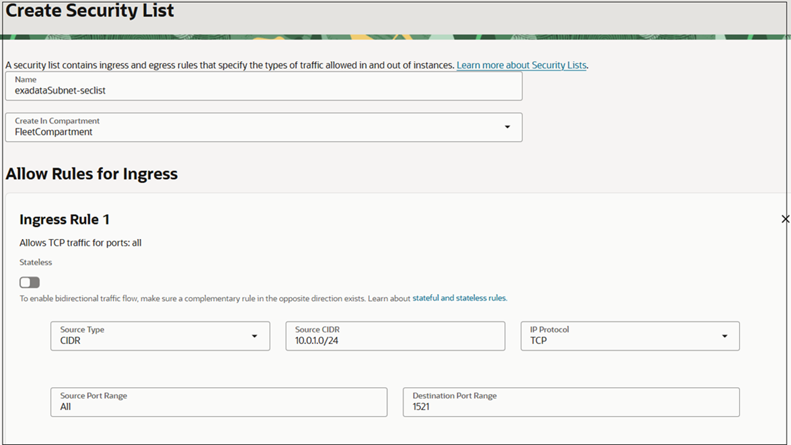
    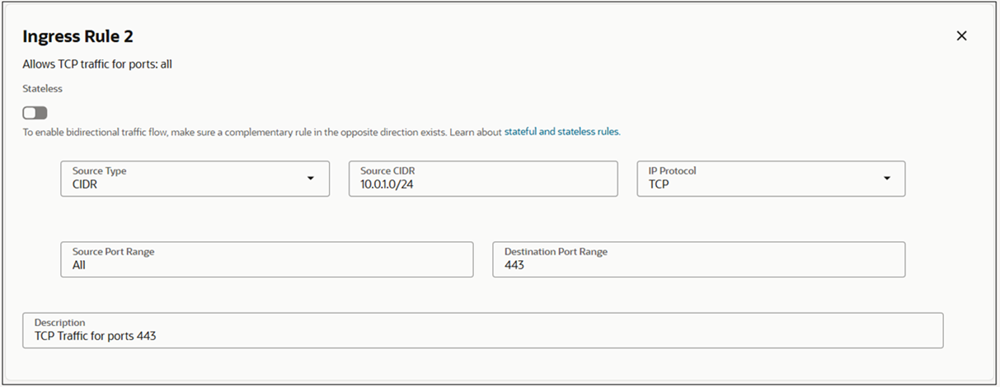
    
    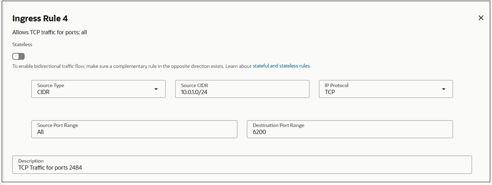
    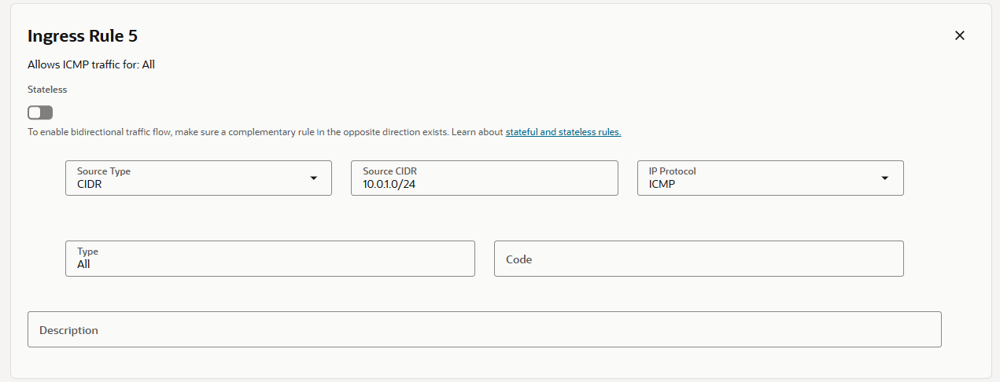
    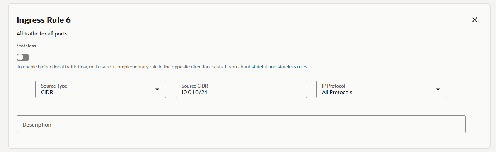
    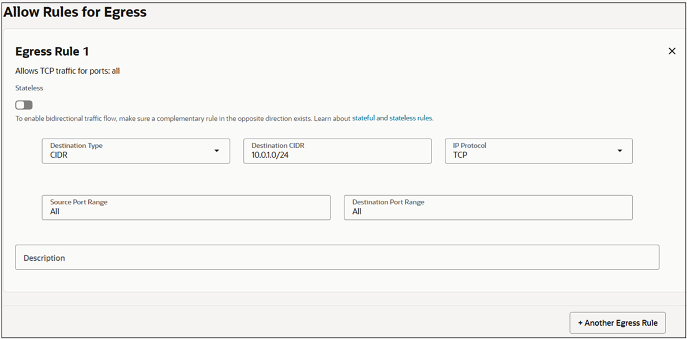

  You have now created the **exaSubnet-seclist** security list. In the same way, create another security list, **appSubnet-seclist**, for the application subnet. After you add the ingress and egress rules, the **appSubnet-seclist** has the rules shown below.  
    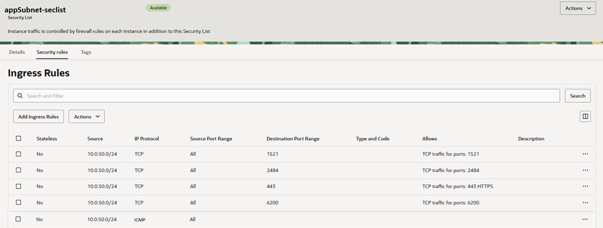
    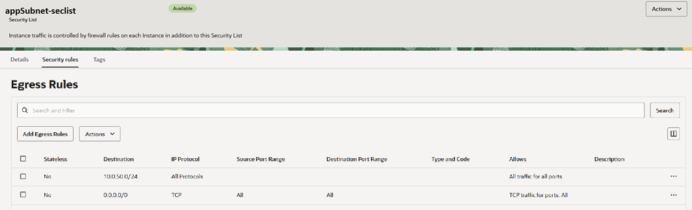

  Because this is a two-tier configuration, this subnet can host VPN servers, application servers, compute instances for VNC, and other resources. Open only the ports required for the services that must receive internet traffic.

  Alternatively, you can host internet-facing resources in a separate subnet and configure security lists accordingly. Consult your network administrator to ensure that the deployment follows your corporate best practices.

  **Create an internet gateway:**

  Instances in the application subnet might need internet access. To provide this access, deploy an internet gateway in the VCN and create a route to it. This is optional and depends on whether you need public-facing hosts. Typically, bastion hosts are deployed in a public subnet for SSH access. In this guide, developer client machines are deployed in the public **appSubnet** for simplicity. 
  
  See [Overview of Internet Gateways](https://docs.oracle.com/en-us/iaas/Content/Network/Tasks/managingIGs.htm) for more details.

  On the VCN details page, under **Resources**, select **Internet Gateways**. Select **Create Internet Gateway**, enter the required information, and then select **Create Internet Gateway**.
    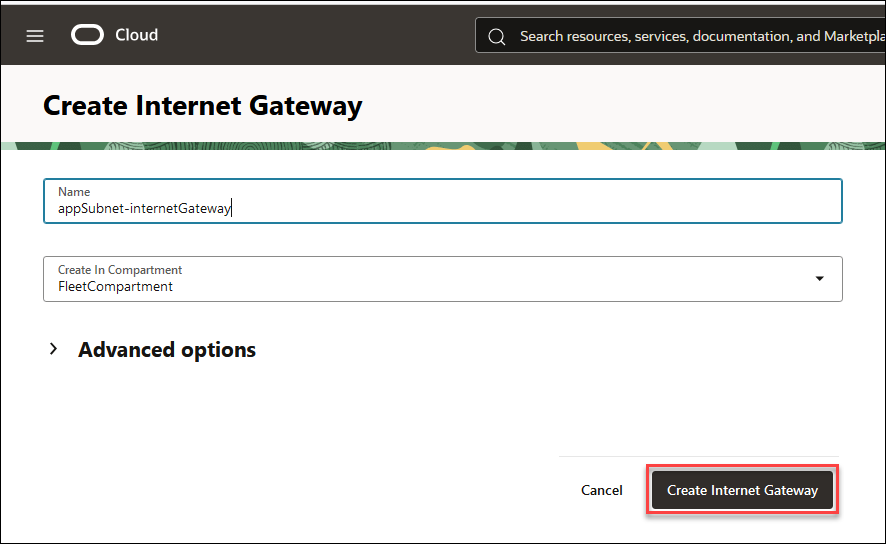

  **Create a Route Table:**

   Create a route table for the application subnet to route traffic to the internet gateway. See [Overview of Route Tables](https://docs.oracle.com/en-us/iaas/Content/Network/Tasks/managingroutetables.htm) for more details.
   
   On the VCN details page, under **Resources**, select **Route Tables**, then select **Create Route Table**. Enter the required information and select **Create**.

  The destination CIDR block `0.0.0.0/0` indicates all IPv4 addresses globally; that is, any host on the internet. You can limit the route to specific hosts or networks as needed. For example, you can limit it to hosts in your corporate network or to a specific host with a unique public IP address.

    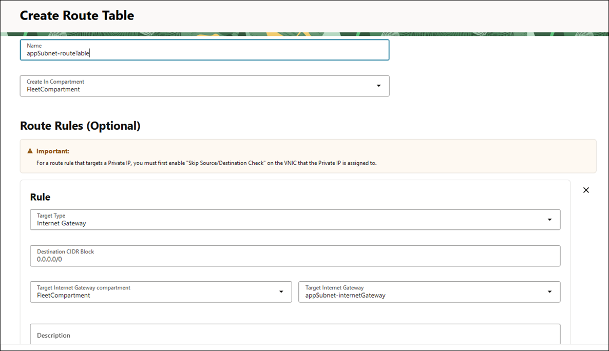

  Similarly, create a route table for the Exadata subnet. Because a route table is required when you create a subnet, create a blank route table named **exaSubnet-routeTable** without route rules.

    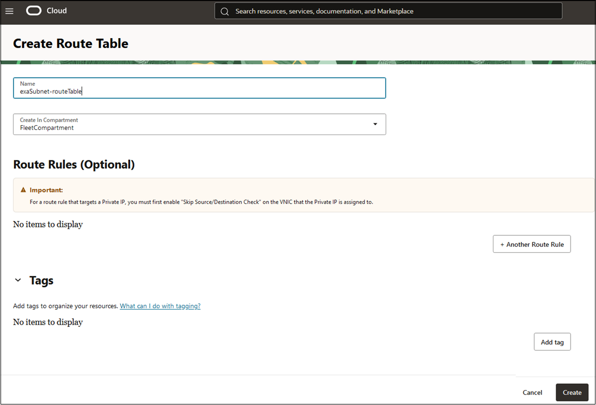

  **Provision the subnets:**

  Provision two subnets: **exadataSubnet** and **appSubnet**. See [Overview of VCN and Subnets](https://docs.oracle.com/en-us/iaas/Content/Network/Tasks/Overview_of_VCNs_and_Subnets.htm) for more details.
  
  On the VCN details page, under **Resources**, select **Subnets**, then select **Create subnet**. Enter the required information and select **Create subnet**.

  Now that you have created the required network resources, you are ready to deploy the Exadata and application subnets. Start by provisioning **exadataSubnet** with the CIDR block `10.0.1.0/24`, as shown below. Associate **exaSubnet-routeTable**, which has no route rules, with **exadataSubnet**.

    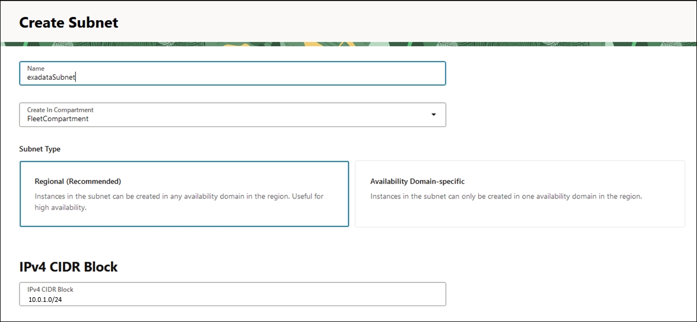
    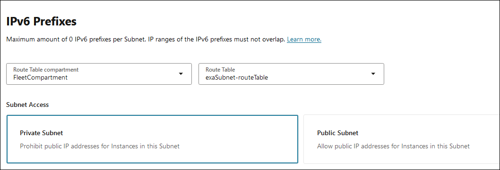
    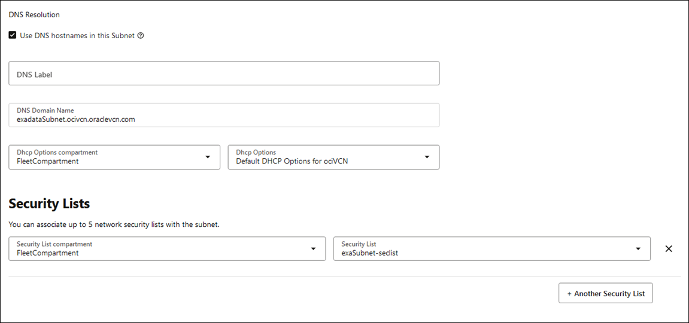
    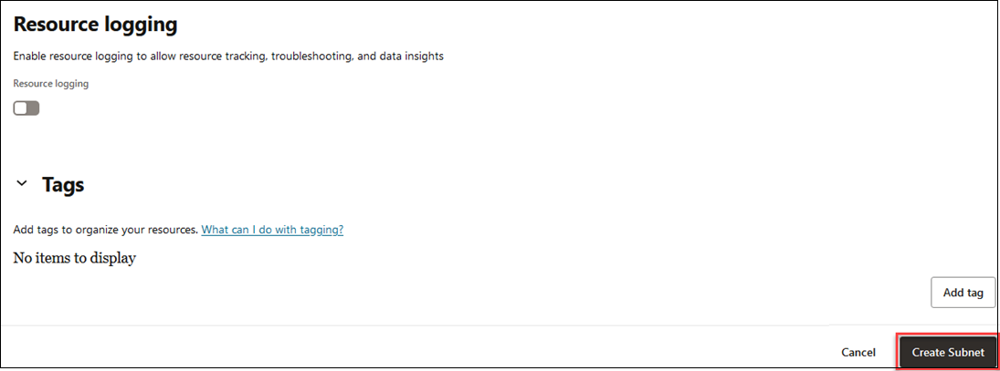

  Next, provision the application subnet with the CIDR block `10.0.50.0/24`. Associate the custom application route table with this subnet to provide internet access.
    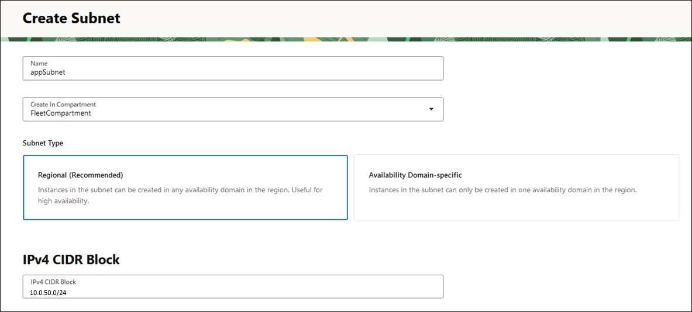
    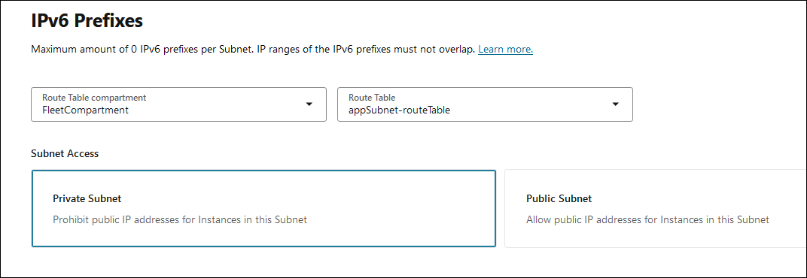
    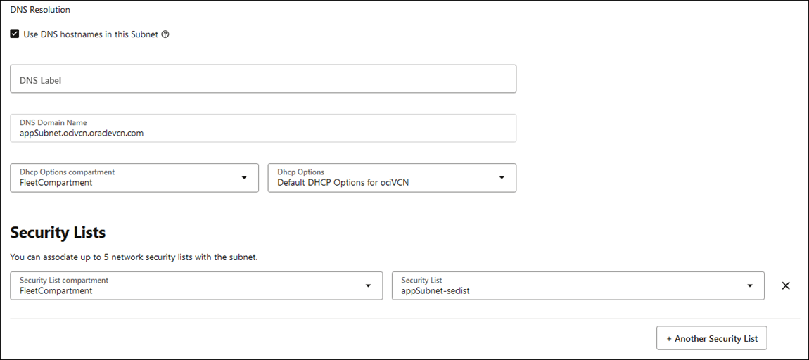
    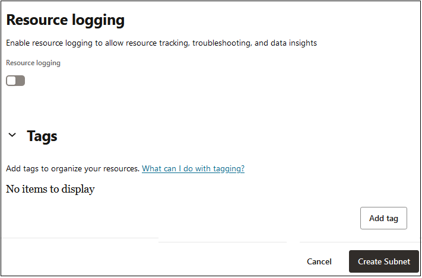

Your network setup is now complete.

*Fantastic! You have now set up your OCI network and users and are ready to deploy Autonomous AI Database infrastructure, databases, and applications.*

You may now **proceed to the next lab**.

## Acknowledgements

- **Author** - Tejus S. & Kris Bhanushali
- **Adapted by** -  Vandana Rajamani, Consulting UA Developer, July 2026
- **Last Updated By/Date** - Vandana Rajamani, Consulting UA Developer, September 2026
