# Preparing your private network in the Oracle Cloud Infrastructure

## Introduction
The Oracle dedicated autonomous database runs on dedicated Exadata hardware in the Oracle Cloud Infrastructure. That means you have your own personal slice of high performance hardware akin to running your own private cloud in a public cloud setting. In this hands-on lab we take a look at some best practices to setting up a secure autonomous data platform. Note that while every organization should implement their own corporate security policies, this guide aims to provide a framework for working with the autonomous data platform in the Oracle Cloud Infrastructure. The two key concepts dealt with here are: a) Separation of duties and b) Network setup.

When configuring the dedicated infrastructure feature of Oracle Autonomous Transaction Processing, you need to ensure that your cloud users have access to use and create only the appropriate kinds of cloud resources to perform their job duties. Additionally, you need to ensure that only authorized personnel and applications have network access to the autonomous databases created on dedicated infrastructure.

To institute access controls for cloud users, you define policies that grant specific groups of users specific access rights to specific kinds of resources in specific compartments.

To institute network access controls, you create VCNs and subnets and then, using the same policy mechanism, permit only the appropriate VCN and subnet to be used when a dedicated infrastructure resource is created. Thus, you can ensure the proper network isolation of resources.

Estimated Time: 60 minutes

### Objectives
As an OCI account administrator with network resource privileges:

1. Create compartments and user groups with the right set of access policies for separation of duties.
2. Create fleet admin and database user accounts.
3. Layout a secure network for the database and application infrastructure.

### Required Artifacts
- An Oracle Cloud Infrastructure account with privileges to create users, IAM policies and networks.
- Since this is the starting point to building your dedicated autonomous database platform, an admin account is recommended.

## Task 1: Create compartments, groups, users and IAM policies
For separation of duties Oracle recommends a fleet administrator provision the exadata infrastucture, VM Clusters and container databases while the database users simply become consumers of these resources and provision their databases on it.

We will use the following IAM structure in line with the bare minimum isolation recommended:

- A **fleetCompartment** to hold the Network resources, Exadata Infrastructure, Autonomous VM Cluster and Autonomous Container Databases (ACD).
- A **dbUserCompartment** for database and application user objects such as Autononomous Databases (ADBs) and application client machines. While for the purpose of this lab we create a single dbUser compartment, in practice, each user may have their own compartment for further isolation.
    - The fleet Admin will have IAM policies to create and manage CEI  (Cloud Exadata Infrastructure), ACDs and network resources in the fleet compartment.
    - Alternatively, A network admin may first provision the VCN and Subnets while a fleet admin then provisions the Exadata Infrastructure, VM Cluster and Container databases. The exadata subnet may be hosted in its own separate compartment.

- Database users in the dbUser compartment will have privileges to *READ* ACD resources in the fleet compartment only. They cannot create, delete or modify those resources. A database user may have complete read/write privileges on their own compartments where they can create and destroy database and application instances.

1. Lets create compartments **fleetComparment** and **dbUserCompartment** as shown.

    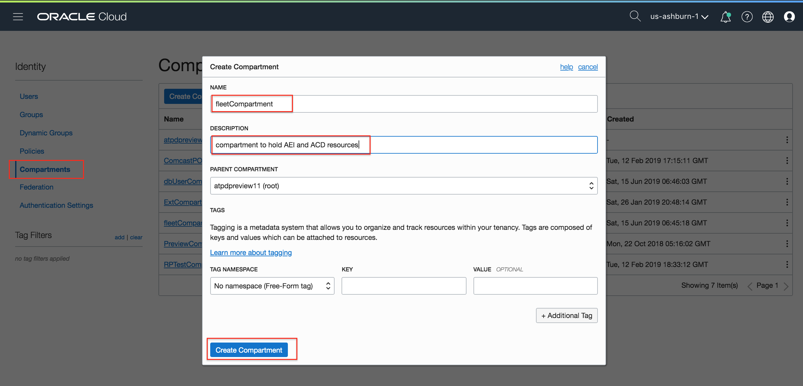

2. Create groups **fleetAdmins** and **dbUsers**.

    

3. Now, add the following IAM policies on the fleetAdminCompartment.

    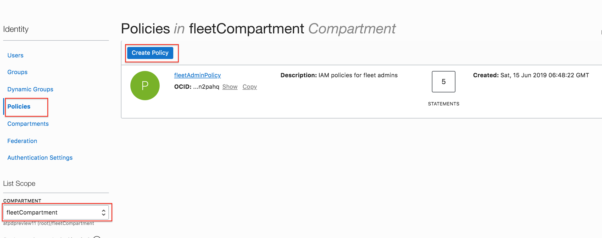

    - The following policy statement on the fleetCompartment ensure group fleetAdmins and dbUsers have the right privileges as explained earlier. Note how fleet admins have **manage** privileges while dbUsers have **read** privileges.

    ````
    <copy>
    Allow group fleetAdmins to MANAGE cloud-exadata-infrastructures in compartment fleetCompartment
    Allow group fleetAdmins to MANAGE autonomous-database-family in compartment fleetCompartment
    Allow group fleetAdmins to USE virtual-network-family in compartment fleetCompartment
    Allow group fleetAdmins to USE tag-namespaces in compartment fleetCompartment
    Allow group fleetAdmins to USE tag-defaults in compartment fleetCompartment
    </copy>
    ````

    - The only privilege dbUsers need on the fleet compartment is `READ` privilege on the Autonomous Container Databases to create their own Autonomous databases. Therefore, we add a policy statement on the fleet compartment as follows:

    ````
    <copy>
    Allow group dbUsers to READ autonomous-container-databases in compartment fleetCompartment
    </copy>
    ````

    - The final set of policy statements on the fleet compartment appear as shown below.

    

4. Similarly, create a **dbUserPolicy** on the **dbUserCompartment** as show. *Make sure you pick the right compartment before you click the 'Create Policy' button*.

    **Note:** The assumption here is that the DB user will need to create other resources such as network, compute instances, storage buckets, and more, in their own compartment. This is highly dependent on a customer's individual requirement and can be configured in many different ways.

    ````
    <copy>
    Allow group dbUsers to MANAGE autonomous-databases in compartment dbUserCompartment
    Allow group dbUsers to MANAGE autonomous-backups in compartment dbUserCompartment
    Allow group dbUsers to USE virtual-network-family in compartment dbUserCompartment
    Allow group dbUsers to MANAGE instance-family in compartment dbUserCompartment
    Allow group dbUsers to MANAGE buckets in compartment dbUserCompartment
    Allow group dbUsers to MANAGE objects in compartment dbUserCompartment
    Allow group dbUsers to MANAGE app-catalog-listing in compartment dbUserCompartment
    </copy>
    ````

    **NOTE: [This documention](https://docs.oracle.com/en/cloud/paas/autonomous-database/adbdf/index.html#articletitle) lists all the IAM policies for Autonomous Database Dedicated Exadata Infrastructure**.

    - You may alternatively choose to grant **MANAGE all-resources** privileges to users that need to provision databases and other cloud resources in their own private compartment as shown below.

    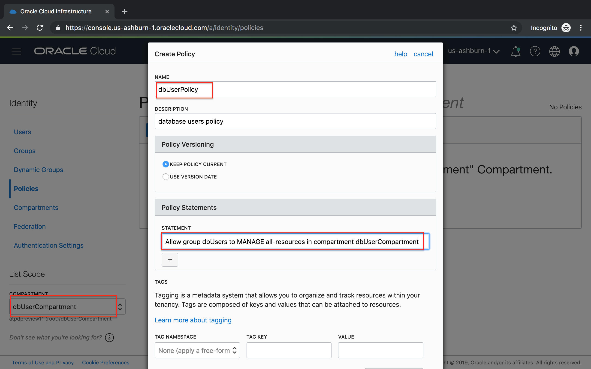

5. And finally, let's create a fleet admin and a database user and add them to their respective groups. Any additional fleet admins or database users will simply need to be added to their groups and they will automatically assume their group privileges.

    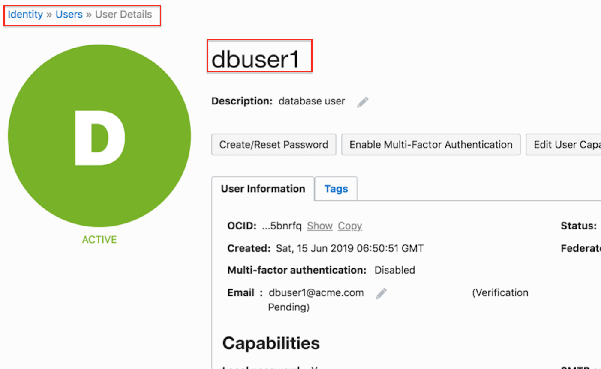
    
    

You now have the users, groups and compartments setup to provision an autonomous database platform.

## Task 2: Layout a secure network for the database and application infrastructure

Setting up the right network upfront is important since you cannot reverse most aspects of your network without completely destroying and rebuilding it. While your network administrators are  ultimately responsible for choosing the right network topology as per corporate network guidelines, here's a best practice recommendation for setting up a secure network for your database and applications.

Here it is assumed that the reader has some basic understanding of networking components and SDNs. If you are absolutely new to this subject, we suggest you refer to the OCI network documentation to get an understanding of VCNs, Subnets, Security lists, routers, gateways, and so on.

Your OCI network can be treated as your own private datacenter. While various network topologies are possible, we pick a topology here where the database infrastructure is in a private subnet while the application and VPN infrastructure are in a public subnet. For more practical scenarios, the VPN and application servers can be further separated into their own subnets and additional firewalls setup.

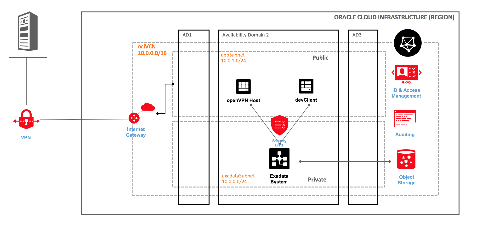

We will also follow these security guidelines as we build the network:

1. Each subnet we build will have its own security list and route table. We will not use the default seclist or route table or share them among subnets.
2. Database infrastructure will be in a private subnet with no internet access.
3. Ingress ports for exadata subnet will be opened on an as-needed basis.
4. Only external facing public subnets will have an internet gateway.
5. External facing hosts will have port 22 open for ingress ssh traffic.

For simplicity, only two subnets are being created here - a private subnet for exadata and a public network for everything else. In practice, multiple subnetworks may be tiered to host webservers, app servers, VPN servers in perimeter networks, and so on.

## Task 3: Log in to  OCI as a network admin or a fleet admin

- Create a VCN in **fleetCompartment** with CIDR block 10.0.0.0/16 which provide for 64k IP addresses for the various subnets within this network.

    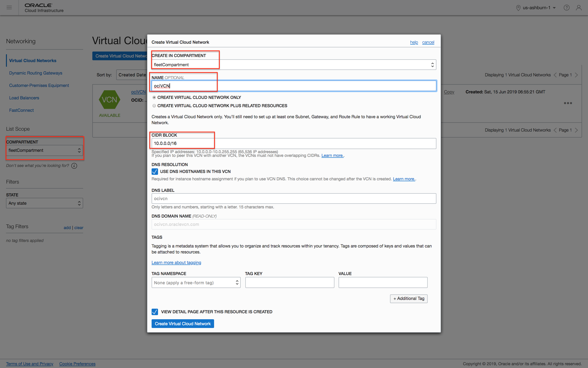

- Let's add two security lists to this VCN, one for each of the two subnets we would deploy for the database and application networks. Each subnet has its own security list as defined in the table below.

    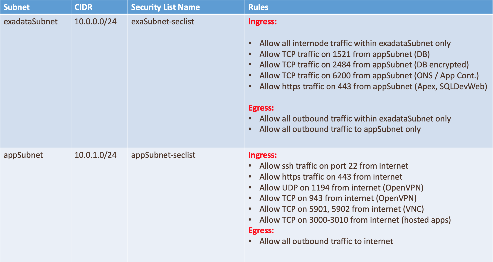

- Start deploying the above configuration in the following order:

    - Create a security list for exadata subnet.

     We start with creating a security list for the exadata subnet based on rules defined in the table above. When completed, our security list appears as follows.

        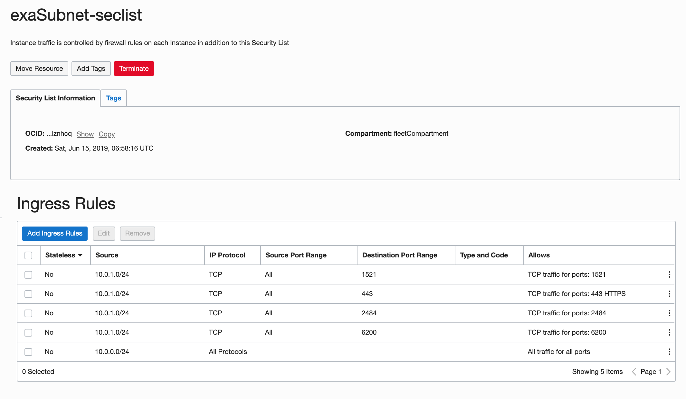

        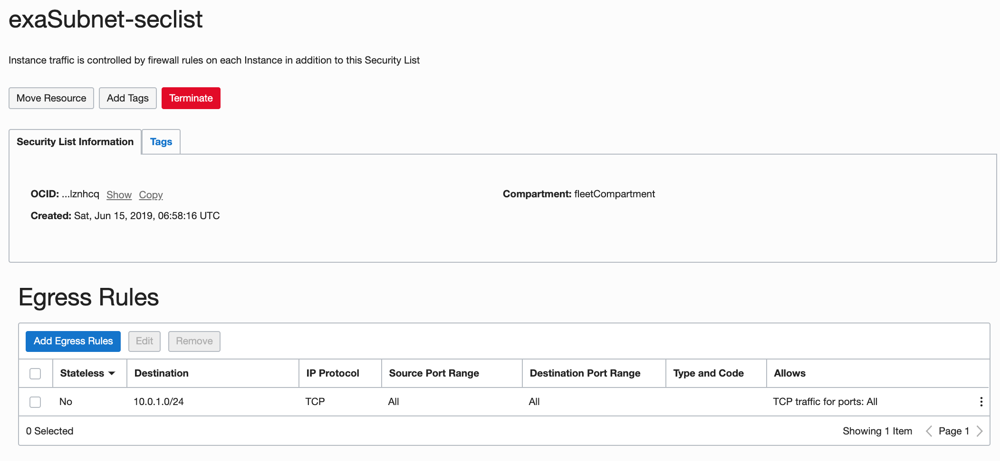

    - Create a security list for the application subnet.

    - Next, add a security list for the application subnet. Once again, since this is a two tier configuration, we will host VPN servers, Application servers, compute instances for VNC, and more in this subnet and therefore, suitable ports needs to be open to internet traffic.

    - Alternatively, you may host internet facing resources in a separate subnet and set up security lists accordingly. Consult your network administrator for deploying this in line with your corporate best practices.

    - When deployed, your application subnet's security list appears as follows:

        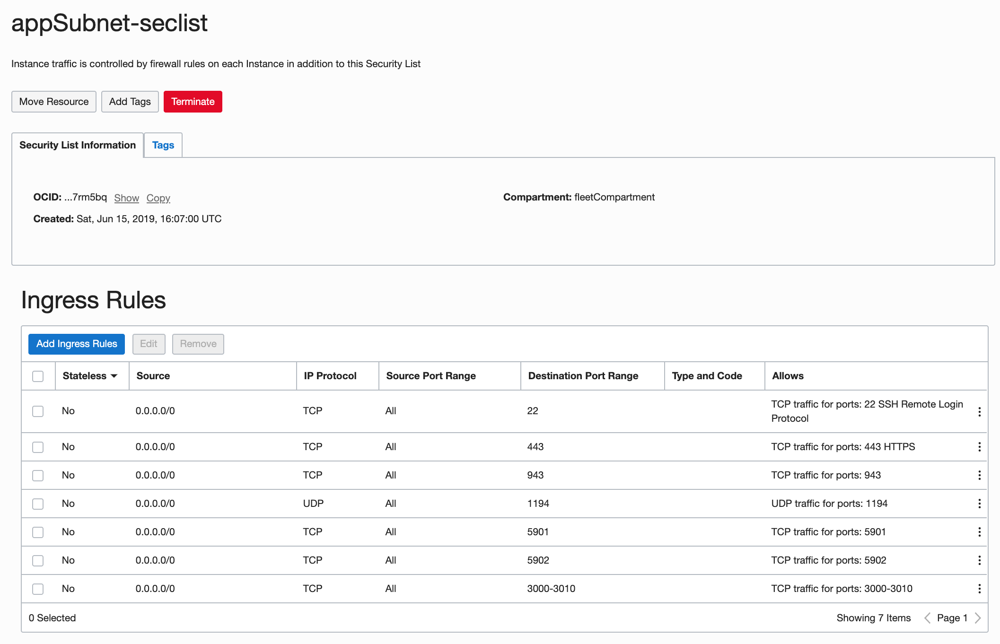

        

- Create an internet gateway.

    Instances in the application subnet may need access to the internet. For that purpose we will deploy an internet gateway in the VCN and create a route to it. This is optional and depends on wether you want any hosts in the public domain. Typically bastion hosts can be setup in a public subnet for ssh access. In this guide, for simplicity, we will set up our developer client machines in the public appSubnet.

    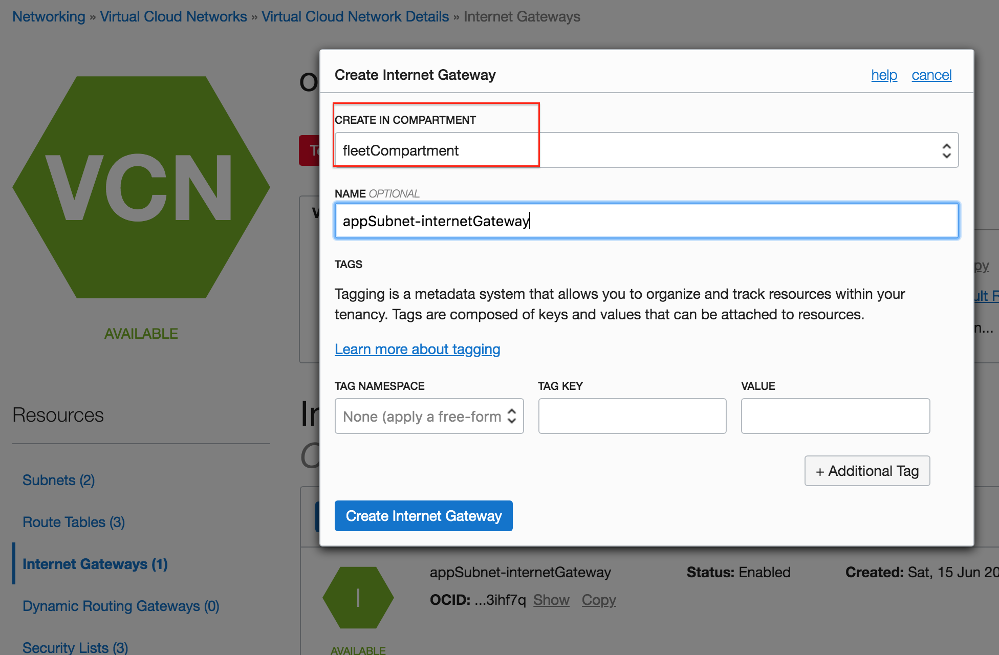

- Create a route table for the Application Subnet to route traffic to the internet gateway.

    Note the destination CIDR block 0.0.0.0/0 indicate ALL IP addresses globally, that is, to any host anywhere on the internet. You can limit it to specific hosts or network as desired. For example, you can limit it to hosts in your corporate network or to a specific host such as your personal laptop as long as it has a unique public IP address.

    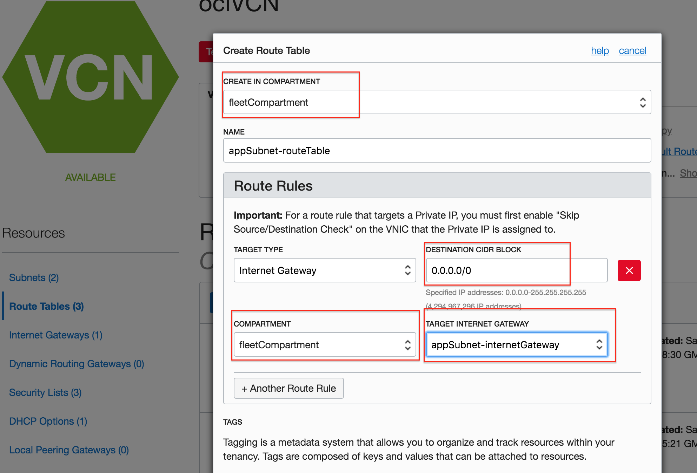

- Similarly, create a route table for the Exadata Subnet.

    Since a route table is required when creating a subnet, we simply create a blank route table named **exaSubnet-routeTable** without any route rules.

    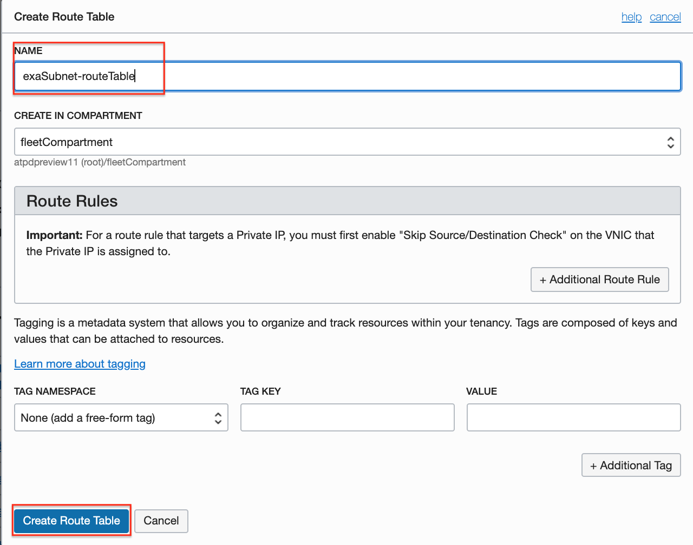

- Provision exadataSubnet and appSubnet.

    Now that we have build all the required network resources, we are ready to deploy the exadata and application subnets. Start by provisioning the exadataSubnet with CIDR 10.0.0.0/24 as shown below. The default route table associated with the exadataSubnet does not have any route rules.

    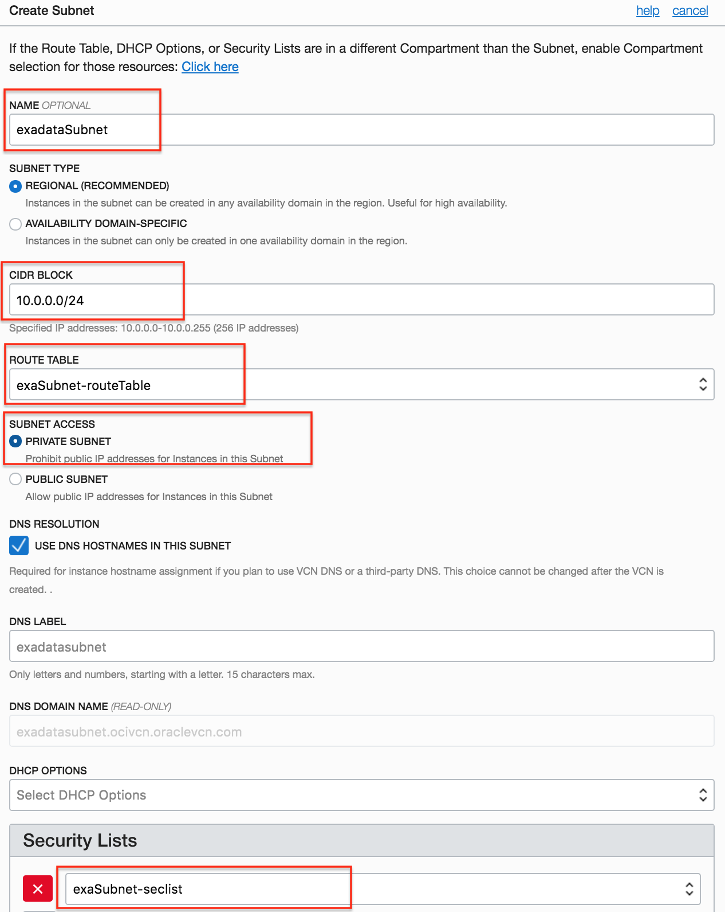

- Next, provision the application subnet with CIDR 10.0.1.0/24. Note that we associate our custom route table to this subnet for internet access.
    

Your network setup is now complete.

You may now **proceed to the next lab**.

## Acknowledgements
*Fantastic! You have now setup your OCI network and users and are ready to deploy autonomous infrastructure, databases and applications.*

- **Author** - Tejus S. & Kris Bhanushali
- **Adapted by** -  Yaisah Granillo, Cloud Solution Engineer
- **Last Updated By/Date** - Kris Bhanushali, March 2022

## See an issue or have feedback?
Please submit feedback [here](https://apexapps.oracle.com/pls/apex/f?p=133:1:::::P1_FEEDBACK:1).   Select 'Autonomous DB on Dedicated Exadata' as workshop name, include Lab name and issue / feedback details. Thank you!
