# OCI API Gateway with Autonomous Database Dedicated


## Introduction
This lab walks you through how to create REST APIs using Database Actions and leverage OCI API Gateway to securely expose APIs to applications.


The API Gateway service enables you to publish APIs with private endpoints that are accessible from within your network, and which you can expose with public IP addresses if you want them to accept internet traffic. The endpoints support API validation, request and response transformation, CORS, authentication and authorization, and request limiting. 

To learn more about this OCI API Gateway [click here] (https://docs.oracle.com/en-us/iaas/Content/APIGateway/Concepts/apigatewayoverview.htm).  

Combining Oracle APEX on Autonomous Database on Dedicated Infrastructure with OCI API Gateway unlocks the potential of making your data, highly-available without exposing security concerns to the outside world.

Estimated Time: 20 minutes

### Objectives

1. Install and configure ORDS modules, templates, and handlers to enable data in the database to be available via API.
2. Configure OCI API Gateway to make the database APIs available over the Internet with rules and regulations. 

### Required Artifacts

- An Oracle Cloud Infrastructure account.
- A pre-provisioned Autonomous Transaction Processing instance. Refer to the lab **Provisioning Databases** in the **Autonomous Database Dedicated for Developers and Database Users** workshop on how to provision an ATP database.
- A jump host to access the database that resides in the private subnet.

## Task 1: Setup ADB-D and Load data into the database

- Once the database is provisioned, execute the SQL script to create user EMPLOYEE and load the database with an EMPLOYEE table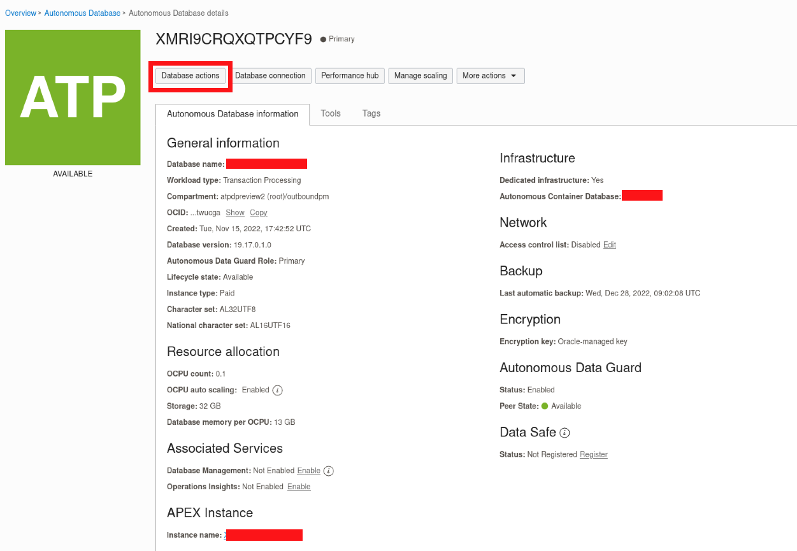

```
CREATE USER EMPLOYEE IDENTIFIED BY WElCome123$;

CREATE TABLE EMPLOYEE.EMPLOYEE (
    EMPLOYEE_ID         VARCHAR2(32) DEFAULT ON NULL SYS_GUID()
        CONSTRAINT EMPLOYEE_ID_NN NOT NULL
        CONSTRAINT EMPLOYEE_ID_PK PRIMARY KEY,
    EMPLOYEE_FIRST_NAME VARCHAR2(100),
    EMPLOYEE_LAST_NAME  VARCHAR2(100), 
    EMPLOYEE_TITLE      VARCHAR2(100)
);

INSERT INTO EMPLOYEE.EMPLOYEE(EMPLOYEE_FIRST_NAME, EMPLOYEE_LAST_NAME, EMPLOYEE_TITLE) VALUES('Ryan', 'Howard', 'Sales Intern');
INSERT INTO EMPLOYEE.EMPLOYEE(EMPLOYEE_FIRST_NAME, EMPLOYEE_LAST_NAME, EMPLOYEE_TITLE) VALUES('Jim', 'Halpert', 'Senior Sales Executive');
INSERT INTO EMPLOYEE.EMPLOYEE(EMPLOYEE_FIRST_NAME, EMPLOYEE_LAST_NAME, EMPLOYEE_TITLE) VALUES('Andy', 'Bernard', 'Sales Executive');
INSERT INTO EMPLOYEE.EMPLOYEE(EMPLOYEE_FIRST_NAME, EMPLOYEE_LAST_NAME, EMPLOYEE_TITLE) VALUES('Michael', 'Scott', 'Regional Manager');
INSERT INTO EMPLOYEE.EMPLOYEE(EMPLOYEE_FIRST_NAME, EMPLOYEE_LAST_NAME, EMPLOYEE_TITLE) VALUES('Toby', 'Flenderson', 'Senior HR');
INSERT INTO EMPLOYEE.EMPLOYEE(EMPLOYEE_FIRST_NAME, EMPLOYEE_LAST_NAME, EMPLOYEE_TITLE) VALUES('Pam', 'Beesley', 'Administrative Assistant');

COMMIT;
```

- Once, the table is created, next step is to configure APIs. 

- Log into the **Database Actions** and under **Development** select **REST** and start creating modules.

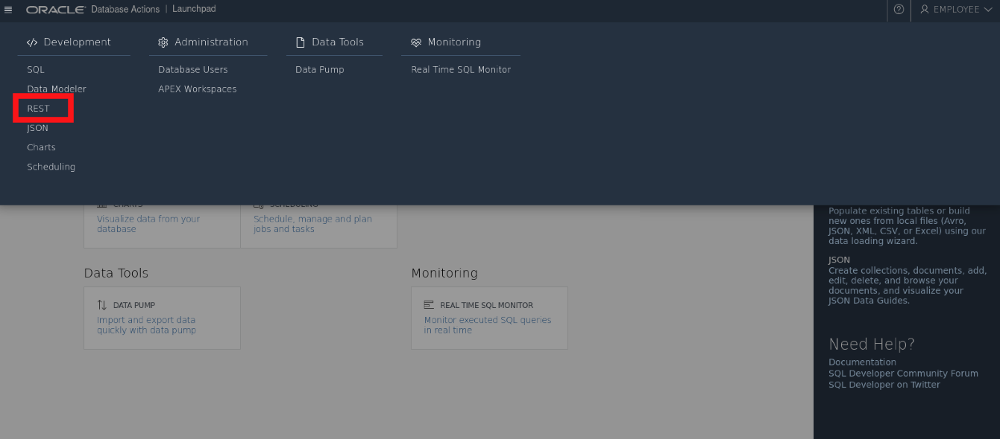
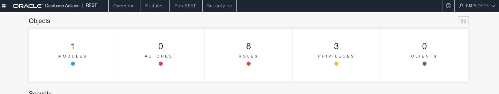

- Modules are grouping of common templates under a common Uniform Resource Indetifier (URI). Create a **Module** and then **Template** that'll allow you to group URIs. You can only have one HTTP method per template.

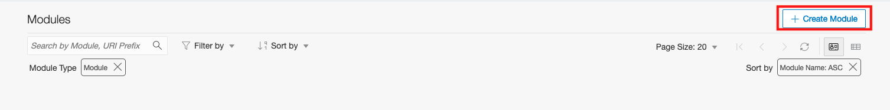
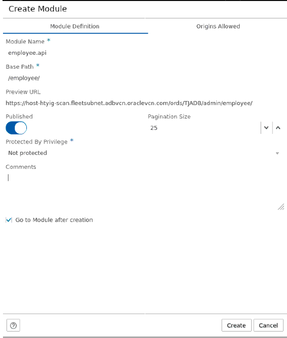
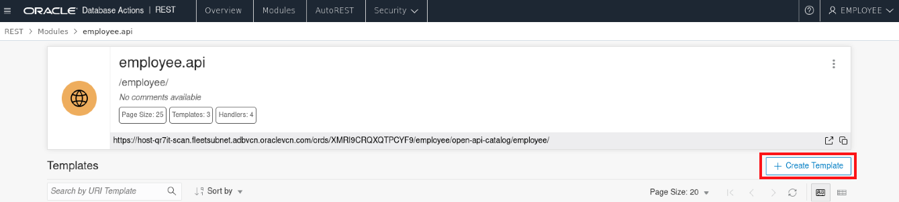
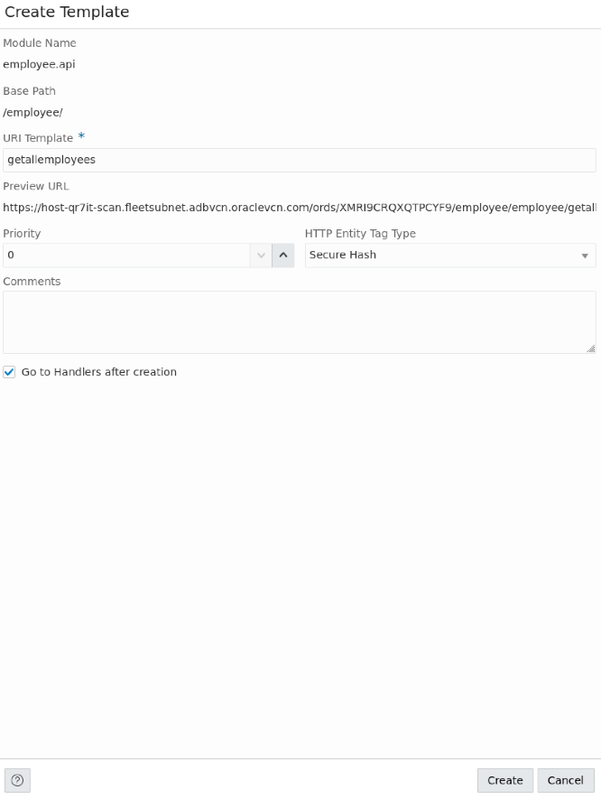
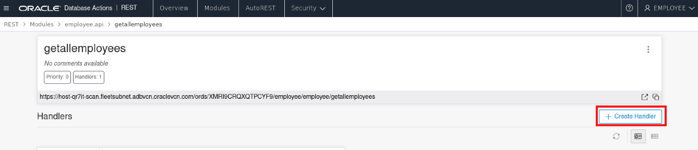


- With the templates and module ready, create **Handlers** and  that'll allow you to create APIs.

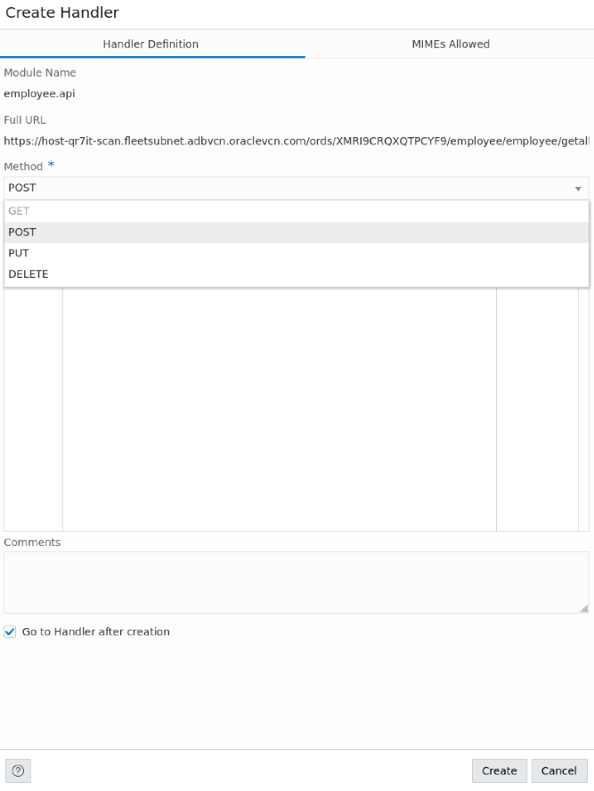
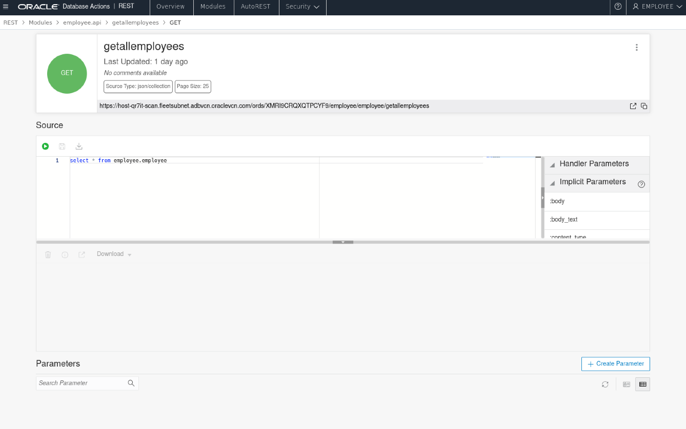


- Awesome, this finishes the first part of the lab, now let's configure **OCI API Gateway**  

## Task 2: Setup OCI API Gateway and Setup URIs for data access from ADB-D

Now that the APIs are available, data is still not available for public consumption. The next step is to configure OCI API Gateway to make the data public.   

- Log into your OCI cloud account to create OCI API Gateway. OCI API Gateway can be provisioned within the same VCN either **Private** or **Public** Subnet. It can also be provisioned in a different VCN if the VCNs are peered. 

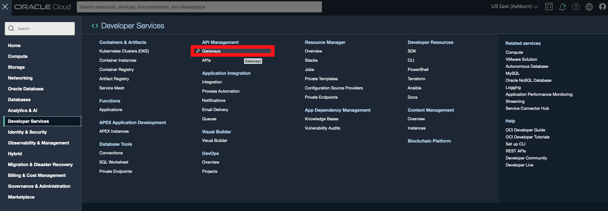
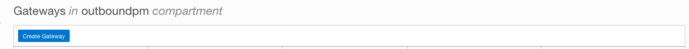
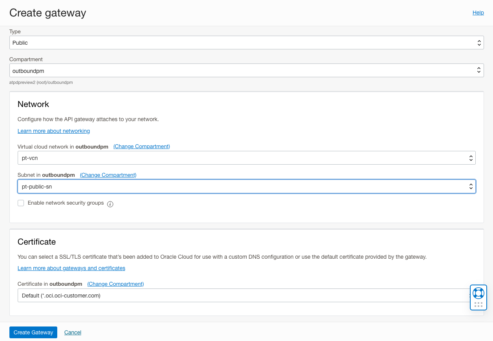
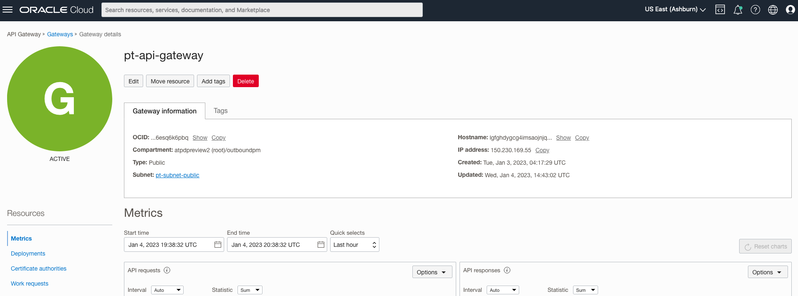
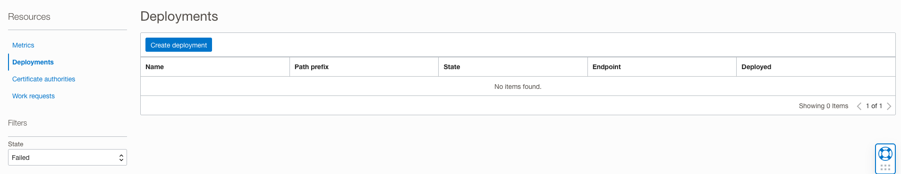

- Upon creation of the API Gateway, you can now create a deployment that'll allow you to place your database API along with CORS, mTLS, Authentication etc.

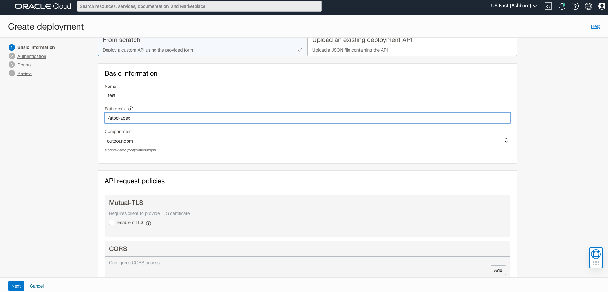
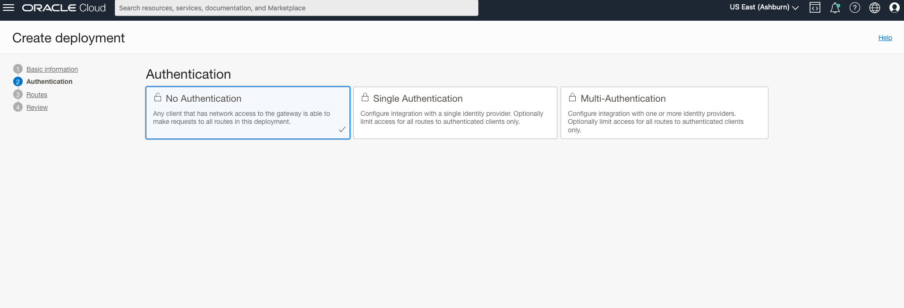

- Setup a route for your API. The example below gets all the employees using GET method. 

```
/getallemployees
```

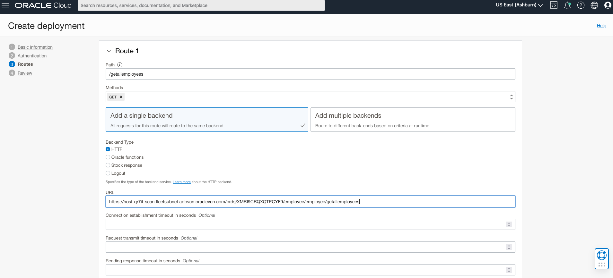

- Then place your ADB-D API on the URI section where you can also have more checks like, connection establishment timeout, request transit timeout and reading response timeout, on the API to prevent overuse and allow hacker any sort of abuse of the API.(We disable the SSL verification as API access may fail!)

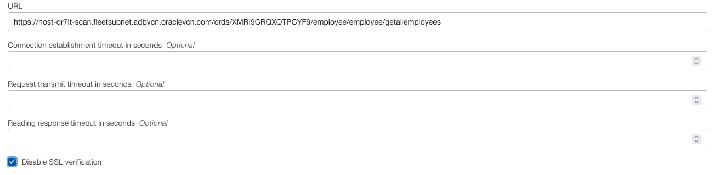

- Now its time to test your API. You can use postman, curl, or browser (simple GET request)

> **_NOTE:_**  Please add your Path to the copied Endpoint since that not the complete endpoint.

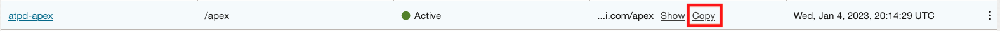

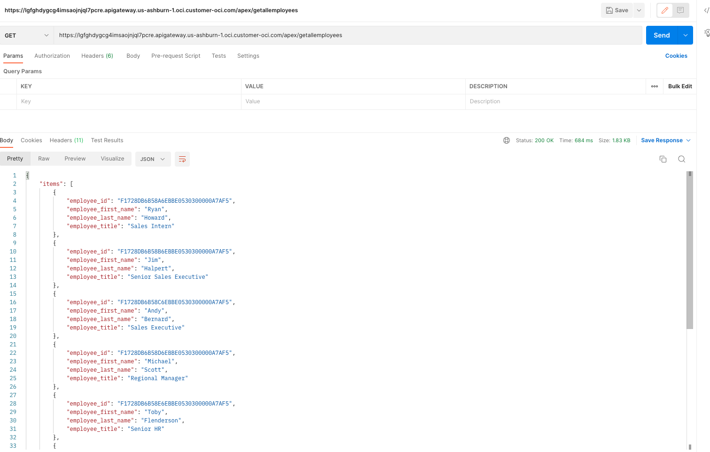

> **_NOTE:_** For Extra Credit, you can chose to create one more module that'll allow you to search employees based on first name, last name or title. 
```
begin
CTX_DDL.create_preference('emp_multi_column_datastore', 'MULTI_COLUMN_DATASTORE');
CTX_DDL.set_attribute('emp_multi_column_datastore', 'columns', 'EMPLOYEE_FIRST_NAME, EMPLOYEE_LAST_NAME,EMPLOYEE_TITLE');
end;
/

create index i1 on employee (EMPLOYEE_FIRST_NAME) indextype is ctxsys.context
  parameters ('datastore emp_multi_column_datastore sync(on commit)');

select * from employee where contains (EMPLOYEE_FIRST_NAME, 'Ryan or Senior') > 0;
```

You may now **proceed to the next lab**.

## Acknowledgements
*Congratulations! You have successfully configured Oracle Autonomous Database on Dedicated Infrastructure with APIs using Oracle Apex and enabled the APIs for Internet Traffic using OCI API Gateway with simulated APIs*

- **Author** - Phani Turlapati
- **Last Updated By/Date** - Phani Turlapati, Autonomous Database Product Management, January 2023

## See an issue or have feedback?  
Please submit feedback [here](https://apexapps.oracle.com/pls/apex/f?p=133:1:::::P1_FEEDBACK:1).   Select 'Autonomous DB on Dedicated Exadata' as the workshop name, include Lab name and issue/feedback details. Thank you!


