# AWR Management of Autonomous AI Database on Dedicated Exadata Infrastructure using Oracle Enterprise Manager

## Introduction

Use Automatic Workload Repository (AWR) to automate database statistics gathering and to collect, process, and maintain performance statistics for database problem detection and self-tuning.

*In this lab, you will use Oracle Enterprise Manager to generate, review, and compare AWR reports for your Autonomous AI Database on Dedicated Exadata Infrastructure (Autonomous AI Database).*

Estimated Time: 20 minutes

### Objectives

As a database administrator:

1. Learn how to generate an AWR report for an Autonomous AI Database from Oracle Enterprise Manager.
2. Learn how to change the AWR retention period for reports generated for that instance.
3. Compare two AWR reports taken at different intervals by using Oracle Enterprise Manager.

### Required Artifacts

- An Oracle Cloud Infrastructure account.
- A pre-provisioned Autonomous Database Dedicated instance. Refer to [Provisioning Databases](https://livelabs.oracle.com/ords/r/dbpm/livelabs/run-workshop?p210_wid=3197) lab for details.
- Successful connection of the Autonomous Database Dedicated instance from Oracle Enterprise Manager. Refer the previous lab [Connecting to Autonomous AI Database from Oracle Enterprise Manager](?lab=adb-deploy-oem) for details.

## Task 1: Generate an AWR report for an Autonomous AI Database from Oracle Enterprise Manager

- Sign in to Oracle Enterprise Manager as the **sysman** user.

    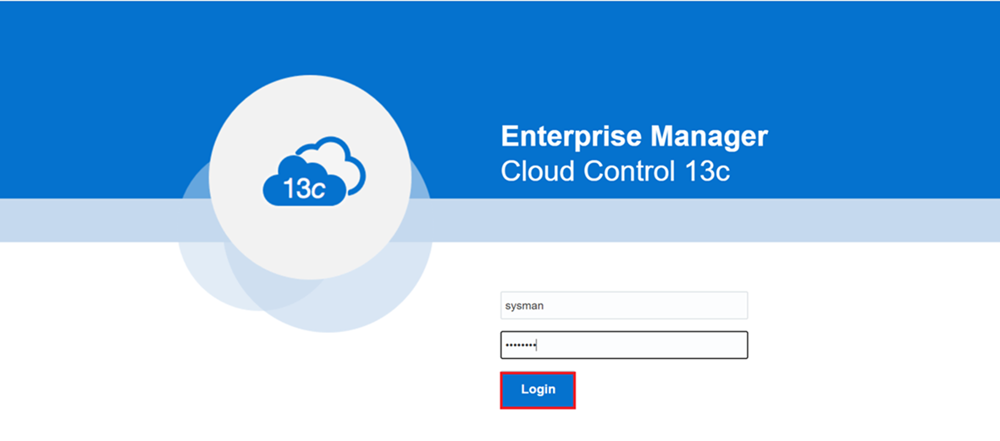

- Click **Targets** and select **All Targets**.

    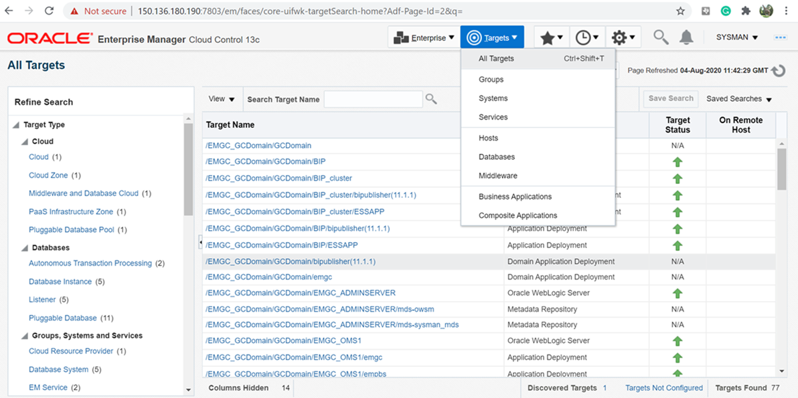

- Click your database type, for example **Autonomous Transaction Processing** and select **ADBEM** (the name of your Autonomous AI Database).

    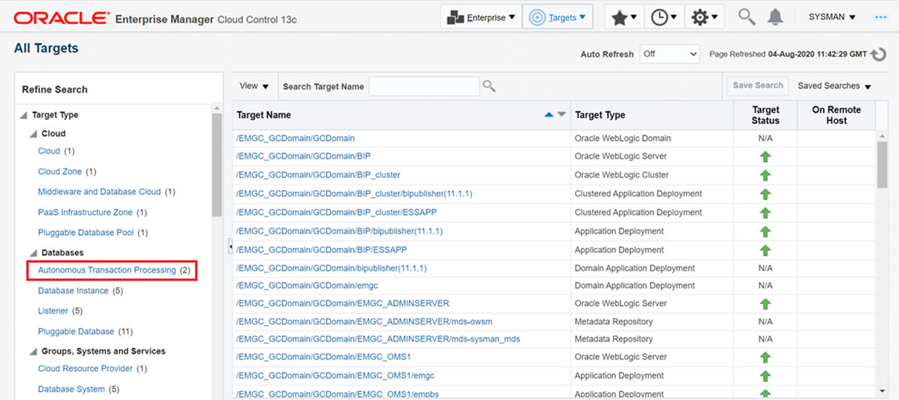

    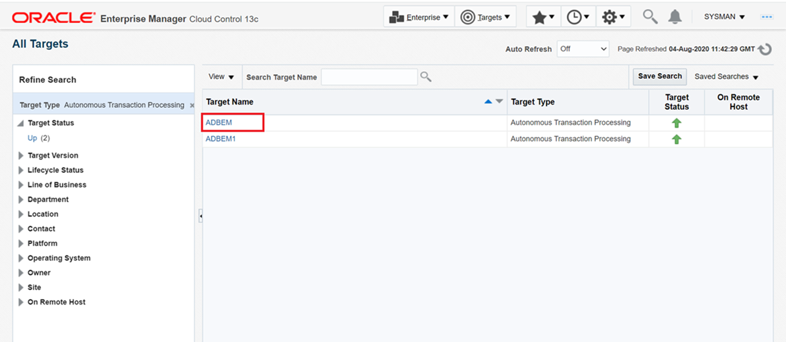

- Click **Performance**, select **AWR**, and then click **AWR Report**.

    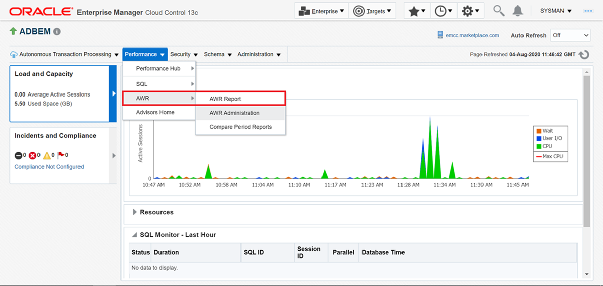

- Select the **Begin Snapshot** and **End Snapshot**, and then click **Generate Report**.

    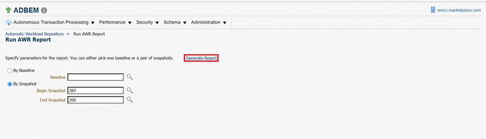

    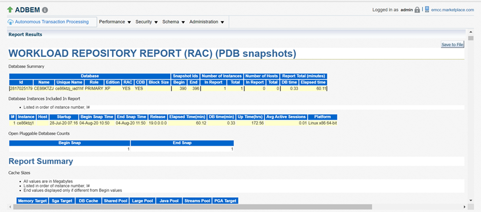

## Task 2: Change the AWR retention period for the generated report

- On the Oracle Enterprise Manager home page, click **Performance**, select **AWR**, and then click **AWR Administration**.

    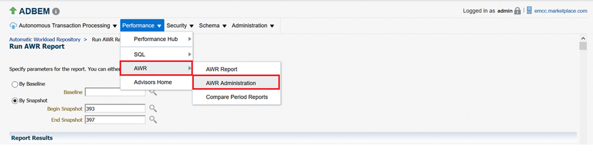

- Click **Edit**.

    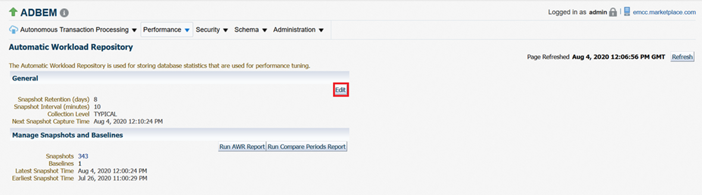

- Change the **Retention Period**.

    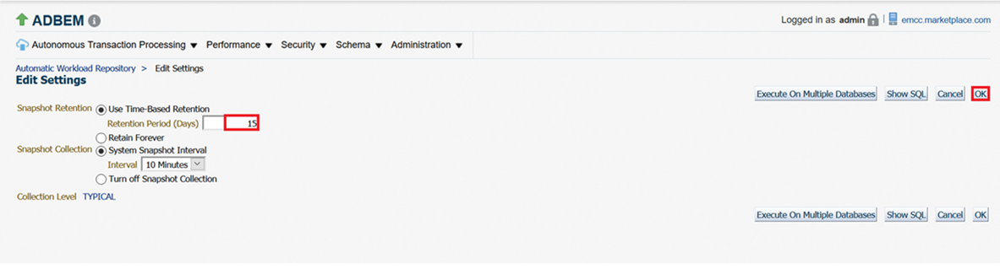

- Click **OK**.

    

    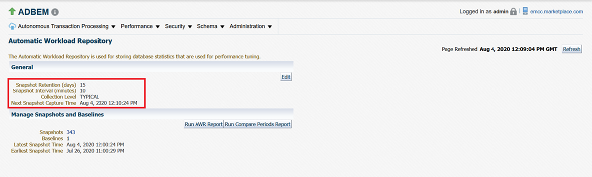

## Task 3: Compare two AWR reports from different periods

- Click **Performance**, select **AWR**, and then click **Compare Period Reports**.

    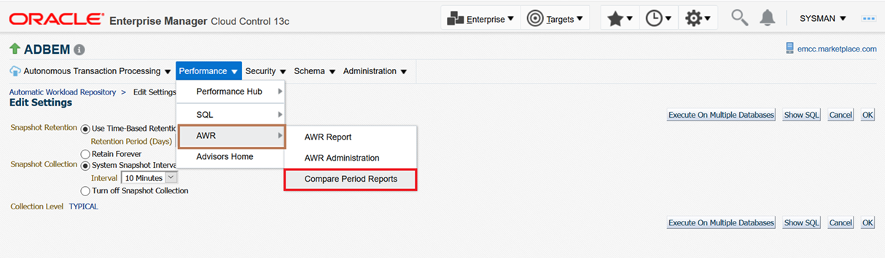

- Select the **Begin Snapshot** and **End Snapshot** for the **First Period** and **Second Period**.

    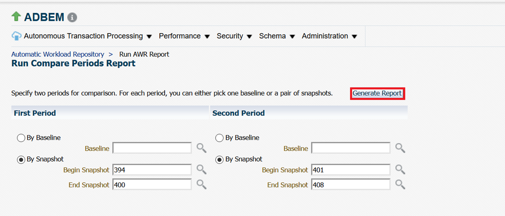

- Click **Generate Report**.

    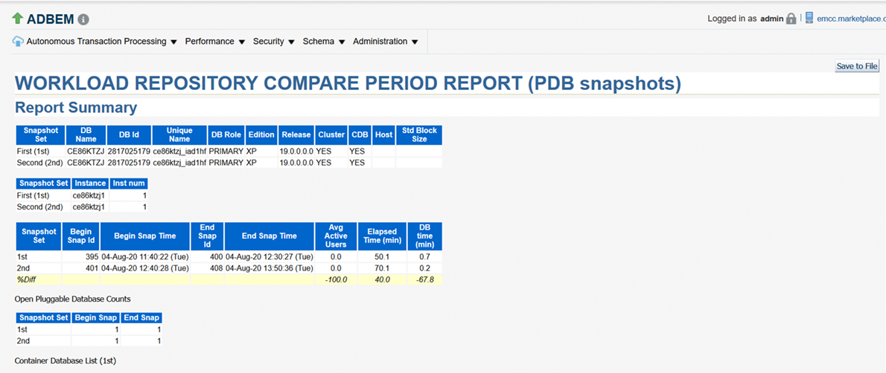

*Congratulations! You have successfully completed AWR report analysis by using Oracle Enterprise Manager.*

You may now **proceed to the next lab**.

## Acknowledgements

- **Authors** - Navya M S & Padma Priya Natarajan
- **Adapted by** - Vandana Rajamani, Consulting UA Developer, July 2026
- **Last Updated By/Date** - Vandana Rajamani, Consulting UA Developer, July 2026

