# Manage Operator Access Control

## Introduction

Oracle Operator Access Control enables you to grant, audit, and revoke Oracle's access to your Exadata Infrastructure, Exadata Cloud@Customer, and Autonomous Exadata VM Cluster resources managed by Oracle, and to obtain near real-time audit reports of all actions taken by a human operator.

This lab walks you through how to create an Operator Control, assign an Operator Control, edit an Operator Control, and update an Operator Control assignment.

Estimated Time: 40 minutes

### Objectives

As a database administrator and OCI administrator:

- Create and manage Operator Control access to Exadata Infrastructure and Autonomous Exadata VM Cluster resources on Oracle Cloud Infrastructure and Cloud@Customer infrastructure.

### Required Artifacts

- An Oracle Cloud Infrastructure account.
- Privileges to create and manage Operator Access Control and assign Operator Control. Refer to the [policy details documentation](https://docs.oracle.com/en-us/iaas/operator-access-control/doc/policy-details.html) for common policies.

## Task 1: Create Operator Control

Add the following policy before you create Operator Access Control.

```
allow service operatoraccesscontrol to inspect database-family in tenancy
```

- Log in to your OCI tenancy, navigate to Oracle AI Database from the main hamburger menu. Select **Operator Access Control** > **Operator Controls**.

    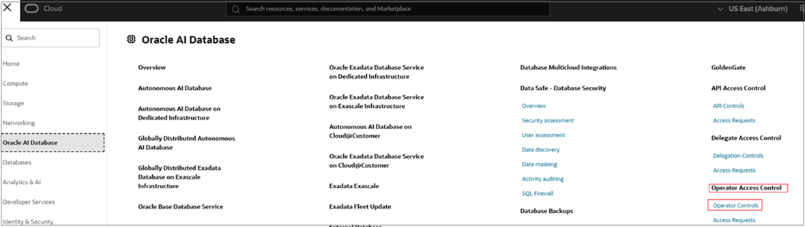

- Click Create Operator Control.

    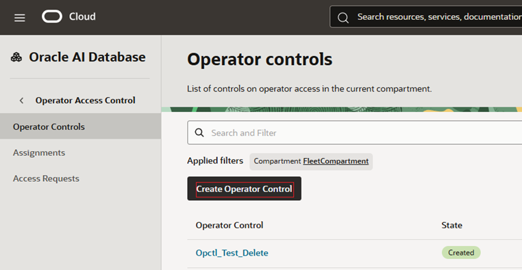

- Select the compartment in which you want to create the Operator Control. Enter the Operator Control name to which you want to grant access and provide a brief description. Choose either Exadata Infrastructure or Autonomous Exadata VM Cluster as the resource type, and select Cloud@Customer or Oracle Cloud as the deployment platform.

  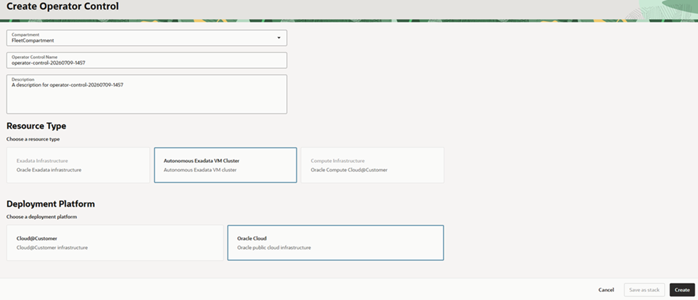

  NOTE: In the Approval Requirements section, select the option that best matches the access you want to grant to the operator.

    1. Pre-Approve All Actions: This mode automatically approves access requests from Oracle Operators to perform system maintenance.
    2. Select Actions to Pre-Approve: This mode lets you choose the specific actions you want to grant to Oracle Operators. Select the pre-approved actions from the drop-down list.
    3. Select Groups: Choose the groups whose members can approve or revoke Oracle Operator maintenance requests.
  
You can also provide a message to Oracle Operators that will be displayed when an access request is made.

  Click Create to create the Operator Control.

  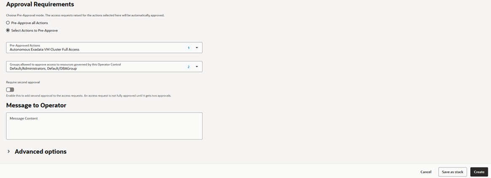

  The Operator Control details page lists all of the details for your Operator Control.

  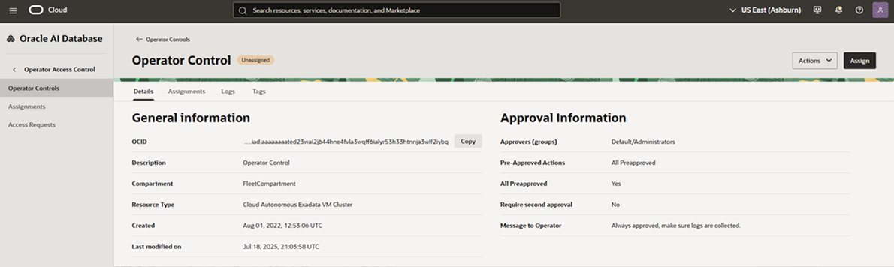

## Task 2: Assign Operator Control

You can assign policies to control operator access to your infrastructure and database.

- In the Operator Control details page, click **Assign**. Based on the Resource Type and Deployment Platform for which the Operator Control was created, the corresponding resources are displayed for selection in the Assignment Information section.

   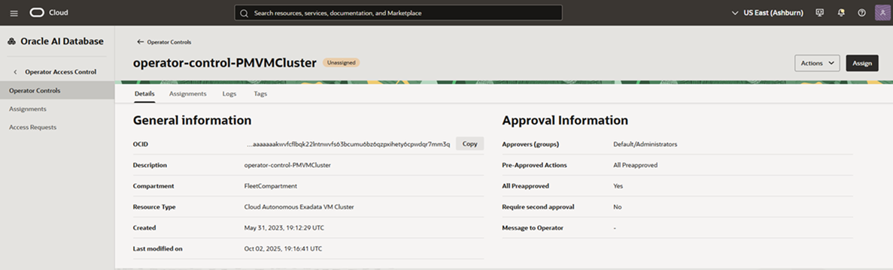

- Select the compartment where the Autonomous VM Cluster is provisioned, and choose the appropriate Autonomous VM Cluster from the drop-down list. Select an assignment duration from the available options. You can assign access for a specified duration.

   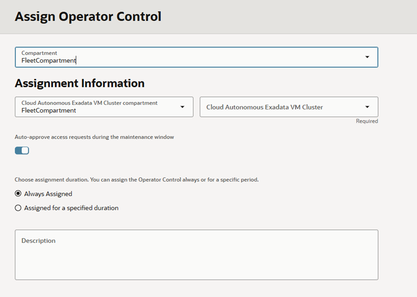

- You can configure the Operator Access Control service to forward audit logs to your on-premises Syslog server. Select Forward audit logs, and enter the Syslog server address and port details. You can either choose a CA certificate or paste a CA certificate to secure the connection for forwarding audit logs to the Syslog server.

    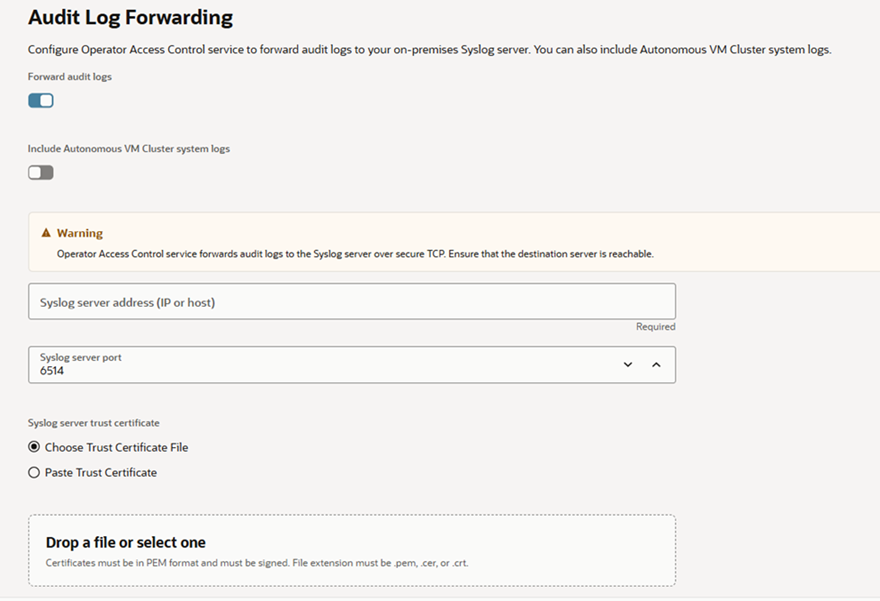

## Task 3: Edit Operator Control

To change the compartment, user permissions, and other control settings, you can edit the existing Operator Control.

- In the Operator Control details page, click **Actions**, and then select **Edit**.

   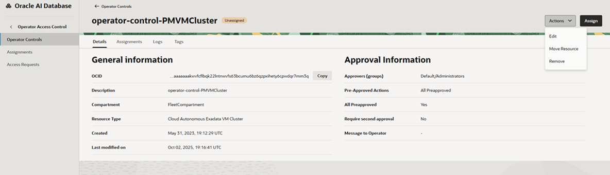

- Edit your control settings and click Save.

  **Note:** You cannot change the resource type after you create an Operator Control.

   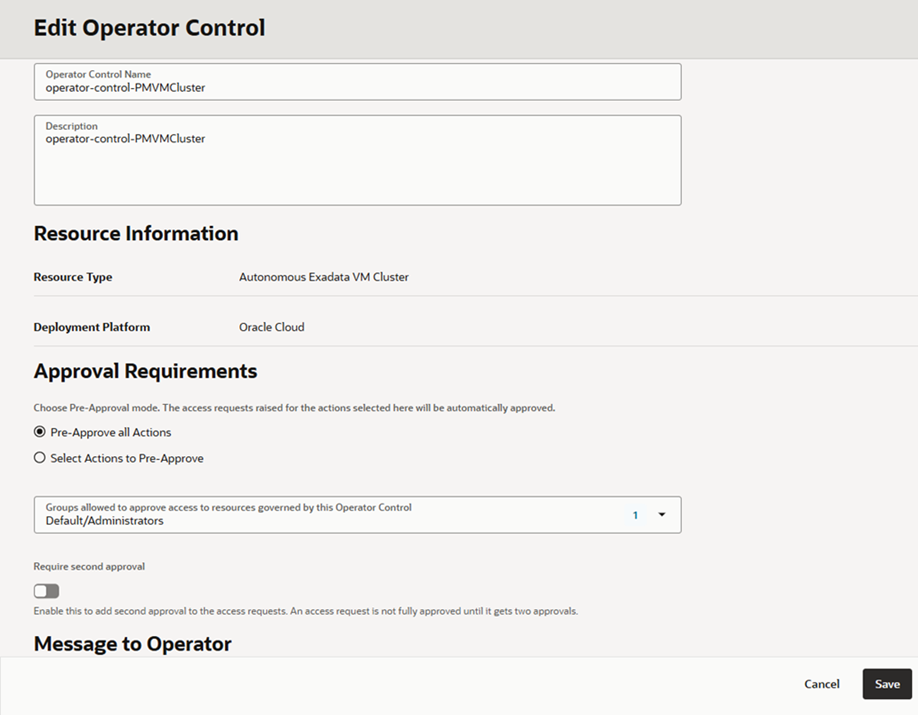

## Task 4: Update Operator Control Assignment

- Log in to your OCI tenancy, navigate to Oracle AI Database from the main hamburger menu. Select **Operator Access Control** > **Operator Controls**.

    

- From the list of Operator Controls, click the name of the Operator Control for which you want to update the assignment.

- On the Operator Control details page, under **Assignments**, find the assignment that you want to update. Click the Assignment ID of the assignment, and then click **Edit**.

    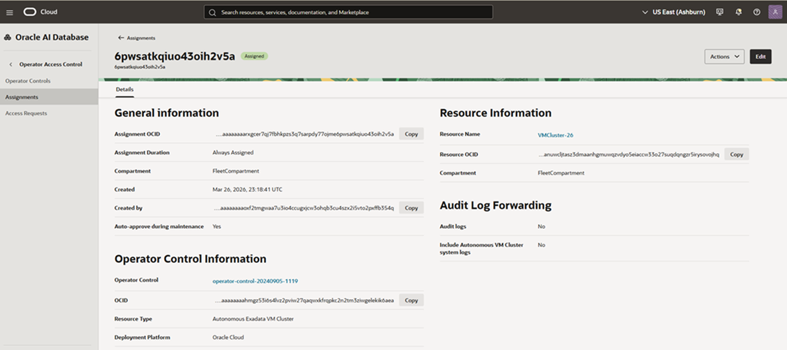

- On the Update Operator Control Assignment page, choose the assignment information, and click **Save**.

    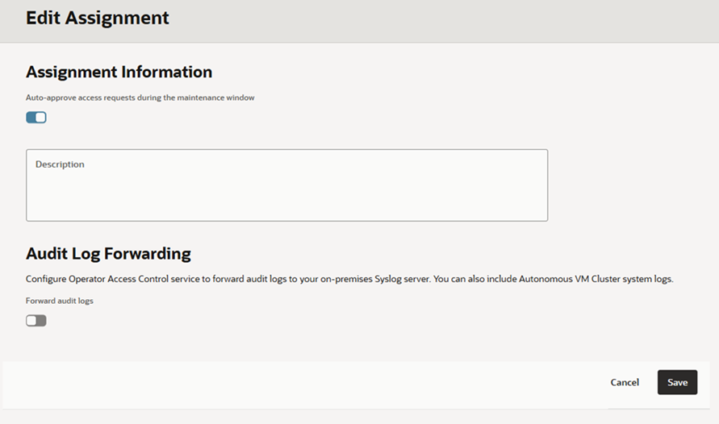

## Task 5: Remove Operator Control Assignment

- Log in to your OCI tenancy, navigate to Oracle AI Database from the main hamburger menu. Select **Operator Access Control** > **Operator Controls**.

    

- From the list of Operator Controls, click the name of the Operator Control for which you want to remove the assignment.

- On the Operator Control details page, under Assignments, find the assignment that you want to remove. Click the Assignment ID of the assignment. Under Actions, click **Remove Assignment**. In the Remove Assignment dialog, click **Remove**.

    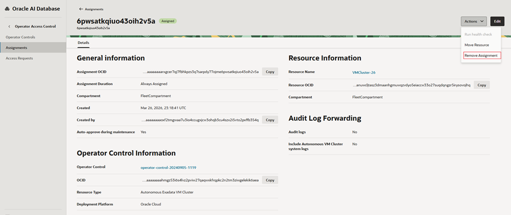

## Task 6: Remove Operator Control

- Log in to your OCI tenancy, navigate to Oracle AI Database from the main hamburger menu. Select **Operator Access Control** > **Operator Controls**.

    

- From the list of Operator Controls, select the one that you want to remove. 

- Under **Actions**, click **Remove**. On the Remove Operator Control dialog, click **Remove**.

    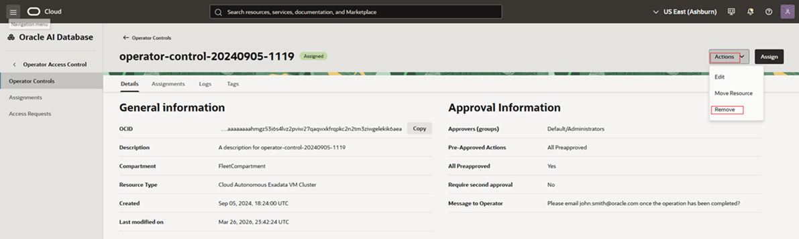

NOTE: Even after removal, the contents of an Operator Control remain visible. However, you cannot assign it.

## Task 7: Enable Logs and Create Log Groups

You can enable logs to track Oracle Operator activities on your system. To audit the actions that an Oracle operator performs, you can create an audit log for a compartment and a service that you want to monitor.

- Log in to your OCI tenancy, navigate to Oracle AI Database from the main hamburger menu. Select **Operator Access Control** > **Operator Controls**.

    

- From the list of Operator Controls, select the one for which you want to enable logs.

- On the Operator Control details page, click **Logs**. A Log Group is a logical container of Logs. You can use Log Groups to streamline Log management. Click on the three dots in the Category of Log that you want to enable. Click **Enable log**.

    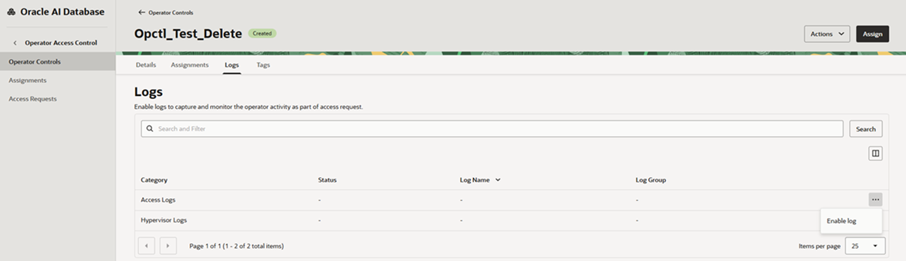

You can view the details of any existing logs.

- On the Operator Control details page, click **Logs**. Click the log name to navigate to the log details page.

   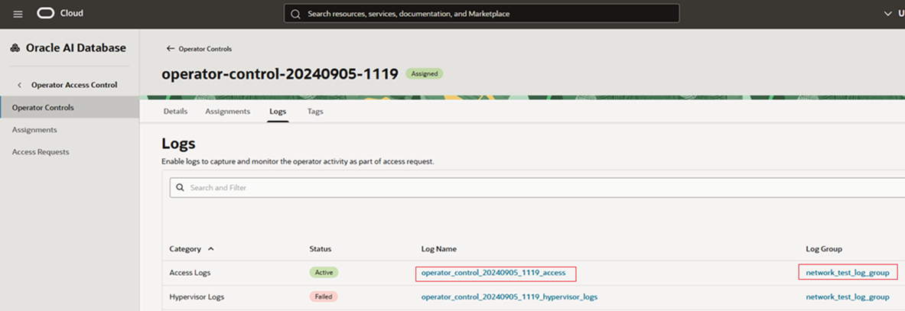

- Explore the logs in the log details page.

  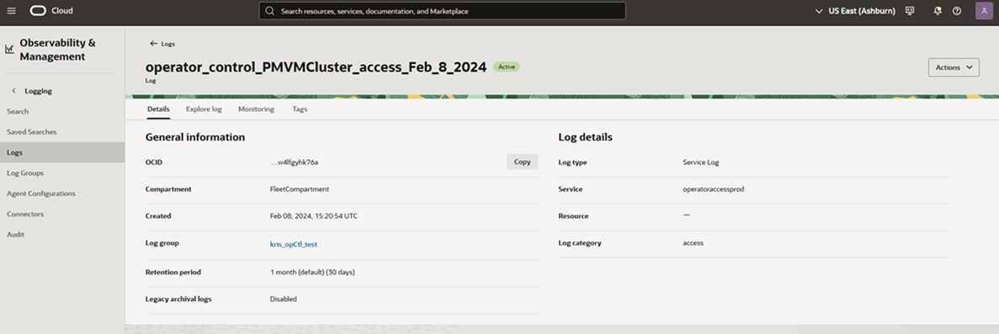

*Congratulations! You successfully enabled Operator Access Control for your infrastructure and database.*


## Acknowledgements

- **Author** - Tejus S, Autonomous AI Database Product Management
- **Last Updated By/Date** - Vandana Rajamani, Consulting UA Developer, July 2026
