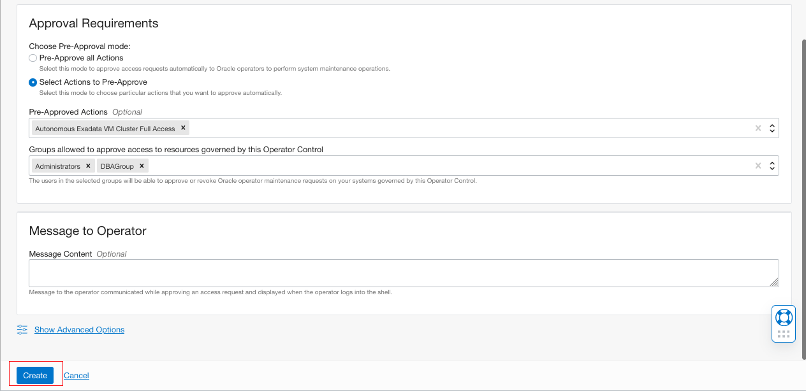
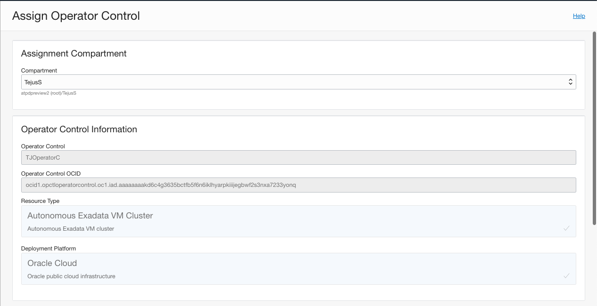
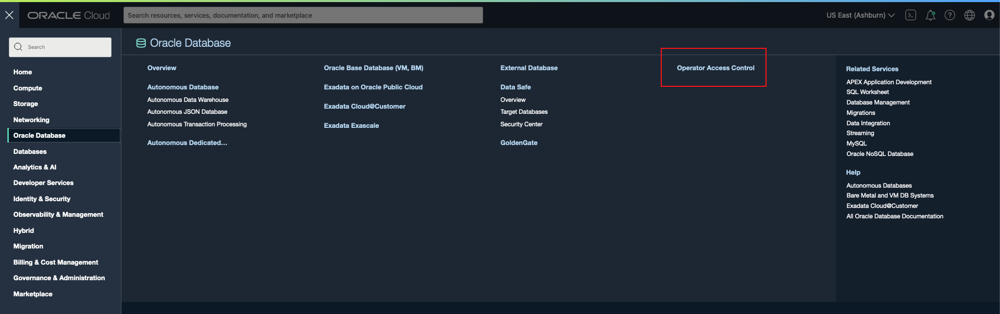

# Oracle Operator Access Control

## Introduction

Oracle Operator Access Control enables you to grant, audit, and revoke the access Oracle has to your Exadata Infrastructure, Exadata Cloud@Customer, and Autonomous Exadata VM Cluster administered by Oracle, and to obtain audit reports of all actions taken by a human operator, in a near real-time manner. 

This lab walks you through how to create Operator control, Assign Operator Control, Edit Operator Control, and Update Operator Control.

Estimated Time: 40 minutes

### Objectives

As a database administrator and OCI administrator:
1. Create and Manage Operator Control Access to Exadata Infrastructure and Autonomous Exadata VM Cluster on Oracle Public cloud infrastructure and Cloud@Customer infrastructure.


### Required Artifacts

- An Oracle Cloud Infrastructure account.
- Privelege to Create and Manage Operator Access Control and Assign Operator Control. Refer [here](https://docs.oracle.com/en-us/iaas/operator-access-control/doc/policy-details.html) on common policies. 

## Task 1: Create Operator Control

Add the following policy before you create Operator Access Control.

```
allow service operatoraccesscontrol to inspect database-family in tenancy
```

- Log in to your OCI tenancy and navigate to Oracle Database and Select Operator Access Control from the main hamburger menu.

    

- Click Create Operator Control.

    


- Select a Compartment where you want to create the Operator Control, enter Operator Control Name to which you want to grant access to your compartment, enter a brief description, choose either Exadata Infrastructure or Autonomous Exadata VM Cluster as Resource Type, and select Cloud@Customer or Oracle Cloud as Deployment Platform.

NOTE: In Approval Requirements section, select the following based on the access control that you want to grant to the operator. 
1. Pre-Approve All Action: This mode provides you an auto-approve access request to Oracle Operators to perform system maintenance.
2. Select Actions to Pre-Approve: This mode provides you to choose particular actions that you want to grant to Oracle Operators. Pick the Pre-Approced Actions List from the drop-down.
Select Groups whose members you want to be able to approve or revoke Oracle Operator maintenance requests. 
You can also provide a message to Oracle Operators that will be displayed at the time of an access request.


Click Create to to create Operator control.





- Operator Control Details Page lists all the details of your Operator Control.

    

- Configruing Notifications will allow you to be notified when operator request access to your infrastructure. To Enable Notifications Information, click on Configure under Notification Information and enter a Valid Email address. 

    
    


## Task 2: Assign Operator Control

You can assign policies to control Operator access to your Infrastructure and Database. 

- Click on Assign Operator Control in Operator Control Details Page

    

- Select the compartment where Autonomous VM Cluster is provisioned, and pick the right Autonomus VM Cluster from the drop-down. Choose an assignment duration from the check box. You can assign for a specified time duration for the Operators. 


    
    

- You can configure Operators Access Control service to forward audit logs to your on-premise Syslog server. Check Forward audit logs and enter Syslog Server address and port details. You can either Choose a CA certificate or Paste a CA certificate to secure the connection between audit log forwarding to Syslog server.

    


## Task 3: Edit Operator Control

To change the compartment, User Permissions and other control setting you can Edit the existing Operator control.


- Navigate to Operator Access Control from Menu and Click on Edit Operator Control from Operator Control Details page.


    

- Edit your control settings and click on Save.

NOTE: You can not change the Resource Type after creating an Operator Control.


 
## Task 4: Update Operator Control Assignment

 - Log in to you OCI rtenancy, Under Oracle Database, click Operator Access Control

     
    
- From the list of Operator Controls, click the name of the Operator Control for which you want to update the assignment.

- In the Operator Control details page, under Assignments, find the assignment that you want to update, click the actions button (three dots), and then select Update Assignment.


      

- Update Operator Control Assignment page, choose Assignment Information, and click Update.

      


## Task 5: Remove Operator Control Assignment
 - Log in to you OCI rtenancy, Under Oracle Database, click Operator Access Control

     
    
- From the list of Operator Controls, click the name of the Operator Control for which you want to update the assignment.

- In the Operator Control details page, under Assignments, find the assignment that you want to update, click the actions button (three dots), and then select Remove Assignment.

     

 
## Task 6: Remove Operator Control

You cannot remove an indefinite assignment (ALWAYS ASSIGNED) if there exist one or more windowed assignments (ASSIGNED FOR A SPECIFIED DURATION). 

 - Log in to you OCI rtenancy, Under Oracle Database, click Operator Access Control

     

- From the list of Operator Controls, select the one that you want to remove.

- Click Remove Operator Control from details page. 

     

- Enter Removal Comments and REMOVE to confirm. 

NOTE: Even after removal, the contents of a Operator Controll will be visible. Howeverm you cannot assing it. 


    

## Task 7: Enable Logs and Create Log Groups

 You can enable Logs to track Oracle Operator activities on your system. To audit the actions that an Oracle operator performs, you can create an audit log for a compartment and a particular service you want to monitor.

 - Log in to you OCI rtenancy, Under Oracle Database, click Operator Access Control

     

- From the list of Operator Controls, select the one that you want to enable logs.

- Under Operator Control details page, scroll down to resources and click on Logs. 

     

- Click on Enable Logs 

     

- Select Compartment, Log Group, Log Name, and Log Retention period and click on Enable Log. 

NOTE: Log Group is a logical container of Logs. You can use Log Groups to streamline Log management.


- Click on Log Name to navigate to log details page. 

    

- Explore Logs and Search Logs in your Log details page. 


You may now **proceed to the next lab**.

## Acknowledgements
*Congratulations! You successfully enabled Operator Access Control to your Infrastructure and Database.*

- **Author** - Tejus S
- **Last Updated By/Date** -  Tejus S, July 2022

## See an issue or have feedback?  
Please submit feedback [here](https://apexapps.oracle.com/pls/apex/f?p=133:1:::::P1_FEEDBACK:1).   Select 'Autonomous DB on Dedicated Exadata' as workshop name, include Lab name and issue / feedback details. Thank you!
